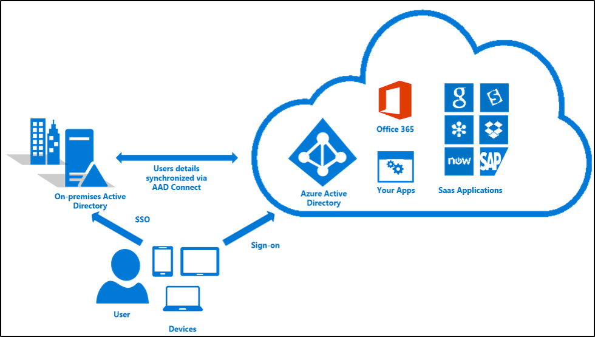
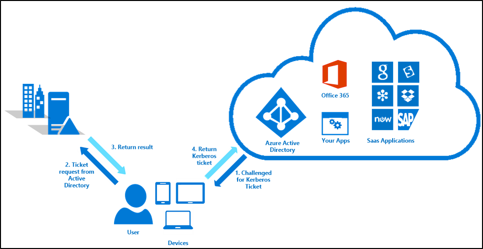
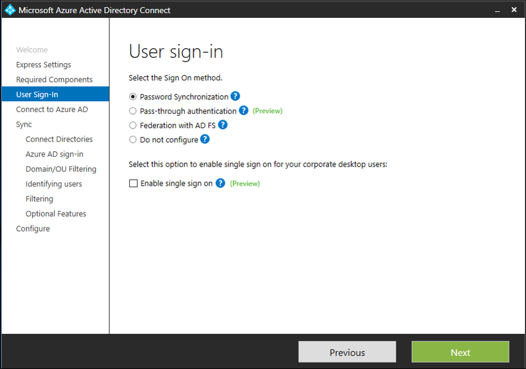
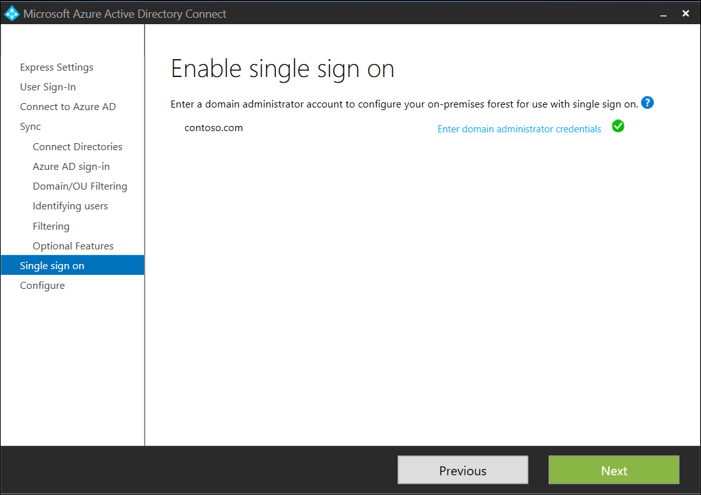
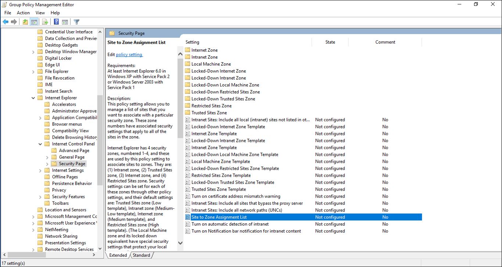
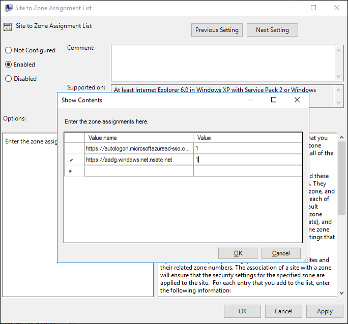

<properties
    pageTitle="Azure AD Connect：单一登录 | Azure"
    description="本主题介绍了你需要了解的如何从本地 Active Directory (AD) 单一登录到基于云的 Azure Active Directory (Azure AD) 和连接的服务的信息。"
    services="active-directory"
    keywords="什么是 Azure AD Connect, 安装 Active Directory, Azure AD 所需的组件, SSO, 单一登录"
    documentationcenter=""
    author="billmath"
    manager="femila"/>  

<tags
    ms.assetid="9f994aca-6088-40f5-b2cc-c753a4f41da7"
    ms.service="active-directory"
    ms.workload="identity"
    ms.tgt_pltfrm="na"
    ms.devlang="na"
    ms.topic="article"
    ms.date="02/15/2017"
    ms.author="billmath"
    wacn.date="03/07/2017"/>

# 什么是单一登录 (SSO)（预览）
单一登录是可以在 Azure Active Directory Connect 中启用的用于[密码同步](/documentation/articles/active-directory-aadconnectsync-implement-password-synchronization/)或[直通身份验证](/documentation/articles/active-directory-aadconnect-pass-through-authentication/)的选项。如果启用该选项，当用户使用其企业计算机并连接到企业网络时，只需键入其用户名即可登录到 Azure Active Directory (Azure AD) 或其他云服务，不需键入密码。

  

向最终用户提供 SSO 功能后，对基于云的服务的访问更加熟悉，并向组织提供安全而简单的流程，无需其他任何本地的组件。

SSO 是通过 Azure AD Connect 启用的一项功能，适用于密码同步或直通身份验证和本地 Active Directory。若要让最终用户在环境中使用单一登录，需要确保用户：

- 在已加入域的计算机上
- 具有与域控制器的直接连接，例如在公司的有线或无线网络上，或使用远程访问连接，如 VPN 连接。
- 将云中的 Kerberos 终结点定义为浏览器 Intranet 区域的一部分。

如果缺少上述任何要求（例如，计算机不在公司网络中），系统会提示用户输入其密码，如同未使用单一登录时一样。

## 支持的客户端
在能够进行 Kerberos 身份验证的计算机（如 Windows 计算机）上，可以通过支持[新式身份验证](https://aka.ms/modernauthga)的基于 Web 浏览器的客户端和 Office 客户端进行单一登录。下表详细描述了各个操作系统上基于浏览器的客户端。

| 操作系统\\浏览器 |Internet Explorer|Chrome|Firefox|Edge
| --- | --- |--- | --- | --- |
|Windows 10|是|是|是*|否
|Windows 8.1|是|是|是*|不适用
|Windows 8|是|是|是*|不适用
|Windows 7|是|是|是*|不适用
|Mac|不适用|不适用|不适用|不适用

- 需要单独的配置。

## 单一登录的工作原理

当用户在 Azure AD Connect 中启用单一登录后，会在本地 Active Directory 中创建名为 AZUREADSSOACCT 的计算机帐户，同时会与 Azure AD 安全地共享 Kerberos 解密密钥。此外，还会创建两个 Kerberos 服务主体名称 (SPN)，用于表示客户端与 Azure AD 之间的身份验证过程使用的 URL。

此设置完成后，身份验证过程与任何其他基于集成 Windows 身份验证 (IWA) 的应用程序相同。如果用户熟悉 IWA 的工作原理，则应知道如何在 Azure AD 中使用单一登录。如果不熟悉，IWA 的过程如下：

  

首先，用户尝试访问某个资源（例如 SharePoint Online），该资源信任 Azure AD 颁发的令牌。然后，SharePoint Online 将用户重定向，以使用 Azure AD 进行身份验证。然后，用户提供其用户名，使 Azure AD 能够确定是否为其组织启用了单一登录。假设为组织启用了单一登录，将出现以下通信。

1.	Azure AD 通过“401 未授权”响应质询客户端，以提供 Kerberos 票证。
2.	客户端针对 Azure AD 从 Active Directory 请求票证。
3.	Active Directory 查找 Azure AD Connect 创建的计算机帐户，并将使用此计算机帐户的机密加密的 Kerberos 票证返回给客户端。此票证包括当前登录到此计算机的用户的标识。
4.	客户端将其从 Active Directory 获取的 Kerberos 票证发送到 Azure AD。
5.	Azure AD 使用以前共享的密钥解密 Kerberos 票证，然后向用户返回令牌或要求用户提供其他证明，例如资源所需的多重身份验证。

单一登录是机会性功能，这表示如果因为某些原因无法使用该功能，用户只需和平常一样在登录页输入密码。

## 单一登录 (SSO) 先决条件
如果启用带“直通身份验证”的“单一登录”，则除了“直通身份验证”所需的先决条件，没有更多先决条件。

如果启用带“密码同步”的“单一登录”，且 Azure AD Connect 和 Azure AD 之间存在防火墙，则请确保：
- Azure AD Connect 服务器能够与 *.msappproxy.net 通信
- Azure AD Connect 可在以下端口上向 Azure AD 发出 HTTPS 请求：

|协议|端口号|说明
| --- | --- | ---
|HTTPS|9090|	启用 SSO 注册（只有 SSO 注册过程才需要）。

## 启用带直通身份验证或密码同步的 SSO
Azure AD Connect 提供了一个简单的过程来启用带直通身份验证或密码同步的单一登录。请确保在同步的每个林中都具有其中一个域的域管理员权限，以便在计算机帐户上配置 Kerberos 服务主体名称 (SPN)。用户名和密码未存储在 Azure AD Connect 或 Azure AD 中，并且仅用于此操作。

安装 Azure AD Connect 时选择自定义安装，以便能够在用户登录页中选择单一登录选项。有关详细信息，请参阅 [Azure AD Connect 的自定义安装](/documentation/articles/active-directory-aadconnect-get-started-custom/)。

  

启用单一登录后，可以继续完成安装向导，直到到达单一登录页面。

  

对于列出的每个林，提供相应的帐户详细信息即可为 Azure 目录启用单一登录。

>[AZURE.NOTE]
为了配置 SSO，Azure AD Connect 需要能够与端口 9090 (TCP) 上的 *.msappproxy.net 通信。只需在配置期间完成此端口打开操作，最终用户身份验证期间不需要执行此操作。

## 确保客户端自动登录
默认情况下，浏览器不会尝试将凭据发送到 Web 服务器，除非 URL 定义为在 Intranet 区域。通常情况下，浏览器可以通过查看 URL 来计算正确的区域。例如，如果 URL 为 http://intranet/，浏览器将自动发送凭据，因为它会映射到 Intranet 区域的 URL。但是，如果 URL 包含句点（例如 http://intranet.contoso.com/），则计算机不会自动发送凭据，而是将该 URL 视为普通 Internet 站点。

由于在 Azure AD 中用于单一登录的 URL 包含句点，因此需将其显式添加到计算机的 Intranet 区域。此设置允许浏览器将当前登录的用户的凭据以 Kerberos 票证形式自动发送到 Azure AD。将所需 URL 添加到 Intranet 区域的最简单方法是在 Active Directory 中创建组策略。

1.	打开组策略管理工具。
2.	编辑应用到所有用户的组策略，例如“默认域策略”。
3.	导航到“用户配置\\管理模板\\Windows 组件\\Internet Explorer\\Internet 控制面板\\安全页”，并选择“站点到区域分配列表”。

4.	启用策略，并在对话框中输入以下值/数据。

    	Value: https://autologon.microsoftazuread-sso.com  
    	Data: 1  
    	Value: https://aadg.chinacloudapi.cn.nsatc.net  
    	Data: 1  
5.	结果如下图所示：

6.	请单击两次“确定”。

用户现在可以进行单一登录了。

>[AZURE.NOTE]
默认情况下，Chrome 使用和 Internet Explorer 相同的一组受信任的站点 URL。如果为 Chrome 配置了不同设置，则需单独更新这些站点。

## 排查单一登录问题
请务必确保客户端正确配置单一登录，其中包括：

1.	在 Intranet 区域内定义了 https://autologon.microsoftazuread-sso.com 和 https://aadg.chinacloudapi.cn.nsatc.net。
2.	确保工作站加入到域。
3.	确保用户使用域帐户登录。
4.	请确保计算机已连接到公司网络。
5.	确保计算机的时间与 Active Directory 同步，并且域控制器时间与正确时间的误差在 5 分钟内。
6.	清除客户端的现有 Kerberos 票证，例如，在命令提示符下运行命令 **klist purge**。

如果能够确认上述要求，则可查看浏览器的控制台日志以了解其他信息。可以在开发人员工具下找到控制台日志。这些日志有助于确定潜在问题。

## 事件日志条目
如果启用了成功审核功能，那么用户每次使用单一登录登录时，就会在域控制器的事件日志中记录一个条目。若要查找这些事件，可以查看与计算机帐户 **AzureADSSOAcc$** 关联的安全事件 4769 的事件日志。下面的筛选器查找与此计算机帐户关联的所有安全性事件：

	<QueryList>
	  <Query Id="0" Path="Security">
	<Select Path="Security">*[EventData[Data[@Name='ServiceName'] and (Data='AZUREADSSOACC$')]]</Select>
	  </Query>
	</QueryList>

<!---HONumber=Mooncake_0227_2017-->
<!---Update_Description: wording update -->