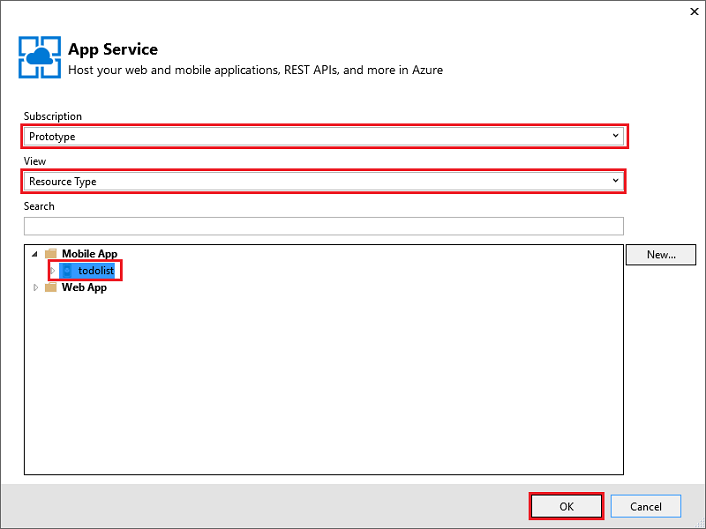
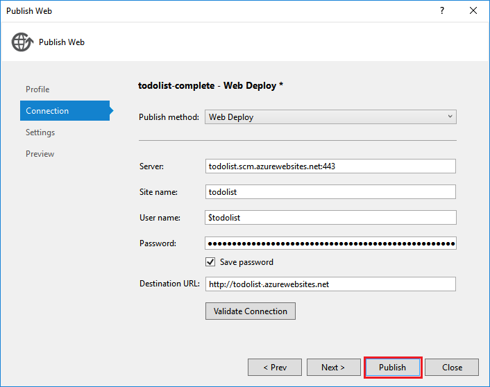
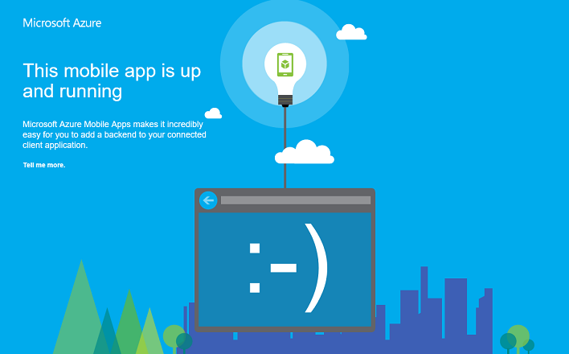

<properties
	pageTitle="如何使用适用于移动应用的 .NET 后端服务器 SDK | Azure 应用服务"
	description="了解如何使用适用于 Azure 应用服务移动应用的 .NET 后端服务器 SDK。"
	keywords="应用服务, azure 应用服务, 移动应用, 移动服务, 缩放, 可缩放, 应用部署, azure 应用部署"
	services="app-service\mobile"
	documentationCenter=""
	authors="adrianhall"
	manager="erikre"
	editor=""/>  

<tags
	ms.service="app-service-mobile"
	ms.workload="mobile"
	ms.tgt_pltfrm="mobile-multiple"
	ms.devlang="dotnet"
	ms.topic="article"
	ms.date="10/01/2016"
	wacn.date="02/21/2017"
	ms.author="adrianha"/>

# 使用适用于 Azure 移动应用的 .NET 后端服务器 SDK

[AZURE.INCLUDE [azure-sdk-developer-differences](../../includes/azure-sdk-developer-differences.md)]

[AZURE.INCLUDE [app-service-mobile-selector-server-sdk](../../includes/app-service-mobile-selector-server-sdk.md)]

本主题说明如何在关键的 Azure 应用服务移动应用方案中使用 .NET 后端服务器 SDK。借助 Azure 移动应用 SDK 可从 ASP.NET 应用程序使用移动客户端。

>[AZURE.TIP] [适用于 Azure 移动应用的 .NET 服务器 SDK][2] 是 GitHub 上的开放源代码。存储库包含所有源代码，包括整个服务器 SDK 单元测试套件以及一些示例项目。

## 参考文档

服务器 SDK 的参考文档位于此处：[Azure Mobile Apps .NET Reference][1]（Azure 移动应用 .NET 参考）。

## 如何创建 .NET 移动应用后端

如果正在开始新项目，可以使用 [Azure 门户预览]或 Visual Studio 创建应用服务应用程序。可以在本地运行应用服务应用程序，或将项目发布到基于云的应用服务移动应用。

[AZURE.INCLUDE [azure-sdk-developer-differences](../../includes/azure-visual-studio-login-guide.md)]

如果将移动功能添加到现有项目，请参阅[下载并初始化 SDK](#install-sdk) 部分。

### 使用 Azure 门户创建 .NET 后端

若要创建应用服务移动后端，请按照[快速入门教程][3]或以下步骤操作：

[AZURE.INCLUDE [app-service-mobile-dotnet-backend-create-new-service-classic](../../includes/app-service-mobile-dotnet-backend-create-new-service-classic.md)]

返回“开始使用”边栏选项卡，在“创建表 API”下面，选择“C#”作为“后端语言”。单击“下载”，将压缩的项目文件解压缩到本地计算机，并在 Visual Studio 中打开解决方案。

### 使用 Visual Studio 2013 和 Visual Studio 2015 创建 .NET 后端

安装[用于 .NET 的 Azure SDK][4]（2.9.0 或更高版本），在 Visual Studio 中创建 Azure 移动应用项目。安装 SDK 后，使用以下步骤创建 ASP.NET 应用程序：

1. 打开“新建项目”对话框（从“文件”>“添加”>“项目...”）。

2. 展开“模板”>“Visual C#”，然后选择“Web”。

3. 选择“ASP.NET Web 应用程序”。

4. 填写项目名称。然后，单击“确定”。
5. 在“ASP.NET 4.5.2 模板”下面，选择“Azure 移动应用”。选中“在云中托管”，在云中创建移动后端（可在其中发布此项目）。
6. 单击“确定”。

## 如何下载并初始化 SDK

该 SDK 在 [NuGet.org] 上提供。此包包含开始使用 SDK 所需的基本功能。若要初始化该 SDK，需要对 **HttpConfiguration** 对象执行操作。

###安装 SDK

若要安装该 SDK，请在 Visual Studio 中右键单击服务器项目，选择“管理 NuGet 包”，搜索 [Microsoft.Azure.Mobile.Server] 包，然后单击“安装”。

###初始化服务器项目

初始化 .NET 后端服务器项目的方式类似其他 ASP.NET 项目，可通过包含 OWIN 启动类来完成。确保已引用 NuGet 包 `Microsoft.Owin.Host.SystemWeb`。若要在 Visual Studio 中添加此类，请鼠标右键服务器项目，选择“添加”>“新建项”，然后选择“Web”>“常规”>“OWIN 启动类”。会生成具有以下属性的类：

    [assembly: OwinStartup(typeof(YourServiceName.YourStartupClassName))]

在 OWIN startup 类的 `Configuration()` 方法中，使用 **HttpConfiguration** 对象配置 Azure 移动应用环境。以下示例初始化未添加任何功能的服务器项目：

	// in OWIN startup class
	public void Configuration(IAppBuilder app)
	{
	    HttpConfiguration config = new HttpConfiguration();

	    new MobileAppConfiguration()
	        // no added features
	        .ApplyTo(config);

	    app.UseWebApi(config);
	}

若要启用单个功能，必须在调用 **ApplyTo** 之前对 **MobileAppConfiguration** 对象调用扩展方法。例如，以下代码在初始化期间，将默认路由添加到具有属性 `[MobileAppController]` 的所有 API 控制器：

	new MobileAppConfiguration()
	    .MapApiControllers()
	    .ApplyTo(config);

Azure 门户中的服务器快速启动代码调用 **UseDefaultConfiguration()**。此代码相当于以下设置：

		new MobileAppConfiguration()
			.AddMobileAppHomeController()             // from the Home package
			.MapApiControllers()
			.AddTables(                               // from the Tables package
				new MobileAppTableConfiguration()
					.MapTableControllers()
					.AddEntityFramework()             // from the Entity package
				)
			.AddPushNotifications()                   // from the Notifications package
			.MapLegacyCrossDomainController()         // from the CrossDomain package
			.ApplyTo(config);

使用的扩展方法包括：

* `AddMobileAppHomeController()` 提供默认的 Azure 移动应用主页。
* `MapApiControllers()` 提供自定义 API 功能，用于使用 `[MobileAppController]` 属性修饰的 WebAPI 控制器。
* `AddTables()` 提供 `/tables` 终结点到表控制器的映射。
* `AddTablesWithEntityFramework()` 是速记方法，用于使用基于实体框架的控制器映射 `/tables` 终结点。
* `AddPushNotifications()` 提供将设备注册到通知中心的简单方法。
* `MapLegacyCrossDomainController()` 为本地开发提供标准 CORS 标头。

### SDK 扩展

以下基于 NuGet 的扩展包提供应用程序可以使用的多种移动功能。可以使用 **MobileAppConfiguration** 对象在初始化期间启用扩展。

- [Microsoft.Azure.Mobile.Server.Quickstart]
	 支持基本的移动应用设置。在初始化期间，通过调用 **UseDefaultConfiguration** 扩展方法添加到配置。此扩展包含以下扩展：通知、身份验证、实体、表、跨域和主目录包。Azure 门户上提供的移动应用快速入门使用此包。

- [Microsoft.Azure.Mobile.Server.Home](http://www.nuget.org/packages/Microsoft.Azure.Mobile.Server.Home/)
	实现网站根目录的默认 *此移动应用已启动并在运行* 页。通过调用 **AddMobileAppHomeController** 扩展方法添加到配置。

- [Microsoft.Azure.Mobile.Server.Tables](http://www.nuget.org/packages/Microsoft.Azure.Mobile.Server.Tables/)
	包含用于处理数据和设置数据管道的类。通过调用 **AddTables** 扩展方法添加到配置。

- [Microsoft.Azure.Mobile.Server.Entity](http://www.nuget.org/packages/Microsoft.Azure.Mobile.Server.Entity/)
	使 Entity Framework 能够访问 SQL 数据库中的数据。通过调用 **AddTablesWithEntityFramework** 扩展方法添加到配置。

- [Microsoft.Azure.Mobile.Server.Authentication]
	启用身份验证，并设置用于验证令牌的 OWIN 中间件。通过调用 **AddAppServiceAuthentication** 与 **IAppBuilder**.**UseAppServiceAuthentication** 扩展方法添加到配置。

- [Microsoft.Azure.Mobile.Server.Notifications]
	启用推送通知并定义推送注册终结点。通过调用 **AddPushNotifications** 扩展方法添加到配置。

- [Microsoft.Azure.Mobile.Server.CrossDomain](http://www.nuget.org/packages/Microsoft.Azure.Mobile.Server.CrossDomain/)
	创建从移动应用向旧版 Web 浏览器提供数据的控制器。通过调用 **MapLegacyCrossDomainController** 扩展方法添加到配置。

- [Microsoft.Azure.Mobile.Server.Login]
	提供 AppServiceLoginHandler.CreateToken() 方法，该方法是自定义身份验证方案使用的静态方法。

## 如何发布服务器项目

本部分说明如何从 Visual Studio 发布 .NET 后端项目。也可以使用 Git 或 [Azure 应用服务部署文档](/documentation/articles/web-sites-deploy/)中介绍的任何其他方法部署后端项目。

1. 在 Visual Studio 中，重新生成项目以还原 NuGet 包。

2. 在“解决方案资源管理器”中，右键单击该项目，然后单击“发布”。首次发布时，需要定义发布配置文件。如果已定义配置文件，可以选择它，然后单击“发布”。

2. 如果系统要求选择发布目标，请单击“Microsoft Azure 应用服务”>“下一步”，然后根据需要使用 Azure 凭据登录。Visual Studio 将直接从 Azure 下载并安全存储发布设置。

	  

3. 选择“订阅”，从“视图”中选择“资源类型”，展开“移动应用”，单击移动应用后端，然后单击“确定”。

	  

4. 验证发布配置文件信息，然后单击“发布”。

	  

	成功发布移动应用后端后，可以看到表示成功的登陆页面。

	  

## 如何定义表控制器

定义表控制器，向移动客户端公开 SQL 表。配置表控制器需要执行三个步骤：

1. 创建一个数据传输对象 (DTO) 类。
2. 在移动 DbContext 类中配置表引用。
3. 创建表控制器。

数据传输对象 (DTO) 是一个继承自 `EntityData` 的纯 C# 对象。例如：

    public class TodoItem : EntityData
    {
        public string Text { get; set; }
        public bool Complete {get; set;}
    }

DTO 用于定义 SQL 数据库内的表。若要创建数据库项，请将 `DbSet<>` 属性添加到正在使用的 DbContext。在 Azure 移动应用的默认项目模板中，DbContext 称为`Models\MobileServiceContext.cs`：

    public class MobileServiceContext : DbContext
    {
        private const string connectionStringName = "Name=MS_TableConnectionString";

        public MobileServiceContext() : base(connectionStringName)
        {

        }

        public DbSet<TodoItem> TodoItems { get; set; }

        protected override void OnModelCreating(DbModelBuilder modelBuilder)
        {
            modelBuilder.Conventions.Add(
                new AttributeToColumnAnnotationConvention<TableColumnAttribute, string>(
                    "ServiceColumnTable", (property, attributes) => attributes.Single().ColumnType.ToString()));
        }
    }

如果安装了 Azure SDK，现在可以创建模板表控制器，如下所示：

1. 右键单击“控制器”文件夹，然后选择“添加”>“控制器...”。
2. 选择“Azure 移动应用表控制器”选项，然后单击“添加”。
3. 在“添加控制器”对话框中：
    * 在“模型类”下拉框中，选择新的 DTO。
    * 在“DbContext”下拉框中，选择“移动服务 DbContext”类。
    * 已为控制器创建名称。
4. 单击“添加”。

快速入门服务器项目包含简单的 **TodoItemController** 的示例。

###  如何调整表分页大小

默认情况下，Azure 移动应用为每个请求返回 50 条记录。分页可以确保客户端不会长时间占用其 UI 线程或服务器，从而提供良好的用户体验。若要更改表分页大小，可增加服务器端“允许的查询大小”和客户端页面大小。服务器端“允许的查询大小”可使用 `EnableQuery` 属性调整：

    [EnableQuery(PageSize = 500)]

确保 PageSize 大于或等于客户端请求的大小。有关更改客户端页面大小的详细信息，请参阅具体的客户端操作指南文档。

## 如何定义自定义 API 控制器

自定义 API 控制器通过公开终结点，向移动应用后端提供最基本的功能。可以使用 [MobileAppController] 属性注册移动设备特定的 API 控制器。`MobileAppController` 属性会注册路由、设置移动应用 JSON 序列化程序，并打开[客户端版本检查](/documentation/articles/app-service-mobile-client-and-server-versioning/)。

1. 在 Visual Studio 中，右键单击“控制器”文件夹，单击“添加”>“控制器”，选择“Web API 2 控制器 &mdash; 空白”，然后单击“添加”。

2. 提供**控制器名称**（例如 `CustomController`），然后单击“添加”。

3. 在新控制器类文件中添加以下 using 语句：

		using Microsoft.Azure.Mobile.Server.Config;

4. 将 **[MobileAppController]** 属性应用到 API 控制器类定义，如以下示例中所示：

		[MobileAppController]
		public class CustomController : ApiController
		{
		      //...
		}

4. 在 App\_Start/Startup.MobileApp.cs 文件中添加对 **MapApiControllers** 扩展方法的调用，如以下示例中所示：

		new MobileAppConfiguration()
		    .MapApiControllers()
		    .ApplyTo(config);

还可以使用 `UseDefaultConfiguration()` 扩展方法，而不使用 `MapApiControllers()`。客户端仍可访问任何未应用 **MobileAppControllerAttribute** 的控制器，但是使用任何移动应用客户端 SDK 的客户端可能无法正常使用此类控制器。

## 如何使用身份验证

Azure 移动应用使用应用服务身份验证/授权来保护移动后端。本部分说明如何在 .NET 后端服务器项目中执行以下身份验证相关的任务：

+ [如何将身份验证添加到服务器项目](#add-auth)
+ [如何对应用程序使用自定义身份验证](#custom-auth)
+ [如何检索经过身份验证的用户信息](#user-info)
+ [如何限制已获授权用户的数据访问](#authorize)

### 如何将身份验证添加到服务器项目

可以通过扩展 **MobileAppConfiguration** 对象并配置 OWIN 中间件，将身份验证添加到服务器项目。安装 [Microsoft.Azure.Mobile.Server.Quickstart] 包和调用 **UseDefaultConfiguration** 扩展方法时，可以跳到步骤 3。

1. 在 Visual Studio 中，安装 [Microsoft.Azure.Mobile.Server.Authentication] 包。

2. 在 Startup.cs 项目文件中 **Configuration** 方法的开头添加以下代码行：

		app.UseAppServiceAuthentication(config);

	此 OWIN 中间件组件验证由关联的应用服务网关颁发的令牌。

3. 将 `[Authorize]` 属性添加到任何要求身份验证的控制器或方法。

若要了解如何在移动应用后端对客户端进行身份验证，请参阅 [Add authentication to your app](/documentation/articles/app-service-mobile-ios-get-started-users/)（将身份验证添加到应用）。

### 如何对应用程序使用自定义身份验证

如果不想使用这些应用服务身份验证/授权提供程序，可实现自己的登录系统。安装 [Microsoft.Azure.Mobile.Server.Login] 包有助于生成身份验证令牌。提供自己的代码用于验证用户凭据。例如，可以针对数据库中的加盐密码和哈希密码进行检查。在以下示例中，`isValidAssertion()` 方法（在其他位置定义）负责这些检查。

通过创建 ApiController 并公开 `register` 和 `login` 操作来公开自定义身份验证。客户端应使用自定义 UI 从用户处收集信息。这些信息随后使用标准 HTTP POST 调用提交至 API。服务器验证断言后，便可以使用 `AppServiceLoginHandler.CreateToken()` 方法颁发令牌。ApiController **不应**使用 `[MobileAppController]` 属性。

请注意，此 ApiController **不应**使用 `[MobileAppController]` 属性，因为这会导致客户端登录请求失败。`[MobileAppController]` 属性需要请求标头 [ZUMO-API-VERSION](/documentation/articles/app-service-mobile-client-and-server-versioning/)，此标头**并非**由客户端 SDK 针对登录路由而发送。

可能的示例登录操作为：

		public IHttpActionResult Post([FromBody] JObject assertion)
		{
			if (isValidAssertion(assertion)) // user-defined function, checks against a database
			{
				JwtSecurityToken token = AppServiceLoginHandler.CreateToken(new Claim[] { new Claim(JwtRegisteredClaimNames.Sub, assertion["username"]) },
					mySigningKey,
					myAppURL,
					myAppURL,
					TimeSpan.FromHours(24) );
				return Ok(new LoginResult()
				{
					AuthenticationToken = token.RawData,
					User = new LoginResultUser() { UserId = userName.ToString() }
				});
			}
			else // user assertion was not valid
			{
				return this.Request.CreateUnauthorizedResponse();
			}
		}

在上述示例中，LoginResult 和 LoginResultUser 是公开必需属性的可序列化对象。客户端预期收到的登录响应是采用以下格式的 JSON 对象：

		{
			"authenticationToken": "<token>",
			"user": {
				"userId": "<userId>"
			}
		}

`AppServiceLoginHandler.CreateToken()` 方法包含 _audience_ 和 _issuer_ 参数。这两个参数使用 HTTPS 方案设置为应用程序根目录的 URL。同样，应该将 _secretKey_ 设置为应用程序的签名密钥值。不要分发客户端中的签名密钥，因为它可用于构建密钥以及模拟用户。在应用服务中托管时，可通过引用 _WEBSITE\_AUTH\_SIGNING\_KEY_ 环境变量获取签名密钥。如果在本地调试上下文中有需要，可根据[使用身份验证进行本地调试](#local-debug)部分中的说明检索密钥，并将它存储为应用程序设置。

颁发的令牌可能还包括其他声明和到期日期。颁发的令牌至少必须包括一个使用者 (**sub**) 声明。

可通过重载身份验证路由支持标准客户端 `loginAsync()` 方法。如果客户端调用 `client.loginAsync('custom');` 进行登录，路由必须为 `/.auth/login/custom`。可使用 `MapHttpRoute()` 设置用于自定义身份验证控制器的路由：

    config.Routes.MapHttpRoute("custom", ".auth/login/custom", new { controller = "CustomAuth" });

>[AZURE.TIP] 使用 `loginAsync()` 方法可确保将身份验证令牌附加到后续对服务的每个调用。

###如何检索经过身份验证的用户信息

当应用服务对用户进行身份验证时，可以访问分配的用户 ID 和 .NET 后端代码中的其他信息。用户信息可用于在后端进行授权决策。以下代码可获取与请求关联的用户 ID：

    // Get the SID of the current user.
    var claimsPrincipal = this.User as ClaimsPrincipal;
    string sid = claimsPrincipal.FindFirst(ClaimTypes.NameIdentifier).Value;

SID 派生自提供程序特定的用户 ID，对于给定的用户和登录提供程序而言是静态的。对于无效的身份验证令牌，SID 为 null。

应用服务还允许向登录提供程序请求特定声明。这样，便可以从提供程序请求更多信息。可以在门户上的提供程序边栏选项卡中指定声明。某些声明需要提供程序的额外配置。

### 如何限制已获授权用户的数据访问

上一部分已说明如何检索经过身份验证的用户的用户 ID。可以根据此值来限制对数据和其他资源的访问。例如，将 userId 列添加到表并根据用户 ID 筛选查询结果，是将返回的数据局限于已获授权用户的简单方式。以下代码只会在 SID 与 TodoItem 表上 UserId 列中的值匹配时才返回数据行：

    // Get the SID of the current user.
    var claimsPrincipal = this.User as ClaimsPrincipal;
    string sid = claimsPrincipal.FindFirst(ClaimTypes.NameIdentifier).Value;

    // Only return data rows that belong to the current user.
    return Query().Where(t => t.UserId == sid);

`Query()` 方法返回 `IQueryable`，可通过 LINQ 操作用于处理筛选。

## 如何将推送通知添加到服务器项目

通过扩展 **MobileAppConfiguration** 对象并创建通知中心客户端，将推送通知添加到服务器项目。

1. 在 Visual Studio 中，右键单击服务器项目并单击“管理 NuGet 包”，搜索 `Microsoft.Azure.Mobile.Server.Notifications`，然后单击“安装”。

2. 重复此步骤安装 `Microsoft.Azure.NotificationHubs` 包，其中包含通知中心客户端库。

3. 在 App\_Start/Startup.MobileApp.cs 中，于初始化期间添加对 **AddPushNotifications()** 扩展方法的调用：

		new MobileAppConfiguration()
			// other features...
			.AddPushNotifications()
			.ApplyTo(config);

4. 添加以下代码用于创建通知中心客户端：

        // Get the settings for the server project.
        HttpConfiguration config = this.Configuration;
        MobileAppSettingsDictionary settings =
            config.GetMobileAppSettingsProvider().GetMobileAppSettings();

        // Get the Notification Hubs credentials for the Mobile App.
        string notificationHubName = settings.NotificationHubName;
        string notificationHubConnection = settings
            .Connections[MobileAppSettingsKeys.NotificationHubConnectionString].ConnectionString;

        // Create a new Notification Hub client.
        NotificationHubClient hub = NotificationHubClient
        .CreateClientFromConnectionString(notificationHubConnection, notificationHubName);

现在可以使用通知中心客户端将推送通知发送到已注册的设备。有关详细信息，请参阅 [Add push notifications to your app](/documentation/articles/app-service-mobile-ios-get-started-push/)（将推送通知添加到应用）。若要了解有关通知中心的详细信息，请参阅[通知中心概述](/documentation/articles/notification-hubs-push-notification-overview/)。
# 如何：使用标记启用目标推送

通知中心允许使用标记将目标通知发送到特定的注册。多个标记会自动创建：

* 安装 ID 标识特定设备。
* 基于身份验证 SID 的用户 ID 标识特定用户。

可以从 **MobileServiceClient** 上的 **installationId** 属性访问安装 ID。以下示例演示如何在通知中心内使用安装 ID 将标记添加到特定的安装：

	hub.PatchInstallation("my-installation-id", new[]
	{
	    new PartialUpdateOperation
	    {
	        Operation = UpdateOperationType.Add,
	        Path = "/tags",
	        Value = "{my-tag}"
	    }
	});

创建安装时，后端会忽略客户端在推送通知注册期间提供的任何标记。若要使客户端能够将标记添加到安装，必须创建使用上述模式添加标记的自定义 API。

有关示例，请参阅应用服务移动应用已完成的快速入门示例中的[客户端添加的推送通知标记][5]。

##如何将推送通知发送到经过身份验证的用户

当经过身份验证的用户注册推送通知时，用户 ID 标记将自动添加到注册中。使用此标记可以向该用户注册的所有设备发送推送通知。以下代码获取发出请求的用户的 SID，并将模板推送通知发送到该用户的每个设备注册：

    // Get the current user SID and create a tag for the current user.
    var claimsPrincipal = this.User as ClaimsPrincipal;
    string sid = claimsPrincipal.FindFirst(ClaimTypes.NameIdentifier).Value;
    string userTag = "_UserId:" + sid;

    // Build a dictionary for the template with the item message text.
    var notification = new Dictionary<string, string> { { "message", item.Text } };

    // Send a template notification to the user ID.
    await hub.SendTemplateNotificationAsync(notification, userTag);

在注册来自经过身份验证客户端的推送通知时，请确保在尝试注册之前身份验证已完成。有关详细信息，请参阅适用于 .NET 后端的应用服务移动应用完整快速入门示例中的 [Push to users][6]（推送到用户）。

## 如何对 .NET 服务器 SDK 进行调试和故障排除

Azure 应用服务提供多种适用于 ASP.NET 应用程序的调试和故障排除方法：

- [Monitoring an Azure App Service（监视 Azure 应用服务）](/documentation/articles/web-sites-monitor/)
- [Enable Diagnostic Logging in Azure App Service（在 Azure 应用服务中启用诊断记录）](/documentation/articles/web-sites-enable-diagnostic-log/)
- [Toubleshoot an Azure App Service in Visual Studio（在 Visual Studio 中对 Azure 应用服务进行故障排除）](/documentation/articles/web-sites-dotnet-troubleshoot-visual-studio/)

### 日志记录

可以使用标准的 ASP.NET 跟踪写入来写入应用服务诊断日志。写入日志之前，必须在移动应用后端中启用诊断。

若要启用诊断并写入日志，请执行以下操作：

1. 遵循 [How to enable diagnostics](/documentation/articles/web-sites-enable-diagnostic-log/#enablediag)（如何启用诊断）中的步骤。

2. 在代码文件中添加以下 using 语句：

		using System.Web.Http.Tracing;

3. 创建从 .NET 后端写入诊断日志的跟踪写入器，如下所示：

		ITraceWriter traceWriter = this.Configuration.Services.GetTraceWriter();
		traceWriter.Info("Hello, World");

4. 重新发布服务器项目，并访问移动应用后端，结合日志记录执行代码路径。

5. 根据[如何下载记录](/documentation/articles/web-sites-enable-diagnostic-log/#download)中所述下载并评估日志。

### 使用身份验证进行本地调试

可以先在本地运行应用程序以测试更改，然后将更改发布到云中。对于大部分 Azure 移动应用后端，在 Visual Studio 中按 *F5* 。但是，使用身份验证时需要考虑其他一些事项。

必须有基于云的移动应用，已配置应用服务身份验证/授权，并且客户端必须有指定为备用登录主机的云终结点。请参阅各客户端平台的相关文档，获取所需的特定步骤。

确保移动后端中已安装 [Microsoft.Azure.Mobile.Server.Authentication]。然后，在将 `MobileAppConfiguration` 应用到 `HttpConfiguration` 之后，在应用程序的 OWIN 启动类中添加以下代码：

		app.UseAppServiceAuthentication(new AppServiceAuthenticationOptions()
		{
			SigningKey = ConfigurationManager.AppSettings["authSigningKey"],
			ValidAudiences = new[] { ConfigurationManager.AppSettings["authAudience"] },
			ValidIssuers = new[] { ConfigurationManager.AppSettings["authIssuer"] },
			TokenHandler = config.GetAppServiceTokenHandler()
		});

在上述示例中，应该使用 HTTPS 方案将 Web.config 文件中的 _authAudience_ 和 _authIssuer_ 应用程序设置配置为应用程序根目录的 URL。同样，应该将 _authSigningKey_ 设置为应用程序的签名密钥值。获取签名密钥：

1. 在 [Azure 门户预览]中导航到应用
2. 依次单击“工具”、“Kudu”和“转到”。
3. 在 Kudu 管理站点中，单击“环境”。
4. 查找 _WEBSITE\_AUTH\_SIGNING\_KEY_ 的值。

使用本地应用程序配置中 _authSigningKey_ 参数的签名密钥。移动后端现已经过相关配置，在本地运行时可以验证令牌，该令牌由客户端从基于云的终结点获取。

[1]: https://msdn.microsoft.com/zh-cn/library/azure/dn961176.aspx
[2]: https://github.com/Azure/azure-mobile-apps-net-server
[3]: /documentation/articles/app-service-mobile-ios-get-started/
[4]: /downloads/
[5]: https://github.com/Azure-Samples/app-service-mobile-dotnet-backend-quickstart/blob/master/README.md#client-added-push-notification-tags
[6]: https://github.com/Azure-Samples/app-service-mobile-dotnet-backend-quickstart/blob/master/README.md#push-to-users
[Azure 门户预览]: https://portal.azure.cn/
[NuGet.org]: http://www.nuget.org/
[Microsoft.Azure.Mobile.Server]: http://www.nuget.org/packages/Microsoft.Azure.Mobile.Server/
[Microsoft.Azure.Mobile.Server.Quickstart]: http://www.nuget.org/packages/Microsoft.Azure.Mobile.Server.Quickstart/
[Microsoft.Azure.Mobile.Server.Authentication]: http://www.nuget.org/packages/Microsoft.Azure.Mobile.Server.Authentication/
[Microsoft.Azure.Mobile.Server.Login]: http://www.nuget.org/packages/Microsoft.Azure.Mobile.Server.Login/
[Microsoft.Azure.Mobile.Server.Notifications]: http://www.nuget.org/packages/Microsoft.Azure.Mobile.Server.Notifications/
[MapHttpAttributeRoutes]: https://msdn.microsoft.com/zh-cn/library/dn479134(v=vs.118).aspx

<!---HONumber=Mooncake_1114_2016-->