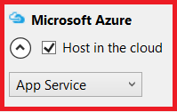

<properties
	pageTitle="使用 Visual Studio 将 ASP.NET 应用部署到 Azure App Service | Azure"
	description="了解如何使用 Visual Studio 将 ASP.NET Web 项目部署到 Azure App Service 中的新 Web 应用。"
	services="app-service\web"
	documentationCenter=".net"
	authors="tdykstra"
	manager="wpickett"
	editor=""/>

<tags
	ms.service="app-service-web"
	ms.date="07/22/2016"
	wacn.date="09/26/2016"/>

# 使用 Visual Studio 将 ASP.NET Web 应用部署到 Azure App Service

[AZURE.INCLUDE [选项卡](../../includes/app-service-web-get-started-nav-tabs.md)]

## 概述

本教程介绍如何使用 Visual Studio 2015 将 ASP.NET Web 应用程序部署到 [Azure App Service 中的 Web 应用](/documentation/articles/app-service-web-overview/)。

本教程假设你是此前没有 Azure 使用经验的 ASP.NET 开发人员。完成本教程后，你将能够在云中启动并运行简单的 Web 应用程序。

学习内容：

* 在 Visual Studio 中，如何在创建新的 Web 项目的同时创建新的应用服务 Web 应用。
* 如何使用 Visual Studio 将 Web 项目部署到应用服务 Web 应用。

下图说明了在本教程中执行的操作。

教程末尾的[故障排除](#troubleshooting)部分介绍了在出现故障的情况下应如何操作，[后续步骤](#next-steps)部分提供了其他教程的链接，方便用户更深入地了解如何使用 Azure App Service。

由于这是一篇入门教程，其中只是说明了部署 Web 项目有多么简单 - 不需要使用数据库，也不需要进行身份验证或授权。有关更多高级部署主题的链接，请参阅 [How to deploy an Azure web app](/documentation/articles/web-sites-deploy/)（如何部署 Azure Web 应用）。

除了安装用于 .NET 的 Azure SDK所需的时间，本教程需要大约 10-15 分钟才能完成。

## 先决条件

* 本教程假设你用过 ASP.NET MVC 和 Visual Studio。如需简介，请参阅 [Getting Started with ASP.NET MVC 5](http://www.asp.net/mvc/overview/getting-started/introduction/getting-started)（ASP.NET MVC 5 入门）。

* 需要一个 Azure 帐户。可以[建立 Azure 试用帐户](/pricing/1rmb-trial/?WT.mc_id=A261C142F)。

## 设置开发环境

本教程专为配合使用 Visual Studio 2015 和 [用于 .NET 的 Azure SDK](/documentation/articles/dotnet-sdk/) 2.9 或更高版本编写。

* [下载最新的用于 Visual Studio 2015 的 Azure SDK](http://go.microsoft.com/fwlink/?linkid=518003)。该 SDK 将会安装 Visual Studio 2015（如果尚未安装）。

	>[AZURE.NOTE] 根据计算机上已有 SDK 依赖项数量的不同，安装 SDK 可能耗时较长，从几分钟到半小时或更长时间不等。

如果你有 Visual Studio 2013 并想要使用它，可以[下载最新的 Azure SDK for Visual Studio 2013](http://go.microsoft.com/fwlink/?LinkID=324322)。某些屏幕可能看起来与这些插图不同。

## 配置新的 Web 项目

下一步是在 Visual Studio 中创建一个 Web 项目，并在 Azure App Service 中创建一个 Web 应用。在本教程部分，你将配置新的 Web 项目。

1. 打开 Visual Studio 2015。

2. 单击“文件”>“新建”>“项目”。

3. 在“新建项目”对话框中，单击“Visual C#”>“Web”>“ASP.NET Web 应用程序”。

3. 确保选择 **.NET Framework 4.5.2** 作为目标框架。

4. 将应用程序命名为 **MyExample**，然后单击“确定”。

	

5. 在“新建 ASP.NET 项目”对话框中，选择“MVC”模板，然后单击“更改身份验证”。

	在本教程中，你将要部署 ASP.NET MVC Web 项目。如果想要了解如何部署 ASP.NET Web API 项目，请参阅[后续步骤](#next-steps)部分。

	

6. 在“更改身份验证”对话框中，单击“无身份验证”，然后单击“确定”。

	

	在本快速入门教程中，你要部署一个不执行用户登录的简单应用。

5. 在“新建 ASP.NET 项目”对话框的“Azure”部分中，确保“在云中托管”处于未选中状态。

	

	Azure 中国区目前不支持在 Visual Studio 中创建或管理网站。因此，需要转到[Azure 门户预览](https://Portal.azure.cn/)创建新的 Azure Web 应用

6. 单击**“确定”**

## 将项目部署到网站

在本部分中，你要将 Web 项目部署到 Web 应用。

1. 在[经典管理门户](https://manage.windowsazure.cn/)中，创建新网站或选择已退出的网站。

2. 单击网站的“仪表板”。在“速览”下，单击“下载发布配置文件”。

3. 在 Visual Studio 中，右键单击你的项目并选择“发布”

	

	几秒钟后，将显示“发布 Web”向导。

4. 在“发布配置文件”中单击“导入”，然后选择前面下载的发布配置文件。

	Visual Studio 将项目部署到 Azure 所需的设置随即已导入。可以使用该向导查看和更改这些设置。

8. 在“发布 Web”向导的“连接”选项卡中，单击“下一步”。

	

10. 在“设置”选项卡中，单击“下一步”。

	你可以接受“配置”和“文件发布选项”的默认值。

	你可以通过“配置”下拉列表部署用于远程调试的调试版本。[后续步骤](#next-steps)部分链接到了说明如何在调试模式下远程运行 Visual Studio 的教程。

	

11. 在“预览”选项卡中，单击“发布”。

	

	单击“发布”后，Visual Studio 开始执行将文件复制到 Azure 服务器的过程。这可能需要一到两分钟。

	“输出”和“Azure App Service 活动”窗口将显示已执行的部署操作并报告已成功完成部署。

	

	成功完成部署后，默认浏览器将自动打开指向已部署 Web 应用的 URL。你创建的应用程序现在运行于云中。浏览器地址栏中的 URL 显示正在从 Internet 加载该 Web 应用。

	

	> [AZURE.TIP] 可以启用“Web 单键发布”工具栏以快速完成部署。单击“视图”>“工具栏”，然后选择“Web 单键发布”。可通过工具栏选择一个配置文件，然后单击相关按钮进行发布，或者单击相关按钮以打开“发布 Web”向导。
	> 

## 故障排除

如果在学习本教程的过程中遇到问题，请确保你使用的是最新版本的用于 .NET 的 Azure SDK。检查版本的最简单方法是[下载用于 Visual Studio 2015 的 Azure SDK](http://go.microsoft.com/fwlink/?linkid=518003)。如果你已安装最新版本，Web 平台安装程序会指出不需要进行安装。

如果在企业网络中并尝试通过防火墙部署到 Azure App Service，请确保已针对 Web 部署打开端口 443 和 8172。如果无法打开这些端口，请参阅下面的“后续步骤”部分以了解其他部署选项。

## 后续步骤

在本教程中，你已了解如何创建简单的 Web 应用程序并将其部署到 Azure Web 应用。可通过以下相关主题和资源来详细了解 Azure App Service：

* 在 [Azure 门户预览](https://portal.azure.cn/)中监视和管理 Web 应用。

	有关详细信息，请参阅 [Configure web app in Azure App Service](/documentation/articles/web-sites-configure/)（在 Azure App Service 中配置 Web 应用）。

* 从源代码管理部署 Web 项目

	有关通过[源代码管理系统](http://www.asp.net/aspnet/overview/developing-apps-with-windows-azure/building-real-world-cloud-apps-with-windows-azure/source-control)[自动完成部署](http://www.asp.net/aspnet/overview/developing-apps-with-windows-azure/building-real-world-cloud-apps-with-windows-azure/continuous-integration-and-continuous-delivery)的信息，请参阅 [Get started with web apps in Azure App Service](/documentation/articles/app-service-web-get-started/)（Azure App Service 中的 Web 应用入门）和 [How to deploy an Azure web app](/documentation/articles/web-sites-deploy/)（如何部署 Azure Web 应用）。

* 将 ASP.NET Web API 部署到 Azure App Service 中的 API 应用

	你已经了解如何创建主要用于托管网站的 Azure App Service 实例。应用服务还提供了用于托管 Web API 的功能，例如，用于生成客户端代码的 CORS 支持和 API 元数据支持。你可以在 Web 应用中使用 API 功能，但如果你主要希望在应用服务的实例中托管 API，则 **API 应用**是更好的选择。有关详细信息，请参阅 [Get started with API Apps and ASP.NET in Azure App Service](/documentation/articles/app-service-api-dotnet-get-started/)（Azure App Service 中的 API 应用和 ASP.NET 入门）。

* 添加自定义域名和 SSL

	有关如何使用 SSL 和你自己的域（例如 www.contoso.com 而不是 contoso.chinacloudsites.cn）的信息，请参阅以下资源：

	* [在 Azure App Service 中配置自定义域名](/documentation/articles/web-sites-custom-domain-name/)
	* [为 Azure 网站启用 HTTPS](/documentation/articles/web-sites-configure-ssl-certificate/)

* 当你不再使用 Web 应用和任何相关的 Azure 资源时，请删除包含这些资源的资源组。

*	有关在应用服务中创建 ASP.NET Web 应用的更多示例，请参阅 [HealthClinic.biz](https://github.com/Microsoft/HealthClinic.biz) 2015 Connect [演示](https://blogs.msdn.microsoft.com/visualstudio/2015/12/08/connectdemos-2015-healthclinic-biz/)中的 [Create and deploy an ASP.NET web app in Azure App Service在](https://github.com/Microsoft/HealthClinic.biz/wiki/Create-and-deploy-an-ASP.NET-web-app-in-Azure-App-Service)（ Azure App Service 中创建和部署 ASP.NET Web 应用）和 [Create and deploy a mobile app in Azure App Service](https://github.com/Microsoft/HealthClinic.biz/wiki/Create-and-deploy-a-mobile-app-in-Azure-App-Service)（在 Azure App Service 中创建和部署移动应用）。有关 HealthClinic.biz 演示的多个快速入门，请参阅 [Azure Developer Tools Quickstarts](https://github.com/Microsoft/HealthClinic.biz/wiki/Azure-Developer-Tools-Quickstarts)（Azure 开发人员工具快速入门）。

<!---HONumber=Mooncake_0919_2016-->