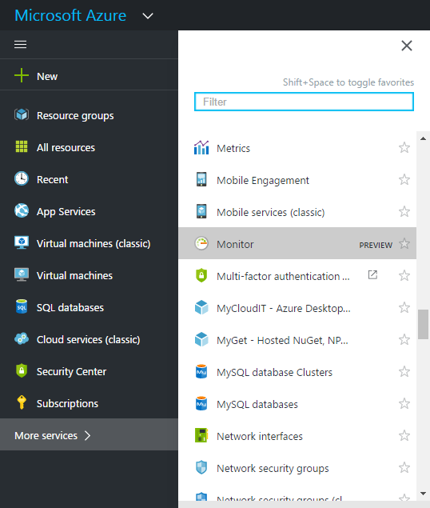
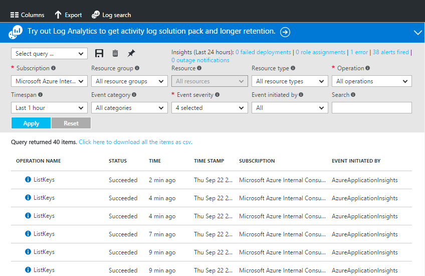
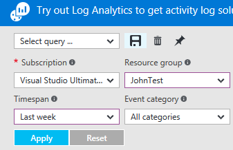
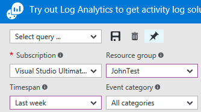
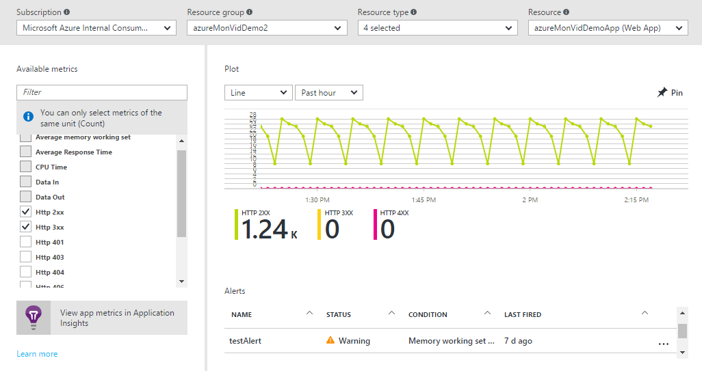
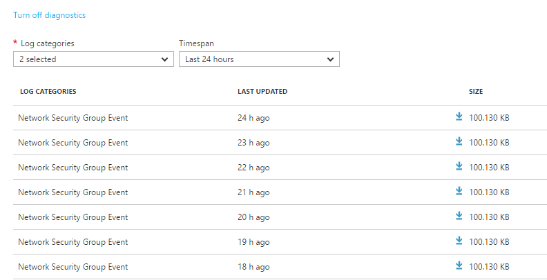
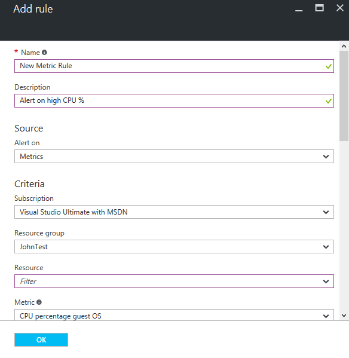

<properties
	pageTitle="Azure 监视器入门 | Azure"
	description="开始使用 Azure 监视器来洞察资源操作并根据数据采取措施。"
	authors="johnkemnetz"
	manager="rboucher"
	editor=""
	services="monitoring-and-diagnostics"
	documentationCenter="monitoring-and-diagnostics"/>

<tags
	ms.service="monitoring-and-diagnostics"
	ms.workload="na"
	ms.tgt_pltfrm="na"
	ms.devlang="na"
	ms.topic="article"
	ms.date="09/26/2016"
	wacn.date="11/14/2016"
	ms.author="johnkem"/>

# Azure 监视器入门

Azure 监视器是一款全新的平台服务，提供一个中心位置来让用户监视 Azure 资源。使用 Azure 监视器能够可视化、查询、路由、存档来自 Azure 资源的指标和日志并对其执行操作。可以使用“监视”门户边栏选项卡、Insights PowerShell cmdlet、跨平台 CLI 或 Azure Insights REST API 来处理这些数据。本文演练 Azure 监视器的几个重要组件。

1. 在门户中，导航到“更多服务”并找到“监视”选项。单击星号图标，将此选项添加到收藏列表，这样，就始终能够从左侧导航栏方便地访问它。

      

2. 单击“监视”选项打开“监视”边栏选项卡。此边栏选项卡将所有监视设置和数据组成一个合并视图。其中打开的第一个部分是“活动日志”。

      

    Azure 监视器包含三种基本类别的监视数据：活动日志、指标和诊断日志。

3. 单击“活动日志”可确保显示活动日志部分。

      

    **活动日志**描述针对订阅中的资源执行的所有操作。使用活动日志可以确定针对订阅中的资源执行的任何写入操作的“内容、用户和时间”。例如，活动日志可以告知何时停止了 Web 应用，以及谁停止了 Web 应用。活动日志事件在平台中存储 90 天。
   
    可以为常用的筛选器创建并保存查询，然后，将最重要的查询固定到门户仪表板，这样，只要发生符合条件的事件，就能收到通知。

4. 筛选特定资源组在过去一周的视图，然后单击“保存”按钮。

      

5. 接下来，单击“固定”按钮。

      

    此演练中的大多数视图都可固定到仪表板。这有助于创建单一信息源来显示有关服务的操作数据。

6. 返回到仪表板。现在可以看到，该查询（和结果数目）已显示在仪表板中。

      

7. 返回到“监视”磁贴，然后单击“指标”部分。首先需要选择一个资源，使用该部分顶部的选项进行筛选和选择即可。

      

    所有 Azure 资源都会发出指标。此视图将所有指标合并在单个窗格中。

8. 选择资源后，所有可用指标将显示在边栏选项卡的左侧。可以选择指标并修改图形类型和时间范围，一次性绘制多个指标的图表。此外，还可以查看针对此资源设置的所有指标警报。

      

9. 如果对图表感到满意，可以使用“固定”按钮将它固定到仪表板。

10. 返回到“监视”边栏选项卡，然后单击“诊断日志”。

      

    诊断日志是特定资源发出的日志，提供与该资源的操作相关的数据。例如，“网络安全组规则计数器”和“逻辑应用工作流日志”就属于诊断日志。这些日志可存储在存储帐户中、流式传输到事件中心，进行高级搜索和警报。
   
    在门户中，可以查看和筛选订阅中所有资源的列表，确定它们是否已启用诊断日志。

11. 在诊断日志边栏选项卡中单击某个资源。如果诊断日志存储在存储帐户中，将会显示一个可直接下载的每小时日志列表。还可以单击“打开/关闭诊断”，以便设置在存储帐户中存档日志、将其流式传输到事件中心。

      

12. 导航到“监视”边栏选项卡的“警报”部分。

      

    可以在此处管理针对 Azure 资源的所有警报。警报可以触发发送电子邮件或发布到 Webhook 的活动。
   
13. 单击“添加指标警报”可创建警报。

      

    然后，可将警报固定到仪表板，随时轻松查看其状态。

可以通过执行以下步骤并将所有相关磁贴固定到仪表板，创建应用程序与基础结构的完整视图，如下所示：

  

## 后续步骤
- 阅读 [Overview of Azure Monitor](/documentation/articles/monitoring-overview/)（Azure 监视器概述）

<!---HONumber=Mooncake_1107_2016-->