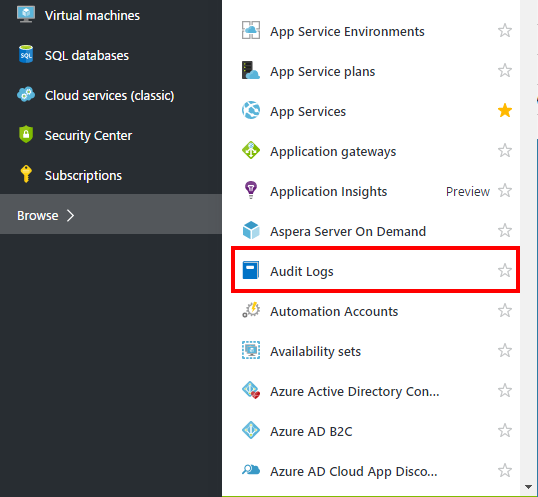
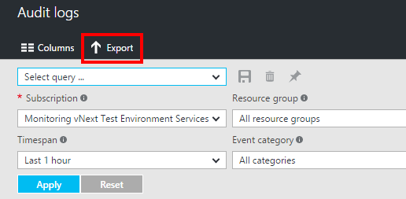
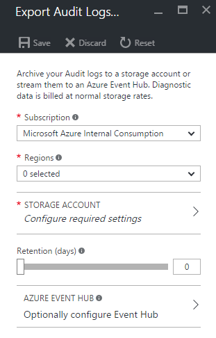

<properties
	pageTitle="Azure 活动日志概述 | Azure"
	description="了解什么是 Azure 活动日志，以及如何通过它了解发生在 Azure 订阅中的事件。"
	authors="johnkemnetz"
	manager="rboucher"
	editor=""
	services="monitoring-and-diagnostics"
	documentationCenter="monitoring-and-diagnostics"/>

<tags
	ms.service="monitoring-and-diagnostics"
	ms.workload="na"
	ms.tgt_pltfrm="na"
	ms.devlang="na"
	ms.topic="article"
	ms.date="08/17/2016"
	ms.author="johnkem"
	wacn.date="10/17/2016"/>  


# Azure 活动日志概述
**Azure 活动日志**是一种日志，方便用户了解对订阅中的资源执行的操作。活动日志此前称为“审核日志”或“操作日志”，因为它报告订阅的控制平面事件。使用活动日志，用户可确定任何针对订阅中资源的写入（PUT、POST、DELETE）操作的“内容、人员和时间”，并可了解操作状态和其他相关属性。活动日志不包括读取 (GET) 操作。

活动日志不同于[诊断日志](/documentation/articles/monitoring-overview-of-diagnostic-logs/)，后者全都是资源发出的日志。这些日志记录对该资源执行的操作，而不是在该资源上执行的操作。

可以通过 Azure 门户、CLI、PowerShell cmdlet 和 Insights REST API 从活动日志检索事件。

## 可以对活动日志执行的操作
可以对活动日志执行的部分操作如下：

- 在 **Azure 门户**中查询和查看活动日志。
- 通过 REST API、PowerShell Cmdlet 或 CLI 查询活动日志。
- [创建触发活动日志事件的电子邮件或 webhook 警报。](/documentation/articles/insights-auditlog-to-webhook-email/)
- [将活动日志保存到**存储帐户**进行存档或手动检查](/documentation/articles/monitoring-archive-activity-log/)。可以使用“日志配置文件”指定保留时间（天）。
- 在 PowerBI 中使用 [**PowerBI 内容包**](https://powerbi.microsoft.com/zh-CN/documentation/powerbi-content-pack-azure-audit-logs/)分析活动日志。
- [将活动日志流式传输到**事件中心**](/documentation/articles/monitoring-stream-activity-logs-event-hubs/)，方便第三方服务或自定义分析解决方案（例如 PowerBI）引入。

## <a name="export-the-activity-log-with-log-profiles"></a> 使用日志配置文件导出活动日志
**日志配置文件**控制如何导出活动日志。可以使用日志配置文件配置：

- 应将活动日志发送到何处：存储帐户或事件中心
- 应该发送哪些事件类别（例如 Write、Delete、Action）
- 应该导出哪些区域（位置）
- 应该将活动日志保留在存储帐户中多长时间 – 保留期为 0 天表示永久保留日志。如果不需永久保留，则可将该值设置为 1 到 2147483647 之间的任意天数。如果设置了保留策略，但禁止将日志存储在存储帐户中（例如，如果仅选择事件中心或 OMS 选项），则保留策略无效。

这些设置可以在门户的“活动日志”边栏选项卡中通过“导出”选项配置，也可以[使用 REST API](https://msdn.microsoft.com/zh-cn/library/azure/dn931927.aspx)、PowerShell cmdlet 或 CLI 通过编程方式配置。一个订阅只能有一个日志配置文件。

### 通过 Azure 门户配置日志配置文件
可以在 Azure 门户中使用“导出”选项将活动日志流式传输到事件中心，或者将其存储在存储帐户中。

1. 使用门户左侧的菜单导航到“活动日志”边栏选项卡。

      

2. 单击边栏选项卡顶部的“导出”按钮。

      

3. 在出现的边栏选项卡中，可以选择要导出事件的区域、要保存事件的存储帐户、要在存储中保留这些事件的天数（0 天意味着永久保留日志），以及要在其中创建事件中心（用于流式传输这些事件）的服务总线命名空间。

      

4. 单击“保存”保存这些设置。这些设置会即时应用到订阅。

### 通过 Azure PowerShell Cmdlet 配置日志配置文件
#### 获取现有的日志配置文件
```
Get-AzureRmLogProfile
```

#### 添加日志配置文件
```
Add-AzureRmLogProfile -Name my_log_profile -StorageAccountId /subscriptions/s1/resourceGroups/myrg1/providers/Microsoft.Storage/storageAccounts/my_storage -serviceBusRuleId /subscriptions/s1/resourceGroups/Default-ServiceBus-chinanorth/providers/Microsoft.ServiceBus/namespaces/mytestSB/authorizationrules/RootManageSharedAccessKey -Locations chinaeast,chinanorth -RetentionInDays 90 -Categories Write,Delete,Action
```

| 属性 | 必选 | 说明 |
|------------------|----------|-----------------------------------------------------------------------------------------------------------------------------------------------------------------------------------------------|
| 名称 | 是 | 日志配置文件的名称。 |
| StorageAccountId | 否 | 应该将活动日志保存到其中的存储帐户的资源 ID。 |
| serviceBusRuleId | 否 | 服务总线命名空间（需在其中创建事件中心）的服务总线规则 ID。将是以下格式的字符串：`{service bus resource ID}/authorizationrules/{key name}`。 |
| locations | 是 | 要为其收集活动日志事件的逗号分隔区域的列表。 |
| RetentionInDays | 是 | 事件的保留天数，介于 1 到 2147483647 之间。值为零时，将无限期（永久）存储日志。 |
| Categories | 否 | 应收集的事件类别的逗号分隔列表。可能值包括：Write、Delete 和 Action。 |

#### 删除日志配置文件
```
Remove-AzureRmLogProfile -name my_log_profile
```

### 通过 Azure 跨平台 CLI 配置日志配置文件
#### 获取现有的日志配置文件
```
azure insights logprofile list
```
```
azure insights logprofile get --name my_log_profile
```
`name` 属性应为日志配置文件的名称。

#### 添加日志配置文件
``` 
azure insights logprofile add --name my_log_profile --storageId /subscriptions/s1/resourceGroups/insights-integration/providers/Microsoft.Storage/storageAccounts/my_storage --serviceBusRuleId /subscriptions/s1/resourceGroups/Default-ServiceBus-chinanorth/providers/Microsoft.ServiceBus/namespaces/mytestSB/authorizationrules/RootManageSharedAccessKey --locations chinaeast,chinanorth --retentionInDays 90 –categories Write,Delete,Action
```

| 属性 | 必选 | 说明 |
|------------------|----------|-----------------------------------------------------------------------------------------------------------------------------------------------------------------------------------------------|
| 名称 | 是 | 日志配置文件的名称。 |
| storageId | 否 | 应该将活动日志保存到其中的存储帐户的资源 ID。 |
| serviceBusRuleId | 否 | 服务总线命名空间（需在其中创建事件中心）的服务总线规则 ID。将是以下格式的字符串：`{service bus resource ID}/authorizationrules/{key name}`。 |
| locations | 是 | 要为其收集活动日志事件的逗号分隔区域的列表。 |
| retentionInDays | 是 | 事件的保留天数，介于 1 到 2147483647 之间。值为零时，将无限期（永久）存储日志。 |
| categories | 否 | 应收集的事件类别的逗号分隔列表。可能值包括：Write、Delete 和 Action。 |

#### 删除日志配置文件
```
azure insights logprofile delete --name my_log_profile
```

## 事件架构
活动日志中的每个事件都有一个 JSON blob，如下所示：

```
{
  "value": [ {
    "authorization": {
      "action": "microsoft.support/supporttickets/write",
      "role": "Subscription Admin",
      "scope": "/subscriptions/s1/resourceGroups/MSSupportGroup/providers/microsoft.support/supporttickets/115012112305841"
    },
    "caller": "admin@contoso.com",
    "channels": "Operation",
    "claims": {
      "aud": "https://management.core.windows.net/",
      "iss": "https://sts.windows.net/72f988bf-86f1-41af-91ab-2d7cd011db47/",
      "iat": "1421876371",
      "nbf": "1421876371",
      "exp": "1421880271",
      "ver": "1.0",
      "http://schemas.microsoft.com/identity/claims/tenantid": "1e8d8218-c5e7-4578-9acc-9abbd5d23315 ",
      "http://schemas.microsoft.com/claims/authnmethodsreferences": "pwd",
      "http://schemas.microsoft.com/identity/claims/objectidentifier": "2468adf0-8211-44e3-95xq-85137af64708",
      "http://schemas.xmlsoap.org/ws/2005/05/identity/claims/upn": "admin@contoso.com",
      "puid": "20030000801A118C",
      "http://schemas.xmlsoap.org/ws/2005/05/identity/claims/nameidentifier": "9vckmEGF7zDKk1YzIY8k0t1_EAPaXoeHyPRn6f413zM",
      "http://schemas.xmlsoap.org/ws/2005/05/identity/claims/givenname": "John",
      "http://schemas.xmlsoap.org/ws/2005/05/identity/claims/surname": "Smith",
      "name": "John Smith",
      "groups": "cacfe77c-e058-4712-83qw-f9b08849fd60,7f71d11d-4c41-4b23-99d2-d32ce7aa621c,31522864-0578-4ea0-9gdc-e66cc564d18c",
      "http://schemas.xmlsoap.org/ws/2005/05/identity/claims/name": " admin@contoso.com",
      "appid": "c44b4083-3bq0-49c1-b47d-974e53cbdf3c",
      "appidacr": "2",
      "http://schemas.microsoft.com/identity/claims/scope": "user_impersonation",
      "http://schemas.microsoft.com/claims/authnclassreference": "1"
    },
    "correlationId": "1e121103-0ba6-4300-ac9d-952bb5d0c80f",
    "description": "",
    "eventDataId": "44ade6b4-3813-45e6-ae27-7420a95fa2f8",
    "eventName": {
      "value": "EndRequest",
      "localizedValue": "End request"
    },
    "eventSource": {
      "value": "Microsoft.Resources",
      "localizedValue": "Microsoft Resources"
    },
    "httpRequest": {
      "clientRequestId": "27003b25-91d3-418f-8eb1-29e537dcb249",
      "clientIpAddress": "192.168.35.115",
      "method": "PUT"
    },
    "id": "/subscriptions/s1/resourceGroups/MSSupportGroup/providers/microsoft.support/supporttickets/115012112305841/events/44ade6b4-3813-45e6-ae27-7420a95fa2f8/ticks/635574752669792776",
    "level": "Informational",
    "resourceGroupName": "MSSupportGroup",
    "resourceProviderName": {
      "value": "microsoft.support",
      "localizedValue": "microsoft.support"
    },
    "resourceUri": "/subscriptions/s1/resourceGroups/MSSupportGroup/providers/microsoft.support/supporttickets/115012112305841",
    "operationId": "1e121103-0ba6-4300-ac9d-952bb5d0c80f",
    "operationName": {
      "value": "microsoft.support/supporttickets/write",
      "localizedValue": "microsoft.support/supporttickets/write"
    },
    "properties": {
      "statusCode": "Created"
    },
    "status": {
      "value": "Succeeded",
      "localizedValue": "Succeeded"
    },
    "subStatus": {
      "value": "Created",
      "localizedValue": "Created (HTTP Status Code: 201)"
    },
    "eventTimestamp": "2015-01-21T22:14:26.9792776Z",
    "submissionTimestamp": "2015-01-21T22:14:39.9936304Z",
    "subscriptionId": "s1"
  } ],
"nextLink": "https://management.azure.com/########-####-####-####-############$skiptoken=######"
}
```

| 元素名称 | 说明 |
|----------------------|-----------------------------------------------------------------------------------------------------------------------------------------------------------------------------------------------------------------------------------------------------------------------------------------------------------------------------------------------------------------------------------------------------------------------------------------------------------------------------------------------------------------------------|
| authorization | 包含事件的 RBAC 属性的 Blob。通常包括“action”、“role”和“scope”属性。 |
| caller | 执行操作（UPN 声明或 SPN 声明，具体取决于可用性）的用户的电子邮件地址。 |
| channels | 以下值之一：“Admin”、“Operation” |
| correlationId | 通常为字符串格式的 GUID。共享 correlationId 的事件属于同一 uber 操作。 |
| description | 事件的静态文本说明。 |
| eventDataId | 事件的唯一标识符。 |
| eventSource | 生成此事件的 Azure 服务或基础结构的名称。 |
| httpRequest | 描述 Http 请求的 Blob。通常包括“clientRequestId”、“clientIpAddress”和“method”（HTTP 方法，例如 PUT）。 |
| level | 事件的级别。以下值之一：“Critical”、“Error”、“Warning”、“Informational”和“Verbose” |
| resourceGroupName | 受影响资源的资源组的名称。 |
| resourceProviderName | 受影响资源的资源提供程序的名称 |
| resourceUri | 受影响资源的资源 ID。 |
| operationId | 在多个事件（对应于单个操作）之间共享的 GUID。 |
| operationName | 操作的名称。 |
| properties | `<Key, Value>` 对集合（即字典），描述事件的详细信息。 |
| status | 描述操作状态的字符串。部分常用值包括：Started、In Progress、Succeeded、Failed、Active、Resolved。 |
| subStatus | 通常为相应 REST 调用的 HTTP 状态代码，但也可能包括用于描述子状态的其他字符串，例如以下常用值：OK（HTTP 状态代码：200）、Created（HTTP 状态代码：201）、Accepted（HTTP 状态代码：202）、No Content（HTTP 状态代码：204）、Bad Request（HTTP 状态代码：400）、Not Found（HTTP 状态代码：404）、Conflict（HTTP 状态代码：409）、Internal Server Error（HTTP 状态代码：500）、Service Unavailable（HTTP 状态代码：503）、Gateway Timeout（HTTP 状态代码：504）。 |
| eventTimestamp | 处理与事件对应的请求的 Azure 服务生成事件时的时间戳。 |
| submissionTimestamp | 事件可供查询的时间戳。 |
| subscriptionId | Azure 订阅 ID。 |
| nextLink | 继续标记，用于提取下一结果集，此时这些结果已分解成多个响应。如果有 200 多个记录，通常会出现这种情况。 |

## 后续步骤
- [详细了解活动日志（以前称为审核日志）](/documentation/articles/resource-group-audit/)
- [将 Azure 活动日志流式传输到事件中心](/documentation/articles/monitoring-stream-activity-logs-event-hubs/)

<!---HONumber=Mooncake_1010_2016-->