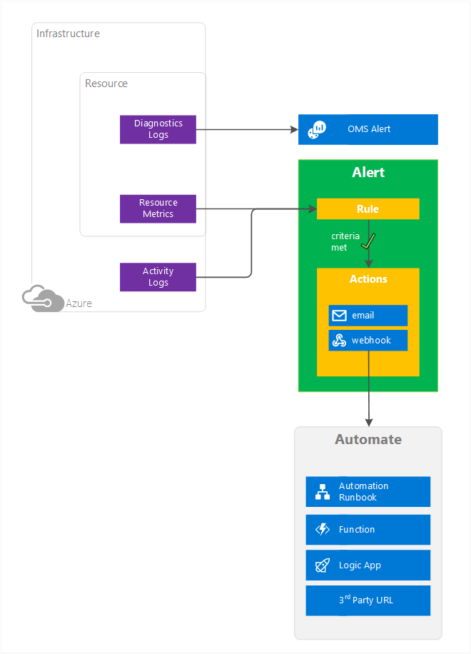

<properties
	pageTitle="Azure 中的警报概述 | Azure"
	description="使用警报可以监视 Azure 资源指标、事件或日志，并在符合指定的条件时接收通知。"
	authors="rboucher"
	manager=""
	editor=""
	services="monitoring-and-diagnostics"
	documentationCenter="monitoring-and-diagnostics"/>

<tags
	ms.service="monitoring-and-diagnostics"
	ms.workload="na"
	ms.tgt_pltfrm="na"
	ms.devlang="na"
	ms.topic="article"
	ms.date="09/24/2016"
	wacn.date="11/14/2016"
	ms.author="robb"/>

# Azure 中的警报概述

本文介绍什么是警报及其优点，以及如何开始使用警报。

## 什么是警报？
警报是监视 Azure 资源指标、事件或日志并在符合指定条件时发出通知的一种方法。

可能根据以下条件接收警报：

- **指标值**：当指定指标的值在任一方向越过了指定的阈值时警报将触发。也就是说，当条件先是满足以及之后不再满足该条件时，警报都会触发。
- **活动日志事件**：警报可以在发生每个事件时都触发，也可以仅在发生特定数量的事件时触发。

## 不同 Azure 服务中的警报

警报可跨不同的服务使用，包括：

- **Azure 监视器**：基于指标值和活动日志事件启用警报。Azure 监视器包含 [Azure Insights REST API](https://msdn.microsoft.com/zh-cn/library/dn931943.aspx)。有关详细信息，请参阅 [Using the Azure portal, PowerShell, or the command-line interface to create alerts](/documentation/articles/insights-alerts-portal/)（使用 Azure 门户、PowerShell 或命令行接口创建警报）。

## 警报操作
可将警报配置为执行以下操作：

- 将电子邮件通知发送到服务管理员、共同管理员或指定的其他电子邮件。
- 调用 Webhook，以便用户启动其他自动化操作

   

## 后续步骤

了解警报规则以及如何使用以下工具来配置这些规则：

- [Azure 门户](/documentation/articles/insights-alerts-portal/)
- [PowerShell](/documentation/articles/insights-alerts-powershell/)
- [命令行接口 (CLI)](/documentation/articles/insights-alerts-command-line-interface/)
- [Azure 监视器 REST API](https://msdn.microsoft.com/zh-cn/library/azure/dn931945.aspx)

<!---HONumber=Mooncake_1107_2016-->