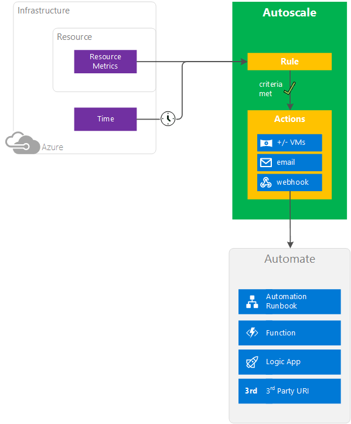
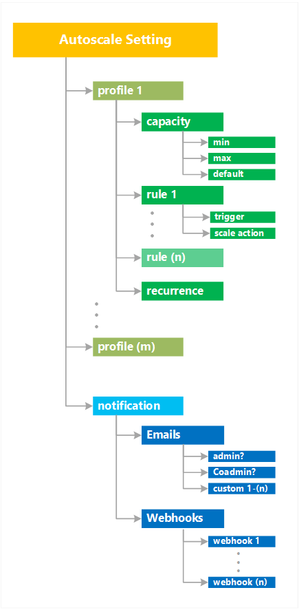

<properties
	pageTitle="Microsoft Azure 虚拟机、云服务和 Web 应用自动缩放概述 | Azure"
	description="Microsoft Azure 自动缩放概述。适用于虚拟机、云服务和 Web 应用。"
	authors="rboucher"
	manager=""
	editor=""
	services="monitoring-and-diagnostics"
	documentationCenter="monitoring-and-diagnostics"/>

<tags
	ms.service="monitoring-and-diagnostics"
	ms.workload="na"
	ms.tgt_pltfrm="na"
	ms.devlang="na"
	ms.topic="article"
	ms.date="09/06/2016"
	wacn.date="10/17/2016"
	ms.author="robb"/>  

# Azure 虚拟机、云服务和 Web 应用自动缩放概述

本文介绍了 Azure 自动缩放是什么、其对用户的好处，以及如何开始使用它。

Azure Insights 自动缩放仅适用于[虚拟机规模集](/documentation/services/virtual-machine-scale-sets/)、[云服务](/documentation/services/cloud-services/)和[应用服务 - Web 应用](/documentation/services/app-service/web/)。

>[AZURE.NOTE] Azure 有两个自动缩放方法。旧版自动缩放适用于虚拟机（可用性集）。此功能的支持有限。若要获取更快速、更可靠的自动缩放支持，建议迁移到 VM 规模集。本文提供了此旧技术的使用方法链接。

## 自动缩放是什么？

自动缩放是指在处理应用程序负载时让适当数量的资源运行。在负载增加时，可以通过自动缩放添加资源；在资源处于空闲状态时，可以通过自动缩放删除资源，节省资金。可以指定需要运行的实例的最小数目和最大数目，根据规则集自动添加或删除 VM。设置最小数目可确保应用程序在没有负载的情况下也会运行。设置最大数目是为了限制每小时可能会引发的总成本。可以使用创建的规则在这两种极限之间自动缩放。

   

当满足规则条件时，将触发一个或多个自动缩放操作。可以添加和删除虚拟机，或执行其他操作。下面的概念关系图演示了此过程。

   

 

## 描述的自动缩放过程
以下说明适用于上面的关系图的各个部分。

### 资源指标 
资源会发出指标，这些指标随后通过规则进行处理。指标通过不同方法发出。VM 规模集使用 Azure 诊断代理提供的遥测数据，而 Web 应用和云服务的遥测则直接来自 Azure 基础结构。一些常用的统计信息包括：CPU 使用率、内存使用情况、线程计数、队列长度和磁盘使用情况。如需可用遥测数据的列表，请参阅[自动缩放常用指标](/documentation/articles/insights-autoscale-common-metrics/)。

### 时间
基于计划的规则以 UTC 为基础。设置规则时，必须正确设置时区。

### 规则
此图仅显示了一个自动缩放规则，但用户可以有许多个这样的规则。可以根据自身情况所需创建复杂的、互相重叠的规则。规则类型包括
 
 - **基于指标** - 例如，在 CPU 使用率超出 50% 时执行该操作。
 - **基于时间** - 例如，在给定时区的每个星期六的早晨 8 点触发 webhook。

基于指标的规则会衡量应用程序负载，根据负载添加或删除 VM。如果使用基于计划的规则，则当用户看到负载时间模式并且想要在负载可能升高或降低之前进行缩放时，完成相应的缩放。

 
### 操作和自动化

规则可以触发一个或多个类型的操作。

- **规模** - 缩放 VM 的规模
- **电子邮件** - 将电子邮件发送给管理员、共同管理员和/或指定的其他电子邮件地址
- **通过 webhook 自动操作** - 调用 webhook，在 Azure 内外触发多个复杂操作。在 Azure 中，可以启动 Azure 自动化 runbook、Azure 函数或 Azure 逻辑应用。在 Azure 外的第三方 URL 示例包含 Slack 和 Twilio 之类的服务。

## 自动缩放设置
自动缩放使用下列术语和结构。

- **自动缩放设置**：由自动缩放引擎读取，用于确定是进行扩展还是进行缩减。它包含一个或多个配置文件、目标资源的信息，以及通知设置。
    - **自动缩放配置文件**：组合了容量设置、控制触发器的规则集、适用于配置文件的缩放操作，以及定期设置。可以有多个配置文件，以应对不同的互相重叠的要求。
        - **容量设置**：表示实例数的最小值、最大值和默认值。[使用图 1 的适当位置]
        - **规则**：包括触发器（指标触发器或时间触发器）和缩放操作，表示在满足此规则的情况下，自动缩放应缩还是放。
        - **定期**：表示自动缩放应在何时执行此配置文件。例如，可以针对一天中的不同时间或者一周中的不同日期设置不同的自动缩放配置文件。
- **通知设置**：定义在发生自动缩放事件时应发送的通知，前提是符合某个自动缩放设置的配置文件的条件。自动缩放可以将通知发送到一个或多个电子邮件地址，也可以对一个或多个 webhook 进行调用。
 
  

[Autoscale REST API](https://msdn.microsoft.com/zh-cn/library/dn931928.aspx) 中提供了可配置字段和说明的完整列表。

有关代码示例，请参阅

<!-- [Advanced Autoscale configuration using Resource Manager templates for VM Scale Sets](/documentation/articles/insights-advanced-autoscale-virtual-machine-scale-sets/)（通过用于 VM 规模集的 Resource Manager 模板进行的高级自动缩放配置） -->
* [自动缩放 REST API](https://msdn.microsoft.com/zh-cn/library/dn931953.aspx)

## 水平缩放和垂直缩放
  
自动缩放仅以水平方式增加资源的规模，即只增加（“放”）或减少（“缩”）VM 实例的数目。水平缩放在使用云服务的情况下更为灵活，因为这样可以运行数千个处理负载的 VM。垂直缩放与此不同。它保持 VM 数量不变，但会增强（“提高”）或削弱（“降低”）VM 的功能。功能按内存、CPU 速度、磁盘空间等指标衡量。垂直缩放有更多的限制。它取决于更大型硬件的可用性，后者存在地区差异，并会快速达到上限。垂直缩放通常还需要启动和停止 VM。

## 访问方法 
可以通过以下方式设置自动缩放：

- [Azure 门户](/documentation/articles/insights-how-to-scale/)
- [PowerShell](/documentation/articles/insights-powershell-samples/#create-and-manage-autoscale-settings)
- [跨平台命令行接口 (CLI)](/documentation/articles/insights-cli-samples/#autoscale)
- [Insights REST API](https://msdn.microsoft.com/zh-cn/library/azure/dn931953.aspx)

## 支持进行自动缩放的服务

| 服务 | 架构和文档 |
|--------------------------------------|-----------------------------------------------------|
| Web 应用 | [缩放 Web 应用](/documentation/articles/insights-how-to-scale/) |
| 云服务 | [自动缩放云服务](/documentation/articles/cloud-services-how-to-scale/) |
| 虚拟机：经典 | [缩放经典虚拟机可用性集](https://blogs.msdn.microsoft.com/kaevans/2015/02/20/autoscaling-azurevirtual-machines/) |
| 虚拟机：Windows 规模集| [在 Windows 中缩放 VM 规模集](/documentation/articles/virtual-machine-scale-sets-windows-autoscale/) |
| 虚拟机：Linux 规模集 | [在 Linux 中缩放 VM 规模集](/documentation/articles/virtual-machine-scale-sets-linux-autoscale/) |

<!-- | 虚拟机：Windows 示例 | [Advanced Autoscale configuration using Resource Manager templates for VM Scale Sets](/documentation/articles/insights-advanced-autoscale-virtual-machine-scale-sets/)（通过用于 VM 规模集的 Resource Manager 模板进行的高级自动缩放配置） |  -->

## 后续步骤

若要详细了解自动缩放，请使用前面列出的自动缩放演练，或参阅以下资源：

- [Azure Insights autoscale common metrics](/documentation/articles/insights-autoscale-common-metrics/)（Azure Insights 自动缩放常用指标）
- [Best practices for Azure Insights autoscale](/documentation/articles/insights-autoscale-best-practices/)（Azure Insights 自动缩放最佳实践）
- [Use autoscale actions to send email and webhook alert notifications](/documentation/articles/insights-autoscale-to-webhook-email/)（使用自动缩放操作发送电子邮件和 webhook 警报通知）
- [自动缩放 REST API](https://msdn.microsoft.com/zh-cn/library/dn931953.aspx)
- [Troubleshooting Virtual Machine Scale Sets Autoscale](/documentation/articles/virtual-machine-scale-sets-troubleshoot/)（虚拟机规模集自动缩放疑难解答）

<!---HONumber=Mooncake_1010_2016-->