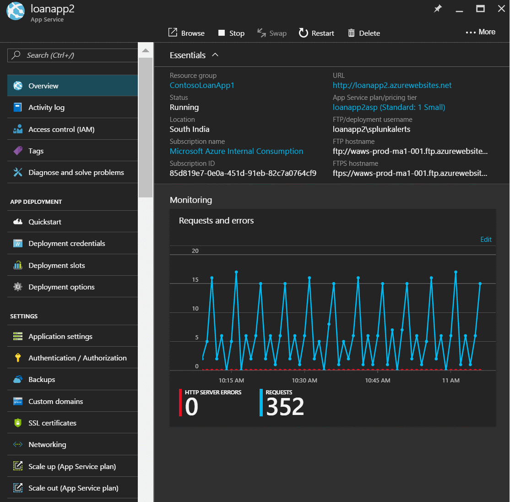
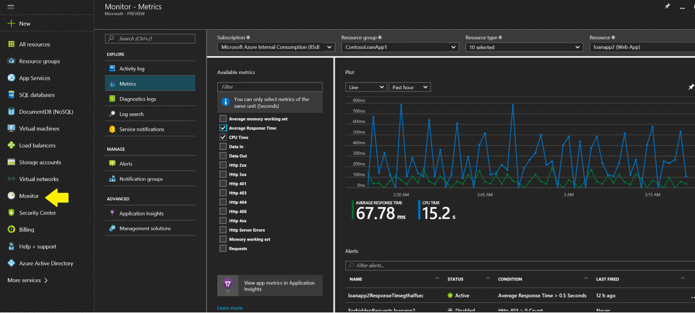

<properties
	pageTitle="Microsoft Azure 中的指标概述 | Azure"
	description="概述指标及其在 Microsoft Azure 中的用途"
	authors="kamathashwin"
	manager=""
	editor=""
	services="monitoring-and-diagnostics"
	documentationCenter="monitoring-and-diagnostics"/>

<tags
	ms.service="monitoring-and-diagnostics"
	ms.workload="na"
	ms.tgt_pltfrm="na"
	ms.devlang="na"
	ms.topic="article"
	ms.date="09/26/2016"
	ms.author="ashwink"
	wacn.date="11/14/2016"/>

# Azure 中的指标概述 

本文介绍 Azure 中的指标及其优点，以及如何开始使用它们。

## 什么是指标？

在 Azure 监视器中可以使用遥测来查看 Azure 上的工作负荷的性能与运行状况。最重要的 Azure 遥测数据类型是大多数 Azure 资源发出的指标（也称为性能计数器）。Azure 监视器提供多种方式来配置和使用这些指标，以便进行监视与故障排除。

## 指标有哪些作用？

指标是重要的遥测来源，可以实现以下目的：

- 通过在门户图表上绘制资源（例如 VM、网站或逻辑应用）的指标并将该图表固定到仪表板，来**跟踪资源的性能**。
- 当某个指标超过特定的阈值，从而影响资源的性能时，可以**接收通知**。
- **配置自动化操作**，例如自动缩放资源，或者在指标超过特定的阈值时触发 Runbook。
- 针对资源的性能或使用趋势**执行高级分析**或报告。
- 针对**合规性/审核**目的**存档**资源的性能或运行状况历史记录。

##  指标的特征
指标具有以下特征：

- 所有指标都有 **1 分钟的频率**。每隔一分钟就会从资源接收指标值，因此几乎可以实时洞察资源的状态和运行状况。
- 指标是**现成可用的，不需要选择添加**或设置额外的诊断。
- 可以访问每个指标的 **30 天历史记录**。可以快速查看最近和每个月的资源性能或运行状况趋势。

你可以：

- 选择资源并将资源绘制在图表上时，通过 Azure 门户轻松发现、访问和**查看所有指标**。
- 配置指标**警报规则，以便在指标超过设置的阈值时，发送通知或执行自动化操作**。自动缩放是一种特殊的自动化操作，可用于扩展资源，满足网站或计算资源的传入请求或负载要求。可将自动缩放设置规则配置为根据超出阈值的指标进行扩展/缩减。
- 将指标**存档**更长时间，或者将其用于脱机报告。为资源配置诊断设置时，可将指标路由到 Blob 存储。
- 将指标**流式传输**到事件中心，然后可将它们路由到 Azure 流分析或自定义应用，进行近乎实时的分析。为此可以使用诊断设置。
- 通过新的 Azure 监视器 REST API **使用**指标。
- 使用 PowerShell cmdlet 或跨平台 REST API **查询**指标。

   

## 通过门户访问指标
下面是有关通过 Azure 门户预览创建指标图表的快速演练：

### 创建资源之后查看指标
1. 打开 Azure 门户预览。
2. 创建新的应用服务 - 网站。
3. 创建网站后，转到网站的“概述”边栏选项卡。
4. 可以查看新指标，它们将以“监视”磁贴的形式显示。可以编辑该磁贴和选择更多指标

   

### 在单个位置访问所有指标
1. 打开 Azure 门户
2. 导航到新的“监视”选项卡，然后选择其下面的“指标”选项
3. 可以从下拉列表中选择订阅、资源组和资源名称。
4. 现在即可查看可用指标列表。
5. 选择所需的指标并绘制其图表。
6. 可以单击右上角的“固定”，将它固定到仪表板。

   

>[AZURE.NOTE] 可以从 VM（基于 Azure Resource Manager）访问主机级指标和 VM 规模集，无需指定任何额外的诊断设置。这些新的主机级指标可供 Windows 和 Linux 实例使用。这些指标不会与在 VM 或 VMSS 上打开 Azure 诊断后，你有权访问的来宾 OS 级指标相混淆。

## 通过 REST API 访问指标
可以通过 Azure 监视器 API 访问 Azure 指标。有两个 API 可帮助发现和访问指标。使用：

- [Azure 监视器指标定义 REST API](https://msdn.microsoft.com/zh-cn/library/mt743621.aspx) 可以访问服务可用的指标列表。
- [Azure 监视器指标 REST API](https://msdn.microsoft.com/zh-cn/library/mt743622.aspx) 可以访问实际指标数据

>[AZURE.NOTE] 本文通过适用于 Azure 资源的[新指标 API](https://msdn.microsoft.com/zh-cn/library/dn931930.aspx) 介绍指标。新指标定义 API 的 API 版本为 2016-03-01，指标 API 的版本为 2016-09-01。可以使用 API 版本 2014-04-01 访问旧指标定义和指标。

有关使用 Azure 监视器 REST API 的更详细演练，请参阅 [Azure Monitor REST API Walkthrough](/documentation/articles/monitoring-rest-api-walkthrough/)（Azure 监视器 REST API 演练）。

## 指标的导出选项
可以转到“监视”选项卡下的“诊断日志”边栏选项卡，查看指标的导出选项。对于本文中前面所述的用例，可以选择要发送到 Blob 存储、事件中心或 OMS Log Analytics 的指标（和诊断日志）。

   

可以通过 Resource Manager 模板、[PowerShell](/documentation/articles/insights-powershell-samples)、[CLI](/documentation/articles/insights-cli-samples/) 或 [REST API](https://msdn.microsoft.com/zh-cn/library/dn931943.aspx) 配置此功能。

## 对指标执行操作
可以针对指标数据接收通知或执行自动化操作。为此，可以配置警报规则或自动缩放设置。

### 警报规则
可以针对指标配置警报规则。这些警报规则可以检查指标是否超过某个阀值，通过电子邮件发出通知，或者触发一个随后可用于执行任何自定义脚本的 Webhook。还可以使用该 Webhook 来配置第三方产品集成。

   

### 自动缩放
某些 Azure 资源支持使用多个实例进行扩展或缩减，以便能够处理工作负荷。自动缩放将应用到应用服务（Web 应用）、虚拟机规模集 (VMSS) 和经典云服务。可以配置自动缩放规则，以便在影响工作负荷的特定指标超过指定的阈值时进行扩展或缩减。有关详细信息，请参阅 [Overview of autoscaling](/documentation/articles/monitoring-overview-autoscale/)（自动缩放概述）。

   

## 支持的服务和指标
Azure 监视器是全新的指标基础结构。它支持 Azure 门户中的以下 Azure 服务和新版 Azure 监视器 API：

- VM（基于 Azure Resource Manager）
- VM 规模集
- 批处理
- 事件中心命名空间
- 服务总线命名空间（仅限高级 SKU）
- SQL（版本 12）
- SQL 弹性池
- 网站
- Web 服务器场
- Logic Apps
- IoT 中心
- Redis 缓存
- 网络：应用程序网关
- 搜索

可以在 [Azure Monitor metrics - supported metrics per resource type](/documentation/articles/monitoring-supported-metrics/)（Azure 监视器指标 - 每种资源类型支持的指标）中查看所有受支持服务及其指标的详细列表。

## 后续步骤

请参阅本文中的所有链接。此外，请了解：

- [自动缩放的常用指标](/documentation/articles/insights-autoscale-common-metrics/)
- 如何[创建警报规则](/documentation/articles/insights-alerts-portal/)

<!---HONumber=Mooncake_1107_2016-->