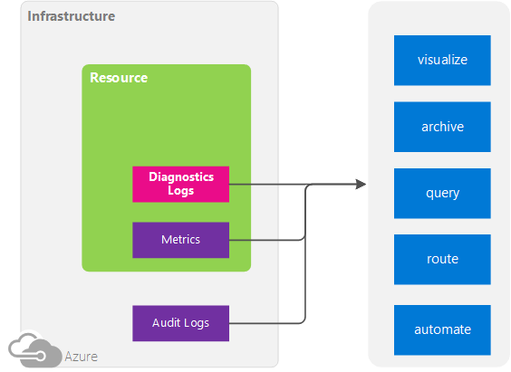
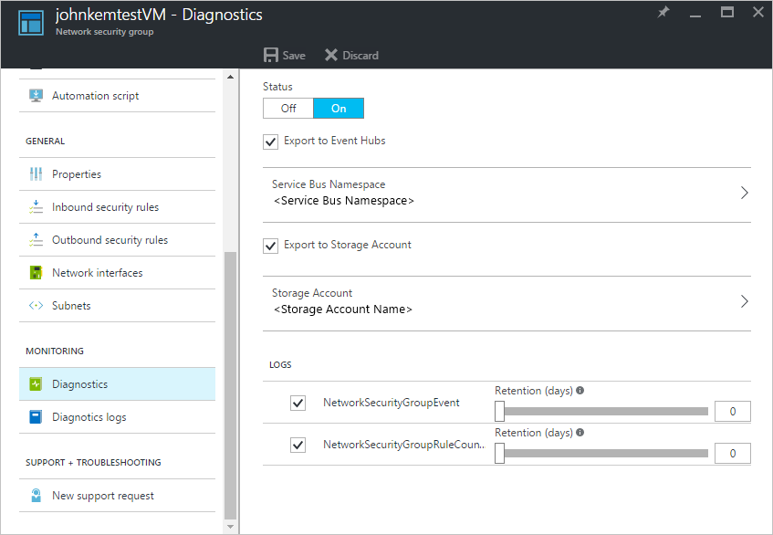
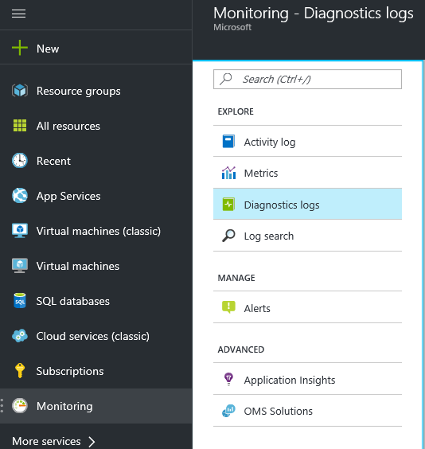
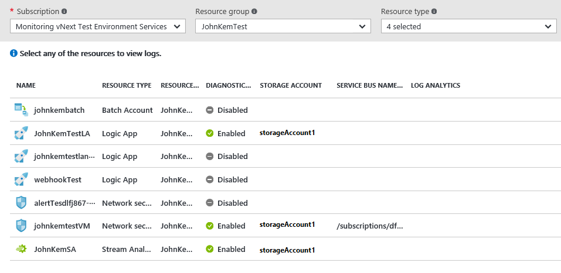

<properties
	pageTitle="Azure 诊断日志概述 | Azure"
	description="了解什么是 Azure 诊断日志，以及如何使用该诊断日志了解发生在 Azure 资源内的事件。"
	authors="johnkemnetz"
	manager="rboucher"
	editor=""
	services="monitoring-and-diagnostics"
	documentationCenter="monitoring-and-diagnostics"/>

<tags
	ms.service="monitoring-and-diagnostics"
	ms.workload="na"
	ms.tgt_pltfrm="na"
	ms.devlang="na"
	ms.topic="article"
	ms.date="10/12/2016"
	ms.author="johnkem; magoedte"
	wacn.date="11/14/2016"/>  

# Azure 诊断日志概述
**Azure 诊断日志**是资源发出的日志，记录与该资源的操作相关的各种频繁生成的数据。这些日志的内容因资源类型而异（例如，Windows 事件系统日志是一类针对 VM 的诊断日志，而 blob、表和队列日志是针对存储帐户的诊断日志类别），并且不同于[活动日志（以前称为审核日志或操作日志）](/documentation/articles/monitoring-overview-activity-logs/)，后者用于了解在订阅的资源上执行的操作。并非所有资源都支持此处所述的诊断日志新类型。下面的受支持服务的列表显示了哪些资源类型支持新的诊断日志。

  

## 可以对诊断日志执行的操作
可以对诊断日志执行的部分操作如下：

- 将诊断日志保存到**存储帐户**进行审核或手动检查。可以使用“诊断设置”指定保留时间（天）。
- [将诊断日志流式传输到**事件中心**](/documentation/articles/monitoring-stream-diagnostic-logs-to-event-hubs/)，方便第三方服务或自定义分析解决方案（例如 PowerBI）引入。
- 使用 [OMS Log Analytics](/documentation/articles/log-analytics-azure-storage-json/) 对诊断日志进行分析

##  诊断设置
可以使用“诊断设置”配置非计算资源的诊断日志。资源控制的“诊断设置”：

- 将诊断日志发送到何处：存储帐户、事件中心和/或 OMS Log Analytics。
- 发送哪些日志类别。
- 应该将每个日志类别保留在存储帐户中多长时间 – 保留期为 0 天表示永久保留日志。如果不需永久保留，可将此值的范围设置为 1 到 2147483647。如果设置了保留策略，但禁止将日志存储在存储帐户中（例如，如果仅选择事件中心或 OMS 选项），则保留策略无效。

这些设置可以通过“诊断”边栏选项卡（适用于 Azure 门户中的资源）、Azure PowerShell 和 CLI 命令或 [Insights REST API](https://msdn.microsoft.com/zh-cn/library/azure/dn931943.aspx) 轻松进行配置。

## 如何启用诊断日志集合
可以在门户中通过资源的边栏选项卡在创建资源的过程中或在创建资源以后启用诊断日志集合。也可使用 Azure PowerShell 或 CLI 命令（或者使用 Insights REST API）在任何时间点启用诊断日志。

> [AZURE.TIP] 这些说明可能不能直接应用到每个资源。请参阅此页底部的架构链接，了解适用于特定资源类型的特殊步骤。

[此文介绍如何使用资源模板在创建资源时启用诊断设置](/documentation/articles/monitoring-enable-diagnostic-logs-using-template/)

### 在门户中启用诊断日志
执行以下操作即可在创建某些资源类型时在 Azure 门户中启用诊断日志：

1.	转到“新建”并选择感兴趣的资源。
2.	在配置基本设置并选择大小以后，即可在“设置”边栏选项卡的“监视”下选择“启用”，然后选择一个存储帐户，在其中存储诊断日志。当用户向存储帐户发送诊断时，系统会针对存储和事务收取正常数据费率。

3.	单击“确定”并创建资源。

若要在创建资源以后在 Azure 门户中启用诊断日志，请执行以下操作：

1.	转到资源的边栏选项卡，打开“诊断”边栏选项卡。
2.	单击“启用”，然后选取存储帐户和/或事件中心。

3.	在“日志”下，选择要进行收集或流式传输操作的“日志类别”。
4.	单击“保存”。

###以编程方式启用诊断日志
若要通过 Azure PowerShell Cmdlet 启用诊断日志，请使用以下命令。

若要允许在存储帐户中存储诊断日志，请使用以下命令：

    Set-AzureRmDiagnosticSetting -ResourceId [your resource Id] -StorageAccountId [your storage account id] -Enabled $true

存储帐户 ID 是需要向其发送日志的存储帐户的资源 ID。

若要允许将诊断日志流式传输到事件中心，请使用以下命令：

    Set-AzureRmDiagnosticSetting -ResourceId [your resource Id] -ServiceBusRuleId [your service bus rule id] -Enabled $true

服务总线规则 ID 是以下格式的字符串：`{service bus resource ID}/authorizationrules/{key name}`。

若要启用将诊断日志发送到 Log Analytics 工作区，请使用以下命令：

    Set-AzureRmDiagnosticSetting -ResourceId [your resource id] -WorkspaceId [log analytics workspace id] -Enabled $true

> [AZURE.NOTE] 10 月版中未提供 WorkspaceId 参数。11 月版中将会提供。

可以在 Azure 门户中获取 Log Analytics 工作区 ID。

可以结合这些参数启用多个输出选项。

若要通过 Azure CLI 启用诊断日志，请使用以下命令：

若要允许在存储帐户中存储诊断日志，请使用以下命令：

    azure insights diagnostic set --resourceId <resourceId> --storageId <storageAccountId> --enabled true

存储帐户 ID 是需要向其发送日志的存储帐户的资源 ID。

若要允许将诊断日志流式传输到事件中心，请使用以下命令：

    azure insights diagnostic set --resourceId <resourceId> --serviceBusRuleId <serviceBusRuleId> --enabled true

服务总线规则 ID 是以下格式的字符串：`{service bus resource ID}/authorizationrules/{key name}`。

若要启用将诊断日志发送到 Log Analytics 工作区，请使用以下命令：

    azure insights diagnostic set --resourceId <resourceId> --workspaceId <workspaceId> --enabled true

> [AZURE.NOTE] 10 月版中未提供 workspaceId 参数。11 月版中将会提供。

可以在 Azure 门户中获取 Log Analytics 工作区 ID。

可以结合这些参数启用多个输出选项。

若要使用 Insights REST API 更改诊断设置，请参阅[此文档](https://msdn.microsoft.com/zh-cn/library/azure/dn931931.aspx)。

## 在门户中管理诊断设置

为确保所有资源采用正确的诊断设置，可以在门户中导航到“监视”边栏选项卡，打开“诊断日志”边栏选项卡。

  

可能需要单击“更多服务”才能找到“监视”边栏选项卡。

在此边栏选项卡中，可以查看和筛选支持诊断日志的所有资源，检查它们是否已启用诊断，以及该日志要流向哪些存储帐户、事件中心和/或 Log Analytics 工作区。

  

单击某个资源会显示已存储在存储帐户的所有日志，并提供关闭或修改诊断设置的选项。单击下载图标下载特定时间段的日志。

  

> [AZURE.NOTE] 仅当已将诊断设置配置为在存储帐户中保存诊断日志时，这些日志才显示在此视图中并可供下载。

## 诊断日志支持的服务和架构
诊断日志的架构因资源和日志类别而异。以下是受支持的服务及其架构。

| 服务 | 架构和文档 |
|-------------------------------|-----------------------------------------------------------------------------------------------------------------|
| 软件负载均衡器 | [用于 Azure 负载均衡器的 Log Analytics（预览版）](/documentation/articles/load-balancer-monitor-log/) |
| 网络安全组 | [网络安全组 (NSG) 的日志分析](/documentation/articles/virtual-network-nsg-manage-log/) |
| 应用程序网关 | [应用程序网关的诊断日志记录](/documentation/articles/application-gateway-diagnostics/) |
| Logic Apps | 没有可用架构。 |
| 事件中心 | 没有可用架构。 |
| 服务总线 | 没有可用架构。 |
| 流分析 | 没有可用架构。 |

## 每种资源类型支持的日志类别

|资源类型|类别|类别显示名称|
|---|---|---|
|Microsoft.Automation/automationAccounts|JobLogs|作业日志|
|Microsoft.Automation/automationAccounts|JobStreams|作业流|
|Microsoft.Batch/batchAccounts|ServiceLog|服务日志|
|Microsoft.DataLakeAnalytics/accounts|审核|审核日志|
|Microsoft.DataLakeAnalytics/accounts|请求|请求日志|
|Microsoft.DataLakeStore/accounts|审核|审核日志|
|Microsoft.DataLakeStore/accounts|请求|请求日志|
|Microsoft.EventHub/namespaces|ArchiveLogs|存档日志|
|Microsoft.EventHub/namespaces|OperationalLogs|操作日志|
|Microsoft.KeyVault/vaults|AuditEvent|审核日志|
|Microsoft.Logic/workflows|WorkflowRuntime|工作流运行时诊断事件|
|Microsoft.Network/networksecuritygroups|NetworkSecurityGroupEvent|网络安全组事件|
|Microsoft.Network/networksecuritygroups|NetworkSecurityGroupRuleCounter|网络安全组规则计数器|
|Microsoft.Network/networksecuritygroups|NetworkSecurityGroupFlowEvent|网络安全组规则流事件|
|Microsoft.Network/loadBalancers|LoadBalancerAlertEvent|负载均衡器警报事件|
|Microsoft.Network/loadBalancers|LoadBalancerProbeHealthStatus|负载均衡器探测运行状况|
|Microsoft.Network/applicationGateways|ApplicationGatewayAccessLog|应用程序网关访问日志|
|Microsoft.Network/applicationGateways|ApplicationGatewayPerformanceLog|应用程序网关性能日志|
|Microsoft.Network/applicationGateways|ApplicationGatewayFirewallLog|应用程序网关防火墙日志|
|Microsoft.Search/searchServices|OperationLogs|操作日志|
|Microsoft.ServerManagement/nodes|RequestLogs|请求日志|
|Microsoft.ServiceBus/namespaces|OperationalLogs|操作日志|
|Microsoft.StreamAnalytics/streamingjobs|执行|执行|
|Microsoft.StreamAnalytics/streamingjobs|创作|创作|

## 后续步骤
- [将诊断日志流式传输到**事件中心**](/documentation/articles/monitoring-stream-diagnostic-logs-to-event-hubs/)
- [使用 Insights REST API 更改诊断设置](https://msdn.microsoft.com/zh-cn/library/azure/dn931931.aspx)

<!---HONumber=Mooncake_1010_2016-->