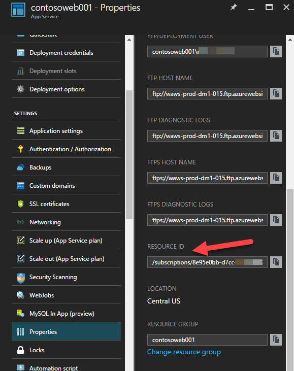

<properties
	pageTitle="Azure 监视 REST API 演练 | Azure"
	description="如何对请求进行身份验证和使用 Azure 监视器 REST API。"
	authors="mcollier, rboucher"
	manager=""
	editor=""
	services="monitoring-and-diagnostics"
	documentationCenter="monitoring-and-diagnostics"/>  

<tags
	ms.service="monitoring-and-diagnostics"
	ms.workload="na"
	ms.tgt_pltfrm="na"
	ms.devlang="na"
	ms.topic="article"
	ms.date="09/27/2016"
	wacn.date="11/14/2016"
	ms.author="mcollier"/>  

# Azure 监视 REST API 演练
本文说明如何执行身份验证，使代码能够遵循 [Azure 监视器 REST API 参考](https://msdn.microsoft.com/zh-cn/library/azure/dn931943.aspx)。

使用 Azure 监视器 API 能够以编程方式检索可用的默认指标定义（例如 CPU 时间、请求等指标类型）、粒度和指标值。检索定义后，可将数据保存在独立的数据存储（例如 Azure SQL 数据库、DocumentDB 或 Azure Data Lake）中。然后，可以根据需要从该处执行其他分析。

除了处理各种指标数据点以外，如本文中所示，使用监视 API 还能列出警报规则、查看活动日志以及执行其他许多操作。有关可用操作的完整列表，请参阅 [Azure Monitor REST API Reference](https://msdn.microsoft.com/zh-cn/library/azure/dn931943.aspx)（Azure 监视器 REST API 参考）。

## 对 Azure 监视器请求进行身份验证

第一步是对请求进行身份验证。

针对 Azure 监视器 API 执行的所有任务都使用 Azure Resource Manager 身份验证模型。因此，所有请求必须使用 Azure Active Directory (Azure AD) 进行身份验证。对客户端应用程序进行身份验证的方法之一是创建 Azure AD 服务主体，并检索身份验证 (JWT) 令牌。以下示例脚本演示如何通过 PowerShell 创建 Azure AD 服务主体。有关更详细的演练，请参阅有关[使用 Azure PowerShell 创建用于访问资源的服务主体](/documentation/articles/resource-group-authenticate-service-principal/#authenticate-service-principal-with-password—powershell)的文档。还可以[通过 Azure 门户创建服务主体](/documentation/articles/resource-group-create-service-principal-portal/)。

    $subscriptionId = "{azure-subscription-id}"
    $resourceGroupName = "{resource-group-name}"
    $location = "chinaeast"
    
    # Authenticate to a specific Azure subscription.
    Login-AzureRmAccount -SubscriptionId $subscriptionId
    
    # Password for the service principal
    $pwd = "{service-principal-password}"
    
    # Create a new Azure AD application
    $azureAdApplication = New-AzureRmADApplication `
                            -DisplayName "My Azure Insights" `
                            -HomePage "https://localhost/azure-monitor" `
                            -IdentifierUris "https://localhost/azure-monitor" `
                            -Password $pwd
    
    # Create a new service principal associated with the designated application
    New-AzureRmADServicePrincipal -ApplicationId $azureAdApplication.ApplicationId
    
    # Assign Reader role to the newly created service principal
    New-AzureRmRoleAssignment -RoleDefinitionName Reader `
                              -ServicePrincipalName $azureAdApplication.ApplicationId.Guid

若要查询 Azure 监视器 API，客户端应用程序应使用事先创建的服务主体进行身份验证。以下示例 PowerShell 脚本演示了一种使用 [Active Directory 身份身份验证库](/documentation/articles/active-directory-authentication-libraries/) (ADAL) 帮助获取 JWT 身份验证令牌的方法。JWT 令牌作为请求中 HTTP 授权参数的一部分传递给 Azure Insights API。

    $azureAdApplication = Get-AzureRmADApplication -IdentifierUri "https://localhost/azure-monitor"
    
    $subscription = Get-AzureRmSubscription -SubscriptionId $subscriptionId
    
    $clientId = $azureAdApplication.ApplicationId.Guid
    $tenantId = $subscription.TenantId
    $authUrl = "https://login.windows.net/${tenantId}"
    
    $AuthContext = [Microsoft.IdentityModel.Clients.ActiveDirectory.AuthenticationContext]$authUrl
    $cred = New-Object -TypeName Microsoft.IdentityModel.Clients.ActiveDirectory.ClientCredential -ArgumentList ($clientId, $pwd)
     
    $result = $AuthContext.AcquireToken("https://management.core.chinacloudapi.cn/", $cred)
    
    # Build an array of HTTP header values 
    $authHeader = @{
    'Content-Type'='application/json'
    'Accept'='application/json'
    'Authorization'=$result.CreateAuthorizationHeader()
    }

身份验证设置步骤完成后，即可针对 Azure 监视器 REST API 执行查询。有两个有用的查询：

1. 列出资源的指标定义

2. 检索指标值

## 检索指标定义
>[AZURE.NOTE] 若要使用 Azure 监视器 REST API 检索指标定义，请使用“2016-03-01”作为 API 版本。

    $apiVersion = "2016-03-01"
    $request = "https://management.azure.cn/subscriptions/${subscriptionId}/resourceGroups/${resourceGroupName}/providers/${resourceProviderNamespace}/${resourceType}/${resourceName}/providers/microsoft.insights/metricDefinitions?api-version=${apiVersion}"
    
    Invoke-RestMethod -Uri $request `
                      -Headers $authHeader `
                      -Method Get `
                      -Verbose

对于 Azure 逻辑应用，指标定义如以下屏幕截图中所示：

  

有关详细信息，请参阅 [List the metric definitions for a resource in Azure Monitor REST API](https://msdn.microsoft.com/zh-cn/library/azure/mt743621.aspx)（在 Azure 监视器 REST API 中列出资源的指标定义）文档。

## 检索指标值
知道可用的指标定义后，即可检索相关的指标值。将指标的名称“value”（而不是“localizedValue”）用于任何筛选请求（例如，检索“CpuTime”和“Requests”指标数据点）。如果未指定筛选器，将返回默认指标。

>[AZURE.NOTE] 若要使用 Azure 监视器 REST API 检索指标值，请使用“2016-06-01”作为 API 版本。

**方法**：GET

**请求 URI**：https://management.azure.cn/subscriptions/_{subscription-id}_/resourceGroups/_{resource-group-name}_/providers/_{resource-provider-namespace}_/_{resource-type}_/_{resource-name}_/providers/microsoft.insights/metrics?$filter=_{filter}_&api-version=_{apiVersion}_

例如，若要检索给定时间范围内时间粒度为 1 小时的 RunsSucceeded 指标数据点，请求将如下所示：

    $apiVersion = "2016-06-01"
    $filter = "(name.value eq 'RunsSucceeded') and aggregationType eq 'Total' and startTime eq 2016-09-23 and endTime eq 2016-09-24 and timeGrain eq duration'PT1H'"
    $request = "https://management.azure.cn/subscriptions/${subscriptionId}/resourceGroups/${resourceGroupName}/providers/${resourceProviderNamespace}/${resourceType}/${resourceName}/providers/microsoft.insights/metrics?`$filter=${filter}&api-version=${apiVersion}"
    (Invoke-RestMethod -Uri $request `
                       -Headers $authHeader `
                       -Method Get `
                       -Verbose).Value | ConvertTo-Json

结果类似于以下屏幕截图中的示例：

  

若要检索多个数据点或聚合点，请将指标定义名称和聚合类型添加到筛选器，如以下示例中所示：

    $apiVersion = "2016-06-01"
    $filter = "(name.value eq 'ActionsCompleted' or name.value eq 'RunsSucceeded') and (aggregationType eq 'Total' or aggregationType eq 'Average') and startTime eq 2016-09-23T13:30:00Z and endTime eq 2016-09-23T14:30:00Z and timeGrain eq duration'PT1M'"
    $request = "https://management.azure.cn/subscriptions/${subscriptionId}/resourceGroups/${resourceGroupName}/providers/${resourceProviderNamespace}/${resourceType}/${resourceName}/providers/microsoft.insights/metrics?`$filter=${filter}&api-version=${apiVersion}"
    (Invoke-RestMethod -Uri $request `
                       -Headers $authHeader `
                       -Method Get `
                       -Verbose).Value | ConvertTo-Json

### 使用 ARMClient
替代 PowerShell（如上所示）的做法是在 Windows 计算机上使用 [ARMClient](https://github.com/projectkudu/ARMClient)。ARMClient 将自动处理 Azure AD 身份验证（及生成的 JWT 令牌）。以下步骤概述如何使用 ARMClient 检索指标数据：

1. 安装 [Chocolatey](https://chocolatey.org/) 和 [ARMClient](https://github.com/projectkudu/ARMClient)。

2. 在终端窗口中，键入 _armclient.exe login_。系统将提示登录到 Azure。

3. 键入 _armclient GET [your\_resource\_id]/providers/microsoft.insights/metricdefinitions?api-version=2016-03-01_

4. 键入 _armclient GET [your\_resource\_id]/providers/microsoft.insights/metrics?api-version=2016-06-01_

  

## 检索资源 ID
使用 REST API 确实有助于了解可用的指标定义、粒度和相关值。使用 [Azure 管理库](https://msdn.microsoft.com/zh-cn/library/azure/mt417623.aspx)时，这些信息很有用。

对于上述代码，要使用的资源 ID 是所需 Azure 资源的完整路径。例如，若要针对某个 Azure Web 应用执行查询，资源 ID 将是：

*/subscriptions/{subscription-id}/resourceGroups/{resource-group-name}/providers/Microsoft.Web/sites/{site-name}/*

以下列表包含各种 Azure 资源的几个资源 ID 格式示例：

* **IoT 中心** - /subscriptions/_{subscription-id}_/resourceGroups/_{resource-group-name}_/providers/Microsoft.Devices/IotHubs/_{iot-hub-name}_

* **SQL 弹性池** - /subscriptions/_{subscription-id}_/resourceGroups/_{resource-group-name}_/providers/Microsoft.Sql/servers/_{pool-db}_/elasticpools/_{sql-pool-name}_

* **SQL 数据库 (v12)** - /subscriptions/_{subscription-id}_/resourceGroups/_{resource-group-name}_/providers/Microsoft.Sql/servers/_{server-name}_/databases/_{database-name}_

* **服务总线** - /subscriptions/_{subscription-id}_/resourceGroups/_{resource-group-name}_/providers/Microsoft.ServiceBus/_{namespace}_/_{servicebus-name}_

* **VM 规模集** - /subscriptions/_{subscription-id}_/resourceGroups/_{resource-group-name}_/providers/Microsoft.Compute/virtualMachineScaleSets/_{vm-name}_

* **VM** - /subscriptions/_{subscription-id}_/resourceGroups/_{resource-group-name}_/providers/Microsoft.Compute/virtualMachines/_{vm-name}_

* **事件中心** - /subscriptions/_{subscription-id}_/resourceGroups/_{resource-group-name}_/providers/Microsoft.EventHub/namespaces/_{eventhub-namespace}_

还可以通过其他方法检索资源 ID，包括通过 Azure 门户、PowerShell 或 Azure CLI 查看所需的资源。

### Azure 门户预览
还可以从 Azure 门户预览获取资源 ID。为此，请导航到所需的资源，然后选择“属性”。资源 ID 将显示在“属性”边栏选项卡中，如以下屏幕截图中所示：

  

### Azure PowerShell
也可以使用 Azure PowerShell cmdlet 检索资源 ID。例如，若要获取某个 Azure Web 应用的资源 ID，请执行 Get-AzureRmWebApp cmdlet，如以下屏幕截图中所示：

  

### Azure CLI
若要使用 Azure CLI 检索资源 ID，请执行“azure webapp show”命令并指定“-json”选项，如以下屏幕截图中所示：

  

## 检索活动日志数据
除了处理指标定义和相关值以外，还可以检索有关 Azure 资源的其他有趣的深入信息。例如，可以查询[活动日志](https://msdn.microsoft.com/zh-cn/library/azure/dn931934.aspx)数据。以下示例演示如何使用 Azure 监视器 REST API 查询 Azure 订阅在特定日期范围内的活动日志数据：

    $apiVersion = "2014-04-01"
    $filter = "eventTimestamp ge '2016-09-23' and eventTimestamp le '2016-09-24'and eventChannels eq 'Admin, Operation'"
    $request = "https://management.azure.cn/subscriptions/${subscriptionId}/providers/microsoft.insights/eventtypes/management/values?api-version=${apiVersion}&`$filter=${filter}"
    (Invoke-RestMethod -Uri $request `
                       -Headers $authHeader `
                       -Method Get `
                       -Verbose).Value | ConvertTo-Json

## 后续步骤
* 查看[监视概述](/documentation/articles/monitoring-overview/)。
* 查看 [Azure 监视器支持的指标](/documentation/articles/monitoring-supported-metrics/)。
* 查看 [Azure 监视器 REST API 参考](https://msdn.microsoft.com/zh-cn/library/azure/dn931943.aspx)。
* 查看 [Azure 管理库](https://msdn.microsoft.com/zh-cn/library/azure/mt417623.aspx)。

<!---HONumber=Mooncake_1107_2016-->