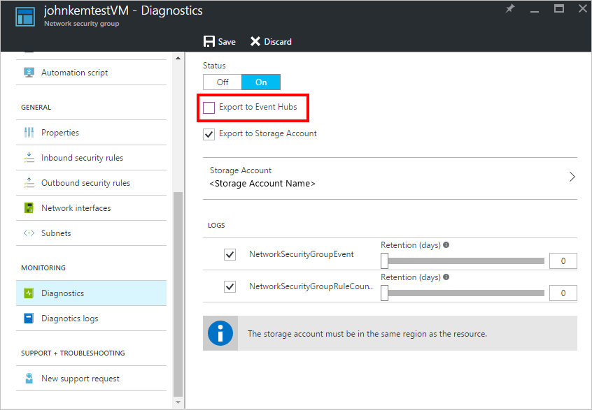

<properties
	pageTitle="将 Azure 诊断日志流式传输到事件中心 | Azure"
	description="了解如何将 Azure 诊断日志流式传输到事件中心。"
	authors="johnkemnetz"
	manager="rboucher"
	editor=""
	services="monitoring-and-diagnostics"
	documentationCenter="monitoring-and-diagnostics"/>

<tags
	ms.service="monitoring-and-diagnostics"
	ms.workload="na"
	ms.tgt_pltfrm="na"
	ms.devlang="na"
	ms.topic="article"
	ms.date="08/08/2016"
	ms.author="johnkem"
	wacn.date="10/17/2016"/>  


# 将 Azure 诊断日志流式传输到事件中心

可以将 **[Azure 诊断日志](/documentation/articles/monitoring-overview-of-diagnostic-logs/)**以近实时方式流式传输到任何应用程序，方法是使用门户中的内置“导出到事件中心”选项，或者通过 Azure PowerShell Cmdlet 或 Azure CLI 在诊断设置中启用服务总线规则 ID。

## 可以对诊断日志和事件中心执行的操作
可以通过下述几种方式将流式传输功能用于诊断日志：

- **将日志流式传输到第三方日志记录和遥测系统** – 一段时间后，事件中心的流式传输功能就会成为一种机制，用于将诊断日志通过管道传输到第三方 SIEM 和日志分析解决方案。

- **通过将“热路径”数据流式传输到 PowerBI 查看服务运行状况** – 可以通过事件中心、流分析和 PowerBI 在 Azure 服务中轻松地将诊断数据转化成近实时分析结果。[此文档文章很好地概述了如何设置事件中心、如何使用流分析处理数据，以及如何使用 PowerBI 作为输出](/documentation/articles/stream-analytics-power-bi-dashboard/)。下面是如何设置诊断日志的一些提示：
	- 在门户中选中相关选项或通过 PowerShell 启用相关选项以后，即可自动创建针对某类诊断日志的事件中心，因此需在服务总线命名空间中选择名称以“insights-”开头的“事件中心”。
	- 下面是一个流分析查询示例，可直接将所有日志数据解析成 PowerBI 表：

```
SELECT
records.ArrayValue.[Properties you want to track]
INTO
[OutputSourceName – the PowerBI source]
FROM
[InputSourceName] AS e
CROSS APPLY GetArrayElements(e.records) AS records
```

- **生成自定义遥测和日志记录平台** – 如果已经有一个自定义生成的遥测平台，或者正想生成一个，则可利用事件中心高度可缩放的发布-订阅功能，灵活地引入诊断日志。

##启用诊断日志的流式传输
可以通过编程、门户或 [Insights REST API](https://msdn.microsoft.com/zh-cn/library/azure/dn931943.aspx) 启用诊断日志的流式传输。无论哪种方式，用户均可选取一个服务总线命名空间，在该命名空间针对每个启用的日志类别创建事件中心。诊断**日志类别**是一类可供资源收集的日志。可以在 Azure 门户的“诊断”边栏选项卡下选择要为特定资源收集的日志类别。

  


> [AZURE.WARNING] 从计算资源（例如，VM 或 Service Fabric）启用诊断日志并对其进行流式传输[需要另一组步骤](/documentation/articles/event-hubs-streaming-azure-diags-data/)。

### 通过 PowerShell Cmdlet
若要通过 [Azure PowerShell Cmdlet](/documentation/articles/insights-powershell-samples/) 启用流式传输，可以使用 `Set-AzureRmDiagnosticSetting` cmdlet 并设置以下参数：

```
Set-AzureRmDiagnosticSetting -ResourceId [your resource Id] -ServiceBusRuleId [your service bus rule id] -Enabled $true
```

服务总线规则 ID 是以下格式的字符串：`{service bus resource ID}/authorizationrules/{key name}`，例如 `/subscriptions/{subscription ID}/resourceGroups/Default-ServiceBus-WestUS/providers/Microsoft.ServiceBus/namespaces/{service bus namespace}/authorizationrules/RootManageSharedAccessKey`。


### 通过 Azure CLI
若要通过 [Azure CLI](/documentation/articles/insights-cli-samples/) 启用流式传输，可以使用 `insights diagnostic set` 命令，如下所示：

```
azure insights diagnostic set --resourceId <resourceId> --serviceBusRuleId <serviceBusRuleId> --enabled true
```

可以对服务总线规则 ID 使用相同的格式，详见 PowerShell Cmdlet 的解释。

###通过 Azure 门户
若要通过 Azure 门户启用流式传输，请导航到资源的诊断设置，然后选择“导出到事件中心”。

  


若要进行配置，请选择现有的服务总线命名空间。选择的命名空间将是创建事件中心的地方（如果这是用户第一次流式传输诊断日志），或者是将诊断日志流式传输到事件中心的地方（如果已有资源将日志类别流式传输到该命名空间），而策略则定义流式传输机制所具有的权限。目前，流式传输到事件中心需要“管理”、“读取”和“发送”权限。在经典门户中针对服务总线命名空间的“配置”选项卡下，可以创建或修改服务总线命名空间的共享访问策略。若要更新这些诊断设置的其中一个，必须在服务总线授权规则中让客户端拥有 ListKey 权限。

##如何使用事件中心的日志数据？
下面是事件中心的输出数据示例：

```
{
    "records": [
        {
            "time": "2016-07-15T18:00:22.6235064Z",
            "workflowId": "/SUBSCRIPTIONS/DF602C9C-7AA0-407D-A6FB-EB20C8BD1192/RESOURCEGROUPS/JOHNKEMTEST/PROVIDERS/MICROSOFT.LOGIC/WORKFLOWS/JOHNKEMTESTLA",
            "resourceId": "/SUBSCRIPTIONS/DF602C9C-7AA0-407D-A6FB-EB20C8BD1192/RESOURCEGROUPS/JOHNKEMTEST/PROVIDERS/MICROSOFT.LOGIC/WORKFLOWS/JOHNKEMTESTLA/RUNS/08587330013509921957/ACTIONS/SEND_EMAIL",
            "category": "WorkflowRuntime",
            "level": "Error",
            "operationName": "Microsoft.Logic/workflows/workflowActionCompleted",
            "properties": {
                "$schema": "2016-04-01-preview",
                "startTime": "2016-07-15T17:58:55.048482Z",
                "endTime": "2016-07-15T18:00:22.4109204Z",
                "status": "Failed",
                "code": "BadGateway",
                "resource": {
                    "subscriptionId": "df602c9c-7aa0-407d-a6fb-eb20c8bd1192",
                    "resourceGroupName": "JohnKemTest",
                    "workflowId": "243aac67fe904cf195d4a28297803785",
                    "workflowName": "JohnKemTestLA",
                    "runId": "08587330013509921957",
                    "location": "westus",
                    "actionName": "Send_email"
                },
                "correlation": {
                    "actionTrackingId": "29a9862f-969b-4c70-90c4-dfbdc814e413",
                    "clientTrackingId": "08587330013509921958"
                }
            }
        },
        {
            "time": "2016-07-15T18:01:15.7532989Z",
            "workflowId": "/SUBSCRIPTIONS/DF602C9C-7AA0-407D-A6FB-EB20C8BD1192/RESOURCEGROUPS/JOHNKEMTEST/PROVIDERS/MICROSOFT.LOGIC/WORKFLOWS/JOHNKEMTESTLA",
            "resourceId": "/SUBSCRIPTIONS/DF602C9C-7AA0-407D-A6FB-EB20C8BD1192/RESOURCEGROUPS/JOHNKEMTEST/PROVIDERS/MICROSOFT.LOGIC/WORKFLOWS/JOHNKEMTESTLA/RUNS/08587330012106702630/ACTIONS/SEND_EMAIL",
            "category": "WorkflowRuntime",
            "level": "Information",
            "operationName": "Microsoft.Logic/workflows/workflowActionStarted",
            "properties": {
                "$schema": "2016-04-01-preview",
                "startTime": "2016-07-15T18:01:15.5828115Z",
                "status": "Running",
                "resource": {
                    "subscriptionId": "df602c9c-7aa0-407d-a6fb-eb20c8bd1192",
                    "resourceGroupName": "JohnKemTest",
                    "workflowId": "243aac67fe904cf195d4a28297803785",
                    "workflowName": "JohnKemTestLA",
                    "runId": "08587330012106702630",
                    "location": "westus",
                    "actionName": "Send_email"
                },
                "correlation": {
                    "actionTrackingId": "042fb72c-7bd4-439e-89eb-3cf4409d429e",
                    "clientTrackingId": "08587330012106702632"
                }
            }
        }
    ]
}
```

| 元素名称 | 说明 |
|--------------|--------------------------------------------------------|
|records | 此有效负载中所有日志事件的数组。 |
|time | 发生事件的时间。 |
|category | 此事件的日志类别。 |
|resourceId | 生成此事件的资源的资源 ID。 |
|operationName | 操作的名称。 |
|级别 | 可选。指示日志事件级别。 |
|属性 | 事件的属性。 |


可以在[此处](/documentation/articles/monitoring-overview-of-diagnostic-logs/)查看支持流式传输到事件中心的所有资源提供程序的列表。

##后续步骤
- [详细了解 Azure 诊断日志](/documentation/articles/monitoring-overview-of-diagnostic-logs/)
- [事件中心入门](/documentation/articles/event-hubs-csharp-ephcs-getstarted/)

<!---HONumber=Mooncake_1010_2016-->