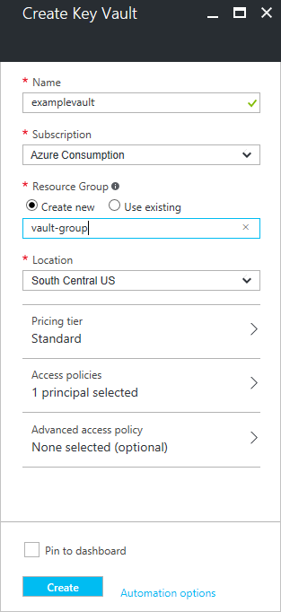
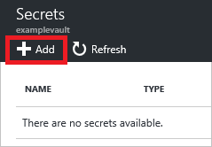
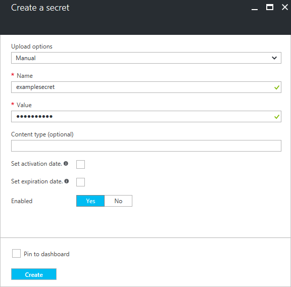
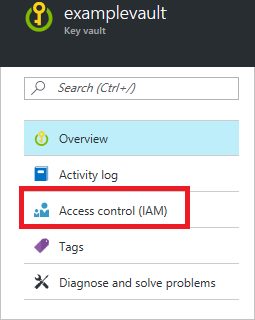
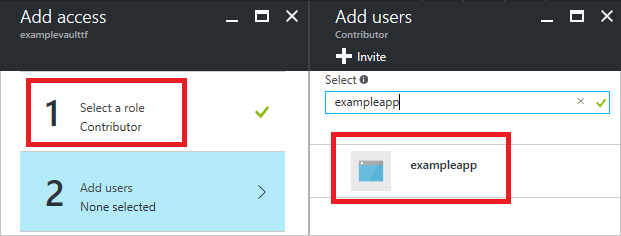
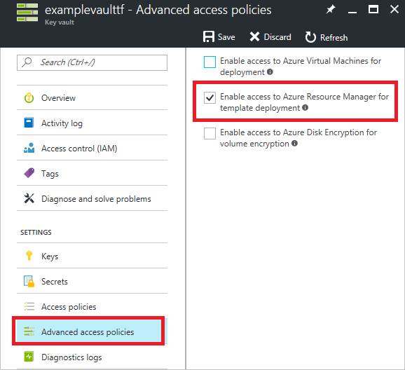

<properties
    pageTitle="密钥保管库机密与 Resource Manager 模板 | Azure"
    description="说明在部署期间如何以参数形式从密钥保管库传递机密。"
    services="azure-resource-manager,key-vault"
    documentationcenter="na"
    author="tfitzmac"
    manager="timlt"
    editor="tysonn" />
<tags
    ms.assetid="c582c144-4760-49d3-b793-a3e1e89128e2"
    ms.service="azure-resource-manager"
    ms.devlang="na"
    ms.topic="article"
    ms.tgt_pltfrm="na"
    ms.workload="na"
    ms.date="12/09/2016"
    wacn.date="01/06/2017"
    ms.author="tomfitz" />  

# 在部署过程中使用密钥保管库传递安全参数值

在部署过程中，需要将安全值（例如密码）作为参数传递时，可从 [Azure 密钥保管库](/documentation/articles/key-vault-whatis/)检索值。通过引用参数文件中的密钥保管库和密钥来检索值。值永远不会公开，因为仅引用其密钥保管库 ID。不需要每次部署资源时手动输入机密的值。密钥保管库与部署到的资源组不需要位于同一订阅中。引用密钥保管库时，需要包括订阅 ID。

本主题说明如何创建密钥保管库和密钥、为 Resource Manager 模板配置密钥访问权限，以及将密钥作为参数传递。如果已经拥有密钥保管库和密钥，但需要检查模板和用户访问权限，请转到[启用密钥访问权限](#enable-access-to-the-secret)部分。如果已经拥有密钥保管库和密钥，并确定已针对模板和用户访问权限进行配置，请转到[通过静态 ID 引用密钥](#reference-a-secret-with-static-id)部分。

## 部署密钥保管库和机密

可通过 Resource Manager 模板部署密钥保管库和密钥。有关示例，请参阅[密钥保管库模板](/documentation/articles/resource-manager-template-keyvault/)和[密钥保管库密钥模板](/documentation/articles/resource-manager-template-keyvault-secret/)。请在创建密钥保管库时将 **enabledForTemplateDeployment** 属性设置为 **true**，以便从其他 Resource Manager 模板引用它。

或者，可通过 Azure 门户预览创建密钥保管库和密钥。

1. 选择“新建”->“安全性 + 标识”->“密钥保管库”。

      

2. 为密钥保管库提供值。暂时可以忽略“访问策略”和“高级访问策略”设置。相关部分会介绍这些设置。选择“创建”。

      

3. 现在拥有一个密钥保管库。选择该密钥保管库。

4. 在密钥保管库边栏选项卡中，选择“密钥”。

      

5. 选择“添加”。

      

6. 选择“手动”作为上传选项。为密钥提供名称和值。选择“创建”。

      

现已创建密钥保管库和密钥。

##  启用密钥访问权限

无论使用的是新密钥保管库还是现有密钥保管库，请确保部署模板的用户可以访问密钥。部署引用某个密钥的模板的用户必须具有密钥保管库的 `Microsoft.KeyVault/vaults/deploy/action` 权限。[所有者](/documentation/articles/role-based-access-built-in-roles/#owner)和[参与者](/documentation/articles/role-based-access-built-in-roles/#contributor)角色都授予此访问权限。也可创建一个授予该权限的[自定义角色](/documentation/articles/role-based-access-control-custom-roles/)，然后将用户添加到该角色。此外，必须授予 Resource Manager 在部署过程中访问密钥保管库的能力。

可通过门户检查或执行这些步骤。

1. 选择“访问控制 (IAM)”。

      

2. 如果想要用于部署模板的帐户尚不是所有者或参与者（或尚未添加到授予 `Microsoft.KeyVault/vaults/deploy/action` 权限的自定义角色），请选择“添加”

      

3. 选择参与者或所有者角色，然后搜索要分配到该角色的标识。选择“确定”完成将标识添加到角色的操作。

      

4. 若要在部署过程中通过模板启用访问权限，请选择“高级访问控制”。选择“启用对 Azure Resource Manager 的访问以进行模板部署”选项。

      

##  通过静态 ID 引用机密

从用于将值传递到模板的 **参数文件（而不是模板）** 内部引用密钥。你可以通过传递密钥保管库的资源标识符和机密的名称来引用机密。在以下示例中，密钥保管库机密必须已存在，而且用户提供其资源 ID 的静态值。

    {
        "$schema": "http://schema.management.azure.com/schemas/2015-01-01/deploymentParameters.json#",
        "contentVersion": "1.0.0.0",
        "parameters": {
          "sqlsvrAdminLoginPassword": {
            "reference": {
              "keyVault": {
                "id": "/subscriptions/{guid}/resourceGroups/{group-name}/providers/Microsoft.KeyVault/vaults/{vault-name}"
              },
              "secretName": "adminPassword"
            }
          },
          "sqlsvrAdminLogin": {
            "value": "exampleadmin"
          }
        }
    }

在模板中，接受密钥的参数应是 **securestring**。以下示例显示了某个模板的相关部分，该模板将部署需要管理员密码的 SQL Server。

    {
        "$schema": "https://schema.management.azure.com/schemas/2015-01-01/deploymentTemplate.json#",
        "contentVersion": "1.0.0.0",
        "parameters": {
            "sqlsvrAdminLogin": {
                "type": "string",
                "minLength": 4
            },
            "sqlsvrAdminLoginPassword": {
                "type": "securestring"
            },
            ...
        },
        "resources": [
            {
              "name": "[variables('sqlsvrName')]",
              "type": "Microsoft.Sql/servers",
              "location": "[resourceGroup().location]",
              "apiVersion": "2014-04-01-preview",
              "properties": {
                  "administratorLogin": "[parameters('sqlsvrAdminLogin')]",
                  "administratorLoginPassword": "[parameters('sqlsvrAdminLoginPassword')]"
              },
              ...
            }
        ],
        "variables": {
            "sqlsvrName": "[concat('sqlsvr', uniqueString(resourceGroup().id))]"
        },
        "outputs": { }
    }

## 通过动态 ID 引用机密

上一部分介绍了如何传递密钥保管库机密的静态资源 ID。但是，在某些情况下，你需要引用随当前部署而变的密钥保管库机密。在这种情况下，不能在参数文件中对资源 ID 进行硬编码。遗憾的是，不能在参数文件中动态生成资源 ID，因为参数文件中不允许模板表达式。

若要动态生成密钥保管库机密的资源 ID，必须将需要机密的资源移至嵌套式模板中。需要在主模板中添加嵌套式模板，然后传入包含动态生成的资源 ID 的参数。

    {
        "$schema": "https://schema.management.azure.com/schemas/2015-01-01/deploymentTemplate.json#",
        "contentVersion": "1.0.0.0",
        "parameters": {
          "vaultName": {
            "type": "string"
          },
          "secretName": {
            "type": "string"
          }
        },
        "resources": [
        {
          "apiVersion": "2015-01-01",
          "name": "nestedTemplate",
          "type": "Microsoft.Resources/deployments",
          "properties": {
            "mode": "incremental",
            "templateLink": {
              "uri": "https://www.contoso.com/AzureTemplates/newVM.json",
              "contentVersion": "1.0.0.0"
            },
            "parameters": {
              "adminPassword": {
                "reference": {
                  "keyVault": {
                    "id": "[concat(resourceGroup().id, '/providers/Microsoft.KeyVault/vaults/', parameters('vaultName'))]"
                  },
                  "secretName": "[parameters('secretName')]"
                }
              }
            }
          }
        }],
        "outputs": {}
    }

## 后续步骤
* 有关密钥保管库的一般信息，请参阅 [Azure 密钥保管库入门](/documentation/articles/key-vault-get-started/)。
* 有关对虚拟机使用密钥保管库的信息，请参阅 [Azure Resource Manager 的安全注意事项](/documentation/articles/best-practices-resource-manager-security/)。
* 有关引用密钥机密的完整示例，请参阅[密钥保管库示例](https://github.com/rjmax/ArmExamples/tree/master/keyvaultexamples)。

<!---HONumber=Mooncake_0103_2017-->