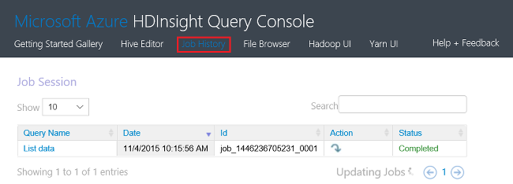

<properties
    pageTitle="使用 Azure 门户预览在 HDInsight 中管理基于 Windows 的 Hadoop 群集 | Azure"
    description="了解如何管理 HDInsight 服务。创建 HDInsight 群集，打开交互式 JavaScript 控制台，然后打开 Hadoop 命令控制台。"
    services="hdinsight"
    documentationcenter=""
    tags="azure-portal"
    author="mumian"
    manager="jhubbard"
    editor="cgronlun" />
<tags
    ms.assetid="9295a988-bd88-453a-8c8b-55fa103bf39c"
    ms.service="hdinsight"
    ms.workload="big-data"
    ms.tgt_pltfrm="na"
    ms.devlang="na"
    ms.topic="article"
    ms.date="01/17/2017"
    wacn.date="03/24/2017"
    ms.author="jgao" />  

# 使用 Azure 门户预览在 HDInsight 中管理基于 Windows 的 Hadoop 群集

使用 [Azure 门户预览][azure-portal]，可以在 Azure HDInsight 中创建基于 Windows 的 Hadoop 群集、更改 Hadoop 用户密码，以及启用远程桌面协议 (RDP) 以访问群集上的 Hadoop 命令控制台。

本文中的信息仅适用于基于 Windows 的 HDInsight 群集。有关管理基于 Linux 的群集的信息，请参阅[使用 Azure 门户预览在 HDInsight 中管理 Hadoop 群集](/documentation/articles/hdinsight-administer-use-portal-linux/)。

> [AZURE.IMPORTANT]
Linux 是在 HDInsight 3.4 版或更高版本上使用的唯一操作系统。有关详细信息，请参阅 [HDInsight 在 Windows 上弃用](/documentation/articles/hdinsight-component-versioning/#hdi-version-32-and-33-nearing-deprecation-date)。

## 先决条件

在开始阅读本文前，你必须具有：

* **一个 Azure 订阅**。请参阅[获取 Azure 试用版](/pricing/1rmb-trial/)。
* **Azure 存储帐户** - HDInsight 群集使用 Azure Blob 存储容器作为默认文件系统。有关 Azure Blob 存储如何提供与 HDInsight 群集无缝体验的详细信息，请参阅[将 Azure Blob 存储与 HDInsight 配合使用](/documentation/articles/hdinsight-hadoop-use-blob-storage/)。有关创建 Azure 存储帐户的详细信息，请参阅[如何创建存储帐户](/documentation/articles/storage-create-storage-account/)。

## 打开门户
1. 登录到 [https://portal.azure.cn](https://portal.azure.cn)。
2. 打开门户之后，你可以：

    * 单击左侧菜单中的“新建”以创建新群集：

        
    * 单击左侧菜单中的“HDInsight 群集”。

        

     如果 **HDInsight** 没有显示在左侧菜单中，请单击“浏览”。

     

## 创建群集
有关使用门户创建群集的说明，请参阅[创建 HDInsight 群集](/documentation/articles/hdinsight-provision-clusters/)。

HDInsight 使用各种 Hadoop 组件。有关已获得验证和支持的组件列表，请参阅 [Azure HDInsight 包含哪个版本的 Hadoop？](/documentation/articles/hdinsight-component-versioning/)。可使用以下选项之一自定义 HDInsight：

* 使用脚本操作运行可以自定义群集的自定义脚本，以更改群集配置或安装 Giraph 或 Solr 等自定义组件。有关详细信息，请参阅[使用脚本操作自定义 HDInsight 群集](/documentation/articles/hdinsight-hadoop-customize-cluster/)。
* 在群集创建期间使用 HDInsight .NET SDK 或 Azure PowerShell 中的群集自定义参数。然后，这些配置更改在群集的整个生存期内保留，并且不受 Azure 平台在维护时定期执行的群集节点重新映像影响。有关使用群集自定义参数的详细信息，请参阅[创建 HDInsight 群集](/documentation/articles/hdinsight-provision-clusters/)。
* 一些本机 Java 组件（如 Mahout 和 Cascading）可以在群集上作为 JAR 文件运行。可以通过 Hadoop 作业提交机制将这些 JAR 文件分发到 Azure Blob 存储，并提交到 HDInsight 群集。有关详细信息，请参阅[以编程方式提交 Hadoop 作业](/documentation/articles/hdinsight-submit-hadoop-jobs-programmatically/)。

    > [AZURE.NOTE]
    如果在将 JAR 文件部署到 HDInsight 群集或调用 HDInsight 群集上的 JAR 文件时遇到问题，请联系 [Azure.cn 技术支持](/support/contact/)。
    >

    > Cascading 不受 HDInsight 支持，因此不符合 Azure.cn 技术支持的条件。有关支持的组件列表，请参阅 [HDInsight 提供的群集版本有哪些新功能](/documentation/articles/hdinsight-component-versioning/)。
    >
    >

不支持使用远程桌面连接在群集上安装自定义软件。应避免在头节点的驱动器上存储任何文件，因为如果需要重新创建群集，这些文件会丢失。建议在 Azure Blob 存储中存储文件。Blob 存储是持久性的。

## 列出并显示群集
1. 登录到 [https://portal.azure.cn](https://portal.azure.cn)。
2. 单击左侧菜单中的“HDInsight 群集”。
3. 单击群集名称。如果群集列表很长，可以使用页面顶部的筛选器。
4. 双击列表中的群集可显示详细信息。

    **菜单和概要**：

      

    * 若要自定义菜单，请右键单击菜单中的任意位置，然后单击“自定义”。
    * **设置**和**所有设置**：显示该群集的“设置”边栏选项卡，可让你访问该群集的详细配置信息。
    * **仪表板**、**群集仪表板**和 **URL：这些是访问群集仪表板的所有途径，对于基于 Linux 的群集该仪表板为 Ambari Web。-**Secure Shell**：显示使用 Secure Shell (SSH) 连接连接到群集的说明。
    * **缩放群集**：可让你更改此群集的辅助角色节点数。
    * **删除**：删除群集。
    * **快速启动 ()**：显示有助于开始使用 HDInsight 的信息。
    * **用户 ()**：设置 Azure 订阅的其他用户对此群集的门户管理权限。

        > [AZURE.IMPORTANT]
        这*只会*影响在 Azure 门户预览中对此群集的访问和权限，对于连接到 HDInsight 群集或将作业提交到其上的用户并没有作用。
        >
        >
    * **标记 ()**：通过标记可设置键/值对，定义云服务的自定义分类。例如，你可以创建名为 **project** 的键，然后对与特定项目关联的所有服务使用一个公用值。
    * **Ambari 视图**：Ambari Web 的链接。

        > [AZURE.IMPORTANT]
        若要管理 HDInsight 群集提供的服务，必须使用 Ambari Web 或 Ambari REST API。有关如何使用 Ambari 的详细信息，请参阅 [Manage HDInsight clusters using Ambari](/documentation/articles/hdinsight-hadoop-manage-ambari/)（使用 Ambari 管理 HDInsight 群集）
        >
        >

        **使用情况**：

        
5. 单击“设置”。

    

    * **属性**：查看群集属性。
    * **群集 AAD 标识**：
    * **Azure 存储密钥**：查看默认存储帐户及其密钥。存储帐户是在群集创建过程中进行配置。
    * **群集登录**：更改群集 HTTP 用户的用户名和密码。
    * **外部元存储**：查看 Hive 和 Oozie 元存储。只能在群集创建过程中配置元存储。
    * **缩放群集**：增加和减少群集辅助节点的数量。
    * **远程桌面**：启用和禁用远程桌面 (RDP) 访问，以及配置 RDP 用户名。RDP 用户名必须与 HTTP 用户名不同。
    * **记录合作伙伴**：

        > [AZURE.NOTE]
        这是可用设置的常规列表；并非所有存在的设置都适用于所有群集类型。
        >
        >
6. 单击“属性”：

    属性部分列出以下内容：

    * **主机名**：群集名称。
    * **群集 URL**。
    * **状态**：包括“已终止”、“已接受”、ClusterStorageProvisioned、AzureVMConfiguration、HDInsightConfiguration、“正常运行”、“正在运行”、“错误”、“正在删除”、“已删除”、“超时”、DeleteQueued、DeleteTimedout、DeleteError、PatchQueued、CertRolloverQueued、ResizeQueued、ClusterCustomization
    * **区域**：Azure 位置。有关受支持的 Azure 位置的列表，请参阅 [HDInsight pricing](/pricing/details/hdinsight/)（HDInsight 定价）中的“上市地区”。
    * **已创建的数据**。
    * **操作系统**：**Windows** 或 **Linux**。
    * **类型**：Hadoop、HBase、Storm、Spark。
    * **版本**。请参阅 [HDInsight versions](/documentation/articles/hdinsight-component-versioning/)（HDInsight 版本）
    * **订阅**：订阅名称。
    * **订阅 ID**。
    * **主数据源**。用作默认 Hadoop 文件系统的 Azure Blob 存储帐户。
    * **辅助节点定价层**。
    * **头节点定价层**。

## 删除群集
删除群集不会删除默认的存储帐户或任何链接的存储帐户。可以使用相同的存储帐户和相同的元存储来重新创建群集。

1. 登录[门户][azure-portal]。
2. 从左侧菜单中依次单击“浏览全部”、“HDInsight 群集”和群集名称。
3. 单击顶部菜单中的“删除”，然后按照说明操作。

另请参阅 [Pause/shut down clusters](#pauseshut-down-clusters)（暂停/关闭群集）。

##  缩放群集
使用群集缩放功能，可更改 Azure HDInsight 中运行的群集使用的辅助节点数，而无需重新创建群集。

> [AZURE.NOTE]
只支持使用 HDInsight 3.1.3 或更高版本的群集。如果不确定群集的版本，可以查看“属性”页面。请参阅[列出并显示群集](#list-and-show-clusters)。
>
>

更改 HDInsight 支持的每种类型的群集所用数据节点数的影响：

* Hadoop

    可顺利增加正在运行的 Hadoop 群集中的辅助节点数，而不会影响任何挂起或运行中的作业。也可在操作进行中提交新作业。系统会正常处理失败的缩放操作，让群集始终保持正常运行状态。

    减少数据节点数目以缩减 Hadoop 群集时，系统会重新启动群集中的某些服务。这会导致所有正在运行和挂起的作业在缩放操作完成时失败。但是，可在操作完成后重新提交这些作业。
* HBase

    可在 HBase 群集运行时顺利添加或删除节点。完成缩放操作后的几分钟内，区域服务器将自动平衡。但也可手动平衡区域服务器，方法是登录到群集的头节点，然后在命令提示符窗口中运行以下命令：

        >pushd %HBASE_HOME%\bin
        >hbase shell
        >balancer

    有关使用 HBase shell 的详细信息，请参阅
* Storm

    可在 Storm 群集运行时顺利添加或删除数据节点。但是，缩放操作成功完成后，需要重新平衡拓扑。

    可以使用两种方法来完成重新平衡操作：

    * Storm Web UI
    * 命令行界面 (CLI) 工具

        有关更多详细信息，请参阅 [Apache Storm 文档](http://storm.apache.org/documentation/Understanding-the-parallelism-of-a-Storm-topology.html)。

        HDInsight 群集上提供了 Storm Web UI：

        

        以下是有关如何使用 CLI 命令重新平衡 Storm 拓扑的示例：

            ## Reconfigure the topology "mytopology" to use 5 worker processes,
            ## the spout "blue-spout" to use 3 executors, and
            ## the bolt "yellow-bolt" to use 10 executors
            $ storm rebalance mytopology -n 5 -e blue-spout=3 -e yellow-bolt=10

**缩放群集**

1. 登录到[门户][azure-portal]。
2. 从左侧菜单中依次单击“浏览全部”、“HDInsight 群集”和群集名称。
3. 从顶部菜单中单击“设置”，然后单击“缩放群集”。
4. 输入**辅助节点数**。Azure 订阅中的群集节点数量限制有所不同。要增加限制，可联系计费支持人员。成本信息将反映对节点数所做的更改。

      

## 暂停/关闭群集
大多数 Hadoop 作业只是偶尔运行的批处理作业。大多数 Hadoop 群集都存在长时间不进行处理的情况。有了 HDInsight，可将数据存储在 Azure 存储空间，以便在不使用群集时可将其安全删除。此外，还需要支付 HDInsight 群集费用，即使未使用。由于群集费用高于存储空间费用数倍，因此在不使用群集时将其删除可以节省费用。

可以通过许多方式对此过程进行程序性处理：

* 使用 Azure PowerShell。请参阅 [Analyze flight delay data](/documentation/articles/hdinsight-analyze-flight-delay-data/)（分析航班延误数据）。
* 使用 Azure CLI。请参阅 [Manage HDInsight clusters using Azure CLI](/documentation/articles/hdinsight-administer-use-command-line/)（使用 Azure CLI 管理 HDInsight 群集）。
* 使用 HDInsight .NET SDK。请参阅 [Submit Hadoop jobs](/documentation/articles/hdinsight-submit-hadoop-jobs-programmatically/)（提交 Hadoop 作业）。

有关定价信息，请参阅 [HDInsight pricing](/pricing/details/hdinsight/)（HDInsight 定价）。要从门户中删除群集，请参阅[删除群集](#delete-clusters)

## 更改群集用户名
HDInsight 群集可以有两个用户帐户。HDInsight 群集用户帐户在创建过程中创建。还可以创建通过 RDP 访问群集的 RDP 用户帐户。请参阅[启用远程桌面](#connect-to-hdinsight-clusters-by-using-rdp)。

**更改 HDInsight 群集用户名和密码**

1. 登录[门户][azure-portal]。
2. 从左侧菜单中依次单击“浏览全部”、“HDInsight 群集”和群集名称。
3. 从顶部菜单中单击“设置”，然后单击“群集登录”。
4. 如果已启用“群集登录”，则必须单击“禁用”，然后单击“启用”才能更改用户名和密码。
5. 更改**群集登录名**和/或**群集登录密码**，然后单击“保存”。

    

## 授予/撤消访问权限
HDInsight 群集提供以下 HTTP Web 服务（所有这些服务都有 REST 样式的终结点）：

* ODBC
* JDBC
* Ambari
* Oozie
* Templeton

默认情况下，将授权这些服务进行访问。可以从 Azure 门户预览撤消/授予访问权限。

> [AZURE.NOTE]
通过授予/撤消访问权限，你将重置群集用户名和密码。
>
>

**授予/撤消 HTTP Web 服务访问权限**

1. 登录[门户][azure-portal]。
2. 从左侧菜单中依次单击“浏览全部”、“HDInsight 群集”和群集名称。
3. 从顶部菜单中单击“设置”，然后单击“群集登录”。
4. 如果已启用“群集登录”，则必须单击“禁用”，然后单击“启用”才能更改用户名和密码。
5. 对于“群集登录用户名”和“群集登录密码”，请分别输入群集的新用户名和密码。
6. 单击“保存”。

    

##  查找默认存储帐户
每个 HDInsight 群集都有默认的存储帐户。群集的默认存储帐户及其密钥显示在“设置”>“属性”>“Azure 存储密钥”下。请参阅 [List and show clusters](#list-and-show-clusters)（列出和显示群集）。

## 查找资源组
在 Azure Resource Manager 模式下，每个 HDInsight 群集都是使用 Azure 资源组创建的。群集所属的 Azure 资源组显示在以下位置：

* 群集列表包含“资源组”列。
* 群集**概要**磁贴。

请参阅[列出并显示群集](#list-and-show-clusters)。

## 打开 HDInsight 查询控制台
HDInsight 查询控制台包括下列功能：

* **Hive 编辑器**：用于提交 Hive 作业的 GUI Web 界面。请参阅[使用查询控制台运行 Hive 查询](/documentation/articles/hdinsight-hadoop-use-hive-query-console/)。

    
* **作业历史记录**：监视 Hadoop 作业。

    

    单击“查询名称”以显示详细信息，包括“作业属性”、“作业查询”和“作业输出”。**还可将查询和输出下载到工作站。
* **文件浏览器**：浏览默认存储帐户和链接存储帐户。

      

    在屏幕截图中，**<Account>** 类型表示该项为 Azure 存储帐户。单击帐户名称以浏览文件。
* **Hadoop UI**。

      

    可通过 **Hadoop UI* 浏览文件和查看日志。
* **Yarn UI**。

    

## 运行 Hive 查询
要从门户运行 Hive 作业，请单击 HDInsight 查询控制台中的“Hive 编辑器”。请参阅[打开 HDInsight 查询控制台](#open-hdinsight-query-console)。

## 监视作业
要从门户监视作业，请单击 HDInsight 查询控制台中的“作业历史记录”。请参阅[打开 HDInsight 查询控制台](#open-hdinsight-query-console)。

## 浏览文件
要浏览存储在默认存储帐户和链接存储帐户中的文件，请单击 HDInsight 查询控制台中的“文件浏览器”。请参阅[打开 HDInsight 查询控制台](#open-hdinsight-query-console)。

还可使用 HDInsight 控制台的“Hadoop UI”中的“浏览文件系统”实用程序。请参阅[打开 HDInsight 查询控制台](#open-hdinsight-query-console)。

## 监视群集使用情况
HDInsight 群集边栏选项卡的“使用情况”部分会显示相关信息，方便了解订阅中可以用于 HDInsight 的核心数、分配给此群集的核心数，以及这些核心是如何分配给此群集中的节点的。请参阅 [List and show clusters](#list-and-show-clusters)（列出和显示群集）。

> [AZURE.IMPORTANT]
若要监视 HDInsight 群集提供的服务，必须使用 Ambari Web 或 Ambari REST API。有关如何使用 Ambari 的详细信息，请参阅[使用 Ambari 管理 HDInsight 群集](/documentation/articles/hdinsight-hadoop-manage-ambari/)
>
>

## 打开 Hadoop UI
要监视群集、浏览文件系统和查看日志，请单击 HDInsight 查询控制台中的“Hadoop UI”。请参阅[打开 HDInsight 查询控制台](#open-hdinsight-query-console)。

## 打开 Yarn UI
要使用 Yarn 用户界面，请单击 HDInsight 查询控制台中的“Yarn UI”。请参阅[打开 HDInsight 查询控制台](#open-hdinsight-query-console)。

## 使用 RDP 连接到群集
通过创建群集时提供的凭据，可以访问群集上的服务，但无法通过远程桌面访问群集本身。在预配群集时或在预配群集后，可以启用“远程桌面访问”。有关在创建时启用远程桌面的说明，请参阅[创建 HDInsight 群集](/documentation/articles/hdinsight-provision-clusters/)。

**启用远程桌面**

1. 登录[门户][azure-portal]。
2. 从左侧菜单中依次单击“浏览全部”、“HDInsight 群集”和群集名称。
3. 从顶部菜单中单击“设置”，然后单击“远程桌面”。
4. 输入**到期日期**、**远程桌面用户名**和**远程桌面密码**，然后单击“启用”。

      

    “到期日期”的默认值为“一周”。

    > [AZURE.NOTE]
    也可以使用 HDInsight .NET SDK 在群集上启用远程桌面。按以下方式使用 HDInsight 客户端对象上的 **EnableRdp** 方法：**client.EnableRdp(clustername, location, "rdpuser", "rdppassword", DateTime.Now.AddDays(6))**。同样，要在群集上禁用远程桌面，可以使用 **client.DisableRdp(clustername, location)**。有关这些方法的详细信息，请参阅 [HDInsight .NET SDK 参考](https://msdn.microsoft.com/zh-cn/library/azure/dn469975.aspx)。这仅适用于在 Windows 上运行的 HDInsight 群集。
    >
    >

**使用 RDP 连接到群集**

1. 登录[门户][azure-portal]。
2. 从左侧菜单中依次单击“浏览全部”、“HDInsight 群集”和群集名称。
3. 从顶部菜单中单击“设置”，然后单击“远程桌面”。
4. 单击“连接”，然后按照说明进行操作。如果禁用“连接”，必须首先启用它。请确保使用远程桌面用户的用户名和密码。不能使用群集用户凭据。

## 打开 Hadoop 命令行
要使用远程桌面连接到群集并使用 Hadoop 命令行，首先必须对群集启用远程桌面访问，如上一节所述。

**打开 Hadoop 命令行**

1. 使用“远程桌面”连接到群集。
2. 从桌面上双击“Hadoop 命令行”。

    ![HDI.HadoopCommandLine][image-hadoopcommandline]

    有关 Hadoop 命令的详细信息，请参阅 [Hadoop 命令参考](http://hadoop.apache.org/docs/current/hadoop-project-dist/hadoop-common/CommandsManual.html)。

在上面的屏幕截图中，文件夹名称已嵌入 Hadoop 版本号。可以根据群集上安装的 Hadoop 组件的版本更改版本号。可以使用 Hadoop 环境变量引用这些文件夹。例如：

    cd %hadoop_home%
    cd %hive_home%
    cd %hbase_home%
    cd %pig_home%
    cd %sqoop_home%
    cd %hcatalog_home%

## 后续步骤
在本文中，已学习如何使用门户创建 HDInsight 群集和如何打开 Hadoop 命令行工具。要了解更多信息，请参阅下列文章：

* [使用 Azure PowerShell 管理 HDInsight](/documentation/articles/hdinsight-administer-use-powershell/)
* [使用 Azure CLI 管理 HDInsight](/documentation/articles/hdinsight-administer-use-command-line/)
* [创建 HDInsight 群集](/documentation/articles/hdinsight-provision-clusters/)
* [以编程方式提交 Hadoop 作业](/documentation/articles/hdinsight-submit-hadoop-jobs-programmatically/)
* [Azure HDInsight 入门](/documentation/articles/hdinsight-hadoop-linux-tutorial-get-started/)
* [Azure HDInsight 包含哪个版本的 Hadoop？](/documentation/articles/hdinsight-component-versioning/)

[azure-portal]: https://portal.azure.cn
[image-hadoopcommandline]: ./media/hdinsight-administer-use-management-portal/hdinsight-hadoop-command-line.png "Hadoop 命令行"

<!---HONumber=Mooncake_0320_2017-->