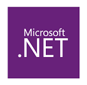

<properties
   pageTitle="密钥保管库开发人员指南 | Azure"
   description="开发人员可以使用 Azure 密钥保管库来管理 Azure 环境中的加密密钥。"
   services="key-vault"
   documentationCenter=""
   authors="BrucePerlerMS"
   manager="mbaldwin"
   editor="bruceper" />  

<tags
   ms.service="key-vault"
   ms.devlang="na"
   ms.topic="article"
   ms.tgt_pltfrm="na"
   ms.workload="identity"
   ms.date="08/16/2016"
   ms.author="bruceper" 
   wacn.date="10/19/2016"/>  

# Azure 密钥保管库开发人员指南
使用密钥保管库能够从应用程序中安全地访问敏感信息，以便：

- 无需自己编写代码即可保护密钥和机密信息，并且能够轻松地在应用程序中使用它们。
- 你能够让客户拥有和管理其自己的密钥，因此可以专注于提供核心软件功能。这样，你的应用程序便不会对客户的租户密钥和机密承担职责或潜在责任。
- 你的应用程序可以使用密钥进行签名和加密，不过使密钥管理与应用程序分开，以便解决方案适用于地理分散的应用程序。

有关 Azure 密钥保管库的更多常规信息，请参阅 [What is Key Vault](/documentation/articles/key-vault-whatis/)（什么是密钥保管库）。

## 创建和管理密钥保管库

在代码中使用 Azure 密钥保管库之前，可以通过 REST、资源管理器模板、PowerShell 或 CLI 创建和管理保管库，如以下文章中所述：

- [使用 REST 创建和管理密钥保管库](https://msdn.microsoft.com/zh-cn/library/azure/mt620024.aspx)
- [使用 PowerShell 创建和管理密钥保管库](/documentation/articles/key-vault-get-started/)
- [使用 CLI 创建和管理密钥保管库](/documentation/articles/key-vault-manage-with-cli/)
- [通过 ARM 模板创建密钥保管库并添加机密](/documentation/articles/resource-manager-template-keyvault/)

>[AZURE.NOTE] 针对密钥保管库执行的操作通过 AAD 进行身份验证并通过密钥保管库自己的访问策略（按保管库定义）进行授权。

## 使用密钥保管库进行编码

程序员的密钥保管库管理系统包含多个接口，并以 REST 作为基础（[密钥保管库 REST API 参考](https://msdn.microsoft.com/zh-cn/library/azure/dn903609.aspx)）。

成功获得授权后，可以执行以下操作：

- 使用 [Create](https://msdn.microsoft.com/zh-cn/library/azure/dn903634.aspx)、[Import](https://msdn.microsoft.com/zh-cn/library/azure/dn903626.aspx)、[Update](https://msdn.microsoft.com/zh-cn/library/azure/dn903616.aspx)、[Delete](https://msdn.microsoft.com/zh-cn/library/azure/dn903611.aspx) 和其他操作管理加密密钥

- 使用 [Get](https://msdn.microsoft.com/zh-cn/library/azure/dn903633.aspx)、[Update](https://msdn.microsoft.com/zh-cn/library/azure/dn986818.aspx)、[Delete](https://msdn.microsoft.com/zh-cn/library/azure/dn903613.aspx) 和其他操作管理机密

- 将加密密钥用于 [Sign](https://msdn.microsoft.com/zh-cn/library/azure/dn878096.aspx)/[Verify](https://msdn.microsoft.com/zh-cn/library/azure/dn878082.aspx)、[WrapKey](https://msdn.microsoft.com/zh-cn/library/azure/dn878066.aspx)/[UnwrapKey](https://msdn.microsoft.com/zh-cn/library/azure/dn878079.aspx) 和 [Encrypt](https://msdn.microsoft.com/zh-cn/library/azure/dn878060.aspx)/[Decrypt](https://msdn.microsoft.com/zh-cn/library/azure/dn878097.aspx) 操作

为使用密钥保管库提供了以下 SDK：

||
|:--:|:--:|
|[.NET SDK 文档](https://msdn.microsoft.com/zh-cn/library/mt430941.aspx)|[Node.js SDK 文档](http://azure.github.io/azure-sdk-for-node/azure-arm-keyvault/latest)|
|[.NET SDK 包](https://azure.microsoft.com/documentation/api/)|[Node.js SDK 包](https://www.npmjs.com/package/azure-keyvault)|

有关将密钥保管库用于应用程序的完整示例，请参阅：

- .NET 示例应用程序 *HelloKeyVault* 和 Azure Web 服务示例。[Azure 密钥保管库代码示例](http://www.microsoft.com/en-us/download/details.aspx?id=45343)
- 本教程可帮助你了解如何从 Azure 中的 Web 应用程序使用 Azure 密钥保管库。[从 Web 应用程序使用 Azure 密钥保管库](/documentation/articles/key-vault-use-from-web-application/)

## 操作方法

以下文章和方案提供了特定于任务的指导，方便你使用 Azure 密钥保管库：

- [如何在部署期间传递安全值（如密码）](/documentation/articles/resource-manager-keyvault-parameter/)- 当你需要在部署期间以参数形式传递安全值（例如密码）时，可以将该值存储为 Azure 密钥保管库中的机密，并在其他资源管理模板中引用该值。
- [如何使用密钥保管库，以便通过 SQL Server 进行可扩展的密钥管理](https://msdn.microsoft.com/zh-cn/library/dn198405.aspx) - 适用于 Azure 密钥保管库的 SQL Server 连接器允许 SQL Server 和 VM 中的 SQL 将 Azure 密钥保管库服务用作可扩展密钥管理 (EKM) 提供程序，以便保护其针对应用程序链接的加密密钥；透明数据加密、备份加密和列级加密。
- [如何将密钥保管库中的证书部署到 VM](https://blogs.technet.microsoft.com/kv/2015/07/14/deploy-certificates-to-vms-from-customer-managed-key-vault/) - 在 Azure 上的 VM 中运行的云应用程序需要一个证书。现在，要如何将此证书部署到此 VM 中呢？
- [如何将密钥保管库与适用于 Windows 和 Linux IaaS VM 的 Azure 磁盘加密相集成](/documentation/articles/azure-security-disk-encryption/) - 此磁盘加密解决方案与 Azure 密钥保管库集成，可帮助控制和管理密钥保管库订阅中的磁盘加密密钥和机密，同时确保虚拟机磁盘中的所有数据可在 Azure 存储空间中静态加密。
- [如何使用端到端密钥轮替和审核设置密钥保管库](/documentation/articles/key-vault-key-rotation-log-monitoring/) - 逐步介绍如何设置 Azure 密钥保管库的密钥轮替和审核。

如需更多将密钥保管库与 Azure 集成和结合使用的特定于任务的指导，请参阅 [Ryan Jones ARM template examples for Key Vault](https://github.com/rjmax/ArmExamples/tree/master/keyvaultexamples)（针对密钥保管库的 Ryan Jones ARM 模板示例）。

## 与密钥保管库集成

这些文章介绍了使用密钥保管库或者与之集成的其他方案与服务。

- [Azure 磁盘加密](/documentation/articles/azure-security-disk-encryption/)利用 Windows 的行业标准 [BitLocker](https://technet.microsoft.com/zh-cn/library/cc732774.aspx) 功能和 Linux 的 [DM-Crypt](https://en.wikipedia.org/wiki/Dm-crypt) 功能，为 OS 和数据磁盘提供卷加密。该解决方案与 Azure 密钥保管库集成，可帮助你控制和管理密钥保管库订阅中的磁盘加密密钥和机密，同时确保虚拟机磁盘中的所有数据可在 Azure 存储空间中静态加密。

## 支持库

- [Azure 密钥保管库核心库](http://www.nuget.org/packages/Microsoft.Azure.KeyVault.Core/1.0.0)提供 `IKey` 和 `IKeyResolver` 接口，用于通过标识符查找密钥，以及使用密钥执行操作。

- [Azure 密钥保管库扩展](http://www.nuget.org/packages/Microsoft.Azure.KeyVault.Extensions/1.0.0)为 Azure 密钥保管库提供了扩展功能。

## 其他密钥保管库资源
- [密钥保管库博客](http://aka.ms/kvblog)
- [密钥保管库论坛](http://aka.ms/kvforum)

<!---HONumber=Mooncake_1010_2016-->
