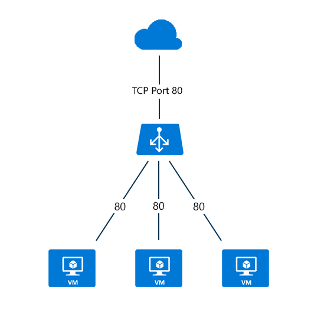

<properties
   pageTitle="面向 Internet 的负载均衡器概述 | Azure "
   description="面向 Internet 的负载均衡器及其功能的概述。使用虚拟机和云服务的 Azure 的负载均衡器的工作原理。"
   services="load-balancer"
   documentationCenter="na"
   authors="sdwheeler"
   manager="carmonm"
   editor="tysonn" />  

<tags
   ms.service="load-balancer"
   ms.devlang="na"
   ms.topic="article"
   ms.tgt_pltfrm="na"
   ms.workload="infrastructure-services"
   ms.date="10/24/2016"
   wacn.date="12/05/2016"
   ms.author="sewhee" />

# 面向 Internet 的负载均衡器概述

Azure 负载均衡器将传入流量的公用 IP 地址和端口号映射到虚拟机的专用 IP 地址和端口号，对于来自虚拟机的响应流量，则进行反向的映射。借助负载平衡规则，可在多个虚拟机或服务之间分配特定类型的流量。例如，可将 Web 请求流量负载分配到多个 Web 服务器或 Web 角色。

对于包含 Web 角色或辅助角色实例的云服务，可在服务定义文件 (.csdef) 中定义一个公共终结点。

 *servicedefinition.csdef* 文件包含终结点配置，有多个用于 Web 角色或辅助角色部署的角色实例时，会针对该部署来设置负载均衡器。若要将实例添加到云部署，可更改服务配置文件 (.csfg) 中的实例计数。

下图显示了公用和专用 TCP 端口 443 的加密 Web 流量的负载平衡终结点，由三个虚拟机共享。这三个虚拟机位于一个负载平衡集中。

)

图 1 - 加密 Web 流量的负载均衡终结点

当 Internet 客户端将网页请求发送到 TCP 端口 443 上的云服务的公共 IP 地址时，Azure Load Balancer 会在负载平衡集中的三个虚拟机之间分发请求。有关负载均衡器算法的详细信息，请参阅[负载均衡器概述页](/documentation/articles/load-balancer-overview#load-balancer-features)。

默认情况下，Azure Load Balancer 在多个虚拟机实例之间平均分发网络流量。还可以配置会话关联，有关详细信息，请参阅[负载均衡器分发模式](/documentation/articles/load-balancer-distribution-mode/)。

## 后续步骤

了解[内部负载均衡器](/documentation/articles/load-balancer-internal-overview/)，以便更好地了解哪个负载均衡器更适合相关云部署。

还可以[开始创建面向 Internet 的负载均衡器](/documentation/articles/load-balancer-get-started-internet-arm-ps/)，并配置适合特定负载均衡器网络流量行为的[分发模式](/documentation/articles/load-balancer-distribution-mode/)类型。

如果应用程序需要始终保持对负载均衡器后面的服务器的连接，你可以详细了解[负载均衡器的空闲 TCP 超时设置](/documentation/articles/load-balancer-tcp-idle-timeout/)。该文章将有助于你了解使用 Azure Load Balancer 时的空闲连接行为。

<!---HONumber=Mooncake_1128_2016-->