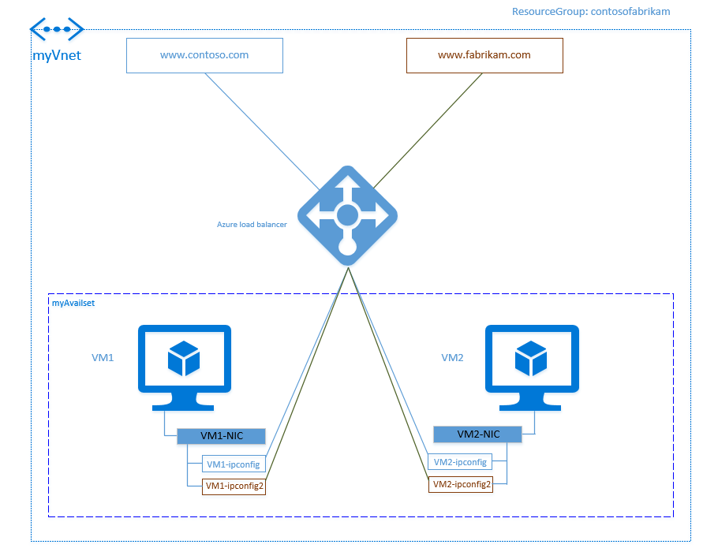

<!-- need to be verified -->

<properties
    pageTitle="使用 Azure CLI 在多个 IP 配置上进行负载均衡 | Azure"
    description="了解如何使用 Azure CLI 将多个 IP 地址分配给虚拟机 | Resource Manager。"
    services="virtual-network"
    documentationcenter="na"
    author="anavinahar"
    manager="narayan"
    editor=""
    tags="azure-resource-manager" />
<tags
    ms.assetid=""
    ms.service="load-balancer"
    ms.devlang="na"
    ms.topic="article"
    ms.tgt_pltfrm="na"
    ms.workload="infrastructure-services"
    ms.date="11/28/2016"
    wacn.date="01/13/2017"
    ms.author="annahar" />

# 在多个 IP 配置上进行负载均衡
> [AZURE.SELECTOR]
- [PowerShell](/documentation/articles/load-balancer-multiple-ip/)
- [CLI](/documentation/articles/load-balancer-multiple-ip-cli/)

本文介绍如何将 Azure Load Balancer 用于每个虚拟网络接口 \(NIC\) 的多个 IP 地址。目前，对一个 NIC 的多个 IP 地址的支持是预览版的功能。有关详细信息，请参阅本文的[限制](#limitations)部分。以下场景说明如何通过 Azure Load Balancer 使用此功能。

在本场景中有两个运行 Windows 的 VM，每个 VM 有一个 NIC。每个 NIC 具有多个 IP 配置。每个 VM 都托管了 contoso.com 和 fabrikam.com 这两个网站。每个网站都绑定到 NIC 的一个 IP 配置。我们使用负载均衡器来公开两个前端 IP 地址，每个地址分别对应于一个网站，从而将流量分发到各个网站的 IP 配置。此场景中两个前端以及两个后端池 IP 地址都使用相同的端口号。

  

##  限制

[AZURE.INCLUDE [virtual-network-preview](../../includes/virtual-network-preview.md)]

## 在多个 IP 配置上进行负载均衡的步骤

按照以下步骤来实现本文所概述的场景：

1. 按链接的文章中的步骤[安装和配置 Azure CLI](/documentation/articles/xplat-cli-install/)，并登录 Azure 帐户。
2. [创建资源组](/documentation/articles/virtual-machines-linux-create-cli-complete/#create-resource-groups-and-choose-deployment-locations) contosofabrikam。

        azure group create contosofabrikam chinaeast

3. 为两个 VM [创建可用性集](/documentation/articles/virtual-machines-linux-create-cli-complete/#create-an-availability-set)。对于此场景，请使用以下命令：

        azure availset create --resource-group contosofabrikam --location chinaeast --name myAvailabilitySet

4. [创建虚拟网络](/documentation/articles/virtual-machines-linux-create-cli-complete/#create-a-virtual-network-and-subnet) myVNet 和子网 mySubnet：

        azure network vnet create --resource-group contosofabrikam --name myVnet --address-prefixes 10.0.0.0/16  --location chinaeast

        azure network vnet subnet create --resource-group contosofabrikam --vnet-name myVnet --name mySubnet --address-prefix 10.0.0.0/24

5. [创建负载均衡器](/documentation/articles/virtual-machines-linux-create-cli-complete/#create-a-load-balancer-and-ip-pools) mylb：

        azure network lb create --resource-group contosofabrikam --location chinaeast --name mylb

6. 为负载均衡器的前端 IP 配置创建两个动态公共 IP 地址：

        azure network public-ip create --resource-group contosofabrikam --location chinaeast --name PublicIp1 --domain-name-label contoso --allocation-method Dynamic

        azure network public-ip create --resource-group contosofabrikam --location chinaeast --name PublicIp2 --domain-name-label fabrikam --allocation-method Dynamic

7. 分别创建两个前端 IP 配置，contosofe 和 fabrikamfe：

        azure network lb frontend-ip create --resource-group contosofabrikam --lb-name mylb --public-ip-name PublicIp1 --name contosofe
        azure network lb frontend-ip create --resource-group contosofabrikam --lb-name mylb --public-ip-name PublicIp2 --name fabrkamfe

8. 创建后端地址池（contosopool 和 fabrikampool）、[探测程序](/documentation/articles/virtual-machines-linux-create-cli-complete/#create-a-load-balancer-health-probe)（HTTP）和负载均衡规则（HTTPc 和 HTTPf）：

        azure network lb address-pool create --resource-group contosofabrikam --lb-name mylb --name contosopool
        azure network lb address-pool create --resource-group contosofabrikam --lb-name mylb --name fabrikampool

        azure network lb probe create --resource-group contosofabrikam --lb-name mylb --name HTTP --protocol "http" --interval 15 --count 2 --path index.html

        azure network lb rule create --resource-group contosofabrikam --lb-name mylb --name HTTPc --protocol tcp --probe-name http--frontend-port 5000 --backend-port 5000 --frontend-ip-name contosofe --backend-address-pool-name contosopool
        azure network lb rule create --resource-group contosofabrikam --lb-name mylb --name HTTPf --protocol tcp --probe-name http --frontend-port 5000 --backend-port 5000 --frontend-ip-name fabrkamfe --backend-address-pool-name fabrikampool

9. 运行以下命令，然后检查输出以[验证负载均衡器](/documentation/articles/virtual-machines-linux-create-cli-complete/#verify-the-load-balancer)是否已正确创建：

        azure network lb show --resource-group contosofabrikam --name mylb

10. 为你的第一台虚拟机 VM1 [创建公共 IP](/documentation/articles/virtual-machines-linux-create-cli-complete/#create-a-public-ip-address) myPublicIp 和[存储帐户](/documentation/articles/virtual-machines-linux-create-cli-complete/#create-a-storage-account) mystorageaccont1，如下所示：

        azure network public-ip create --resource-group contosofabrikam --location chinaeast --name myPublicIP --domain-name-label mypublicdns345 --allocation-method Dynamic

        azure storage account create --location chinaeast --resource-group contosofabrikam --kind Storage --sku-name GRS mystorageaccount1

11. 为 VM1 [创建网络接口](/documentation/articles/virtual-machines-linux-create-cli-complete/#create-an-nic-to-use-with-the-linux-vm) VM1-NIC，添加第二个 IP 配置 VM1-ipconfig2，然后[创建 VM](/documentation/articles/virtual-machines-linux-create-cli-complete/#create-the-linux-vms)，如下所示：

        azure network nic create --resource-group contosofabrikam --location chinaeast --subnet-vnet-name myVnet --subnet-name mySubnet --name myNic --ip-config-name VM1-ipconfig1 --public-ip-name myPublicIP --lb-address-pool-ids "/subscriptions/<your subscription ID>/resourceGroups/contosofabrikam/providers/Microsoft.Network/loadBalancers/mylb/backendAddressPools/contosopool"
        azure network nic ip-config create --resource-group contosofabrikam --nic-name myNic --name VM1-ipconfig2 --lb-address-pool-ids "/subscriptions/<your subscription ID>/resourceGroups/contosofabrikam/providers/Microsoft.Network/loadBalancers/mylb/backendAddressPools/fabrikampool"
        azure vm create --resource-group contosofabrikam --name VM1 --location chinaeast --os-type linux --nic-name myNic --vnet-name VNet1 --vnet-subnet-name Subnet1 --availset-name myAvailabilitySet --vm-size Standard_DS3_v2 --storage-account-name mystorageaccount1 --image-urn canonical:UbuntuServer:16.04.0-LTS:latest --admin-username <your username>  --admin-password <your password>

12. 为第二个 VM 重复步骤 10-11：

        azure network public-ip create --resource-group contosofabrikam --location chinaeast --name myPublicIP2 --domain-name-label mypublicdns785 --allocation-method Dynamic
        azure storage account create --location chinaeast --resource-group contosofabrikam --kind Storage --sku-name GRS mystorageaccount3426
        azure network nic create --resource-group contosofabrikam --location chinaeast --subnet-vnet-name myVnet --subnet-name mySubnet --name myNic2 --ip-config-name VM2-ipconfig1 --public-ip-name myPublicIP2 --lb-address-pool-ids "/subscriptions/<your subscription ID>/resourceGroups/contosofabrikam/providers/Microsoft.Network/loadBalancers/mylb/backendAddressPools/contosopool"
        azure network nic ip-config create --resource-group contosofabrikam --nic-name myNic2 --name VM2-ipconfig2 --lb-address-pool-ids "/subscriptions/<your subscription ID>/resourceGroups/contosofabrikam/providers/Microsoft.Network/loadBalancers/mylb/backendAddressPools/fabrikampool"
        azure vm create --resource-group contosofabrikam --name VM2 --location chinaeast --os-type linux --nic-name myNic2 --vnet-name VNet1 --vnet-subnet-name Subnet1 --availset-name myAvailabilitySet --vm-size Standard_DS3_v2 --storage-account-name mystorageaccount2 --image-urn canonical:UbuntuServer:16.04.0-LTS:latest --admin-username <your username>  --admin-password <your password>

13. 最后，必须将 DNS 资源记录配置为指向各自的负载均衡器的前端 IP 地址。

<!---HONumber=Mooncake_0109_2017-->