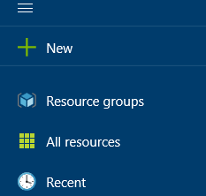
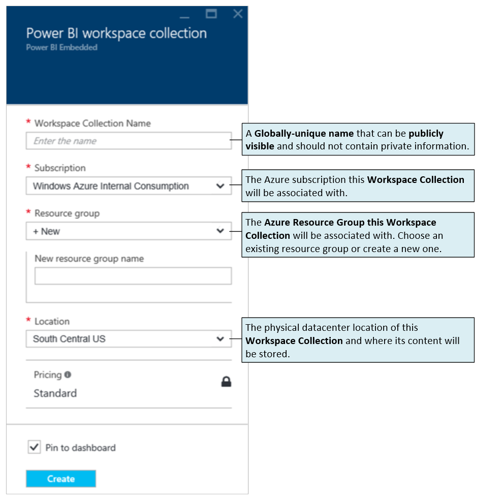
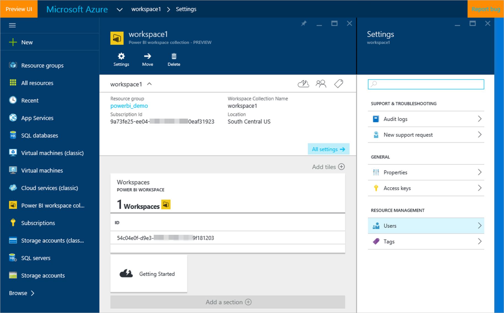
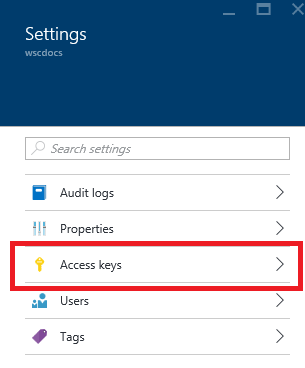
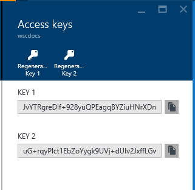

<properties
    pageTitle="Power BI Embedded 入门"
    description="Power BI Embedded，将交互式 Power BI 报表添加到商业智能应用程序"
    services="power-bi-embedded"
    documentationcenter=""
    author="guyinacube"
    manager="erikre"
    editor=""
    tags="" />
<tags
    ms.assetid="4787cf44-5d1c-4bc3-b3fd-bf396e5c1176"
    ms.service="power-bi-embedded"
    ms.devlang="NA"
    ms.topic="hero-article"
    ms.tgt_pltfrm="NA"
    ms.workload="powerbi"
    ms.date="02/06/2017"
    wacn.date="03/14/2017"
    ms.author="asaxton" />  

# Power BI Embedded 入门
**Power BI Embedded** 是一项 Azure 服务，应用程序开发人员可通过它将交互式 Power BI 报表添加到自己的应用程序中。**Power BI Embedded** 可以用于现有应用程序，不需要重新设计或更改用户的登录方式。

**Power BI Embedded** 的资源是通过 [Azure ARM API](https://msdn.microsoft.com/zh-cn/library/mt712306.aspx) 进行预配的。在此示例中，预配的资源是一个 **Power BI 工作区集合**。

  

## 创建工作区集合
**工作区集合**是顶层的 Azure 资源，是要嵌入到应用程序中的内容的容器。可采用两种方式创建**工作区集合**：

- 使用 Azure 门户预览手动创建
- 使用 Azure资源管理器(ARM) API 以编程方式创建

接下来将完成使用 Azure 门户预览构建**工作区集合**的步骤。

1. 打开并登录到 **Azure 门户预览**：[http://portal.azure.cn](http://portal.azure.cn)。
2. 在顶部面板上单击“+ 新建”。
   
	  

3. 在“数据 + 分析”下单击“Power BI Embedded”。
4. 在“工作区集合”边栏选项卡中输入所需的信息。有关**定价**信息，请参阅 [Power BI Embedded 定价](/pricing/details/power-bi-embedded/)。
   
	  

5. 单击“创建”。

**工作区集合**将花费一些时间进行预配。完成后将转到“工作区集合”边栏选项卡。

     

“创建”边栏选项卡包含调用创建工作区并向其部署内容的 API 所需的信息。

## 查看 Power BI API 访问密钥 
调用 Power BI REST API 所需的最重要信息之一是**访问密钥**。这些访问密钥用于生成对 API 请求进行身份验证的**应用令牌**。要查看**访问密钥**，请单击“设置”边栏选项卡上的“访问密钥”。若要了解关于**应用令牌**的详细信息，请参阅[通过 Power BI Embedded 进行身份验证和授权](/documentation/articles/power-bi-embedded-app-token-flow/)。

     

可以看到有两个密钥。

     

复制这两个密钥并将它们安全存储在你的应用程序中。像对待密码一样对待这些密钥很重要，因为它们可以提供**工作区集合**中所有内容的访问权限。

虽然列出了两个密钥，但是一次只需要一个密钥。提供第二个密钥以便定期重新生成密钥，且无需中断对服务的访问。

现在，应用程序具有一个 Power BI 实例和**访问密钥**，可以将报表导入自己的应用程序中。在了解如何导入报表之前，下一节介绍了如何创建要嵌入到应用程序中的 Power BI 数据集和报表。

## 使用工作区

创建工作区集合后，需要创建一个用于容装报表和数据集的工作区。若要创建工作区，需要使用[发布工作区 REST API](https://msdn.microsoft.com/zh-cn/library/azure/mt711503.aspx)。

## 创建要嵌入到应用程序中的 Power BI 数据集和报表
在创建应用程序的 Power BI 实例并具有**访问密钥**后，将需要创建要嵌入的 Power BI 数据集和报表。可以使用 **Power BI Desktop** 创建数据集和报表。可以下载 [Power BI Desktop](https://go.microsoft.com/fwlink/?LinkId=521662) 进行试用。或者，若要快速开始使用，可以下载[零售分析示例 PBIX](http://go.microsoft.com/fwlink/?LinkID=780547)。

> [AZURE.NOTE]
若要了解有关如何使用 **Power BI Desktop** 的详细信息，请参阅 [Power BI Desktop 入门](https://powerbi.microsoft.com/zh-cn/guided-learning/powerbi-learning-0-2-get-started-power-bi-desktop)。

在 **Power BI Desktop** 中，可以通过将数据的副本导入 **Power BI Desktop** 来连接数据源，或者使用 **DirectQuery** 直接连接数据源。

以下是使用**导入**和 **DirectQuery** 之间的区别。

| 导入 | DirectQuery |
| --- | --- |
| 将表、列和数据导入或复制到 **Power BI Desktop**。当使用可视化效果时，**Power BI Desktop** 将查询数据的副本。若要查看对基础数据所做的更改，必须刷新，或重新导入完整的当前数据集。 |仅将表和列导入或复制到 **Power BI Desktop**。当使用可视化效果时，**Power BI Desktop** 将查询基础数据源，这意味着始终可以查看当前数据。 |

有关连接到数据源的详细信息，请参阅[连接到数据源](/documentation/articles/power-bi-embedded-connect-datasource/)。

在 **Power BI Desktop** 中保存工作后，将创建一个 PBIX 文件。此文件包含你的报表。此外，如果导入数据，则 PBIX 包含完整数据集；而如果使用 **DirectQuery**，PBIX 只包含数据集架构。使用 [Power BI 导入 API](https://msdn.microsoft.com/zh-cn/library/mt711504.aspx) 以编程方式将 PBIX 部署到工作区。

> [AZURE.NOTE]
**Power BI Embedded** 具有其他一些 API，用于更改数据集所指向的服务器和数据库，以及设置数据集将用于连接数据库的服务帐户凭据。请参阅 [Post SetAllConnections](https://msdn.microsoft.com/zh-cn/library/mt711505.aspx)（发布 SetAllConnections）和 [Patch Gateway Datasource](https://msdn.microsoft.com/zh-cn/library/mt711498.aspx)（修补网关数据源）。

## 后续步骤
在前面的步骤中你创建了工作区集合以及第一个报表和数据集。现在是时候了解如何为 **Power BI Embedded** 编写代码了。为了帮助用户入门，已创建了一个示例 Web 应用程序：[示例入门](/documentation/articles/power-bi-embedded-get-started-sample/)。此示例介绍了如何执行以下操作：

- 预配内容
  - 创建工作区
  - 导入 PBIX 文件
  - 更新连接字符串并设置数据集的凭据。
- 安全地嵌入报表

## 另请参阅
- [示例入门](/documentation/articles/power-bi-embedded-get-started-sample/)
- [通过 Power BI Embedded 进行身份验证和授权](/documentation/articles/power-bi-embedded-app-token-flow/)
- [Power BI Desktop](https://powerbi.microsoft.com/documentation/powerbi-desktop-get-the-desktop/)

有更多问题？ [试用 Power BI 社区](http://community.powerbi.com/)

<!---HONumber=Mooncake_0306_2017-->
<!---Update_Description: wording update -->