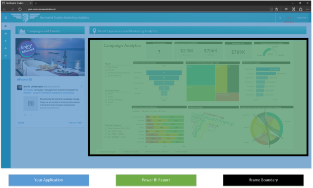
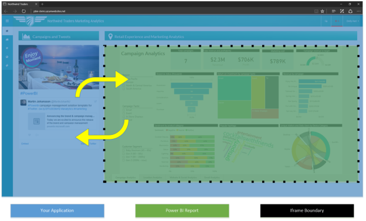
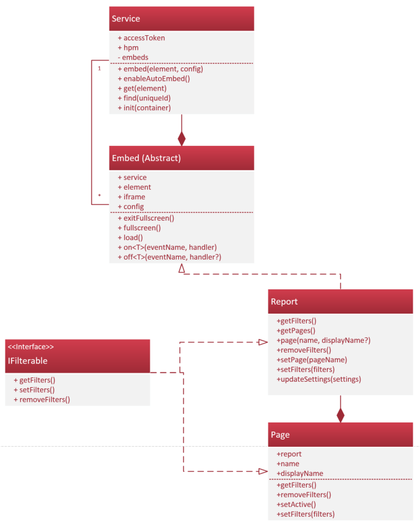

<properties
   pageTitle="使用 JavaScript API 与报表进行交互 | Azure"
   description="Power BI Embedded, 使用 JavaScript API 与报表进行交互"
   services="power-bi-embedded"
   documentationCenter=""
   authors="mgblythe"
   manager="NA"
   editor=""
   tags=""/>
<tags
   ms.service="power-bi-embedded"
   ms.devlang="NA"
   ms.topic="hero-article"
   ms.tgt_pltfrm="NA"
   ms.workload="powerbi"
   ms.date="08/26/2016"
   ms.author="mblythe"
   wacn.date=""/>  

# 使用 JavaScript API 与 Power BI 报表进行交互

Power BI JavaScript API 可以轻松将 Power BI 报表嵌入到应用程序中。使用此 API，应用程序能够以编程方式与各种报表元素（例如页面和筛选器）进行交互。此交互使 Power BI 报表成为应用程序更必不可少的部分。

可以使用作为应用程序的一部分托管的 iframe 将 Power BI 报表嵌入到应用程序中。Iframe 充当应用程序与报表之间的边界，如下图中所示。

  

iframe 使嵌入过程变得更容易，但是如果没有 JavaScript API，报表和应用程序相互之间将无法进行交互。较少交互可能会让人感觉报表没有真正成为应用程序的一部分。报表和应用程序之间实际上需要相互通信，如下图中所示。

  

使用 Power BI JavaScript API，可以编写能够安全地通过 iframe 边界的代码。这使得应用程序能够以编程方式在报表中执行操作，侦听由于用户在报表中执行操作而发生的事件。

## 使用 Power BI JavaScript API 可以做什么？
使用此 JavaScript API 可以管理报表、导航到报表中的页面、筛选报表以及处理嵌入的事件。下图显示了此 API 的结构。

  

### 管理报表
使用此 Javascript API 可以管理在报表和页面级别发生的行为：

- 在应用程序中安全地嵌入特定的 Power BI 报表 - 请尝试[嵌入的演示应用程序](http://azure-samples.github.io/powerbi-angular-client/#/scenario1)
  - 设置访问令牌
- 配置报表
  - 启用和禁用筛选器窗格及页面导航窗格 - 请尝试[更新设置演示应用程序](http://azure-samples.github.io/powerbi-angular-client/#/scenario6)
  - 为页面和筛选器设置默认值 - 请尝试[设置默认值演示](http://azure-samples.github.io/powerbi-angular-client/#/scenario5)
- 进入和退出全屏模式

[了解有关嵌入报表的详细信息](https://github.com/Microsoft/PowerBI-JavaScript/wiki/Embedding-Basics)

### 导航到报表中的页面
可以使用此 JavaScript API 发现报表中的所有页面以及设置当前页面。请尝试[导航演示应用程序](http://azure-samples.github.io/powerbi-angular-client/#/scenario3)。

[了解有关页面导航的详细信息](https://github.com/Microsoft/PowerBI-JavaScript/wiki/Page-Navigation)

### 筛选报表
此 JavaScript API 针对嵌入的报表和报表页面提供了基本和高级筛选功能。请尝试[筛选演示应用程序](http://azure-samples.github.io/powerbi-angular-client/#/scenario4)，并查看此处的一些入门代码。

#### 基本筛选器
基本筛选器置于列或层次结构级别，包含要包括或排除的值的列表。

	const basicFilter: pbi.models.IBasicFilter = {
	  $schema: "http://powerbi.com/product/schema#basic",
	  target: {
	    table: "Store",
	    column: "Count"
	  },
	  operator: "In",
	  values: [1,2,3,4]
	}

#### 高级筛选器
高级筛选器使用逻辑运算符 AND 或 OR，接受一个或两个条件，每个条件都有其自己的运算符和值。支持的条件有：

- None
- LessThan
- LessThanOrEqual
- GreaterThan
- GreaterThanOrEqual
- Contains
- DoesNotContain
- StartsWith
- DoesNotStartWith
- Is
- IsNot
- IsBlank
- IsNotBlank

		const advancedFilter: pbi.models.IAdvancedFilter = {
		  $schema: "http://powerbi.com/product/schema#advanced",
		  target: {
		    table: "Store",
		    column: "Name"
		  },
		  logicalOperator: "Or",
		  conditions: [
		    {
		      operator: "Contains",
		      value: "Wash"
		    },
		    {
		      operator: "Contains",
		      value: "Park"
		    }
		  ]
		}

[了解有关筛选的详细信息](https://github.com/Microsoft/PowerBI-JavaScript/wiki/Filters)

### 处理事件
除了向 iframe 发送信息之外，应用程序还可以接收来自 iframe 的有关下列事件的信息：

- 嵌入的元素
  - loaded
  - error
- 报表
  - pageChanged
  - dataSelected（即将推出）

[了解有关处理事件的详细信息](https://github.com/Microsoft/PowerBI-JavaScript/wiki/Handling-Events)

## 后续步骤
有关 Power BI JavaScript API 的详细信息，请查看以下链接：

- [JavaScript API Wiki](https://github.com/Microsoft/PowerBI-JavaScript/wiki)
- [对象模型参考](https://microsoft.github.io/powerbi-models/modules/_models_.html)
- 示例
  - [Angular](http://azure-samples.github.io/powerbi-angular-client)
  - [Ember](https://github.com/Microsoft/powerbi-ember)
- [直播演示](https://microsoft.github.io/PowerBI-JavaScript/demo/)

<!---HONumber=Mooncake_1010_2016-->