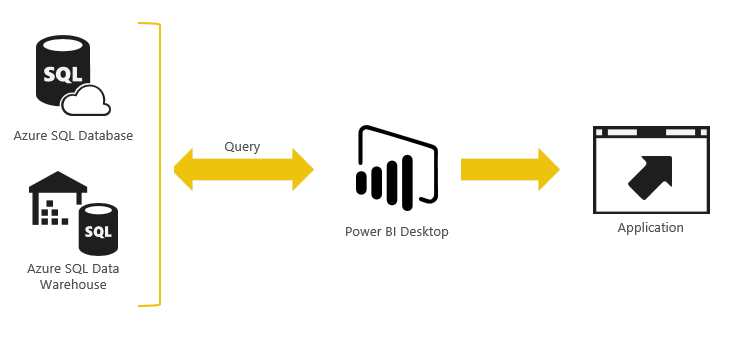
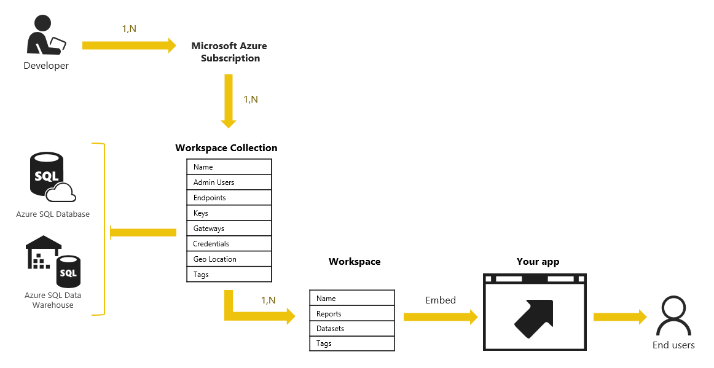
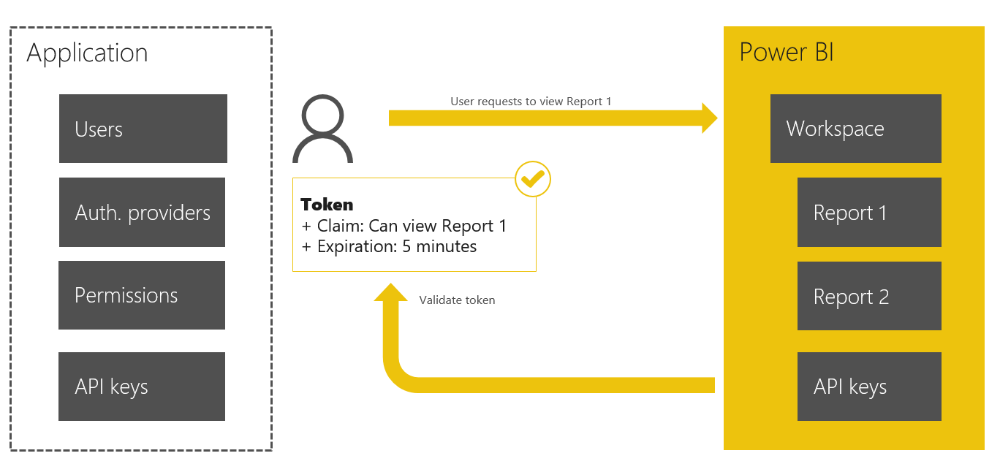

<properties
    pageTitle="Power BI Embedded 是什么？"
    description="借助 Power BI Embedded，可将 Power BI 报表集成到 Web 或移动应用程序中，因此无需生成自定义解决方案。"
    services="power-bi-embedded"
    documentationcenter=""
    author="guyinacube"
    manager="erikre"
    editor=""
    tags="" />
<tags
    ms.assetid="03649b72-b7d7-40ca-b077-12356d72d4f3"
    ms.service="power-bi-embedded"
    ms.devlang="NA"
    ms.topic="article"
    ms.tgt_pltfrm="NA"
    ms.workload="powerbi"
    ms.date="12/05/2016"
    wacn.date="01/24/2017"
    ms.author="asaxton" />  

# Power BI Embedded 是什么？

通过 **Power BI Embedded**，可以将 Power BI 报表集成到 web 或移动应用程序。

  

Power BI Embedded 是一项 **Azure 服务**，使 ISV 能够在其自己的应用程序中融入 Power BI 数据体验。开发人员已经构建了应用程序，并且这些应用程序具有其自己的用户和不同的功能集。这些应用也可能碰巧具有内置的数据元素（如图表和报表），这些元素现在可以由 Power BI Embedded 提供支持。用户不需要具有 Power BI 帐户便可使用这些应用。他们可以继续像以前那样登录到这些应用程序，查看并与 Power BI 报表体验进行交互而无需任何额外的授权。

## Power BI Embedded 的授权
在 **Power BI Embedded** 使用模型中，Power BI 的授权不是由最终用户负责的。而是应该由使用视觉对象的应用开发人员来购买**会话**，并且费用计入拥有这些资源的订阅中。在定价页 (/pricing/details/power-bi-embedded/) 上可以找到其他信息。

## Power BI Embedded 概念模型

  

与 Azure 中的任何其他服务一样，Power BI Embedded 的资源也是通过 [Azure资源管理器API](https://msdn.microsoft.com/zh-cn/library/mt712306.aspx) 进行预配的。在此示例中，预配的资源是一个 **Power BI 工作区集合**。

## 工作区集合
**工作区集合**是一个顶级 Azure 资源容器，包含 0 个或多个**工作区**。**工作区****集合**具有所有标准 Azure 属性和下列内容：

- **访问密钥** - 安全地调用 Power BI API 时使用的密钥（后面的部分中进行了介绍）。
- **用户** - 具有管理员权限的 Azure Active Directory (AAD) 用户，通过 Azure 门户预览或 Azure资源管理器API 管理 Power BI 工作区集合。
- **区域** - 在预配**工作区集合**的过程中，可以选择要在其中预配的区域。有关详细信息，请参阅 [Azure 区域](https://azure.microsoft.com/regions/)。

## 工作区
**工作区** 是一个包含 Power BI 内容的容器，Power BI 内容可以包括数据集、报表和仪表板。**工作区**在首次创建后为空。

## 使用工作区集合和工作区
**工作区集合**和**工作区**是内容容器，它们按最适合所构建的应用程序设计的任何方式进行使用和组织。它们提供了许多不同的方式供用户在其中排列内容。可以选择将所有内容都放在一个工作区中并在稍后使用应用令牌进一步细分客户之间的内容。还可以选择将所有客户放在单独的工作区中，使他们分开一些。另外，也可以选择按区域而不是按客户来组织用户。这种设计十分灵活，可以选择最佳的方式来组织内容。

## 使用应用令牌进行身份验证和授权
**Power BI Embedded** 委托应用程序来执行所有必要的用户身份验证和授权。没有明确要求最终用户必须是 Azure Active directory (Azure AD) 的客户。相反，应用程序通过使用**应用程序身份验证令牌（应用令牌）**向 **Power BI Embedded** 表明自己获得了呈现 Power BI 报表的授权。当应用想要呈现报表时，可以根据需要创建这些**应用令牌**。

  

**应用程序身份验证令牌（应用令牌）**用于向 **Power BI Embedded** 表明身份。有三种类型的**应用令牌**：

1. 预配令牌 - 在**工作区集合**中预配新的**工作区**时使用
2. 开发令牌 - 直接调用 **Power BI REST API** 时使用
3. 嵌入令牌 - 进行调用以在嵌入式 iframe 中呈现报表时使用

这些令牌适用于与 **Power BI Embedded** 进行交互的各种阶段。这些令牌经过专门设计，以便可以将应用中的权限委托给 Power BI。有关详细信息，请参阅[应用令牌流](/documentation/articles/power-bi-embedded-app-token-flow/)。

## 另请参阅
- [常见 Power BI Embedded 方案](/documentation/articles/power-bi-embedded-scenarios/)
- [Power BI Embedded 入门](/documentation/articles/power-bi-embedded-get-started/)

<!---HONumber=Mooncake_0116_2017-->
<!---Update_Description: wording update -->
