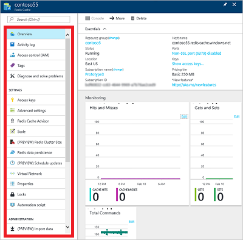
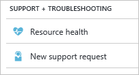
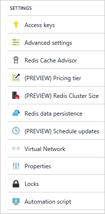
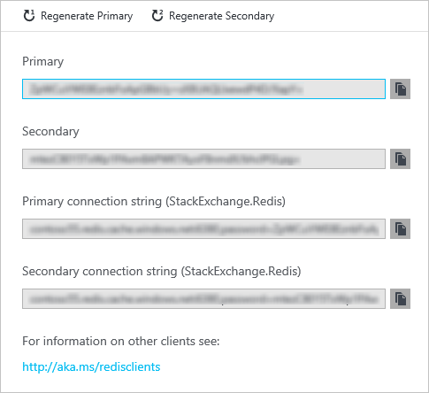
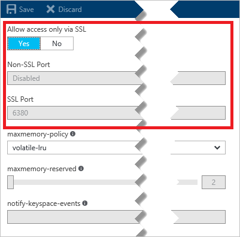
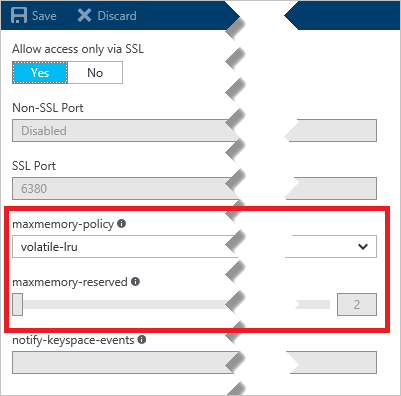
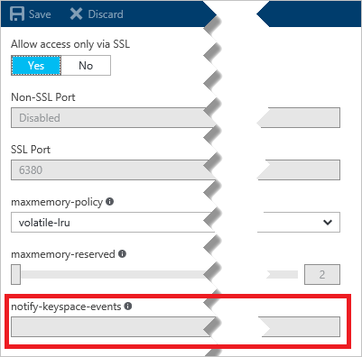
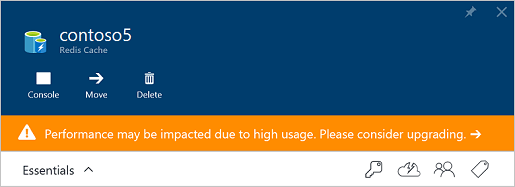
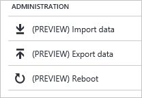
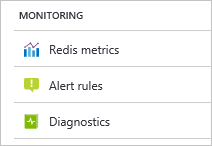

<properties 
	pageTitle="如何配置 Azure Redis 缓存 | Azure"
	description="了解 Azure Redis 缓存的默认 Redis 配置，并了解如何配置 Azure Redis 缓存实例"
	services="redis-cache"
	documentationCenter="na"
	authors="steved0x"
	manager="douge"
	editor="tysonn" />
<tags 
	ms.service="cache"
	ms.devlang="na"
	ms.topic="article"
	ms.tgt_pltfrm="cache-redis"
	ms.workload="tbd"
	ms.date="08/25/2016"
	wacn.date="10/17/2016"
	ms.author="sdanie" />  

# 如何配置 Azure Redis 缓存

本主题介绍如何查看和更新 Azure Redis 缓存实例的配置，并介绍了 Azure Redis 缓存实例的默认 Redis 服务器配置。

>[AZURE.NOTE] 有关配置和使用高级缓存功能的详细信息，请参阅[如何配置高级 Azure Redis 缓存的持久性](/documentation/articles/cache-how-to-premium-persistence/)、[如何配置高级 Azure Redis 缓存的群集](/documentation/articles/cache-how-to-premium-clustering/)以及[如何配置高级 Azure Redis 缓存的虚拟网络支持](/documentation/articles/cache-how-to-premium-vnet/)。

## 配置 Redis 缓存设置

[AZURE.INCLUDE [redis-cache-create](../../includes/redis-cache-browse.md)]

Azure Redis 缓存在“设置”边栏选项卡上提供以下设置。

-	[支持和故障排除设置](#support-amp-troubleshooting-settings)
-	[常规设置](#general-settings)
	-	[属性](#properties)
	-	[访问密钥](#access-keys)
	-	[高级设置](#advanced-settings)
	-	[Redis 缓存顾问](#redis-cache-advisor)
-	[缩放设置](#scale-settings)
	-	[定价层](#pricing-tier)
	-	[Redis 群集大小](#cluster-size)
-	[数据管理设置](#data-management-settings)
	-	[Redis 数据持久性](#redis-data-persistence)
	-	[导入/导出](#importexport)
-	[管理设置](#administration-settings)
	-	[重新启动](#reboot)
	-	[计划更新](#schedule-updates)
-	[诊断设置](#diagnostics-settings)
-	[网络设置](#network-settings)
-	[资源管理设置](#resource-management-settings)

## 支持和故障排除设置

“支持 + 疑难解答”部分中的设置提供了用于解决缓存问题的选项。

  

单击“活动日志”可查看已对缓存执行的操作。也可以使用筛选来展开此视图，以包含其他资源。有关使用审核日志的详细信息，请参阅[查看事件和审核日志](/documentation/articles/insights-debugging-with-events/)以及[使用 Resource Manager 执行审核操作](/documentation/articles/resource-group-audit/)。有关监视 Azure Redis 缓存事件的详细信息，请参阅[操作和警报](/documentation/articles/cache-how-to-monitor/#operations-and-alerts)。

## 常规设置

“常规”部分中的设置用于访问和配置缓存的下列设置。

-	[属性](#properties)
-	[访问密钥](#access-keys)
-	[高级设置](#advanced-settings)
-	[Redis 缓存顾问](#redis-cache-advisor)

### 属性

单击“属性”查看有关缓存的信息，包括缓存终结点和端口。

  

### 访问密钥

单击“访问密钥”查看或重新生成缓存访问密钥。通过正在连接到缓存的客户端，从“属性”边栏选项卡将这些密钥与主机名和端口一起使用。

  

###  高级设置

在“高级设置”边栏选项卡上可以配置以下设置。

-	[访问端口](#access-ports)
-	[Maxmemory-policy 和 maxmemory-reserved](#maxmemory-policy-and-maxmemory-reserved)
-	[密钥空间通知（高级设置）](#keyspace-notifications-advanced-settings)

### 访问端口

默认情况下，为新缓存禁用非 SSL 访问。要启用非 SSL 端口，请对“高级设置”边栏选项卡中的“仅允许通过 SSL 访问”单击“否”，然后单击“保存”。

  

### Maxmemory-policy 和 maxmemory-reserved

“高级设置”边栏选项卡中的“Maxmemory-policy”和“maxmemory-reserved”设置用于为缓存配置内存策略。“maxmemory-policy”设置将为缓存配置逐出策略，“maxmemory-reserved”将为非缓存进程配置保留的内存。

  

“Maxmemory 策略”允许从以下逐出策略中进行选择。

-	volatile-lru（默认）。
-	allkeys-lru
-	volatile-random
-	allkeys-random
-	volatile-ttl
-	noeviction

有关 Maxmemory 策略的详细信息，请参阅[逐出策略](http://redis.io/topics/lru-cache#eviction-policies)。

“maxmemory-reserved”设置可为故障转移过程中的复制等非缓存操作配置保留的内存量 (MB)。碎片比率较高时也可使用此设置。设置此值能够在负载变化时具有更一致的 Redis 服务器体验。对于写入密集型工作负荷，应将此值设置为较高。为此类操作保留内存后，将无法存储缓存数据。

>[AZURE.IMPORTANT] “maxmemory-reserved”设置仅适用于标准缓存和高级缓存。

### 密钥空间通知（高级设置）

Redis 密钥空间通知是在“高级设置”边栏选项卡上配置的。密钥空间通知让客户端能够在发生特定事件时接收通知。

  

>[AZURE.IMPORTANT] 密钥空间通知和“notify-keyspace-events”设置仅适用于标准缓存和高级缓存。

有关详细信息，请参阅 [Redis 密钥空间通知](http://redis.io/topics/notifications)。有关示例代码，请参阅 [Hello world](https://github.com/rustd/RedisSamples/tree/master/HelloWorld) 示例中的 [KeySpaceNotifications.cs](https://github.com/rustd/RedisSamples/blob/master/HelloWorld/KeySpaceNotifications.cs) 文件。

## Redis 缓存顾问

“建议”边栏选项卡会显示适用于缓存的建议。在正常操作期间，不会显示任何建议。

  

如果在缓存操作期间发生任何状况（例如，高内存使用率、网络带宽或服务器负载），将在“Redis 缓存”边栏选项卡中显示警报。

  

可以在“建议”边栏选项卡中找到更多信息。

可以在“Redis 缓存”边栏选项卡的[监视图表](/documentation/articles/cache-how-to-monitor/#monitoring-charts)和[使用率图表](/documentation/articles/cache-how-to-monitor/#usage-charts)部分监视这些度量值。

每个定价层都有不同的客户端连接、内存和带宽的限制。如果缓存持续一段时间接近这些度量值的最大容量，即会提供建议。有关通过“建议”工具查看的度量值和限制的详细信息，请参阅下表。

| Redis 缓存度量值 | 有关详细信息，请参阅 |
|-------------------------|---------------------------------------------------------------------------|
| 网络带宽使用率 | [缓存性能 - 可用带宽](/documentation/articles/cache-faq/#cache-performance) |
| 连接的客户端数 | [默认 Redis 服务器配置 - maxclients](#maxclients) |
| 服务器负载 | [使用率图表 - Redis 服务器负载](/documentation/articles/cache-how-to-monitor/#usage-charts) |
| 内存使用率 | [缓存性能 - 大小](/documentation/articles/cache-faq/#cache-performance) |

若要升级缓存，请单击“立即升级”以更改[定价层](#pricing-tier)并缩放缓存。有关选择定价层的详细信息，请参阅[应使用哪种 Redis 缓存产品和大小？](/documentation/articles/cache-faq/#what-redis-cache-offering-and-size-should-i-use)。

## 缩放设置

“缩放”部分中的设置用于访问和配置缓存的下列设置。

  

-	[定价层](#pricing-tier)
-	[Redis 群集大小](#cluster-size)

### 定价层

单击“定价层”可查看或更改缓存的定价层。有关缩放的详细信息，请参阅[如何缩放 Azure Redis 缓存](/documentation/articles/cache-how-to-scale/)。

### Redis 群集大小

此功能目前尚未在 Azure 中国区推出。而且，如果在 Azure 门户预览版中创建高级 Redis 缓存，则将无法设置群集大小。因此，如果想要创建 ShardCount 大于 1 的 Redis 缓存，应当使用 Azure PowerShell 进行创建。

## 数据管理设置

“数据管理”部分中的设置用于访问和配置缓存的下列设置。

  

-	[Redis 数据持久性](#redis-data-persistence)
-	[导入/导出](#importexport)

### Redis 数据持久性

单击“Redis 数据持久性”可启用、禁用或配置高级缓存的数据持久性。

  

若要启用 Redis 持久性，请单击“已启用”来启用 RDB（Redis 数据库）备份。若要禁用 Redis 持久性，请单击“已禁用”。

若要配置备份间隔，请从下拉列表中选择一个**备份频率**。选项包括“15 分钟”、“30 分钟”、“60 分钟”、“6 小时”、“12 小时”和“24 小时”。在上一个备份操作成功完成以后，此时间间隔就会开始倒计时，同时会启动新的备份。

单击“存储帐户”以选择要使用的存储帐户，然后从“存储密钥”下拉列表中选择要使用的“主密钥”或“辅助密钥”。必须选择与缓存处于相同区域的存储帐户，建议选择“高级存储”帐户，因为高级存储的吞吐量较高。不管任何时候，只要重新生成了持久性帐户的存储密钥，就必须从“存储密钥”下拉列表中重新选择所需的密钥。

单击“确定”可保存暂留配置。

>[AZURE.IMPORTANT] Redis 数据持久性仅适用于高级缓存。有关详细信息，请参阅[如何为高级 Azure Redis 缓存配置持久性](/documentation/articles/cache-how-to-premium-persistence/)。

### 导入/导出

导入/导出是一种 Azure Redis 缓存数据管理操作，可用于通过从高级缓存导入 Redis 缓存数据库 (RDB) 快照以及将 Redis 缓存数据库 (RDB) 快照导出到 Azure 存储帐户中的页 blob 来相应地将数据导入到 Azure Redis 缓存以及从 Azure Redis 缓存导出数据。这将允许在不同 Azure Redis 缓存实例之间进行迁移，或者在使用之前使用数据填充缓存。

导入可用于从任何云或环境中运行的任何 Redis 服务器引入与 Redis 兼容的 RDB 文件，包括在 Linux、Windows 上运行的 Redis 或任何云提供程序（如 Amazon Web Services 等）。导入数据是使用预先填充的数据创建缓存的简单方式。在导入过程中，Azure Redis 缓存从 Azure 存储空间将 RDB 文件加载到内存中，然后再将密钥插入到缓存中。

使用导出可以将 Azure Redis 缓存中存储的数据导出到与 Redis 兼容的 RDB 文件。可以使用此功能将一个 Azure Redis 缓存实例中的数据移到另一个 Azure Redis 缓存实例或另一个 Redis 服务器。在导出过程中，将在托管 Azure Redis 缓存服务器实例的 VM 上创建临时文件，并将该文件上载到指定的存储帐户。导出操作完成后，无论状态为成功还是失败，都会删除临时文件。

>[AZURE.IMPORTANT] 导入/导出仅适用于高级层缓存。有关详细信息和说明，请参阅[在 Azure Redis 缓存中导入和导出数据](/documentation/articles/cache-how-to-import-export-data/)。

## 管理设置

可以通过“管理”部分的设置针对高级缓存执行以下管理任务。

  

-	[重新启动](#reboot)
-	[计划更新](#schedule-updates)

>[AZURE.IMPORTANT] 本部分的设置仅适用于“高级”层缓存。

### 重新启动

可以通过“重新启动”边栏选项卡重新启动缓存的一个或多个节点。这可以测试应用程序在故障时的还原能力。

  

如果高级缓存启用了群集功能，则可选择要重新启动的缓存分片。

若要启动缓存的一个或多个节点，请选择所需节点，然后单击“重新启动”。如果高级缓存启用了群集功能，请选择要重新启动的分片，然后单击“重新启动”。几分钟后，所选节点将重新启动，再过几分钟后，又会回到联机状态。

>[AZURE.IMPORTANT] 重新启动仅适用于高级层缓存。有关详细信息和说明，请参阅 [Azure Redis 缓存管理 - 重新启动](/documentation/articles/cache-administration/#reboot)。

### 计划更新

可以通过“计划更新”边栏选项卡指定一个维护时段，以便针对缓存进行 Redis 服务器更新。

>[AZURE.IMPORTANT] 请注意，维护时段仅适用于 Redis 服务器更新，不适用于任何 Azure 更新或托管缓存的 VM 的操作系统更新。

  

若要指定维护时段，请勾选合适的日期，然后指定每天的维护时段开始时间，最后再单击“确定”。请注意，维护时段使用 UTC 时间。

>[AZURE.IMPORTANT] 计划更新仅适用于高级层缓存。有关详细信息和说明，请参阅 [Azure Redis 缓存管理 - 计划更新](/documentation/articles/cache-administration/#schedule-updates)。

## 诊断设置

“诊断”部分用于配置 Redis 缓存的诊断。

单击“诊断”可[配置存储帐户](/documentation/articles/cache-how-to-monitor/#enable-cache-diagnostics)，以用于存储缓存诊断。

  

单击“Redis 指标”可针对缓存[查看度量值](/documentation/articles/cache-how-to-monitor/#how-to-view-metrics-and-customize-charts)，单击“警报规则”可[设置预警规则](/documentation/articles/cache-how-to-monitor/#operations-and-alerts)。

有关 Azure Redis 缓存诊断的详细信息，请参阅[如何监视 Azure Redis 缓存](/documentation/articles/cache-how-to-monitor/)。

## 网络设置

“网络”部分中的设置用于访问和配置缓存的下列设置。

  

>[AZURE.IMPORTANT] 虚拟网络设置仅适用于缓存创建期间利用 VNET 支持配置的高级缓存。有关利用 VNET 支持创建高级缓存并更新其设置的信息，请参阅[如何配置高级 Azure Redis 缓存的虚拟网络支持](/documentation/articles/cache-how-to-premium-vnet/)。

## 资源管理设置

  

“标记”部分可帮助用户组织资源。有关详细信息，请参阅[使用标记来组织 Azure 资源](/documentation/articles/resource-group-using-tags/)。

“锁定”部分可用来锁定订阅、资源组或资源，以防止组织中的其他用户意外删除或修改关键资源。有关详细信息，请参阅[使用 Azure 资源管理器锁定资源](/documentation/articles/resource-group-lock-resources/)。

Azure 门户预览版中的“用户”部分对基于角色的访问控制 (RBAC) 提供支持，以帮助组织简单准确地满足其访问管理要求。有关详细信息，请参阅 [Azure 门户中基于角色的访问控制](/documentation/articles/role-based-access-control-configure/)。

单击“导出模板”可生成并导出已部署资源的模板，以用于将来部署。有关使用模板的详细信息，请参阅[使用 Azure Resource Manager 模板部署资源](/documentation/articles/resource-group-template-deploy/)。

## 默认 Redis 服务器配置

新的 Azure Redis 缓存实例均已配置以下默认 Redis 配置值。

>[AZURE.NOTE] 无法使用 `StackExchange.Redis.IServer.ConfigSet` 方法更改本部分中的设置。如果使用本部分中的命令之一调用此方法，将引发如下异常：

`StackExchange.Redis.RedisServerException: ERR unknown command 'CONFIG'` 

任何可配置的值（例如 **max-memory-policy**）都可通过 Azure 门户预览版或命令行管理工具（例如 Azure CLI 或 PowerShell）进行配置。

|设置|默认值|说明|
|---|---|---|
|数据库|16|默认的数据库数为 16，但可以根据定价层配置不同数目。1 默认数据库是 DB 0，可以基于每个连接使用 `connection.GetDatabase(dbid)`（其中 dbid 是介于 `0` 和 `databases - 1` 之间的数字）选择其他数据库。|
|maxclients|取决于定价层2|这是同一时间内允许的最大已连接客户端数。一旦达到该限制，Redis 将在关闭所有新连接的同时发送“达到客户端最大数量”的错误。|
|maxmemory-policy|volatile-lru|Maxmemory 策略是达到 maxmemory（创建缓存时所选缓存服务的大小）时，Redis 将根据它选择要删除内容的设置。Azure Redis 缓存的默认设置为 volatile-lru，此设置使用 LRU 算法删除具有过期设置的密钥。可以在 Azure 门户中配置此设置。有关详细信息，请参阅 [Maxmemory-policy 和 maxmemory-reserved](#maxmemory-policy-and-maxmemory-reserved)。|
|maxmemory-samples|3|LRU 和最小 TTL 算法不是精确算法而是近似算法（为了节省内存），因此还可以选择示例大小进行检查。例如，对于默认设置，Redis 将检查三个密钥并选取最近使用较少的一个。|
|lua-time-limit|5,000|Lua 脚本的最大执行时间（以毫秒为单位）。如果达到最大执行时间，Redis 将记录达到最大允许时间后仍继续执行的脚本，并将开始在查询答复时出现错误。|
|lua-event-limit|500|这是脚本事件队列的最大大小。|
|client-output-buffer-limit normalclient-output-buffer-limit pubsub|0 0 032mb 8mb 60|客户端输出缓冲区限制可用于强制断开处于某种原因（一个常见原因是发布/订阅客户端处理消息的速度慢于发布者提供消息的速度）而未从服务器快速读取数据的客户端的连接。有关详细信息，请参阅 [http://redis.io/topics/clients](http://redis.io/topics/clients)。|

 
1每个 Azure Redis 缓存定价层的 `databases` 限制是不同的，可以在创建缓存时进行设置。如果在创建缓存期间未指定 `databases` 设置，则默认值为 16。

-	基本缓存和标准缓存
	-	C0 (250 MB) 缓存 - 最多支持 16 个数据库
	-	C1 (1 GB) 缓存 - 最多支持 16 个数据库
	-	C2 (2.5 GB) 缓存 - 最多支持 16 个数据库
	-	C3 (6 GB) 缓存 - 最多支持 16 个数据库
	-	C4 (13 GB) 缓存 - 最多支持 32 个数据库
	-	C5 (26 GB) 缓存 - 最多支持 48 个数据库
	-	C6 (53 GB) 缓存 - 最多支持 64 个数据库
-	高级缓存
	-	P1 (6 GB - 60 GB) - 最多支持 16 个数据库
	-	P2 (13 GB - 130 GB) - 最多支持 32 个数据库
	-	P3 (26 GB - 260 GB) - 最多支持 48 个数据库
	-	P4 (53 GB - 530 GB) - 最多支持 64 个数据库
	-   所有启用了 Redis 群集的高级缓存 - Redis 群集仅支持使用数据库 0，因此任何启用了 Redis 群集的高级缓存的 `databases` 限制实际上是 1，并且不允许使用 [Select](http://redis.io/commands/select) 命令。

>[AZURE.NOTE] `databases` 设置只能在创建缓存期间配置，并且只能使用 PowerShell、CLI 或其他管理客户端进行配置。有关在创建缓存期间使用 PowerShell 配置 `databases` 的示例，请参阅 [New-AzureRmRedisCache](/documentation/articles/cache-howto-manage-redis-cache-powershell/#databases)。

 
2`maxclients` 对于每个 Azure Redis 缓存定价层都是不同的。

-	基本缓存和标准缓存
	-	C0 (250 MB) 缓存 - 最多支持 256 个连接
	-	C1 (1 GB) 缓存 - 最多支持 1,000 个连接
	-	C2 (2.5 GB) 缓存 - 最多支持 2,000 个连接
	-	C3 (6 GB) 缓存 - 最多支持 5,000 个连接
	-	C4 (13 GB) 缓存 - 最多支持 10,000 个连接
	-	C5 (26 GB) 缓存 - 最多支持 15,000 个连接
	-	C6 (53 GB) 缓存 - 最多支持 20,000 个连接
-	高级缓存
	-	P1 (6 GB - 60 GB) - 最多支持 7,500 个连接
	-	P2 (13 GB - 130 GB) - 最多支持 15,000 个连接
	-	P3 (26 GB - 260 GB) - 最多支持 30,000 个连接
	-	P4 (53 GB - 530 GB) - 最多支持 40,000 个连接

## Azure Redis 缓存中不支持的 Redis 命令

>[AZURE.IMPORTANT] 因为 Azure Redis 缓存实例的配置和管理由 Microsoft 进行管理，所以禁用了以下命令。如果尝试调用它们，则会收到类似于 `"(error) ERR unknown command"` 的错误消息。

- BGREWRITEAOF 

- BGSAVE 

- CONFIG 

- DEBUG 

- MIGRATE 

- SAVE 

- SHUTDOWN 

- SLAVEOF 

- CLUSTER - 群集写入命令被禁用，但允许执行只读群集命令。

有关 Redis 命令的详细信息，请参阅 [http://redis.io/commands](http://redis.io/commands)。

## Redis 控制台

此功能在 Azure 中国还不支持。你可以使用 [redis-cli](http://redis.io/topics/rediscli)

## 将缓存移动到新的订阅

可以单击“移动”，将缓存移动到新的订阅。

  

有关在资源组之间以及订阅之间移动资源的信息，请参阅[将资源移到新的资源组或订阅](/documentation/articles/resource-group-move-resources/)。

## 后续步骤
-	有关使用 Redis 命令的详细信息，请参阅[如何运行 Redis 命令？](/documentation/articles/cache-faq/#how-can-i-run-redis-commands)

<!---HONumber=Mooncake_1010_2016-->