<properties
    pageTitle="将 VMware VM 和物理服务器复制到 Azure | Azure"
    description="介绍如何使用 Azure 门户预览通过部署 Azure Site Recovery 来协调本地 VMware 虚拟机和 Windows/Linux 物理服务器到 Azure 的复制、故障转移和恢复。"
    services="site-recovery"
    documentationcenter=""
    author="rayne-wiselman"
    manager="jwhit"
    editor="" />
<tags
    ms.assetid="dab98aa5-9c41-4475-b7dc-2e07ab1cfd18"
    ms.service="site-recovery"
    ms.workload="backup-recovery"
    ms.tgt_pltfrm="na"
    ms.devlang="na"
    ms.topic="article"
    ms.date="01/23/2017"
    wacn.date="02/15/2017"
    ms.author="raynew" />  

# 在 Azure 门户预览中使用 Azure Site Recovery 将 VMware 虚拟机和物理机复制到 Azure

> [AZURE.SELECTOR]
- [Azure 门户预览](/documentation/articles/site-recovery-vmware-to-azure/)
- [Azure 经典管理门户](/documentation/articles/site-recovery-vmware-to-azure-classic/)

欢迎使用 Azure Site Recovery 服务！

Site Recovery 是能够帮助实现业务连续性和灾难恢复 (BCDR) 策略的 Azure 服务。Site Recovery 可以协调从本地物理服务器和虚拟机到云 (Azure) 或辅助数据中心的复制。当主要位置发生故障时，可以故障转移到辅助位置，使应用和工作负荷保持可用。当主要位置恢复正常时，可以故障回复到主要位置。在[什么是 Azure Site Recovery？](/documentation/articles/site-recovery-overview/d)中了解详细信息

本文介绍如何在 Azure 门户预览中使用 Azure Site Recovery 将本地 VMware 虚拟机或 Windows/Linux 物理服务器复制到 Azure。

阅读本文后，请在底部的 Disqus 意见区域中发表看法。如有技术问题，请在 [Azure 恢复服务论坛](https://social.msdn.microsoft.com/forums/azure/home?forum=hypervrecovmgr)上提出。

## 快速摘要
对于完整部署，我们强烈建议遵循本文中的步骤。但如果时间不够，可以进行下述快速操作。

| **区域** | **详细信息** |
| --- | --- |
| **部署方案** |使用 Azure 门户预览中将 VMware VM 或物理服务器 (Windows/Linux) 复制到 Azure |
| **本地要求** |运行配置服务器、进程服务器、主目标服务器的本地计算机。   配置服务器需要与 Internet 建立连接，并可访问（直接或通过代理）特定的 URL。[完整详细信息](#configuration-server-or-additional-process-server-prerequisites)。 |
| **Azure 要求** |Azure 帐户   恢复服务保管库    保管库区域中有 LRS 或 GRS 存储帐户   高级或标准存储帐户   保管库区域中有 Azure 虚拟网络。[完整详细信息](#azure-prerequisites)。 |
| **Azure 限制** |如果使用 GRS，需要使用另一个 LRS 帐户进行日志记录   在 Azure 门户预览中创建的存储帐户不能跨资源组移动。   目前不支持复制到印度中部和印度南部的高级存储帐户。 |
| **Windows 复制** |在 VMware VM 或物理服务器上安装 Windows 64 位操作系统  Windows Server 2012 R2、Windows Server 2012、Windows Server 2008 R2（装有最新的 SP1）。[完整详细信息](#replicated-machine-prerequisites)。 |
| **Linux 复制** |VMware VM 或物理服务器上的 Linux 操作系统：  Red Hat Enterprise Linux 6.7、7.1、7.2   CentOS 6.5、6.6、6.7、7.0、7.1、7.2   运行 Red Hat 兼容内核或 Unbreakable Enterprise Kernel Release 3 (UEK3) 的 Oracle Enterprise Linux 6.4、6.5   SUSE Linux Enterprise Server 11 SP3。[完整详细信息](#replicated-machine-prerequisites)。 |
| **代理** |在复制的每台计算机上安装移动服务代理。   手动安装，或者从进程服务器推送安装。[完整详细信息](#install-the-mobility-service)。 |
| **复制要求** |复制的计算机必须符合 [Azure 先决条件](/documentation/articles/site-recovery-best-practices/#azure-virtual-machine-requirements)。   无法复制包含加密磁盘的 VM   不支持共享磁盘来宾群集。   可以从复制中排除特定的基本磁盘，但不能排除 OS 磁盘或动态磁盘。   对于 Windows 计算机，OS 磁盘应位于 C 驱动器，且不能是动态磁盘。[了解详细信息](#replicated-machine-prerequisites)。 |
| **VMware 要求** |一台或多台 VMware vSphere 服务器（6.0、5.5 或 5.1，装有最新的更新）。建议将这些服务器放置在配置服务器（或者专用的进程服务器，如果已设置）所在的同一个网络中。   建议使用一台 vCenter 服务器（6.0 或 5.5，装有最新的更新）来管理 vSphere 主机 |
| **VMware 限制** |Site Recovery 不支持新的 vCenter 和 vSphere 6.0 功能，例如跨 vCenter vMotion、虚拟卷和存储 DRS。支持限制为也可以在 5.5 版中使用的功能。 |
| **部署步骤** |**1)** 准备 Azure（订阅、存储、网络） -> **2)** 本地的准备（配置服务器计算机、VMware 帐户） -> **3)** 创建恢复服务保管库 -> **4)** 设置配置服务器 -> **5)** 配置复制设置 -> **6)** 准备部署移动服务代理 -> **7)** 启用复制 -> **8)** 测试复制和故障转移。 |
| **故障回复** |即使复制了物理服务器，也只能故障回复到 VMware。   需要在 Azure 与主站点之间设置 VPN 或 Azure Express Route。   需要将一个临时进程服务器设置为 Azure VM。可以在准备好故障回复时创建此服务器，在故障回复完成后将其删除。 |

## Azure 门户预览中的 Site Recovery
Azure 提供用于创建和处理资源的两个不同的[部署模型](/documentation/articles/resource-manager-deployment-model/) – Azure Resource Manager 模型和经典模型。Azure 还提供两个门户 – Azure 经典门户和 Azure 门户预览。

本文介绍如何在 Azure 门户预览中部署，该门户提供新功能和简化的部署体验。经典门户可以用于维护现有的保管库。无法使用经典门户创建新的保管库。

## 企业中的 Site Recovery
组织需要制定 BCDR 策略来确定应用和数据如何在计划和非计划停机期间保持运行和可用，并尽快恢复正常运行情况。Site Recovery 的作用如下：

* 为 VMware VM 和物理服务器上运行的业务工作负荷提供站外保护。
* 提供单个位置用于设置、管理和监视复制、故障转移以及恢复。
* 自动发现已添加到 vSphere 主机的 VMware VM。
* 方便地从本地基础结构故障转移到 Azure，以及从 Azure 故障回复（还原）到本地站点中的 VMware VM 服务器。
* 启用复制和故障转移，以便同时复制跨多个计算机分层的应用程序工作负荷。可以在恢复计划中收集多个计算机，使分层的应用程序工作负荷能够一起故障转移。

## 方案体系结构
方案组件如下：

- **配置服务器**：一台本地计算机，用于协调通信，以及管理数据复制和恢复过程。可在此计算机上运行统一的安装程序来安装配置服务器和以下附加组件：
 - **进程服务器**：充当复制网关。此服务器接收受保护源计算机提供的复制数据，通过缓存、压缩和加密对其进行优化，然后将数据发送到 Azure 存储空间。它还处理用于保护计算机的移动服务的推送安装，并执行 VMware VM 的自动发现。默认的进程服务器安装在配置服务器上。你可以部署更多的独立进程服务器以扩展部署。
 - **主目标服务器**：处理从 Azure 进行故障回复期间产生的复制数据。
- **移动服务**：此组件部署在要复制到 Azure 的每个计算机（VMware VM 或物理服务器）上。它可以捕获计算机上的数据写入，并将其转发到进程服务器。
- **Azure**：不需创建任何 Azure VM 来处理复制和故障转移到 Azure。需要 Azure 订阅、Azure 存储帐户来存储复制的数据，并需要创建在故障转移后 Azure VM 可连接到的 Azure 虚拟网络。存储帐户和网络必须位于与恢复服务保管库相同的区域中。
- **故障回复**：需要使用一些组件进行故障回复：
 - 临时进程服务器：需要使用一个 Azure VM 作为临时进程服务器。故障回复完成后，可以删除它。
 - VPN：需要在本地站点与 Azure VM 所在的 Azure 网络之间建立 VPN（或 Azure ExpressRoute）连接。
 - 主目标服务器：如果故障回复流量较大，可能需要在本地设置一台专用的主目标服务器计算机。如果流量较小，可以使用配置服务器上运行的默认主目标服务器。

下图显示了这些组件的交互方式。

  

**VMware/物理机到 Azure**

##Azure 先决条件
下面是需要在 Azure 中做好的准备。

**组件** | **要求**
--- | ---
**Azure 帐户**| 需要一个 [Azure](http://azure.cn/) 帐户。你可以从[试用版](/pricing/1rmb-trial/)开始。[详细了解](/pricing/details/site-recovery/) Site Recovery 定价。 
**Azure 存储** | 复制的数据存储在 Azure 存储中，Azure VM 在发生故障转移时创建。  若要存储数据，在与恢复服务保管库所在的同一区域中需要有标准或高级存储帐户。  可以使用 LRS 或 GRS 存储帐户。建议使用 GRS，以便在发生区域性故障或无法恢复主要区域时，能够复原数据。[了解详细信息](/documentation/articles/storage-redundancy/)。   [高级存储](/documentation/articles/storage-premium-storage/)通常用于 IO 性能一贯较高且延迟一贯较低、托管 IO 密集型工作负荷的虚拟机。   如果要将高级帐户用于存储复制的数据，则还需要创建一个标准存储帐户来存储复制日志，这些日志将捕获本地数据正在发生的更改。   **限制**：在 Azure 门户预览中创建的存储帐户不能跨资源组移动。   **限制**：目前不支持复制到印度中部和印度南部的高级存储帐户。   [详细了解](/documentation/articlesstorage/storage-introduction) Azure 存储。
**Azure 网络** | 需要创建在发生故障转移时 Azure VM 可连接到的 Azure 虚拟网络。Azure 虚拟网络必须位于与恢复服务保管库相同的区域中。 
**从 Azure 故障回复** | 需将一个临时进程服务器设置为 Azure VM。可以在准备好故障回复时创建此服务器，在故障回复完成后将其删除。   若要故障回复，需要设置从 Azure 网络到本地站点的 VPN 连接（或 Azure ExpressRoute）。

##配置服务器或附加进程服务器的先决条件
将一台本地计算机设置为配置服务器。

> [AZURE.NOTE]如果想要扩展进程服务器以获得更大的容量，附加进程服务器的先决条件与配置服务器的先决条件相同。

| **组件** | **要求** |
| --- | --- |
| **配置服务器** |一台运行 Windows Server 2012 R2 的本地物理机或虚拟机。所有本地 Site Recovery 组件都安装在此计算机上。  若要进行 VMware VM 复制，建议将该服务器部署为高可用性 VMware VM。若要复制物理机，该计算机可以是物理服务器。   即使复制了物理服务器，从 Azure 执行的故障回复的目标始终是 VMware VM。如果未将配置服务器部署为 VMware VM，则在故障回复之前，需要将一台独立的主目标服务器设置为 VMware VM，以接收故障回复流量。  如果服务器是 VMware VM，则网络适配器类型应为 VMXNET3。如果使用不同类型的网络适配器，请在 vSphere 5.5 服务器上安装 [VMware 更新](https://kb.vmware.com/selfservice/microsites/search.do?cmd=displayKC&docType=kc&externalId=2110245&sliceId=1&docTypeID=DT_KB_1_1&dialogID=26228401&stateId=1)。  该服务器应有一个静态 IP 地址。  该服务器不应是域控制器。  该服务器的主机名最多包含 15 个字符。  操作系统只能为英文版。   安装 VMware vSphere PowerCLI 6.0。  配置服务器需要能够访问 Internet。出站访问权限需符合以下要求：  在安装 Site Recovery 组件过程中在 HTTP 80 上进行临时访问（以下载 MySQL）  在 HTTPS 443 上进行持续的出站访问，以便进行复制管理  在 HTTPS 9443 上进行针对复制流量的持续出站访问（此端口可以修改）  服务器还需要访问以下 URL 以便能够连接到 Azure：``*.accesscontrol.chinacloudapi.cn``   ``*.backup.windowsazure.cn``   ``*.hypervrecoverymanager.windowsazure.cn``   ``*.store.core.chinacloudapi.cn``   ``*.blob.core.chinalcoudapi.cn``   ``https://www.msftncsi.com/ncsi.txt``   ``time.windows.cn``   ``time.nist.gov``   如果在服务器上设置了基于 IP 地址的防火墙规则，请检查这些规则是否允许与 Azure 通信。   允许 [Azure 数据中心 IP 范围](https://www.microsoft.com/download/confirmation.aspx?id=41653)和 HTTPS (443) 协议。  允许订阅所在的 Azure 区域以及美国西部的 IP 地址范围。  允许使用以下 URL 进行 MySQL 下载：``http://cdn.mysql.com/archives/mysql-5.5/mysql-5.5.37-win32.msi`` |

## VMware vCenter/vSphere 主机先决条件
| **组件** | **要求** |
| --- | --- |
| **vSphere** |一个或多个 VMware vSphere 虚拟机监控程序。  虚拟机监控程序应运行 vSphere 版本 6.0、5.5 或 5.1 并装有最新更新。  建议 vSphere 主机和 vCenter 服务器位于进程服务器所在的同一网络中（除非设置了专用的进程服务器，否则，这是配置服务器所在的网络）。 |
| **vCenter** |建议部署 VMware vCenter 服务器来管理 vSphere 主机。该服务器应运行 vCenter 6.0 或 5.5 版并装有最新更新。  **限制**：Site Recovery 不支持新的 vCenter 和 vSphere 6.0 功能，例如跨 vCenter vMotion、虚拟卷和存储 DRS。Site Recovery 支持仅限也可在 5.5 版中使用的功能。 |

##复制的计算机先决条件
| **组件** | **要求** |
| --- | --- |
| **本地 (VMware VM)** |复制的 VM 上应已安装并运行 VMware 工具。   VM 应符合创建 Azure VM 的 [Azure 先决条件](/documentation/articles/site-recovery-best-practices/#azure-virtual-machine-requirements)。  受保护计算机上的单个磁盘的容量不应超过 1023 GB。一台 VM 最多可以有 64 个磁盘（因此最大容量为 64 TB）。  安装驱动器上最少有 2 GB 可用空间用于安装组件。  **限制**：不支持保护带有加密磁盘的 VM。  **限制**：不支持共享磁盘来宾群集。  如果想要实现多 VM 一致性，应在 VM 的本地防火墙中打开**端口 20004**。  不支持使用统一可扩展固件接口 (UEFI)/可扩展固件接口 (EFI) 引导模式的计算机。  计算机名称只能包含 1 到 63 个字符（字母、数字和连字符）。名称必须以字母或数字开头，并以字母或数字结尾。为计算机启用复制后，可以修改 Azure 名称。  如果源 VM 有 NIC 组合，它在故障转移到 Azure 之后将转换成单个 NIC。  如果受保护的虚拟机有一个 iSCSI 磁盘，则在 VM 故障转移到 Azure 时，Site Recovery 会将受保护的 VM iSCSI 磁盘转换成 VHD 文件。如果 iSCSI 目标可供 Azure VM 访问，后者会连接到该目标且实际上会看到两个磁盘 – Azure VM 上的 VHD 磁盘，以及源 iSCSI 磁盘。在这种情况下，需要断开连接 Azure VM 上显示的 iSCSI 目标。 |
| **Windows 计算机（物理或 VMware））** |计算机应运行支持的 64 位操作系统：Windows Server 2012 R2、Windows Server 2012 或 Windows Server 2008 R2 SP1 及更高版本。   操作系统应安装在 C:\\ 驱动器上。OS 磁盘应是 Windows 基本磁盘而不是动态磁盘。数据磁盘可以是动态磁盘。  Site Recovery 支持包含 RDM 磁盘的 VM。在故障回复期间，如果原始的源 VM 和 RDM 磁盘可用，Site Recovery 会重复使用 RDM 磁盘。如果这些磁盘不可用，则 Site Recovery 会在故障回复期间为每个磁盘创建一个新的 VMDK 文件。 |
| **Linux 计算机**（物理机或 VMware） |需要安装支持的 64 位操作系统：Red Hat Enterprise Linux 6.7、7.1、7.2；Centos 6.5、6.6、6.7、7.0、7.1、7.2；运行 Red Hat 兼容内核或 Unbreakable Enterprise Kern Release 3 (UEK3) 的 Oracle Enterprise Linux 6.4、6.5；SUSE Linux Enterprise Server 11 SP3。  受保护计算机上的 /etc/hosts 文件应该包含将本地主机名映射到所有网络适配器关联的 IP 地址的条目。  如果要在故障转移后使用 Secure Shell 客户端 (ssh) 连接到运行 Linux 的 Azure 虚拟机，请确保将受保护的计算机上的 Secure Shell 服务设置为在系统启动时自动启动，并且防火墙规则允许建立到它的 ssh 连接。  主机名、装载点、设备名称以及 Linux 系统路径和文件名（例如 /etc/；/usr）只能采用英文形式。  只能对使用以下存储的 Linux 计算机启用保护：文件系统（EXT3、ETX4、ReiserFS、XFS）；多路径软件-设备映射器（多路径）；卷管理器：(LVM2)。不支持使用 HP CCISS 控制器存储的物理服务器。ReiserFS 文件系统仅在 SUSE Linux Enterprise Server 11 SP3 上受支持。  Site Recovery 支持使用 RDM 磁盘的 VM。在针对 Linux 进行故障回复期间，Site Recovery 不重复使用 RDM 磁盘。相反，它会为每个相应的 RDM 磁盘创建新的 VMDK 文件。  确保在 VMware 上的 VM 配置参数中设置 disk.enableUUID=true。如果该条目不存在，请创建它。需要为 VMDK 提供一致的 UUID，以便能够正确装载。添加此设置还可确保在故障回复只将增量更改而不是整个复制内容传输回到本地。 |
| **移动服务** |**Windows**：若要自动将移动服务推送到运行 Windows 的 VM，需要提供一个管理员帐户（Windows 计算机上的本地管理员），以便进程服务器能够执行推送安装。  **Linux**：若要自动将移动服务推送到运行 Linux 的 VM，需要创建一个可由进程服务器用来执行推送安装的帐户。   默认情况下，将复制计算机上的所有磁盘。若要[从复制中排除某个磁盘](#exclude-disks-from-replication)，在启用复制之前，必须手动在计算机上安装移动服务。  |

## 准备部署
若要准备部署，需要：

1. [设置 Azure 网络](#set-up-an-azure-network)，Azure VM 在故障转移后，将在该网络中创建。此外，若要进行故障回复，需要设置从 Azure 网络到本地站点的 VPN 连接（或 Azure ExpressRoute）。
2. 针对复制的数据[设置 Azure 存储帐户](#set-up-an-azure-storage-account)。
3. 在 vCenter 服务器或 vSphere 主机上[准备一个帐户](#prepare-an-account-for-automatic-discovery)，以便 Site Recovery 可以自动检测到添加的 VMware VM。
4. [准备配置服务器](#prepare-the-configuration-server)，确保它可以访问所需的 URL 并安装 vSphere PowerCLI 6.0。

### 设置 Azure 网络

- 该网络应与要部署恢复服务保管库的网络位于同一 Azure 区域。
- 根据要用于故障转移 Azure VM 的资源模型，需在 [Resource Manager 模式](/documentation/articles/virtual-networks-create-vnet-arm-pportal/)或[经典模式](/documentation/articles/virtual-networks-create-vnet-classic-pportal/)下设置 Azure 网络。
- 若要从 Azure 故障回复到本地 VMware 站点，需要设置从复制的 Azure VM 所在的 Azure 网络，到配置服务器所在的本地网络的 VPN 连接（或 Azure ExpressRoute 连接）。
- [了解](/documentation/articles/vpn-gateway-site-to-site-create/) VPN 站点到站点连接支持的部署模型，以及如何[设置连接](/documentation/articles/vpn-gateway-site-to-site-create/#CreateVNet)。
- 或者，你可以设置 [Azure ExpressRoute](/documentation/articles/expressroute-introduction/)。[了解](/documentation/articles/expressroute-howto-vnet-portal-classic/)如何设置包含 ExpressRoute 的 Azure 网络。

> [AZURE.NOTE] [Migration of networks]用于部署 Site Recovery 的网络不可在同一订阅的不同资源组之间或者跨订阅进行(/documentation/articles/resource-group-move-resources/)。
### 设置 Azure 存储帐户

- 需要使用标准或高级 Azure 存储帐户来保存复制到 Azure 的数据。该帐户必须位于与恢复服务保管库相同的区域中。根据要用于故障转移 Azure VM 的资源模型，需在 [Resource Manager 模式](/documentation/articles/storage-create-storage-account/)或[经典模式](/documentation/articles/storage-create-storage-account-classic-portal/)下设置帐户。
- 如果将高级帐户用于复制的数据，则需要创建其他标准帐户来存储复制日志，这些日志将捕获本地数据正在发生的更改。

> [AZURE.NOTE] [Migration of storage accounts]用于部署 Site Recovery 的存储帐户不可在同一订阅的不同资源组之间或者跨订阅进行(/documentation/articles/resource-group-move-resources/)。
###为自动发现准备帐户

站点恢复进程服务器可以自动发现 vSphere 主机或 vCenter 服务器上用于管理主机的 VMware VM。若要执行自动发现，站点恢复需要能够访问 VMware 服务器的凭据。如果你只复制物理机，则与此无关。

1. 若要使用专用帐户进行自动发现，请在 vCenter 级别创建一个具有[所需权限](#vmware-account-permissions)的角色（例如 Azure\_Site\_Recovery）。
2. 在 vSphere 主机或 vCenter 服务器上创建一个新用户，并向其分配该角色。稍后，将要让 Site Recovery 知道这些凭据，以便它能够执行自动发现。

	>[AZURE.NOTE] 具有只读角色的 vCenter 用户帐户可以运行故障转移，但无法关闭受保护的源计算机。如果想要关闭这些计算机，需要创建 [Azure\_Site\_Recovery](#vmware-account-permissions) 角色。如果你只是将 VM 从 VMware 迁移到 Azure 且不需要进行故障回复，则只读角色是足够的。

###准备配置服务器

1.	确保用于配置服务器的计算机符合[先决条件](#configuration-server-prerequisites)。具体而言，请确保该计算机已使用以下设置连接到 Internet：

	- 允许访问以下 URL：``*.hypervrecoverymanager.windowsazure.cn``；``*.accesscontrol.chinacloudapi.cn``；``*.backup.windowsazure.cn;`` ``*.blob.core.chinacloudapi.cn``；``*.store.core.chinacloudapi.cn``
	- 允许访问 [http://cdn.mysql.com/archives/mysql-5.5/mysql-5.5.37-win32.msi](http://cdn.mysql.com/archives/mysql-5.5/mysql-5.5.37-win32.msi) 以下载 MySQL。
	- 允许使用 [Azure 数据中心 IP 范围](https://www.microsoft.com/download/confirmation.aspx?id=41653)和 HTTPS (443) 协议通过防火墙来与 Azure 通信。
	
2. 在配置服务器上下载并安装 [VMware vSphere PowerCLI 6.0](https://developercenter.vmware.com/tool/vsphere_powercli/6.0)。（目前不支持其他版本的 PowerCLI，包括 R 6.0 版。）

## 创建恢复服务保管库

1. 登录到 [Azure 门户预览](https://portal.azure.cn)。
2. 单击“新建”>“管理”>“备份和 Site Recovery (OMS)”。或者，可以单击“浏览”>“恢复服务保管库”>“添加”。

      

3. 在“名称”中，指定一个友好名称以标识该保管库。如果你有多个订阅，请选择其中一个。
4. [创建一个新资源组](/documentation/articles/resource-group-template-deploy-portal/)或选择一个现有的资源组。指定 Azure 区域。计算机将复制到此区域。请注意，用于站点恢复的 Azure 存储空间和网络需在同一个区域。若要查看受支持的区域，请参阅 Azure Site Recovery 价格详细信息中的“地域可用性”。
5. 若要从仪表板快速访问保管库，请单击“固定到仪表板”，然后单击“创建”。

    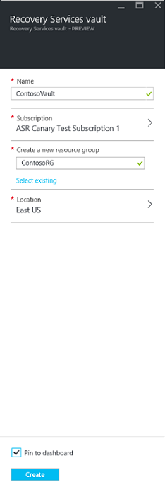  

新保管库将显示在“仪表板”>“所有资源”中，以及“恢复服务保管库”主边栏选项卡上。

## 入门
站点恢复提供“快速启动”体验，旨在帮助你尽快启动和运行项目。它将检查先决条件，并引导你完成部署站点恢复所要执行的步骤。

需选择要复制的计算机类型，以及要复制到的位置。设置基础结构，包括本地服务器、Azure 设置、复制策略和容量规划。基础结构准备就绪后，可以为 VM 和物理服务器启用复制。然后，可对特定计算机运行故障转移，或创建恢复计划以故障转移多个计算机。

选择部署站点恢复的方式，以开始体验“快速启动”。根据复制要求，“入门”流程会稍有不同。

## 步骤 1：选择保护目标
选择要复制的内容以及要复制到的位置。

1. 在“恢复服务保管库”边栏选项卡中选择保管库，然后单击“设置”。
2. 在“设置”>“快速启动”中，单击“Site Recovery”>“步骤 1: 准备基础结构”>“保护目标”。

    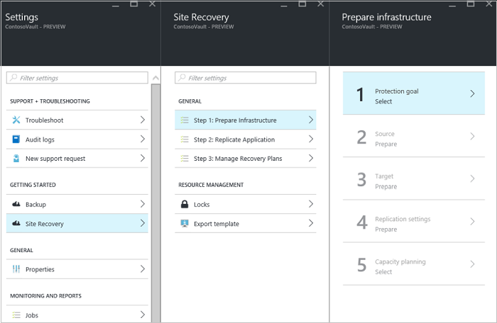  

3. 在“保护目标”中选择“到 Azure”，然后选择“是，使用 VMware vSphere 虚拟机监控程序”。然后，单击“确定”。

    

## 步骤 2：设置源环境
设置配置服务器并将它注册到恢复服务保管库中。如果你要复制 VMware VM，请指定用于自动发现的 VMware 帐户。

1. 单击“步骤 1: 准备基础结构”>“源”。如果没有配置服务器，请在“准备源”中单击“+配置服务器”添加一个。

    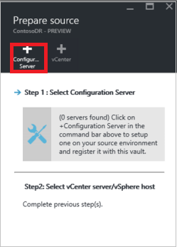  

2. 在“添加服务器”边栏选项卡中，检查“配置服务器”是否已出现在“服务器类型”中。
3. 设置配置服务器之前，请检查[先决条件](#configuration-server-prerequisites)。具体而言，请检查计算机是否可以访问所需的 URL。
4. 下载站点恢复统一安装程序安装文件。
5. 下载保管库注册密钥。运行统一安装程序时需要用到此密钥。生成的密钥有效期为 5 天。

   
6. 在用作配置服务器的计算机上，运行统一安装程序以安装配置服务器、进程服务器和主目标服务器。

### 运行站点恢复统一安装程序
1. 运行统一安装程序安装文件。
2. 在“开始之前”中选择“安装配置服务器和进程服务器”。

   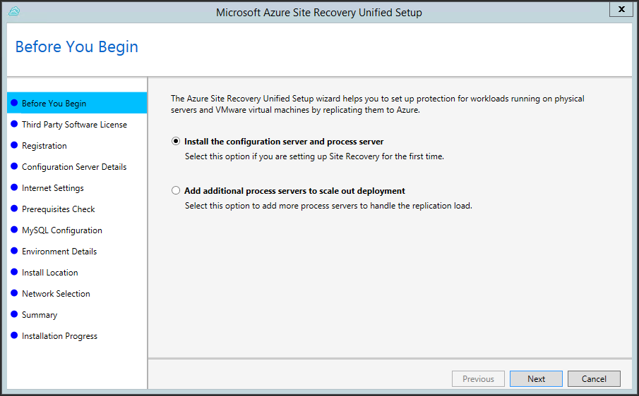  

3. 在“第三方软件许可证”中单击“我接受”，下载并安装 MySQL。

    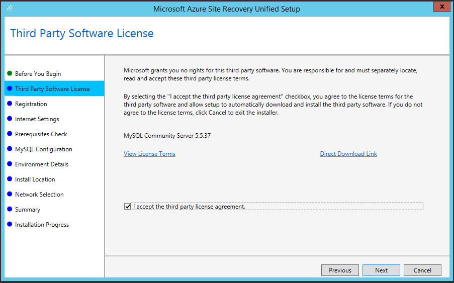  

4. 在“注册”中，通过浏览查找并选择从保管库下载的注册密钥。

    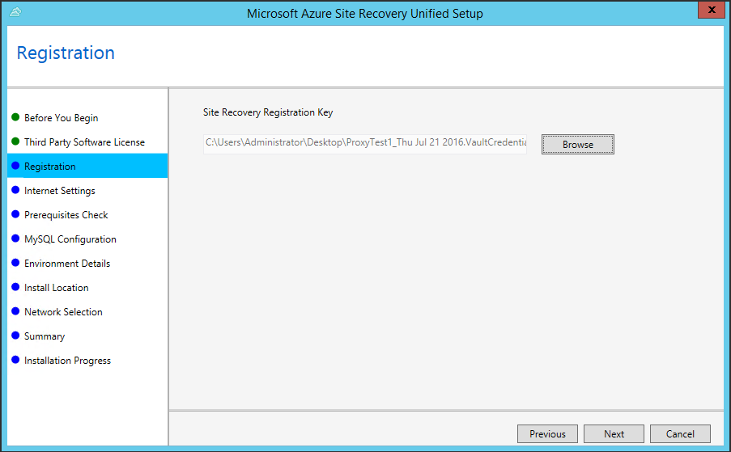  

5. 在“Internet 设置”中，指定配置服务器上运行的提供程序如何通过 Internet 连接到 Azure Site Recovery。

   * 如果希望使用当前已在计算机上设置的代理进行连接，请选择“使用现有代理设置进行连接”。
   * 如果希望提供程序直接进行连接，请选择“不使用代理直接连接”。
   * 如果现有代理要求身份验证，或者你希望使用自定义代理进行提供程序连接，请选择“使用自定义代理设置进行连接”。

     * 如果使用自定义代理，则需指定地址、端口和凭据
     * 如果使用代理，应事先允许[先决条件](#configuration-server-prerequisites)中所述的 URL。

     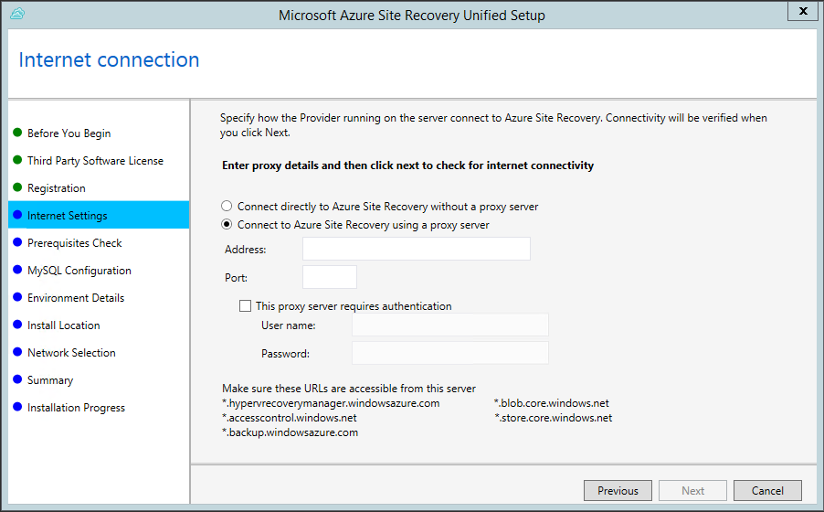  

6. 在“先决条件检查”设置中运行检查，确保安装可以运行。如果看到有关**全局时间同步检查**的警告，请检查系统时钟的时间（“日期和时间”设置）是否与时区相同。

    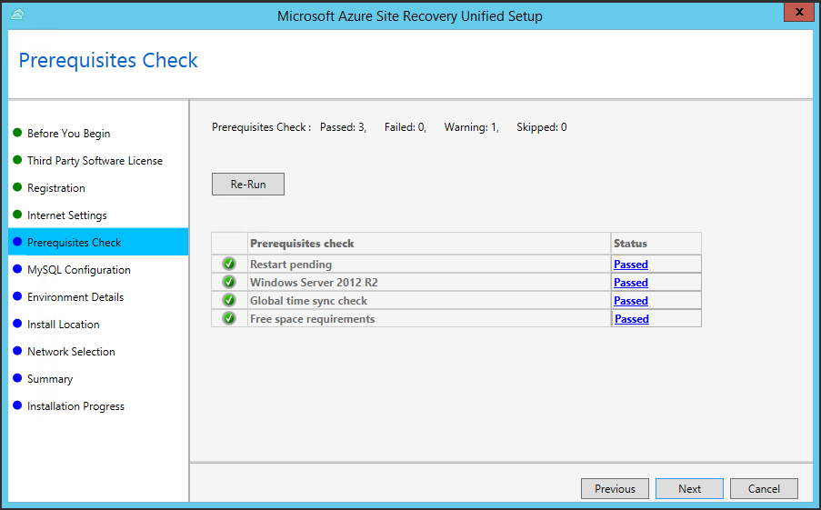  

7. 在“MySQL 配置”中，创建用于登录到要安装的 MySQL 服务器实例的凭据。

    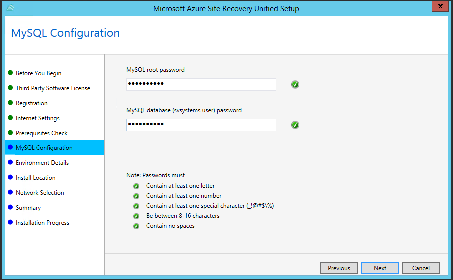  

8. 在“环境详细信息”中，选择是否要复制 VMware VM。如果要复制，则安装程序会检查 PowerCLI 6.0 是否已安装。

    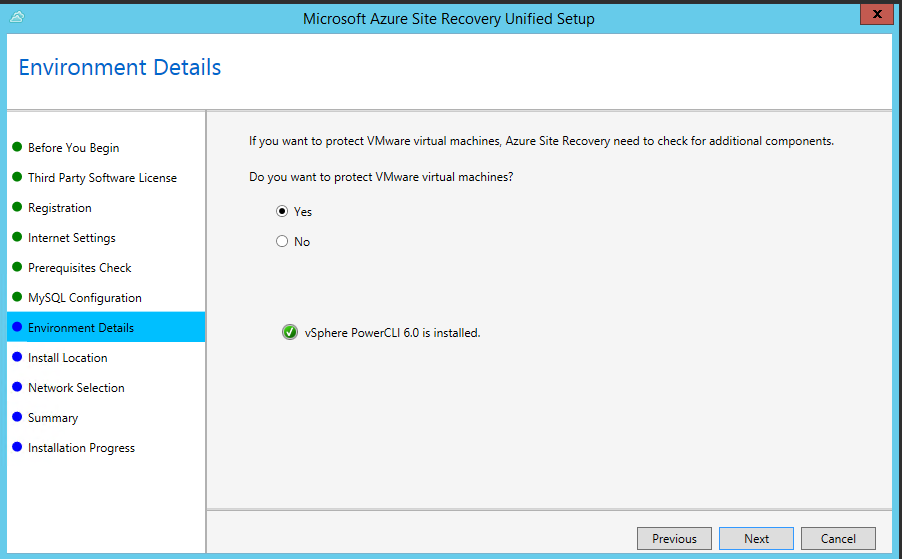  

9. 在“安装位置”中，选择要安装二进制文件和存储缓存的位置。可以选择至少有 5 GB 可用存储空间的驱动器，但我们建议选择至少有 600 GB 可用空间的缓存驱动器。

    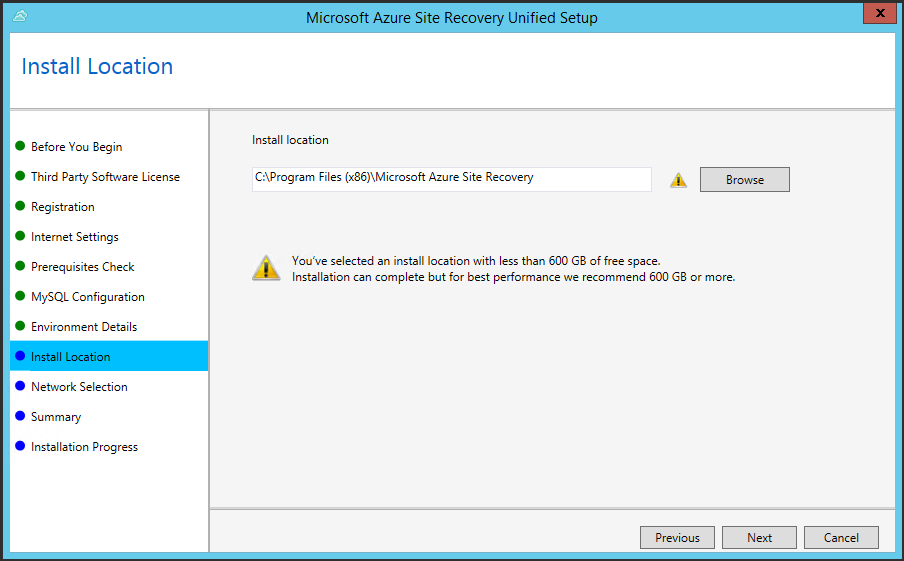  

10. 在“网络选择”中，指定侦听器（网络适配器和 SSL 端口），以便配置服务器在其上发送和接收复制数据。你可以修改默认端口 (9443)。除了此端口，负责协调复制操作的 Web 服务器还会使用端口 443。不应使用 443 接收复制流量。

    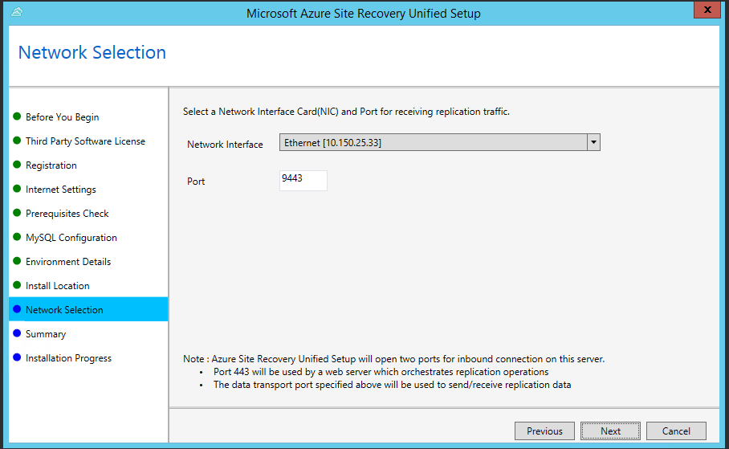  

1. 在“摘要”中复查信息，然后单击“安装”。安装完成后，将生成通行短语。启用复制时需要用到它，因此请复制并将它保存在安全的位置。

   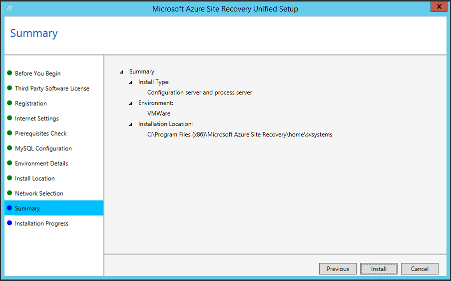  

2. 注册完成后，服务器将显示在保管库的“设置”>“服务器”边栏选项卡中。

#### 从命令行运行安装程序
可以从命令行设置配置服务器：

    UnifiedSetup.exe [/ServerMode <CS/PS>] [/InstallDrive <DriveLetter>] [/MySQLCredsFilePath <MySQL credentials file path>] [/VaultCredsFilePath <Vault credentials file path>] [/EnvType <VMWare/NonVMWare>] [/PSIP <IP address to be used for data transfer] [/CSIP <IP address of CS to be registered with>] [/PassphraseFilePath <Passphrase file path>]

参数：

* /ServerMode：必需。指定是要同时安装配置服务器和进程服务器，还是只安装进程服务器。输入值：CS、PS。
* InstallLocation：必需。用于安装组件的文件夹。
* /MySQLCredsFilePath。必需。MySQL 服务器凭据存储到的文件路径。该文件的格式应是：
  * [MySQLCredentials]
  * MySQLRootPassword = "<密码>"
  * MySQLUserPassword = "<密码>"
* /VaultCredsFilePath。必需。保管库凭据文件的位置
* /EnvType。必需。安装类型。值：VMware、NonVMware
* /PSIP 和 /CSIP。必需。进程服务器和配置服务器的 IP 地址。
* /PassphraseFilePath。必需。通行短语文件的位置。
* /BypassProxy。可选。指定配置服务器不使用代理连接到 Azure。
* /ProxySettingsFilePath。可选。代理设置（默认代理需要身份验证，或自定义代理）。该文件的格式应是：
  * [ProxySettings]
  * ProxyAuthentication = "Yes/No"
  * Proxy IP = "IP Address>"
  * ProxyPort = "<端口>"
  * ProxyUserName="<用户名>"
  * ProxyPassword="<密码>"
* DataTransferSecurePort。可选。用于复制数据的端口号。
* SkipSpaceCheck。可选。跳过缓存的空间检查。
* AcceptThirdpartyEULA。必需。该标志表示接受第三方 EULA。
* ShowThirdpartyEULA。必需。显示第三方 EULA。如果作为输入提供，将忽略所有其他参数。

### 添加用于自动发现的 VMware 帐户
 当你为部署做好准备时，应已[创建一个 VMware 帐户](#prepare-an-account-for-automatic-discovery)，Site Recovery 可以使用它来执行自动发现。按如下所述添加此帐户：

1. 打开 **CSPSConfigtool.exe**。该帐户作为快捷方式位于桌面上，并位于 [安装位置]\\home\\svsystems\\bin 文件夹中。
2. 单击“管理帐户”>“添加帐户”。

      

3. 在“帐户详细信息”中，添加用于自动发现的帐户。请注意，帐户名称出现在门户中可能需要 15 分钟或更长时间。若要立即更新，请单击“配置服务器”> 服务器名称 >“刷新服务器”。

    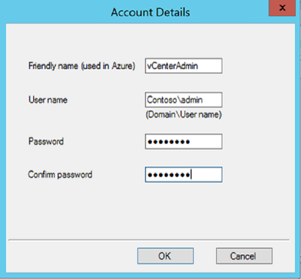

### 连接到 vSphere 主机和 vCenter 服务器
如果要复制 VMware VM，请连接到 vSphere 主机和 vCenter 服务器。

1. 验证配置服务器是否能够通过网络访问 vSphere 主机和 vCenter 服务器。
2. 单击“准备基础结构”>“源”。在“准备源”中选择配置服务器，然后单击“+vCenter”以添加 vSphere 主机或 vCenter 服务器。
3. 在“添加 vCenter”中，指定 vSphere 主机或 vCenter 服务器的友好名称，并指定服务器的 IP 地址或 FQDN。除非已将 VMware 服务器配置为在不同的端口上侦听请求，否则请保留 443 作为端口号。然后，选择用于连接到 VMware 服务器的帐户。单击**“确定”**。

    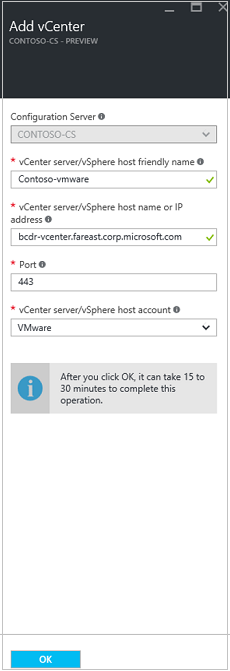  

	>[AZURE.NOTE] 如果在添加 vCenter 服务器或 vSphere 主机时使用的帐户没有对 vCenter 或主机服务器的管理员权限，请确保为帐户启用了以下权限：数据中心、数据存储、文件夹、主机、网络、资源、虚拟机、vSphere 分布式交换机。此外，vCenter 服务器需要存储视图权限。

站点恢复将使用你指定的设置连接到 VMware 服务器并发现 VM。

## 步骤 3：设置目标环境
确认是否设置了用于复制的存储帐户，以及 Azure VM 在故障转移后要连接到的 Azure 网络。

1. 单击“准备基础结构”>“目标”，然后选择要使用的 Azure 订阅。
2. 指定要在故障转移后用于 VM 的部署模型。
3. Site Recovery 将检查是否有一个或多个兼容的 Azure 存储帐户和网络。

   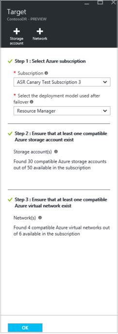  

4. 如果尚未创建存储帐户并想使用 Resource Manager 来创建一个，请单击“+存储帐户”以内联方式执行该操作。在“创建存储帐户”边栏选项卡中，指定帐户名、类型、订阅和位置。该帐户应位于与恢复服务保管库相同的区域。

   

   请注意：

	- If you want to create a storage account using the classic model, do that in the Azure portal. [Learn more](/documentation/articles/storage-create-storage-account-classic-portal/)
	- If you’re using a premium storage account for replicated data, you need to set up an additional standard storage account to store replication logs that capture ongoing changes to on-premises data. 

   > [AZURE.NOTE]目前不支持为印度中部和印度南部的高级存储帐户提供保护。
4.	选择 Azure 网络。如果尚未创建网络并想要使用 Resource Manager 创建网络，请单击“+网络”以内联方式执行该操作。在“创建虚拟网络”边栏选项卡上，指定网络名称、地址范围、子网详细信息、订阅和位置。该网络应位于与恢复服务保管库相同的位置。

     

	If you want to create a network using the classic model, do that in the Azure portal. [Learn more](/documentation/articles/virtual-networks-create-vnet-classic-pportal/).

## 步骤 4：设置复制设置
1. 若要创建新的复制策略，请单击“准备基础结构”>“复制设置”>“+创建和关联”。
2. 在“创建和关联策略”中指定策略名称。
3. 在“RPO 阈值”中：指定 RPO 限制。当连续复制超出此限制时，将生成警报。
4. 在“恢复点保留期”中，针对每个恢复点指定保留期的时长（以小时为单位）。受保护的计算机可以恢复到某个时段内的任意时间点。复制到高级存储的计算机最长支持 24 小时的保留期。
5. 在“应用一致性快照频率”中，指定创建包含应用程序一致性快照的恢复点的频率（以分钟为单位）。
6. 创建复制策略时，默认情况下将自动为故障回复创建一个匹配策略。例如，如果复制策略是 **rep-policy**，则故障回复策略将是 **rep-policy-failback**。在启动故障回复之前，请不会使用此策略。
7. 单击“确定”以创建该策略。

    
8. 当你创建新策略时，该策略将自动与配置服务器关联。单击**“确定”**。

    

## 步骤 5：容量规划
设置基本的基础结构后，可以考虑容量计划并确定是否需要额外的资源。

站点恢复提供 Capacity Planner 帮助你为源环境、站点恢复组件、网络和存储分配适当的资源。可以在快速模式下运行 Planner，以便根据 VM、磁盘和存储的平均数量进行估计；或者在详细模式下运行 Planner，以输入工作负荷级别的数据。开始之前，需要：

* 收集有关复制环境的信息，包括 VM 数、每个 VM 的磁盘数和每个磁盘的存储空间。
* 估计复制数据的每日更改（变动）率。可以使用 [vSphere 容量规划工具](https://labs.vmware.com/flings/vsphere-replication-capacity-planning-appliance)来帮助执行此操作。

1.	单击“下载”以下载该工具，然后开始运行。[阅读](/documentation/aticles/site-recovery-capacity-planner)该工具随附的文章。
2.	完成后，请在“是否已完成容量规划?”中选择“是”。

   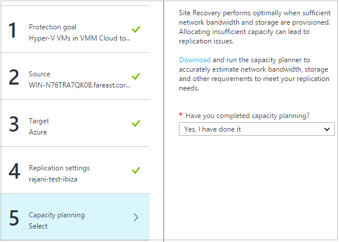  

下表可帮助完成容量规划。

| **组件** | **详细信息** |
| --- | --- | --- |
| **复制** |**每日最大更改率** - 一台受保护的计算机只能使用一个进程服务器，一个进程服务器可处理的每日更改率最高可达 2 TB。因此，2 TB 是受保护计算机支持的每日数据更改率上限。   **最大吞吐量** - 在 Azure 中，一个复制的计算机可能属于一个存储帐户。标准存储帐户每秒最多可以处理 20,000 个请求，因此建议你将源计算机中的 IOPS 数目保持在 20,000。例如，如果你的源计算机有 5 个磁盘，每个磁盘在源上生成 120 IOPS（8K 大小），则处于 Azure 的单磁盘 IOPS 限制 (500) 内。所需的存储帐户数 = 源 IOPS 总计/20000。 |
| **配置服务器** |配置服务器应该能够处理跨所有工作负荷（运行在受保护的计算机上）的每日更改率容量，并有足够的带宽，可以持续地将数据复制到 Azure 存储空间。   根据最佳实践，我们建议你将配置服务器置于与所要保护的计算机相同的网络和 LAN 网段上。可以将它置于另一网络中，但所要保护的计算机应可通过 L3 网络来查看它。   下表汇总了配置服务器的建议大小。 |
| **进程服务器** |默认情况下，第一个进程服务器安装在配置服务器上。你可以部署更多的进程服务器以扩展环境。请注意：  进程服务器接收受保护计算机提供的复制数据，并在发送到 Azure 之前对其通过缓存、压缩和加密进行优化。进程服务器计算机应有足够的资源来执行这些任务。   处理服务器使用基于磁盘的缓存。建议在出现网络瓶颈或中断时，使用单独的大小至少为 600 GB 的缓存磁盘来处理存储的数据更改。 |

### 配置服务器的建议大小
| **CPU** | **内存** | **缓存磁盘大小** | **数据更改率** | **受保护的计算机** |
| --- | --- | --- | --- | --- |
| 8 个 vCPU（2 个套接字 * 4 个核心 @ 2.5GHz） |16 GB |300 GB |500 GB 或更少 |复制少于 100 台计算机。 |
| 12 个 vCPU（2 个插槽 * 6 个核心 @ 2.5GHz） |18 GB |600 GB |500 GB 到 1 TB |复制 100-150 台计算机。 |
| 16 个 vCPU（2 个插槽 * 8 个核心 @ 2.5GHz） |32 GB |1 TB |1 TB 到 2 TB |复制 150-200 台计算机。 |
| 部署另一个进程服务器 | | |> 2 TB |如果你要复制超过 200 台计算机，或者每日数据更改率超过 2 TB，则需部署额外的进程服务器。 |

其中：

* 每台源计算机均配置 3 个磁盘，每个磁盘 100 GB。
* 我们使用了包含 8 个 SAS 驱动器 (10 K RPM) 的基准测试存储空间，使用 RAID 10 进行缓存磁盘度量。

###进程服务器的建议大小
如果需要保护的计算机超过 200 台，或者每日更改率大于 2 TB，可添加更多进程服务器来处理复制负载。若要横向扩展，你可以执行以下操作：

* 增加配置服务器的数目。例如，可以通过两台配置服务器来保护最多 400 台计算机。
* 添加更多进程服务器，使用这些服务器来处理流量，而不是添加配置服务器。

下表介绍了一种方案，在该方案中：

* 你不打算使用配置服务器作为进程服务器。
* 你已设置额外的进程服务器。
* 现已将受保护的虚拟机配置为使用这个额外的进程服务器。
* 每台受保护的源计算机配置为了三个磁盘，每个磁盘 100 GB。

| **配置服务器** | **额外的进程服务器** | **缓存磁盘大小** | **数据更改率** | **受保护的计算机** |
| --- | --- | --- | --- | --- |
| 8 个 vCPU（2 个套接字 * 4 个核心 @ 2.5GHz），16 GB 内存 |4 个 vCPU（2 个套接字 * 2 个核心 @ 2.5GHz），8 GB 内存 |300 GB |250 GB 或更少 |复制 85 台或更少的计算机。 |
| 8 个 vCPU（2 个插槽 * 4 个核心 @ 2.5GHz），16 GB 内存 |8 个 vCPU（2 个套接字 * 4 个核心 @ 2.5GHz），12 GB 内存 |600 GB |250 GB 到 1 TB |复制 85-150 台计算机。 |
| 12 个 vCPU（2 个插槽 * 6 个核心 @ 2.5GHz），18 GB 内存 |12 个 vCPU（2 个套接字 * 6 个核心 @ 2.5GHz），24 GB 内存 |1 TB |1 TB 到 2 TB |复制 150-225 台计算机。 |

使用哪种方式来扩展服务器将取决于你是偏好纵向扩展模型还是横向扩展模型。向上扩展时，需要部署一些高端配置服务器和进程服务器，而向外扩展时，需要部署较多服务器，需要的资源较少。例如，如果需要对 220 台计算机进行保护，可执行以下操作之一：

* 设置具有 12vCPU、18 GB 内存的配置服务器，以及具有 12vCPU、24 GB 内存的进程服务器，并将受保护计算机配置为仅使用额外的进程服务器。
* 也可以配置两个配置服务器（2 x 8vCPU，16 GB RAM）和两个额外的进程服务器（1 x 8vCPU 和 4vCPU x 1，可处理 135 + 85 (220) 台计算机），并将受保护计算机配置为仅使用额外的进程服务器。

[按照这些说明](#deploy-additional-process-servers)设置额外的进程服务器。

### 网络带宽注意事项
可以使用 Capacity Planner 工具来计算复制（初始复制，然后是增量复制）所需的带宽。若要控制复制所用的带宽量，可以使用几个选项：

* **限制带宽**：复制到 Azure 的 VMware 流量会经过特定的进程服务器。可以在运行进程服务器的计算机上限制带宽。
* **影响带宽**：可以使用几个注册表项来控制用于复制的带宽：
  * **HKEY\_LOCAL\_MACHINE\\SOFTWARE\\Microsoft\\Microsoft Azure Backup\\UploadThreadsPerVM** 注册表值指定用于磁盘数据传输（初始或增量复制）的线程数。使用较大的值会增加复制所用的网络带宽。
  * **HKEY\_LOCAL\_MACHINE\\SOFTWARE\\Microsoft\\Microsoft Azure Backup\\DownloadThreadsPerVM** 指定故障回复期间用于数据传输的线程数。

#### 限制带宽
1. 在充当进程服务器的计算机上打开 Microsoft Azure 备份 MMC 管理单元。默认情况下，Microsoft Azure 备份的快捷方式位于桌面上或 C:\\Program Files\\Microsoft Azure Recovery Services Agent\\bin\\wabadmin 中。
2. 在管理单元中，单击“更改属性”。

      

3. 在“限制”选项卡上，选择“为备份操作启用 Internet 带宽使用限制”，然后设置工作时间和非工作时间的限制。有效范围为 512 Kbps 到 102 Mbps。

    

也可以使用 [Set-OBMachineSetting](https://technet.microsoft.com/zh-cn/library/hh770409.aspx) cmdlet 来设置限制。下面是一个示例：

    $mon = [System.DayOfWeek]::Monday
    $tue = [System.DayOfWeek]::Tuesday
    Set-OBMachineSetting -WorkDay $mon, $tue -StartWorkHour "9:00:00" -EndWorkHour "18:00:00" -WorkHourBandwidth  (512*1024) -NonWorkHourBandwidth (2048*1024)

**Set-OBMachineSetting -NoThrottle** 表示不需要限制。

#### 影响网络带宽
1. 在注册表中导航到 **HKEY\_LOCAL\_MACHINE\\SOFTWARE\\Microsoft\\Microsofte Azure Backup\\Replication**。
   * 若要影响复制磁盘上的带宽流量，请修改 **UploadThreadsPerVM** 值，或者创建该项（如果不存在）。
   * 若要影响用于从 Azure 故障回复流量的带宽，请修改 **DownloadThreadsPerVM** 值。
2. 默认值为 4。在“过度预配型”网络中，这些注册表项需要更改，不能使用默认值。最大值为 32。监视流量以优化值。

## 步骤 6：复制应用程序
请确保要复制的计算机已准备好安装移动服务，然后启用复制。

###安装移动服务
  > [AZURE.TIP]
  Azure Site Recovery 现在支持使用 System Center Configuration Manager 等软件部署工具安装移动服务。详细了解如何[自动化移动服务部署](/documentation/articles/site-recovery-install-mobility-service-using-sccm/)。

为虚拟机和物理服务器启用保护时，第一步是安装移动服务。可以通过多种方式实现此目的：

* **进程服务器推送**：在计算机上启用复制时，将从进程服务器推送并安装移动服务组件。请注意，如果计算机已在运行最新版本的组件，则不会执行推送安装。
* **企业推送**：使用企业推送过程（例如 WSUS、System Center Configuration Manager 或 [Azure 自动化和 Desired State configuration](/documentation/articles/site-recovery-automate-mobility-service-install/) 自动安装该组件。执行此操作之前，请设置配置服务器。
* **手动安装**：在要复制的每台计算机上手动安装该组件。执行此操作之前，请设置配置服务器。

#### 准备在 Windows 计算机上自动推送
下面介绍了如何准备 Windows 计算机，以便进程服务器能够自动安装移动服务。

1. 创建可供进程服务器用来访问计算机的帐户。该帐户应具有管理员权限（本地或域），并且仅用于推送安装。

	>[AZURE.NOTE] 如果你使用的不是域帐户，则需在本地计算机上禁用远程用户访问控制。为此，请在注册表中的 HKEY\_LOCAL\_MACHINE\\SOFTWARE\\Microsoft\\Windows\\CurrentVersion\\Policies\\System 下添加值为 1 的 DWORD 项 LocalAccountTokenFilterPolicy。若要从 CLI 添加该注册表项，请键入 **`REG ADD HKEY_LOCAL_MACHINE\SOFTWARE\Microsoft\Windows\CurrentVersion\Policies\System /v LocalAccountTokenFilterPolicy /t REG_DWORD /d 1`**。

2.  在要保护的计算机的 Windows 防火墙中，选择“允许应用或功能通过防火墙”。启用“文件和打印机共享”和“Windows Management Instrumentation”。对于属于某个域的计算机，你可以使用 GPO 配置防火墙设置。

   
3. 添加已创建的帐户：

   * 打开 **cspsconfigtool**。该工具已作为快捷方式在桌面上提供，也可以在 [安装位置]\\home\\svsystems\\bin 文件夹中找到。
   * 在“管理帐户”选项卡中，单击“添加帐户”。
   * 添加已创建的帐户。添加帐户后，在为计算机启用复制时，需要提供这些凭据。

#### 准备在 Linux 服务器上自动推送
1. 确保要保护的 Linux 计算机受支持，如[受保护的计算机先决条件](#protected-machine-prerequisites)中所述。确保 Linux 计算机与进程服务器之间已建立网络连接。
2. 创建可供进程服务器用来访问计算机的帐户。该帐户应是源 Linux 服务器上的 root 用户，仅用于推送安装。

   * 打开 **cspsconfigtool**。该工具已作为快捷方式在桌面上提供，也可以在 [安装位置]\\home\\svsystems\\bin 文件夹中找到。
   * 在“管理帐户”选项卡中，单击“添加帐户”。
   * 添加已创建的帐户。添加帐户后，在为计算机启用复制时，需要提供这些凭据。
3. 确保源 Linux 服务器上的 /etc/hosts 文件包含用于将本地主机名映射到所有网络适配器关联的 IP 地址的条目。
4. 在要复制的计算机上安装最新的 openssh、openssh-server 和 openssl 包。
5. 确保 SSH 已启用且正在端口 22 上运行。
6. 在 sshd\_config 文件中启用 SFTP 子系统和密码身份验证，如下所示：

   * 以 root 身份登录。
   * 在文件 /etc/ssh/sshd\_config 中，找到以 **PasswordAuthentication** 开头的行。
   * 取消注释该行，并将值从“no”更改为“yes”。
   * 找到以“Subsystem”开头的行，并取消注释该行。

       

###手动安装移动服务
配置服务器上的 **C:\\Program Files (x86)\\Microsoft Azure Site Recovery\\home\\svsystems\\pushinstallsvc\\repository** 中提供了安装程序。

| 源操作系统 | 移动服务安装文件 |
| --- | --- |
| Windows Server（仅限 64 位） |Microsoft-ASR\_UA\_9.*.0.0_Windows_* release.exe |
| CentOS 6.4、6.5、6.6（仅限 64 位） |Microsoft-ASR\_UA\_9.*.0.0\_RHEL6-64\_*release.tar.gz |
| SUSE Linux Enterprise Server 11 SP3（仅限 64 位） |Microsoft-ASR\_UA\_9.*.0.0\_SLES11-SP3-64\_*release.tar.gz |
| Oracle Enterprise Linux 6.4、6.5（仅限 64 位） |Microsoft-ASR\_UA\_9.*.0.0\_OL6-64\_*release.tar.gz |

#### 在 Windows Server 上安装移动服务
1. 下载并运行相关安装程序。
2. 在“开始之前”中选择“移动服务”。

      

3. 在“配置服务器详细信息”中，指定配置服务器的 IP 地址，以及运行统一安装程序时生成的通行短语。可以通过在配置服务器上运行以下命令来检索通行短语：**<SiteRecoveryInstallationFolder>\\home\\sysystems\\bin\\genpassphrase.exe –v**。

      

4. 保留“安装位置”中的默认设置，然后单击“下一步”开始安装。
5. 在“安装进度”中监视安装过程，然后根据提示重新启动计算机。安装该服务后，可能需要大约 15 分钟，状态才会在门户中更新。

#### 使用命令提示符在 Windows Server 上安装移动服务
1. 将安装程序复制到要保护的服务器上的某个本地文件夹（如 C:\\Temp）。可以在配置服务器上的 **[安装位置]\\home\\svsystems\\pushinstallsvc\\repository** 中找到安装程序。适用于 Windows 操作系统的包的名称类似于 Microsoft-ASR\_UA\_9.3.0.0_Windows\_GA_17thAug2016\_release.exe
2. 请将此文件重命名为 MobilitySvcInstaller.exe
3. 运行以下命令解压缩 MSI 安装程序：

    ``C:\> cd C:\Tempww`` ``C:\Temp> MobilitySvcInstaller.exe /q /xC:\Temp\Extracted`` ``C:\Temp> cd Extracted`` ``C:\Temp\Extracted> UnifiedAgent.exe /Role "Agent" /CSEndpoint "IP Address of Configuration Server" /PassphraseFilePath <Full path to the passphrase file>``

##### 完整命令行语法
    UnifiedAgent.exe [/Role <Agent/MasterTarget>] [/InstallLocation <Installation Directory>] [/CSIP <IP address of CS to be registered with>] [/PassphraseFilePath <Passphrase file path>] [/LogFilePath <Log File Path>] 

**Parameters**

* **/Role：**必需。指定是否应安装移动服务。输入值 Agent|MasterTarget
* **/InstallLocation：**必需。指定服务安装位置。
* **/PassphraseFilePath：**必需。配置服务器通行短语。
* **/LogFilePath：**必需。应在其中创建安装日志文件的位置。

#### 手动卸载移动服务
可以使用控制面板中的“添加/删除程序”或使用以下命令行指令卸载移动服务：MsiExec.exe /qn /x {275197FC-14FD-4560-A5EB-38217F80CBD1}

#### 在 Linux 服务器上安装移动服务
1. 根据上表，将相应的 tar 存档复制到要复制的 Linux 计算机。
2. 打开 shell 程序，然后运行 `tar -xvzf Microsoft-ASR_UA_8.5.0.0*` 将压缩的 tar 存档解压缩到本地路径
3. 在 tar 存档内容解压缩到的本地目录中创建 passphrase.txt 文件。为此，请在配置服务器上从 C:\\ProgramData\\Microsoft Azure Site Recovery\\private\\connection.passphrase 复制通行短语，然后通过在 shell 中运行 *`echo <passphrase> >passphrase.txt`*，将其保存在 passphrase.txt 中。
4. 运行 *`sudo ./install -t both -a host -R Agent -d /usr/local/ASR -i <IP address> -p <port> -s y -c https -P passphrase.txt`* 以安装移动服务。
5. 指定配置服务器的内部 IP 地址，确保选择端口 443。安装该服务后，可能需要大约 15 分钟，状态才会在门户中更新。

**也可以从命令行安装**：

在配置服务器上从 C:\\Program Files (x86)\\InMage Systems\\private\\connection 复制通行短语，再在配置服务器上将其另存为“passphrase.txt”。然后运行这些命令。在本示例中，配置服务器 IP 地址为 104.40.75.37，HTTPS 端口应该为 443：

在生产服务器上安装：

    ./install -t both -a host -R Agent -d /usr/local/ASR -i 104.40.75.37 -p 443 -s y -c https -P passphrase.txt

在主目标服务器上安装：

    ./install -t both -a host -R MasterTarget -d /usr/local/ASR -i 104.40.75.37 -p 443 -s y -c https -P passphrase.txt

### 启用复制
#### 开始之前
如果要复制 VMware 虚拟机，请注意：

* 系统会每隔 15 分钟发现 VMware VM 一次。在发现之后，可能需要 15 分钟或更长时间，虚拟机才会出现在门户中。同样，当你添加新的 vCenter 服务器或 vSphere 主机时，发现可能要花费 15 分钟或更长时间。
* 虚拟机上的环境更改（例如 VMware 工具安装）可能需要 15 分钟或更长时间才能在门户中更新。
* 可以在“配置服务器”边栏选项卡上 vCenter 服务器/vSphere 主机的“上次联系时间”字段中检查上次发现 VMware VM 的时间。
* 若要添加用于复制的计算机而不想要等待执行计划的发现，请突出显示配置服务器（不要单击它），然后单击“刷新”按钮。
* 启用复制时，如果计算机已做好准备，进程服务器将自动在其上安装移动服务。

####从复制中排除磁盘
当你启用复制时，默认情况下会复制计算机上的所有磁盘。你可以从复制中排除磁盘。例如，你可能不想要复制包含临时数据，或者每当重新启动计算机或应用程序时刷新的数据（例如 pagefile.sys 或 SQL Server tempdb）的磁盘。请注意：

- 只能排除已安装移动服务的磁盘。需要[手动安装移动服务](#install-the-mobility-service-manually)，因为启用复制后只能使用推送机制安装移动服务。
- 只能从复制中排除基本磁盘。不能排除 OS 磁盘或动态磁盘。
- 启用复制后，无法添加或删除要复制的磁盘。如果想要添加或排除磁盘，需要禁用计算机保护，然后重新启用保护。
- 如果某个应用程序需要有排除的磁盘才能正常运行，则故障转移到 Azure 之后，需要在 Azure 中手动创建该磁盘，以便复制的应用程序可以运行。或者，可以将 Azure 自动化集成到恢复计划中，以便在故障转移计算机期间创建磁盘。
- Windows VM：在 Azure 中手动创建的磁盘不会进行故障回复。例如，如果直接在 Azure VM 中故障转移三个磁盘并创建两个，则只会将进行过故障转移的三个磁盘故障回复。不能包括在故障回复过程中或从本地到 Azure 的反向保护过程中手动创建的磁盘。
- Linux VM：在 Azure 中手动创建的磁盘将故障回复。例如，如果要故障转移三个磁盘，并直接在 Azure 中创建两个磁盘，则会故障回复所有五个磁盘。无法从故障回复中排除手动创建的磁盘。

**现在，请按如下所述启用复制**：

1. 单击“步骤 2: 复制应用程序”>“源”。首次启用复制后，请在保管库中单击“+复制”，对其他计算机启用复制。
2. 在“源”边栏选项卡 >“源”中，选择配置服务器。
3. 在“计算机类型”中，选择“虚拟机”或“物理机”。
4. 在“vCenter/vSphere 虚拟机监控程序”中，选择管理 vSphere 主机的 vCenter 服务器，或选择该主机。如果你要复制物理机，则此设置无关紧要。
5. 选择进程服务器。如果你未创建任何额外的进程服务器，则这是配置服务器的名称。然后，单击“确定”。

    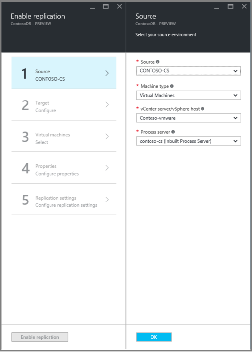  

6. 在“目标”中选择订阅和资源组，以便在其中创建故障转移的虚拟机。为故障转移的虚拟机选择要在 Azure 中使用的部署模型（经典或资源管理）。

7. 选择要用于复制数据的 Azure 存储帐户。请注意：

   * 可以选择高级或标准存储帐户。如果选择高级帐户，则需要指定其他标准存储帐户来持续写入复制日志。这些帐户必须位于与恢复服务保管库相同的区域中。
   * 如果要使用与现有存储帐户不同的存储帐户，可以[创建一个](#set-up-an-azure-storage-account)。若要使用 Resource Manager 模型创建存储帐户，请单击“新建”。如果想使用经典模型创建存储帐户，请[在 Azure 门户预览中](/documentation/articles/storage-create-storage-account-classic-portal/)执行该操作。
8. 选择 Azure VM 在故障转移后启动时所要连接的 Azure 网络和子网。该网络必须位于与恢复服务保管库相同的区域中。选择“立即为选定的计算机配置”，将网络设置应用到选择保护的所有计算机。选择“稍后配置”以选择每个计算机的 Azure 网络。如果没有网络，需要[创建一个](#set-up-an-azure-network)。若要使用 Resource Manager 创建网络，请单击“新建”。若要使用经典模型创建网络，请[在 Azure 门户预览中](/documentation/articles/virtual-networks-create-vnet-classic-pportal/)执行该操作。选择适用的子网。然后，单击“确定”。

      

9. 在“虚拟机”>“选择虚拟机”中，单击并选择要复制的每个计算机。只能选择可以启用复制的计算机。然后，单击“确定”。

    
10. 在“属性”>“配置属性”中，选择进程服务器在计算机上自动安装移动服务时使用的帐户。默认情况下会复制所有磁盘。单击“所有磁盘”并清除不想要复制的所有磁盘。然后，单击“确定”。可以稍后再设置其他属性。

      

11. 在“复制设置”>“配置复制设置”中，检查是否选择了正确的复制策略。可以在“设置”>“复制策略”> 策略名称 >“编辑设置”中修改复制策略设置。应用到策略的更改将应用于复制计算机和新计算机。
12. 如果要将计算机集合到复制组，请启用“多 VM 一致性”并指定组的名称。然后，单击“确定”。请注意：

    * 复制组中的计算机将一起复制，并在故障转移时获得崩溃一致且应用一致的共享恢复点。
    * 我们建议你将 VM 和物理服务器集合在一起，使其镜像你的工作负荷。启用多 VM 一致性可能会影响工作负荷性能，因此，仅当计算机运行相同的工作负荷并且你需要一致性时，才应使用该设置。

    
13. 单击“启用复制”。可以在“设置”>“作业”>“Site Recovery 作业”中，跟踪“启用保护”作业的进度。在“完成保护”作业运行之后，计算机就可以进行故障转移了。

> [AZURE.NOTE] 如果计算机已准备好进行推送安装，则启用保护后，将安装移动服务组件。在计算机上安装该组件后，某个保护作业将启动但会失败。发生这种失败后，需要手动重新启动每台计算机。重启后，保护作业重新启动，初始复制开始。

### 查看和管理 VM 属性
建议你验证源计算机的属性。请记住，Azure VM 名称应符合 [Azure 虚拟机要求](/documentation/articles/site-recovery-best-practices/#azure-virtual-machine-requirements)。

1. 单击“设置”>“复制的项”，然后选择计算机。“概要”边栏选项卡显示有关计算机设置和状态的信息。
2. 在“属性”中，可以查看 VM 的复制和故障转移信息。

      

3. 在“计算和网络”>“计算属性”中，可以指定 Azure VM 名称和目标大小。根据需要修改名称，使其符合 Azure 要求。你还可以查看和添加目标网络、子网的相关信息，以及要分配到 Azure VM 的 IP 地址。注意以下事项：

   * 可以设置目标 IP 地址。如果未提供地址，故障转移的计算机将使用 DHCP。如果设置了无法用于故障转移的地址，故障转移将不会正常工作。如果地址可用于测试故障转移网络，则同一个目标 IP 地址可用于测试故障转移。
   * 网络适配器数目根据你为目标虚拟机指定的大小确定，如下所示：

     * 如果源计算机上的网络适配器数小于或等于目标计算机大小允许的适配器数，则目标的适配器数将与源相同。
     * 如果源虚拟机的适配器数大于目标大小允许的数目，则使用目标大小允许的最大数目。
     * 例如，如果源计算机有两个网络适配器，而目标计算机大小支持四个，则目标计算机将有两个适配器。如果源计算机有两个适配器，但支持的目标大小只支持一个，则目标计算机只有一个适配器。
   * 如果虚拟机有多个网络适配器，它们将全部连接到同一个网络。
   * 如果虚拟机有多个网络适配器，列表中显示的第一个适配器将成为 Azure 虚拟机中的*默认*网络适配器。

       

4. 在“磁盘”中，可以看到 VM 上将要复制的操作系统和数据磁盘。

### 准备在故障转移后连接到 Azure VM
如果想要在故障转移后使用 RDP 连接到 Azure VM，请确保执行以下操作：

**故障转移之前在本地计算机上**：

* 对通过 Internet 进行的访问启用 RDP，确保已针对“公共”添加 TCP 和 UDP 规则，并确保在“Windows 防火墙”->“允许的应用和功能”中针对所有配置文件允许 RDP。
* 针对通过站点到站点连接进行的访问，在计算机上启用 RDP，并确保在“Windows 防火墙”->“允许的应用和功能”中针对“域”和“专用”网络允许 RDP。
* 在本地计算机上安装 [Azure VM 代理](http://go.microsoft.com/fwlink/?LinkID=394789&clcid=0x409)。
* 确保操作系统的 SAN 策略已设置为 OnlineAll。[了解详细信息](https://support.microsoft.com/zh-cn/kb/3031135)
* 在运行故障转移之前关闭 IPSec 服务。

**故障转移之后在 Azure VM 上**：

* 添加 RDP 协议（端口 3389）的公共终结点并指定用于登录的凭据。
* 确保没有任何域策略阻止你使用公共地址连接到虚拟机。
* 尝试连接。如果无法连接，请检查 VM 是否正在运行。有关更多故障排除提示，请阅读[此文](http://social.technet.microsoft.com/wiki/contents/articles/31666.troubleshooting-remote-desktop-connection-after-failover-using-asr.aspx)。

如果要在故障转移后使用安全外壳客户端 (ssh) 访问运行 Linux 的 Azure VM，请执行以下操作：

**故障转移之前在本地计算机上**：

* 确保 Azure VM 上的安全外壳服务已设置为在系统引导时自动启动。
* 确保防火墙规则允许 SSH 连接。

**故障转移之后在 Azure VM 上**：

* 已故障转移的 VM 及其连接到的 Azure 子网上的网络安全组规则需要允许与 SSH 端口建立传入连接。
* 应创建公共终结点，允许 SSH 端口（默认为 TCP 端口 22）上的传入连接。
* 如果通过 VPN 连接（Express Route 或站点到站点 VPN）访问 VM，可以使用客户端通过 SSH 直接连接到 VM。

**故障转移后，在 Azure Windows/Linux VM 上执行以下操作 **：

如果某个网络安全组与 VM 或 VM 子网关联，请确保该组中已创建一个允许 HTTP/HTTPS 的出站规则。此外，请确保 VM 故障转移到的网络的 DNS 配置正确。否则，故障转移可能会超时并出现错误 -“PreFailoverWorkflow 任务 WaitForScriptExecutionTask 超时”。[了解详细信息](/documentation/articles/site-recovery-monitoring-and-troubleshooting/#recovery)。

## 步骤 7：运行测试故障转移
为了对部署进行测试，你可以针对单个虚拟机或单个恢复计划（其中包含一个或多个虚拟机）运行测试故障转移。

1. 若要故障转移单个计算机，请在“设置”>“复制的项”中，单击“VM”>“+测试性故障转移”图标。

    
1. 若要故障转移某个恢复计划，请在“设置”>“恢复计划”中，右键单击该计划 >“测试性故障转移”。若要创建恢复计划，请[遵循这些说明](/documentation/articles/site-recovery-create-recovery-plans/)。
1. 在“测试性故障转移”中，选择 Azure VM 在故障转移之后要连接到的 Azure 网络。
1. 单击“确定”开始故障转移。若要跟踪进度，可以单击 VM 以打开其属性，或者在保管库名称 >“设置”>“作业”>“Site Recovery 作业”中选择“测试性故障转移”作业。
1. 故障转移完成后，还应该能够看到副本 Azure 计算机显示在 Azure 门户预览的“虚拟机”中。应确保 VM 的大小适当、已连接到相应的网络，并且正在运行。
1. 如果[已准备好故障转移后的连接](#prepare-to-connect-to-azure-vms-after-failover)，应该能够连接到 Azure VM。
1. 完成后，单击恢复计划中的“清理测试故障转移”。在“说明”中，记录并保存与测试故障转移相关联的任何观测结果。这会删除测试故障转移期间创建的虚拟机。

有关详细信息，请参阅[到 Azure 的测试故障转移](/documentation/articles/site-recovery-test-failover-to-azure/)文档。

## 故障转移
完成你的计算机的初始复制后，可以根据需要调用故障转移。Site Recovery 支持各种类型的故障转移 - 测试故障转移和非计划的故障转移。[详细了解](/documentation/articles/site-recovery-failover/)不同类型的故障转移，以及有关何时和如何执行其中每种故障转移的详细说明。

> [AZURE.NOTE]
如果目的是将虚拟机迁移到 Azure，我们强烈建议使用[非计划的故障转移操作](/documentation/articles/site-recovery-failover/#run-an-unplanned-failover)，将虚拟机迁移到 Azure。使用测试故障转移在 Azure 中验证已迁移的应用程序后，请使用[完成迁移](#Complete-migration-of-your-virtual-machines-to-Azure)中所述的步骤完成虚拟机迁移。不需要执行提交或删除。“完成迁移”可以完成迁移、去除对虚拟机的保护，并使虚拟机不再产生 Azure Site Recovery 费用。

### 运行非计划的故障转移
本过程描述如何对恢复计划运行“非计划的故障转移”。或者，也可以在“虚拟机”选项卡上对单个虚拟机运行故障转移。在开始之前，请确保要故障转移的所有虚拟机已完成初始复制。

1. 选择“恢复计划”>“recoveryplan\_name”。
2. 在“恢复计划”边栏选项卡中，单击“计划的故障转移”。
3. 在“非计划的故障转移”页上，选择源和目标位置。
4. 选择“关闭虚拟机并同步最新数据”，指定 Azure Site Recovery 应尝试关闭受保护的虚拟机并同步数据，以便对最新版的数据进行故障转移。
5. 故障转移后，虚拟机处于待提交状态。单击“提交”以提交故障转移。

[了解详细信息](/documentation/articles/site-recovery-failover/#run-an-unplanned-failover)

## 完成虚拟机到 Azure 的迁移
> [AZURE.NOTE]
以下步骤仅适用于将虚拟机迁移到 Azure
>
>

1. 按[此处](/documentation/articles/site-recovery-failover/#run-an-unplanned-failover)所述执行计划外故障转移
2. 在“设置”>“复制的项”中，右键单击虚拟机并选择“完成迁移”

      

3. 单击“确定”完成迁移。若要跟踪进度，可以单击 VM 打开其属性，或者在“设置”>“Site Recovery 作业”中使用“完成迁移”作业。

## 监视部署
下面是监视 Site Recovery 部署的配置设置、状态和运行状况的方式：

1. 单击保管库名称以访问“概要”仪表板。在此仪表板中，可以查看 Site Recovery 作业、复制状态、恢复计划、服务器运行状况和事件。可以自定义设置，以显示最常用的磁贴和布局，包括保管库的状态。  
2. 在“运行状况”磁贴中，可以监视站点服务器（VMM 或配置服务器）的问题，以及 Site Recovery 在过去 24 小时内引发的事件。
3. 在“复制的项”、“恢复计划”和“Site Recovery 作业”磁贴中，可以管理和监视复制。可以在“设置”->“作业”->“Site Recovery 作业”中深入到不同的作业。

## 部署额外的进程服务器
如果必须将部署扩展到 200 台源计算机以上，或者每日改动率总计超过 2 TB，则需要额外的进程服务器来处理流量。

请查看[进程服务器的大小建议](#size-recommendations-for-the-process-server)，然后按照这些说明来设置进程服务器。设置服务器后，可以迁移源计算机来使用它。

### 安装额外的进程服务器
1. 在“设置”>“Site Recovery 服务器”中，单击配置服务器 >“进程服务器”。

      

2. 在“服务器类型”中，单击“进程服务器(本地)”。

      

3. 下载并运行 Site Recovery 统一安装程序文件来安装进程服务器，并将其注册到保管库中。
4. 在“开始之前”中选择“添加额外的进程服务器以扩大部署”。
5. 完成向导，完成方式与[安装](#step-2-set-up-the-source-environment)配置服务器时采用的方式相同。

      

6. 在“配置服务器详细信息”中，指定配置服务器的 IP 地址和通行短语。若要获取通行短语，请在配置服务器上运行 **<SiteRecoveryInstallationFolder>\\home\\sysystems\\bin\\genpassphrase.exe –n**。

      

### 对计算机进行迁移，以使用新的进程服务器
1. 在“设置”>“Site Recovery 服务器”中，单击配置服务器，然后展开“进程服务器”。

      

2. 右键单击当前正在使用的进程服务器，然后单击“切换”。

      

3. 在“选择目标进程服务器”中，选择要使用的新进程服务器，然后选择新进程服务器将要处理的虚拟机。单击信息图标，获取服务器的相关信息。为了帮助你做出负载决策，随后会显示将每个所选虚拟机复制到新进程服务器所需的平均空间。单击复选标记，开始复制到新的进程服务器。

##VMware 帐户权限
Site Recovery 需要访问 VMware 帐户来实现故障转移和故障回复，以便进程服务器可以自动发现 vCenter 服务器上的 VM。下表汇总了所需的角色权限。

* 如果只想要发现 VM 和故障转移到 Azure，而不需要故障回复（迁移），可以使用只读的帐户。
* 地于故障转移和故障回复，建议创建一个拥有所需权限的 VMware 角色 (Azure\_Site\_Recovery)，然后将它分配到 VMware 用户或组。

| **任务** | **角色类型** | **权限** | **详细信息** |
| --- | --- | --- | --- |
| VMware 发现  在不关闭源 VM 的情况下故障转移到 Azure（适用于不需要故障回复的迁移） |只读的 VMware 用户 |数据中心对象 –> 传播到子对象，角色=Read-only |用户在数据中心级别分配，因此有权访问数据中心内的所有对象。   若要限制访问权限，请将“禁止访问”角色（包含“传播到子对象”）分配给子对象（vSphere 主机、数据存储、VM 和网络）。 |
| 故障转移和故障回复 |VMware 用户  此用户需要能够执行创建和删除磁盘、打开 VM 等操作。   建议创建一个拥有所需权限的角色 (Azure\_Site\_Recovery)，然后将它分配到 VMware 用户或组。 |数据中心对象 –> 传播到子对象，角色=Azure\_Site\_Recovery  数据存储 -> 分配空间、浏览数据存储、低级别文件操作、删除文件、更新虚拟机文件  网络 -> 网络分配  资源 -> 将 VM 分配到资源池、迁移关闭的 VM、迁移打开的 VM  任务 -> 创建任务、更新任务  虚拟机 -> 配置  虚拟机 -> 交互 -> 回答问题、设备连接、配置 CD 介质、配置软盘介质、关机、开机、VMware 工具安装  虚拟机 -> 清单 -> 创建、注册、取消注册  虚拟机 -> 预配 -> 允许虚拟机下载、允许虚拟机文件上载  虚拟机 -> 快照 -> 删除快照 |用户在数据中心级别分配，因此有权访问数据中心内的所有对象。   若要限制访问权限，请将“禁止访问”角色（包含“传播到子对象”）分配给子对象（vSphere 主机、数据存储、VM 和网络）。 |

## 后续步骤
- [详细了解](/documentation/articles/site-recovery-failover/)不同类型的故障转移。
- [详细了解故障回复](/documentation/articles/site-recovery-failback-azure-to-vmware/)，如何将执行故障回复，以及开始将 Azure VM 复制回到本地主站点。

<!---HONumber=Mooncake_0206_2017-->