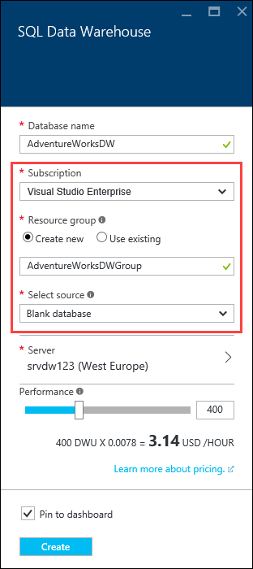

<properties
   pageTitle="在 Azure 门户预览中创建 SQL 数据仓库 | Azure"
   description="了解如何在 Azure 门户预览中创建 Azure SQL 数据仓库"
   services="sql-data-warehouse"
   documentationCenter="NA"
   authors="barbkess"
   manager="jhubbard"
   editor=""
   tags="azure-sql-data-warehouse"/>  

<tags
   ms.service="sql-data-warehouse"
   ms.devlang="NA"
   ms.topic="get-started-article"
   ms.tgt_pltfrm="NA"
   ms.workload="data-services"
   ms.date="08/25/2016"
   wacn.date="10/31/2016"
   ms.author="barbkess;lodipalm;sonyama"/>  

# 创建 Azure SQL 数据仓库

> [AZURE.SELECTOR]
- [Azure 门户预览](/documentation/articles/sql-data-warehouse-get-started-provision/)
- [TSQL](/documentation/articles/sql-data-warehouse-get-started-create-database-tsql/)
- [PowerShell](/documentation/articles/sql-data-warehouse-get-started-provision-powershell/)

本教程使用 Azure 门户预览来创建包含 AdventureWorksDW 示例数据库的 SQL 数据仓库。

## 先决条件

若要开始，您需要：

- **Azure 帐户**：访问 [Azure 试用版][] 或者 [MSDN Azure 信用额度][]，以创建帐户。
- **Azure SQL Server**：有关详细信息，请参阅[使用 Azure 门户预览创建 Azure SQL 数据库逻辑服务器][]。

> [AZURE.NOTE] 创建 SQL 数据仓库可能会导致新的计费服务。有关详细信息，请参阅 [SQL 数据仓库定价][]。

## 创建 SQL 数据仓库

1. 登录到 [Azure 门户预览](https://portal.azure.cn)。

2. 单击“+ 新建”>“数据 + 存储”>“SQL 数据仓库”。

      

3. 在“SQL 数据仓库”边栏选项卡中，填写所需的信息，然后按“创建”进行创建。

      

	- **服务器**：建议先选择服务器。

	- **数据库名称**：用于引用 SQL 数据仓库的名称。对服务器而言，它必须是唯一的。
	
    - **性能**：建议从 400 [DWU][DWU] 开始。可以将滑块向左或向右移动以调整数据仓库的性能，也可以在创建之后增加或减少。若要了解有关 DWU 的详细信息，请参阅[缩放](/documentation/articles/sql-data-warehouse-manage-compute-overview/)文档或者[定价页面][SQL Data Warehouse pricing]。

    - **订阅**：选择此 SQL 数据仓库将会计费的[订阅]。

    - **资源组**：[资源组][Resource group]是旨在帮助管理 Azure 资源集合的容器。了解有关[资源组](/documentation/articles/resource-group-overview/)的详细信息。

    - **选择源**：单击“选择源”>“示例”。Azure 使用 AdventureWorksDW 自动填充“选择示例”选项。

> [AZURE.NOTE] SQL 数据仓库的默认排序规则是 SQL\_Latin1\_General\_CP1\_CI\_AS。如果需要其他排序规则，则可使用 [T-SQL][] 通过其他排序规则创建数据库。

4. 单击“创建”以创建 SQL 数据仓库。

5. 请稍等几分钟。数据仓库准备就绪后，应返回到 [Azure 门户预览](https://portal.azure.cn)。你可以在仪表板上找到你的 SQL 数据仓库，它列于 SQL 数据库之下，或在用来创建它的资源组中。

    

[AZURE.INCLUDE [SQL 数据库创建服务器](../../includes/sql-database-create-new-server-firewall-portal.md)]

## 后续步骤

创建 SQL 数据仓库后，便可以[连接](/documentation/articles/sql-data-warehouse-query-visual-studio/)并开始查询。

若要将数据加载到 SQL 数据仓库中，请参阅[加载概述](/documentation/articles/sql-data-warehouse-overview-load/)。

如果尝试将现有数据库迁移到 SQL 数据仓库，请参阅[迁移概述](/documentation/articles/sql-data-warehouse-overview-migrate/)或使用[迁移实用工具](/documentation/articles/sql-data-warehouse-migrate-migration-utility/)。

还可以使用 Transact-SQL 配置防火墙规则。有关详细信息，请参阅 [sp\_set\_firewall\_rule][] 和 [sp\_set\_database\_firewall\_rule][]。

查看[最佳实践][]也是一个很好的想法。

<!--Article references-->
[使用 Azure 门户预览创建 Azure SQL 数据库逻辑服务器]: /documentation/articles/sql-database-get-started/
[Create an Azure SQL Database logical server with PowerShell]: /documentation/articles/sql-database-get-started-powershell#database-setup-create-a-resource-group-server-and-firewall-rule
[resource groups]: /documentation/articles/resource-group-template-deploy-portal/
[最佳实践]: /documentation/articles/sql-data-warehouse-best-practices/
[DWU]: /documentation/articles/sql-data-warehouse-overview-what-is/
[订阅]: /documentation/articles/azure-glossary-cloud-terminology#subscription/
[resource group]: /documentation/articles/azure-glossary-cloud-terminology
[T-SQL]: /documentation/articles/sql-data-warehouse-get-started-create-database-tsql/
 
<!--MSDN references-->
[sp\_set\_firewall\_rule]: https://msdn.microsoft.com/zh-cn/library/dn270017.aspx
[sp\_set\_database\_firewall\_rule]: https://msdn.microsoft.com/zh-cn/library/dn270010.aspx

<!--Other Web references-->

[SQL Data Warehouse pricing]: /pricing/details/sql-data-warehouse/
[SQL 数据仓库定价]: /pricing/details/sql-data-warehouse/
[Azure 试用版]: /pricing/1rmb-trial
[MSDN Azure 信用额度]: /pricing/member-offers/

<!---HONumber=Mooncake_1024_2016-->