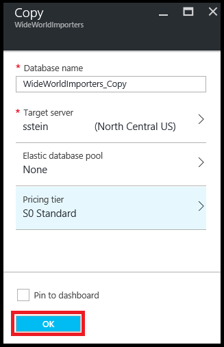

<properties
	pageTitle="使用 Azure 门户预览复制 Azure SQL 数据库 | Azure"
	description="创建 Azure SQL 数据库的副本"
	services="sql-database"
	documentationCenter=""
	authors="stevestein"
	manager="jhubbard"
	editor=""/>

<tags
	ms.service="sql-database"
	ms.devlang="NA"
	ms.date="09/19/2016"
	wacn.date="10/31/2016"
	ms.author="sstein"
	ms.workload="data-management"
	ms.topic="article"
	ms.tgt_pltfrm="NA"/>

# 使用 Azure 门户预览复制 Azure SQL 数据库

> [AZURE.SELECTOR]
- [概述](/documentation/articles/sql-database-copy/)
- [Azure 门户预览](/documentation/articles/sql-database-copy-portal/)
- [PowerShell](/documentation/articles/sql-database-copy-powershell/)
- [T-SQL](/documentation/articles/sql-database-copy-transact-sql/)

以下步骤说明如何使用 [Azure 门户预览](https://portal.azure.cn)将 SQL 数据库复制到同一服务器或其他服务器。

若要复制 SQL 数据库，需要做好以下项：

- Azure 订阅。如果你需要 Azure 订阅，只需单击本页顶部的“免费试用”，然后再回来完成本文的相关操作即可。
- 要复制的 SQL 数据库。如果你没有 SQL 数据库，请按照[创建你的第一个 Azure SQL 数据库](/documentation/articles/sql-database-get-started/)一文中的步骤创建一个。

## 复制 SQL 数据库

打开要复制的数据库对应的 SQL 数据库页：

1.	转到 [Azure 门户预览](https://portal.azure.cn)。
2.	单击“更多服务”>“SQL 数据库”，然后单击所需的数据库。
3.	在 SQL 数据库页上，单击“复制”：

      

1.  在“复制”页上，提供了一个默认的数据库名称。根据需要键入不同的名称（服务器上的所有数据库必须具有唯一的名称）。
2.  选择**目标服务器**。目标服务器是要在其中创建数据库副本的位置。可以将数据库复制到相同或不同的服务器。可以创建新的服务器，或者从列表中选择现有的服务器。
3.  选择**目标服务器**后，将启用“弹性数据库池”和“定价层”选项。如果服务器包含一个池，可以将数据库复制到该池中。
3.  单击“确定”开始复制过程。

      

## 监视复制操作的进度

- 开始复制后，单击门户通知了解详细信息。

    ![通知][3]
 
    ![监视][4]

## 验证数据库位于服务器上

- 单击“更多服务”>“SQL 数据库”并检查新数据库是否处于“联机”状态。

## 解析登录名

若要在复制操作完成后解析登录名，请参阅[解析登录名](/documentation/articles/sql-database-copy-transact-sql/#resolve-logins-after-the-copy-operation-completes)

## 后续步骤

- 有关复制 Azure SQL 数据库的概述，请参阅[复制 Azure SQL 数据库](/documentation/articles/sql-database-copy/)。
- 若要使用 PowerShell 复制数据库，请参阅[使用 PowerShell 复制 Azure SQL 数据库](/documentation/articles/sql-database-copy-powershell/)。
- 若要使用 Transact-SQL 复制数据库，请参阅[使用 Transact-SQL 复制 Azure SQL 数据库](/documentation/articles/sql-database-copy-transact-sql/)。
- 若要了解如何在将数据库复制到其他逻辑服务器时管理用户和登录名，请参阅[灾难恢复后如何管理 Azure SQL 数据库安全性](/documentation/articles/sql-database-geo-replication-security-config/)。

## 其他资源

- [管理登录名](/documentation/articles/sql-database-manage-logins/)
- [使用 SQL Server Management Studio 连接到 SQL 数据库并执行示例 T-SQL 查询](/documentation/articles/sql-database-connect-query-ssms/)
- [将数据库导出到 BACPAC](/documentation/articles/sql-database-export/)
- [业务连续性概述](/documentation/articles/sql-database-business-continuity/)
- [SQL 数据库文档](/documentation/services/sql-databases/)

<!--Image references-->

[1]: ./media/sql-database-copy-portal/copy.png
[2]: ./media/sql-database-copy-portal/copy-ok.png
[3]: ./media/sql-database-copy-portal/copy-notification.png
[4]: ./media/sql-database-copy-portal/monitor-copy.png

<!---HONumber=Mooncake_1024_2016-->