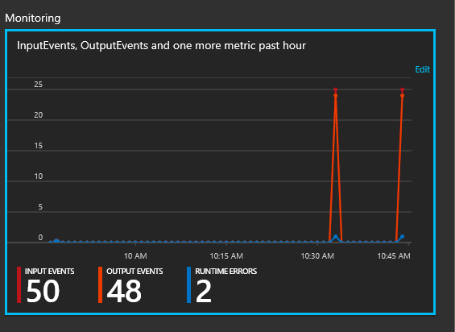

<properties 
	pageTitle="了解流分析作业监视 | Azure" 
	description="了解流分析作业监视" 
	keywords="查询监视器"
	services="stream-analytics" 
	documentationCenter="" 
	authors="jeffstokes72" 
	manager="jhubbard" 
	editor="cgronlun"/>  

<tags 
	ms.service="stream-analytics" 
	ms.devlang="na" 
	ms.topic="article" 
	ms.tgt_pltfrm="na" 
	ms.workload="data-services" 
	ms.date="11/11/2016"
	wacn.date="12/05/2016"
	ms.author="jeffstok"/>

# 了解流分析作业监视以及如何监视查询
## 简介：“监视”页

Azure 经典管理门户和 Azure 门户预览都提供了可用于监视和故障排除查询和作业性能的关键性能指标。

在 Azure 经典管理门户中，单击正在运行的流分析作业的“监视”选项卡可查看这些指标。在“监视”页中显示性能指标最多有 1 分钟的延迟。

  

在 Azure 门户预览中，浏览到想要查看其指标的流分析作业并查看“监视”部分。

  

首次在区域中创建流分析作业时，需要为该区域配置诊断。若要执行此操作，请单击“监视”部分，“诊断”边栏选项卡随即显示。可在此处启用诊断，并指定用于监视数据的存储帐户。

  

## 可用于流分析的指标
| 度量值 | 定义 |
| ---------------------- | ---------------------------------------- |
| 流单元利用率 % | 从作业的“比例”选项卡向一个作业分配的流单元利用率。如果此指标达到 80% 或以上，则很可能会出现事件处理延迟或停止处理的情况。 |
| 输入事件数 | 流分析作业收到的数据量，以事件计数来衡量。这可以用于验证正在发送到输入源的事件。 |
| 输出事件数 | 流分析作业发送到输出目标的数据量，以事件计数来衡量。 |
| 无序事件数 | 收到的无序事件的数目，系统根据事件排序策略来删除这些事件，或者为其提供一个经过调整的时间戳。这可能会受“无序容错时段”设置的影响。 |
| 数据转换错误数 | 流分析作业导致的数据转换错误的数目。 |
| 运行时错误 | 执行流分析作业的过程中发生的错误数。 |
| 延迟输入事件数 | 延迟到达的事件的数目，系统根据延迟到达容错时段设置的事件排序策略配置删除这些事件，或者调整其时间戳。 |

## 在 Azure 管理门户中自定义监视
一张图表上最多可以显示 6 个指标。

若要切换显示相对值（仅显示每个度量值的最终值）和绝对值（显示 Y 轴），请在图表顶部选择“相对”或“绝对”。

  

可以在 1 小时、12 小时、24 小时或 7 天聚合监视图中查看指标。

若要更改度量值图表显示的时间范围，请在图表顶部选择 1 小时、24 小时或者 7 天。

  

你可以设置规则，在作业超过定义的阈值时以电子邮件的方式通知你。

## 在 Azure 门户中自定义监视
可以在“编辑图表”设置中调整图表类型、显示的指标和时间范围。有关详细信息，请参阅[如何自定义监视](/documentation/articles/insights-how-to-customize-monitoring/)。

  

## 作业状态
可以在 Azure 经典管理门户中看到一份作业列表，并从中查看流分析作业的状态。可以在 Azure 经典管理门户中单击流分析图标来查看该作业列表。

| 状态 | 定义 |
| -------- | ---------------------------------------- |
| 已创建 | 作业已创建，但尚未启动。 |
| 正在启动 | 用户单击了启动作业按钮，该作业正在启动 |
| 正在运行 | 作业已分配，正在处理输入，或者正等着处理输入。如果作业显示“正在运行”状态但却没有生成输出，则可能是因为数据处理时间窗口较大，或者查询逻辑较复杂。另一个可能的原因是当前没有任何需要发送给该作业的数据。 |
| 正在停止 | 用户单击了停止作业按钮，作业正在停止。 |
| 已停止 | 作业已停止。 |
| 已降级 | 此状态表示流分析作业遇到暂时性错误（例如输入/输出错误、处理错误、转换错误等）。该作业仍在运行，但生成了很多错误。此作业需要客户关注，并且客户可以查看有关错误的操作日志。 |
| 已失败 | 这表示错误导致作业失败，并且处理已停止。客户需要深入了解操作日志以调试这些错误。 |
| 正在删除 | 这表示正在删除该作业。 |

## 诊断
在 Azure 管理门户中，作业仪表板提供有关需要在何处查找诊断的信息（即输入、输出和/或操作日志）。可以单击链接以前往相应的位置来查看诊断。

  

单击输入或输出资源可提供详细的诊断信息。当作业正在运行时，会用最新的诊断信息刷新此内容。

  

## 获取帮助
如需进一步的帮助，请尝试我们的 [Azure 流分析论坛](https://social.msdn.microsoft.com/Forums/zh-cn/home?forum=AzureStreamAnalytics)。

## 后续步骤
- [Azure 流分析简介](/documentation/articles/stream-analytics-introduction/)
- [Azure 流分析入门](/documentation/articles/stream-analytics-get-started/)
- [缩放 Azure 流分析作业](/documentation/articles/stream-analytics-scale-jobs/)
- [Azure 流分析查询语言参考](https://msdn.microsoft.com/zh-cn/library/azure/dn834998.aspx)
- [Azure 流分析管理 REST API 参考](https://msdn.microsoft.com/zh-cn/library/azure/dn835031.aspx)

<!---HONumber=Mooncake_1128_2016-->