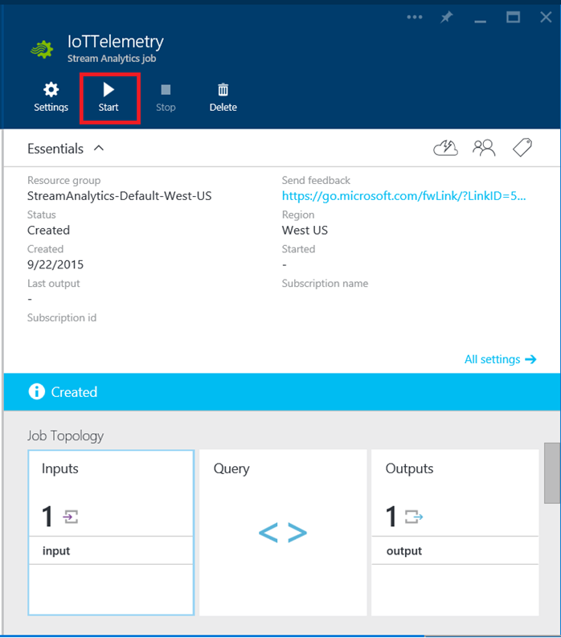

<properties
    pageTitle="如何在流分析中启动流式处理作业 | Azure"
    description="如何在 Azure 流分析中运行流式处理作业 | 学习路径段。"
    keywords="流式处理作业"
    documentationcenter=""
    services="stream-analytics"
    author="jeffstokes72"
    manager="jhubbard"
    editor="cgronlun" />
<tags
    ms.assetid="9d46950f-2b69-49ce-a567-df558c5dd820"
    ms.service="stream-analytics"
    ms.devlang="na"
    ms.topic="article"
    ms.tgt_pltfrm="na"
    ms.workload="data-services"
    ms.date="01/24/2017"
    wacn.date="03/10/2017"
    ms.author="jeffstok" />  

# 如何在 Azure 流分析中运行流式处理作业

当作业的输入、查询和输出均已指定时，你可以启动流分析作业。

若要启动你的作业：

1. 在 Azure 经典管理门户的作业仪表板中，单击页面底部的“启动”。
   
      

    在 Azure 门户中，单击作业页顶部的“启动”。

      

2. 指定一个“开始输出”值以确定此作业何时开始生成输出。之前尚未启动作业的默认设置为“作业开始时间”，表示作业将立即开始处理数据。也可以指定一个过去（用于使用历史数据）或将来（延迟处理直到将来某个时间）的“自定义”时间。当作业以前已启动和停止时，可以使用“上次停止时间”选项，从上次输出时间恢复作业并避免数据丢失。

      

      

3. 确认你的选择。作业状态将更改为“正在启动”，然后在作业已启动后很快转变为“正在运行”。你可以在**通知中心**中监视**启动**操作的进度：

      

      

## 获取帮助
如需进一步的帮助，请尝试我们的 [Azure 流分析论坛](https://social.msdn.microsoft.com/Forums/zh-cn/home?forum=AzureStreamAnalytics)

## 后续步骤

* [Azure 流分析简介](/documentation/articles/stream-analytics-introduction/)
* [Azure 流分析入门](/documentation/articles/stream-analytics-get-started/)
* [缩放 Azure 流分析作业](/documentation/articles/stream-analytics-scale-jobs/)
* [Azure 流分析查询语言参考](https://msdn.microsoft.com/zh-cn/library/azure/dn834998.aspx)
* [Azure 流分析管理 REST API 参考](https://msdn.microsoft.com/zh-cn/library/azure/dn835031.aspx)

<!---HONumber=Mooncake_0306_2017-->
<!--Update_Description:update meta properties;wording update-->