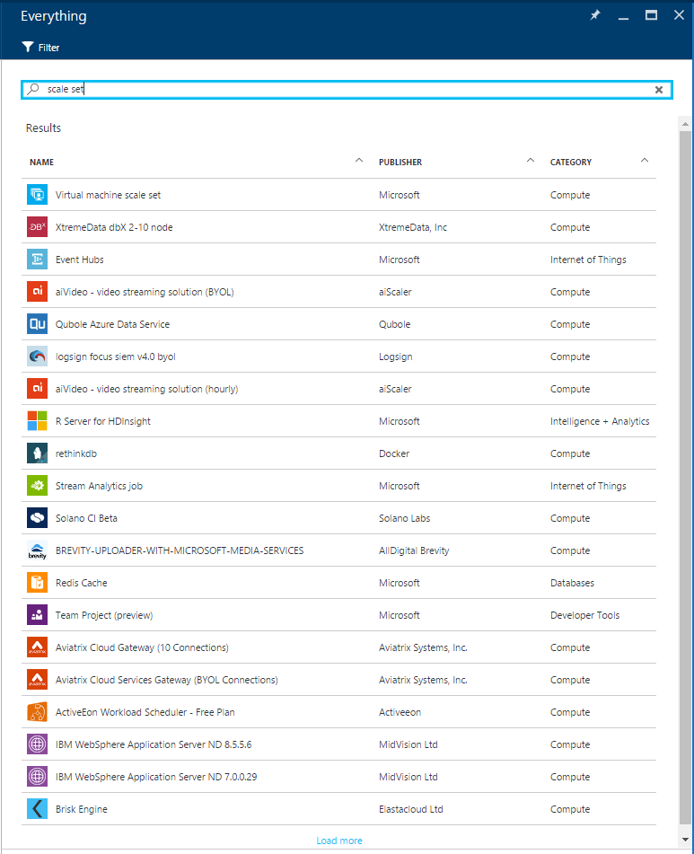
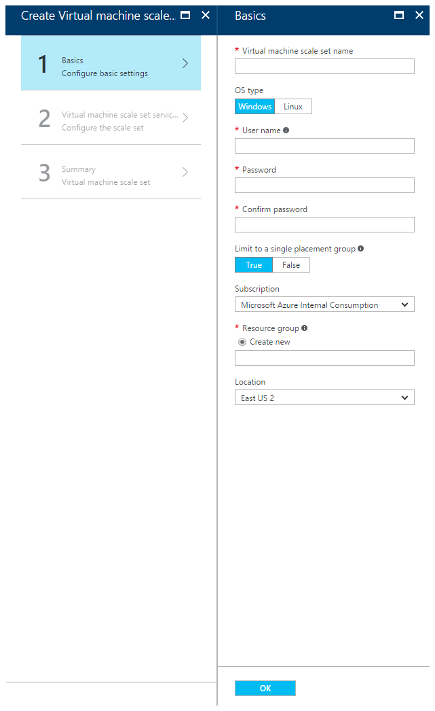
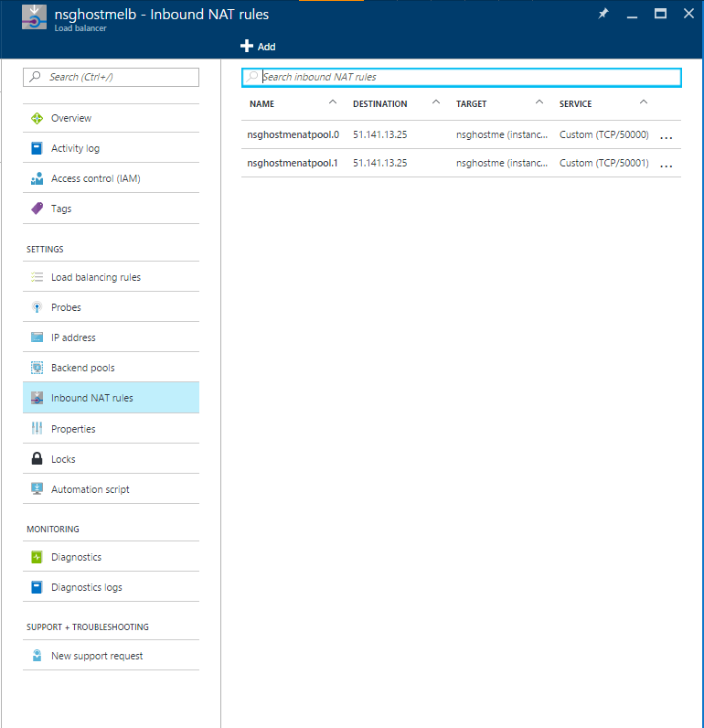

<properties
	pageTitle="使用 Azure 门户预览创建虚拟机规模集 | Azure"
	description="使用 Azure 门户预览部署规模集。"
	keywords="虚拟机规模集" 
	services="virtual-machine-scale-sets"
	documentationCenter=""
	authors="gatneil"
	manager="madhana"
	editor="tysonn"
	tags="azure-resource-manager" />  

<tags
	ms.service="virtual-machine"
	ms.workload="infrastructure-services"
	ms.tgt_pltfrm="vm"
	ms.devlang="na"
	ms.topic="article"
	ms.date="09/15/2016"
	wacn.date=""
	ms.author="gatneil"/>  

# 使用 Azure 门户预览创建虚拟机规模集

本教程介绍如何通过 Azure 门户预览在数分钟内轻松创建虚拟机规模集。如果没有 Azure 订阅，可在开始前创建一个[免费帐户](https://azure.microsoft.com/free/)。

## 从应用商店中选择 VM 映像

在门户中，可以使用 CentOS、CoreOS、Debian、Open Suse、Red Hat Enterprise Linux、SUSE Linux Enterprise Server、Ubuntu Server 或 Windows Server 映像轻松部署规模集。

首先，在 Web 浏览器中导航到 [Azure 门户预览](https://portal.azure.cn)。单击 `New`，搜索 `scale set`，然后选择 `Virtual machine scale set` 条目：

  

## 创建 Linux 虚拟机

现在可使用默认设置并快速创建虚拟机。

* 在 `Basics` 边栏选项卡上，输入规模集的名称。此名称将成为规模集前端负载均衡器的 FQDN 的基础，因此请确保在所有的 Azure 中，此名称是唯一的。

* 选择所需的 OS 类型，输入所需的用户名，然后选择希望使用的身份验证类型。如果选择使用密码，密码的长度必须至少为 12 个字符，并且必须符合以下四个复杂性要求中的其中三个：1 个小写字符、1 个大写字符、1 个数字和 1 个特殊字符。查看有关[用户名和密码要求](/documentation/articles/virtual-machines-windows-faq/#what-are-the-username-requirements-when-creating-a-vm)的更多信息。如果选择 `SSH public key`，请确保仅在公钥中粘贴，而不是在私钥中：

  

* 输入所需的资源组名称和位置，然后单击 `OK`。

* 在 `Virtual machine scale set service settings` 边栏选项卡上：输入所需的域名标签（规模集前端负载均衡器的 FQDN 的基础）。在所有的 Azure 中，此标签必须是唯一的。

* 选择所需的操作系统磁盘映像、实例计数和计算机大小。

* 启用或禁用自动缩放，如果启用，请按照以下步骤进行配置：

  

* 在 `Summary` 边栏选项卡上，验证完成后，单击 `OK`。

* 最后，在 `Purchase` 边栏选项卡上，单击 `Purchase` 开始进行规模集部署。

## 连接到规模集中的 VM

部署规模集后，导航到规模集的负载均衡器的 `Inbound NAT Rules` 选项卡：

  

可以使用这些 NAT 规则连接到规模集中的每个 VM。例如，对于 Windows 规模集，如果传入端口 50000 使用的是 NAT 规则，则可以通过 `<load-balancer-ip-address>:50000` 上的 RDP 连接到该计算机。对于 Linux 规模集，则使用命令 `ssh -p 50000 <username>@<load-balancer-ip-address>` 进行连接。

## 后续步骤

有关如何从 CLI 部署规模集的文档，请参阅[本文档](/documentation/articles/virtual-machine-scale-sets-cli-quick-create/)。

有关如何从 PowerShell 部署规模集的文档，请参阅[本文档](/documentation/articles/virtual-machine-scale-sets-windows-create/)。

有关通用文档，请参阅 [documentation overview page for scale sets](/documentation/articles/virtual-machine-scale-sets-overview/)（规模集的文档概述页）。

有关一般信息，请参阅[规模集的主要登陆页](/home/features/virtual-machine-scale-sets/)。

<!---HONumber=Mooncake_1024_2016-->