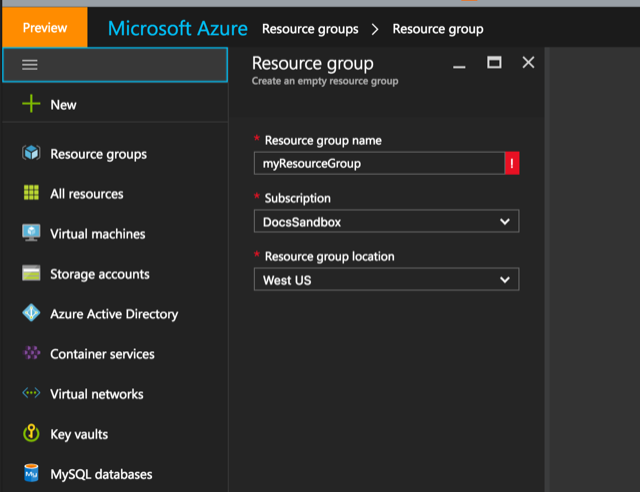
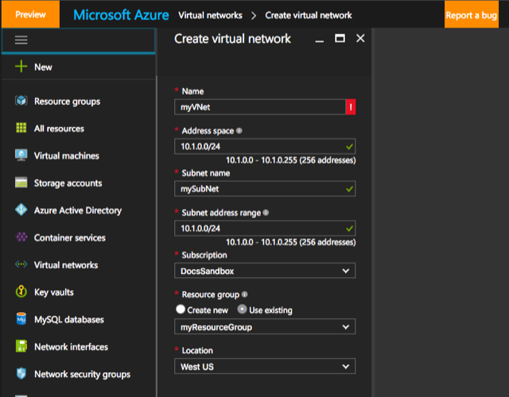
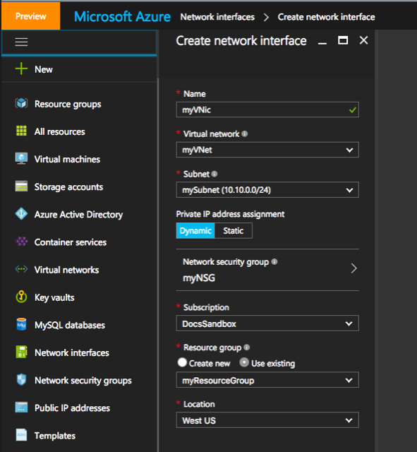
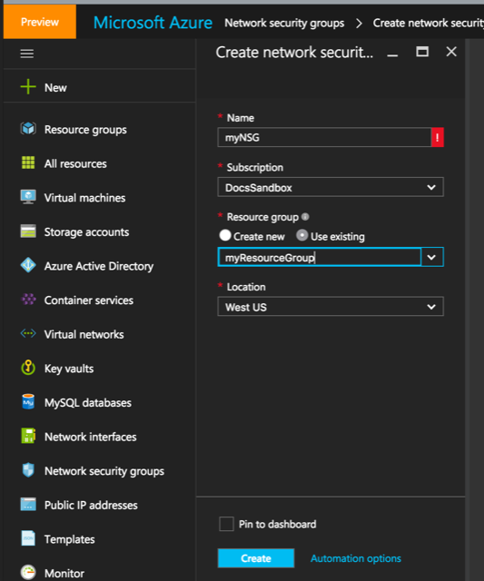
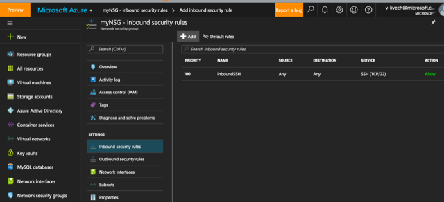
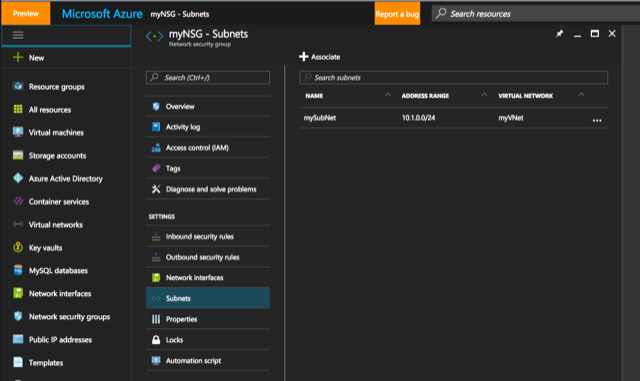
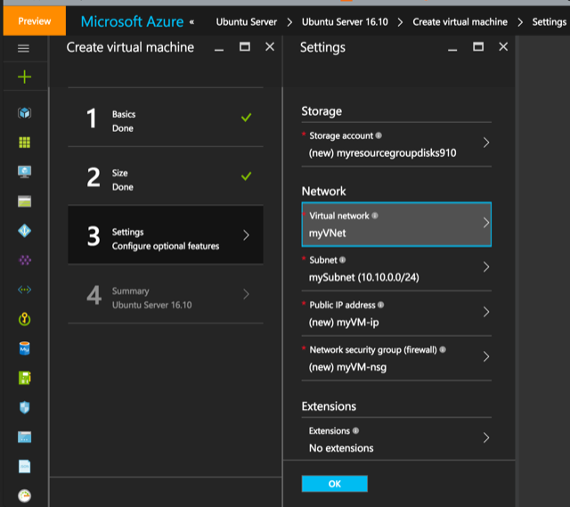

<properties
    pageTitle="使用门户将 Linux VM 部署到现有 Azure 虚拟网络 | Azure"
    description="使用门户将 Linux VM 部署到现有 Azure 虚拟网络。"
    services="virtual-machines-linux"
    documentationcenter="virtual-machines-linux"
    author="vlivech"
    manager="timlt"
    editor="" />
<tags
    ms.assetid="ms.service: virtual-machines-linux"
    ms.devlang="NA"
    ms.topic="article"
    ms.tgt_pltfrm="vm-linux"
    ms.workload="infrastructure"
    ms.date="11/21/2016"
    wacn.date="01/13/2017"
    ms.author="v-livech" />  

# 使用门户将 Linux VM 部署到现有 VNet 和 NSG 中

本文说明如何将 VM 部署到现有的虚拟网络 (VNet)。建议 VNet 和 NSG（网络安全组）等 Azure 资产应该是静态的、很少部署的长期存在资源。部署 VNet 后，不变的重新部署可以重复使用它，而不会对基础结构产生任何负面影响。可以将 VNet 想像为传统硬件网络交换机，用户不需要为全新的硬件交换机配置每个部署。

正确配置 VNet 后，在该 VNet 的整个生命周期中，我们可以继续反复将新的服务器部署到该 VNet，只需做很少的更改（如果有）。

## 创建资源组

首先，我们将部署资源组，以便组织在本演练中创建的所有内容。有关 Azure 资源组的详细信息，请参阅 [Azure Resource Manager 概述](/documentation/articles/resource-group-overview/)

  

## 创建 VNet

第一步是生成用于在其中启动 VM 的 VNet。该 VNet 包含一个子网，在后面的步骤中我们会将 NSG 与此子网相关联。

  

## 将 VNic 添加到子网

虚拟网卡 (VNic) 很重要，因为用户可以将它们连接到不同的 VM，这使 VNic 保持作为静态资源，而 VM 可以是临时 VM。创建 VNic 并将其与上一步中创建的子网相关联。

  

## 创建 NSG

Azure NSG 相当于网络层防火墙。有关 Azure NSG 的详细信息，请参阅[什么是网络安全组](/documentation/articles/virtual-networks-nsg/)。

  

## 添加入站 SSH 允许规则

Linux VM 需要从 Internet 访问，因此将创建允许通过网络将入站端口 22 流量传递到 Linux VM 上的端口 22 的规则。

  

## 将 NSG 与子网相关联

创建 VNet 和子网后，我们将 NSG 与子网相关联。NSG 可与整个子网或单个 VNic 相关联。由于防火墙在子网级别筛选流量，子网中的所有 VNic 和 VM 都受 NSG 保护；与此相对，NSG 只与单个 VNic 相关联且只保护一个 VM。

  

## 将 VM 部署到 VNet 和 NSG 中

使用 Azure 门户预览，将 Linux VM 部署到现有的 Azure 资源组、VNet、子网和 VNic 中。

  

通过使用门户选择现有资源，我们指示 Azure 将 VM 部署在现有网络内部。重述一遍，VNet 和子网一经部署，便可在 Azure 区域内保留为静态或永久资源。

## 后续步骤

* [Use an Azure Resource Manager template to create a specific deployment（使用 Azure Resource Manager 模板创建特定部署）](/documentation/articles/virtual-machines-linux-cli-deploy-templates/)
* [Create your own custom environment for a Linux VM using Azure CLI commands directly（直接使用 Azure CLI 命令为 Linux VM 创建用户自己的自定义环境）](/documentation/articles/virtual-machines-linux-create-cli-complete/)
* [使用模板在 Azure 上创建 Linux VM](/documentation/articles/virtual-machines-linux-create-ssh-secured-vm-from-template/)

<!---HONumber=Mooncake_0109_2017-->