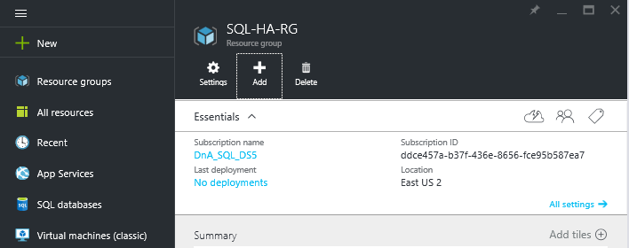
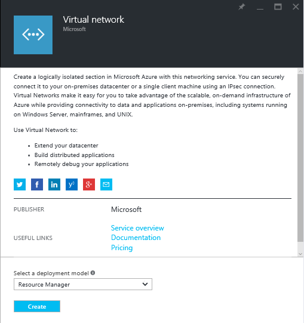
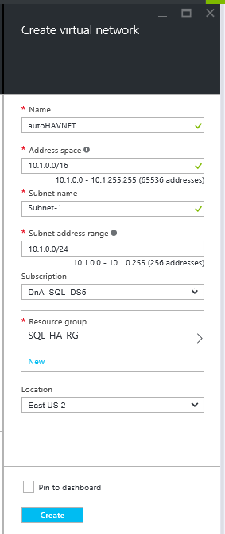
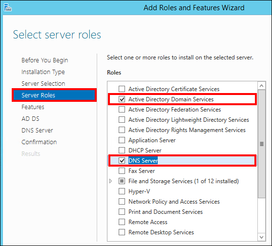
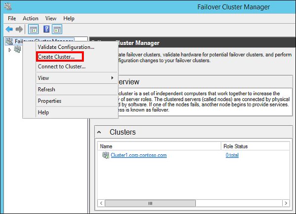
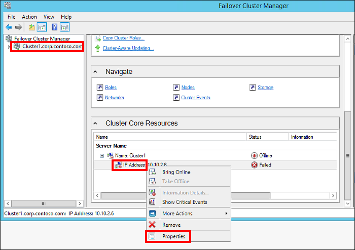
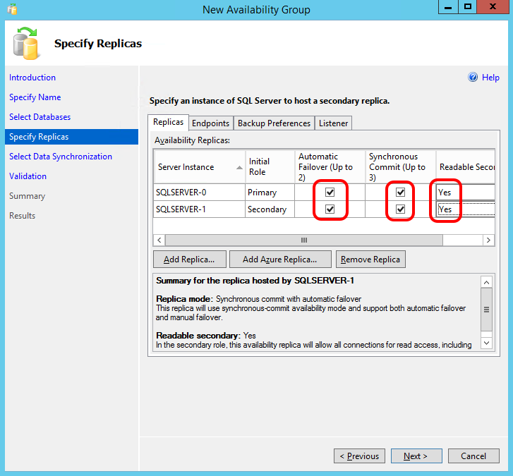
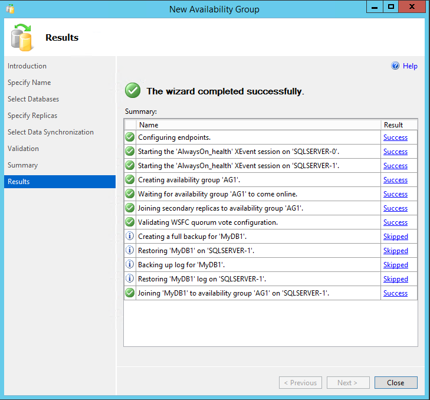
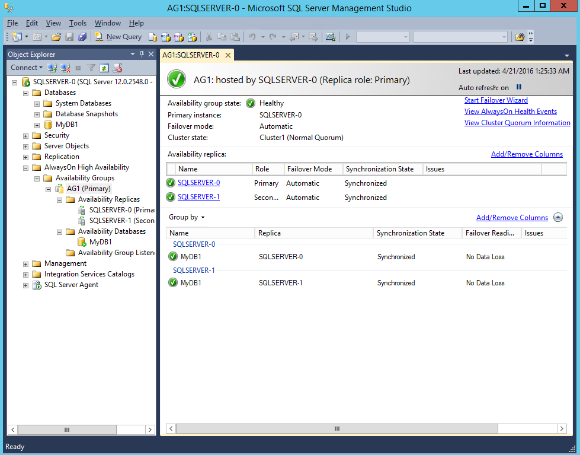

<properties
    pageTitle="在 Azure VM 中手动配置 AlwaysOn 可用性组 - Azure"
    description="创建包含 Azure 虚拟机的 AlwaysOn 可用性组。本教程主要使用用户界面和工具而不是脚本。"
    services="virtual-machines"
    documentationcenter="na"
    author="MikeRayMSFT"
    manager="timlt"
    editor="monicar"
    tags="azure-service-management" />
<tags
    ms.assetid="986cbc2e-553d-4eba-8acb-c34ad7fd1d8b"
    ms.service="virtual-machines"
    ms.devlang="na"
    ms.topic="article"
    ms.tgt_pltfrm="vm-windows-sql-server"
    ms.workload="infrastructure-services"
    ms.date="11/28/2016"
    wacn.date="01/20/2017"
    ms.author="MikeRayMSFT" />  

# 在 Azure VM 中手动配置 Always On 可用性组 - Resource Manager
> [AZURE.SELECTOR]
- [Resource Manager：手动](/documentation/articles/virtual-machines-windows-portal-sql-alwayson-availability-groups-manual/)
- [经典：UI](/documentation/articles/virtual-machines-windows-classic-portal-sql-alwayson-availability-groups/)
- [经典：PowerShell](/documentation/articles/virtual-machines-windows-classic-ps-sql-alwayson-availability-groups/)

   

本端到端教程介绍如何在 Azure Resource Manager 虚拟机上实现 SQL Server 可用性组。

本教程中将创建以下元素：

* 一个包含两个子网（包括前端子网和后端子网）的虚拟网络
* 可用性集中的两个域控制器，具有 Active Directory (AD) 域
* 可用性集中的两个 SQL Server VM，其已部署到后端子网并加入 AD 域
* 一个 3 节点 WSFC 群集，具有节点多数仲裁模型
* 具有一个或多个 IP 地址的内部负载均衡器，用于支持一个或多个可用性组侦听器
* 一个可用性组，具有可用性数据库的两个同步提交副本

下图显示了该解决方案的示意图。

  

可如此配置。还可按需求进行修改。例如，可将域控制器用作仲裁文件共享见证，从而减少虚拟机数量。这会减少双副本可用性组的 VM 数量。利用此方法，解决方案可少用一个 VM。

本教程将创建单个可用性组，该可用性组对侦听器使用一个 IP 地址。也可以创建对每个侦听器使用一个 IP 地址的多个可用性组。每个 IP 地址使用相同的负载均衡器。若要在负载均衡器上配置多个 IP 地址，请使用 PowerShell。有关详细信息，请参阅[配置一个或多个 Always On 可用性组侦听器 - Resource Manager](/documentation/articles/virtual-machines-windows-portal-sql-ps-alwayson-int-listener/)。

[AZURE.INCLUDE [可用性组模板](../../includes/virtual-machines-windows-portal-sql-alwayson-ag-template.md)]

本教程的假设条件如下：

* 你已有一个 Azure 帐户。
* 你已经知道如何使用 GUI 从虚拟机库设置 SQL Server VM。有关详细信息，请参阅[在 Azure 上预配 SQL Server 虚拟机](/documentation/articles/virtual-machines-windows-portal-sql-server-provision/)
* 你已经深入了解可用性组。有关详细信息，请参阅 [AlwaysOn 可用性组 (SQL Server)](https://msdn.microsoft.com/zh-cn/library/hh510230.aspx)。

> [AZURE.NOTE]
若想要搭配使用可用性组和 SharePoint，另请参阅[配置 SharePoint 2013 适用的 SQL Server 2012 AlwaysOn 可用性组](https://technet.microsoft.com/zh-cn/library/jj715261.aspx)。
> 
> 

## 创建资源组
1. 登录 [Azure 门户预览](http://portal.azure.cn)。
2. 单击“+新建”，然后在“应用商店”搜索窗口中键入“资源组”。
   
      

3. 单击“资源组”
   
      

4. 单击“创建”。
5. 在“资源组”边栏选项卡的“资源组名称”下，键入 **SQL-HA-RG**
6. 若有多个 Azure 订阅，请验证此订阅是否为要在其中创建可用性组的 Azure 订阅。
7. 选择一个位置。该位置为要在其中创建可用性组的 Azure 区域。本教程中将在一个 Azure 位置构建所有资源。
8. 确认已选中“固定到仪表板”。此可选设置将在 Azure 门户预览仪表板上放置资源组的快捷方式。
9. 单击“创建”以创建资源组。

Azure 将创建资源组，并在门户中固定资源组的快捷方式。

## 创建网络和子网
下一步是在 Azure 资源组中创建网络和子网。

此解决方案使用一个包含两个子网的虚拟网络。若要深入了解 Azure 中的网络，请参阅[虚拟网络概述](/documentation/articles/virtual-networks-overview/)。

若要创建虚拟网络，请执行以下操作：

1. 在 Azure 门户预览上，单击新资源组，然后单击“+”号将新项添加到该资源组。Azure 随即打开“全部”边栏选项卡。
   
      

2. 搜索“虚拟网络”。
   
       

3. 单击“虚拟网络”。
4. 在“虚拟网络”边栏选项卡中，单击“Resource Manager”部署模型，然后单击“创建”。
   
       

5. 在“创建虚拟网络”边栏选项卡上配置虚拟网络。
   
    下表显示了虚拟网络的设置。
   
    | **字段** | 值 |
    | --- | --- |
    | **Name** |autoHAVNET |
    | **地址空间** |10\.0.0.0/16 |
    | **子网名称** |Subnet-1 |
    | **子网地址范围** |10\.0.0.0/24 |
    | **订阅** |指定要使用的订阅。若只有一个订阅，该字段可以为空。 |
    | **位置** |指定 Azure 位置。 |
   
    地址空间和子网地址范围可能与此表中的不同。根据具体订阅，Azure 将指定可用的地址空间和相应的子网地址范围。如果地址空间不足，请使用其他订阅。
6. 单击“创建”
   
      

Azure 将返回到门户仪表板并在创建新网络时发出通知。

### 创建第二个子网
此时虚拟网络已包含一个名为 Subnet-1 的子网。域控制器将使用此子网。SQL Server 使用名为 **Subnet-2** 的第二个子网。配置 Subnet-2：

1. 在仪表板上，单击所创建的资源组 **SQL-HA-RG**。在“资源”下的资源组中找到网络。
   
    如果未显示 **SQL-HA-RG**，则单击“资源组”并根据资源组名称筛选即可找到。
2. 单击资源列表上的 **autoHAVNET**。Azure 会打开网络配置边栏选项卡。
3. 在“autoHAVNET”虚拟网络中，单击“所有设置”。
4. 在“设置”边栏选项卡中单击“子网”。
   
    请注意已创建的子网。
   
      

5. 创建第二个子网。单击“+子网”。
6. 在“添加子网”边栏选项卡中，通过在“名称”下键入 **subnet-2** 配置子网。Azure 将自动指定一个有效的**地址范围**。请确认此地址范围中至少有 10 个地址。生产环境中可能需要更多地址。
7. 单击“确定”。
   
      

下面是虚拟网络和两个子网的配置设置摘要。

| **字段** | 值 |
| --- | --- |
| **Name** |**autoHAVNET** |
| **地址空间** |取决于订阅中可用的地址空间。典型值为 10.0.0.0/16 |
| **子网名称** |**Subnet-1** |
| **子网地址范围** |取决于订阅中可用的地址范围。典型值为 10.0.0.0/24。 |
| **子网名称** |**Subnet-2** |
| **子网地址范围** |取决于订阅中可用的地址范围。典型值为 10.0.1.0/24。 |
| **订阅** |指定要使用的订阅。 |
| **资源组** |**SQL-HA-RG** |
| **位置** |指定为资源组选择的同一位置。 |

## 创建可用性集
在创建虚拟机之前，需要创建可用性集。可用性集可减少计划内或计划外维护事件的停机时间。Azure 可用性集是 Azure 置于物理容错域和更新域上的逻辑资源组。容错域可确保可用性集的成员具有单独的电源和网络资源。更新域可确保可用性集的成员不会同时停机进行维护。[管理虚拟机的可用性](/documentation/articles/virtual-machines-windows-manage-availability/)。

需要两个可用性集。一个用于域控制器。另一个用于 SQL Server。

若要创建可用性集，请转到资源组再单击“添加”。键入“可用性集”筛选结果。单击结果中的“可用性集”。单击“创建”。

根据下表中的参数配置两个可用性集。

| **字段** | 域控制器可用性集 | SQL Server 可用性集 |
| --- | --- | --- |
| **Name** |adavailabilitySet |sqlAvailabilitySet |
| **资源组** |SQL-HA-RG |SQL-HA-RG |
| **容错域** |3 |3 |
| **更新域** |5 |3 |

创建可用性集之后，请返回到 Azure 门户预览中的资源组。

## 创建域控制器
现已创建网络、子网、可用性集和面向 Internet 的负载均衡器。接下来可以为域控制器创建虚拟机。

### 为域控制器创建虚拟机
若要创建并配置域控制器，请返回到 **SQL-HA-RG** 资源组。

1. 单击“添加”。此时将打开“全部”边栏选项卡。
2. 键入 **Windows Server 2012 R2 Datacenter**。
3. 单击“Windows Server 2012 R2 Datacenter”。在“Windows Server 2012 R2 Datacenter”边栏选项卡中，确认部署模型是“Resource Manager”，然后单击“创建”。Azure 将打开“创建虚拟机”边栏选项卡。

完成前述步骤两次将创建两个虚拟机。将两个虚拟机命名为：

* ad-primary-dc
* ad-secondary-dc
  
  > [AZURE.NOTE]
  **ad-secondary-dc** 是可选组件，可为 Active Directory 域服务提供高可用性。
  > 
  > 

下表显示了这两个虚拟机的设置。

| **字段** | 值 |
| --- | --- |
| **用户名** |DomainAdmin |
| **密码** |Contoso!0000 |
| **订阅** |*你的订阅* |
| **资源组** |SQL-HA-RG |
| **位置** |*你的位置* |
| **大小** |D1\_V2（标准） |
| **存储类型** |标准 |
| **存储帐户** |*自动创建* |
| **虚拟网络** |autoHAVNET |
| **子网** |subnet-1 |
| **公共 IP 地址** |*与 VM 同名* |
| **网络安全组** |*与 VM 同名* |
| **诊断** |已启用 |
| **诊断存储帐户** |*自动创建* |
| **可用性集** |adAvailabilitySet |

> [AZURE.NOTE]
可用性集在 VM 上创建后即无法更改。
> 
> 

Azure 将创建虚拟机。

创建虚拟机后，请配置域控制器。

### 配置域控制器
执行以下步骤，将 **ad-primary-dc** 计算机配置为 corp.contoso.com 的域控制器。

1. 在门户中打开 **SQL-HA-RG** 资源组，然后选择 **ad-primary-dc** 计算机。在 **ad-primary-dc** 边栏选项卡中，单击“连接”打开用于远程桌面访问的 RDP 文件。
   
      

2. 使用已配置的管理员帐户 (**\\DomainAdmin**) 和密码 (**Contoso!0000**) 登录。
3. 默认情况下，应显示“服务器管理器”仪表板。
4. 单击仪表板上的“添加角色和功能”链接。
   
      

5. 选择“下一步”，直到你到达“服务器角色”部分。
6. 选择“Active Directory 域服务”和“DNS 服务器”角色。出现提示时，添加这些角色所需的任何其他功能。
   
    > [AZURE.NOTE]
    Windows 会警告你没有静态 IP 地址。如果你要测试配置，请单击“继续”。对于生产方案，请在 Azure 门户预览中将 IP 地址设置为静态地址，或[使用 PowerShell 设置域控制器计算机的静态 IP 地址](/documentation/articles/virtual-networks-reserved-private-ip/)。
    > 
    > 
   
      

7. 单击“下一步”，直到你到达“确认”部分。选中“必要时自动重新启动目标服务器”复选框。
8. 单击“安装”。
9. 功能安装完毕后，返回到“服务器管理器”仪表板。
10. 选择左侧窗格中的新“AD DS”选项。
11. 单击黄色警告栏上的“更多”链接。
    
      

12. 在“所有服务器任务详细信息”对话框的“操作”栏中，单击“将此服务器提升为域控制器”。
13. 在“Active Directory 域服务配置向导”中，使用以下值：
    
    | **Page** | 设置 |
    | --- | --- |
    | **部署配置** |**添加新林** = 选定 **根域名** = corp.contoso.com |
    | **域控制器选项** |**DSRM 密码** = Contoso!0000 **确认密码** = Contoso!0000 |
14. 单击“下一步”以浏览向导中的其他页。在“必备项检查”页上，确认你看到以下消息：“所有先决条件检查都成功通过”。请注意，你应查看任何适用的警告消息，但可以继续安装。
15. 单击“安装”。**ad-primary-dc** 虚拟机自动重启。

### 配置第二个域控制器
在主域控制器重新启动之后，可以配置第二个域控制器。此可选步骤有助于实现高可用性。若要完成此步骤，需要知道域控制器的专用 IP 地址。可以从 Azure 门户预览获取此信息。请按照以下步骤配置第二个域控制器。

1. 登录到 **ad-primary-dc** 计算机。
2. 打开远程桌面并通过 IP 地址连接到第二个域控制器。如果不知道第二个域控制器的 IP 地址，请转到 Azure 门户预览并查看分配给第二个域控制器的网络接口的地址。
3. 将首选 DNS 服务器地址更改为域控制器的地址。
4. 启动主域控制器 (**ad-primary-dc**) 的 RDP 文件，并使用配置的管理员帐户 (**BUILTIN\\DomainAdmin**) 和密码 (**Contoso!0000**) 登录到 VM。
5. 在主域控制器中，使用该 IP 地址启动连接到 **ad-secondary-dc** 的远程桌面。请使用相同的帐户和密码。
6. 一旦登录，你应看到“服务器管理器”仪表板。单击左窗格中的“本地服务器”。
7. 选择“由 DHCP 分配的启用 IPv6 的 IPv4 地址”链接。
8. 在“网络连接”窗口中，选择网络图标。
   
      

9. 在命令栏中，单击“更改此连接的设置”（根据你的窗口大小，你可能需要单击双右箭头才能看到此命令）。
10. 选择“Internet 协议版本 4 (TCP/IPv4)”，然后单击“属性”。
11. 选择“使用以下 DNS 服务器地址”，并在“首选 DNS 服务器”中指定主域控制器的地址。
12. 该地址是分配给 Azure 虚拟网络中 subnet-1 子网内的 VM 的地址，而该 VM 为 **ad-primary-dc**。若要验证 **ad-primary-dc** 的 IP 地址，请在命令提示符中使用 **nslookup ad-primary-dc**，如下所示。
    
      

    
    > [AZURE.NOTE]
    设置 DNS 后，可能会断开与成员服务器之间的 RDP 会话。若发生此情况，可在 Azure 门户预览中重启 VM。
    > 
    > 
13. 依次单击“确定”和“关闭”来提交更改。你现在能够将该 VM 加入到 **corp.contoso.com** 中。
14. 重复执行创建第一个域控制器时所遵循的步骤，但要在“Active Directory 域服务配置向导”中使用以下值：

| 页面 | 设置 |
| --- | --- |
| **部署配置** |**将域控制器添加到现有域** = 选定 **根** = corp.contoso.com |
| **域控制器选项** |**DSRM 密码** = Contoso!0000 **确认密码** = Contoso!0000 |

### 配置域帐户
接下来，配置 Active Directory (AD) 帐户以供稍后使用。

1. 重新登录到 **ad-primary-dc** 计算机。
2. 在“服务器管理器”中，选择“工具”，然后单击“Active Directory 管理中心”。
   
      

3. 在“Active Directory 管理中心”的左窗格中，选择“corp (本地)”。
4. 在右侧的“任务”窗格中，选择“新建”，然后单击“用户”。使用以下设置：
   
    | 设置 | 值 |
    | --- | --- |
    | **名字** |Install |
    | **用户 SamAccountName** |Install |
    | **密码** |Contoso!0000 |
    | **确认密码** |Contoso!0000 |
    | **其他密码选项** |选定 |
    | **密码永不过期** |已选中 |
5. 单击“确定”以创建 **Install** 用户。此帐户将用于配置故障转移群集和可用性组。
6. 使用相同的步骤创建两个其他用户：**CORP\\SQLSvc1** 和 **CORP\\SQLSvc2**。SQL Server 服务使用这些帐户。接下来，要赋予 **CORP\\Install** 所需权限来配置 Windows Server 故障转移群集 (WSFC)。
7. 在“Active Directory 管理中心”的左窗格中，选择“corp (本地)”。然后，在右侧的“任务”窗格中，单击“属性”。
   
      

8. 选择“扩展”，然后单击“安全性”选项卡上的“高级”按钮。
9. 在“corp 的高级安全设置”对话框中，单击“添加”。
10. 单击“选择主体”。然后，搜索 **CORP\\Install**。单击“确定”。
11. 选择“读取全部属性”和“创建计算机对象”权限。
    
       

12. 单击“确定”，然后再次单击“确定”。关闭 corp 属性窗口。

现已配置好 Active Directory 和用户对象，接下来将创建两个 SQL Server VM 和 1 个见证服务器 VM。然后将这三个 VM 加入域。

## 创建 SQL Server
### 创建并配置 SQL Server VM
接下来，创建三个 VM，包括两个 SQL Server VM 和一个 WSFC 群集节点。若要创建各个 VM，请返回到 **SQL-HA-RG** 资源组，单击“添加”，搜索相应的库项，然后依次选择“虚拟机”和“从库中”。然后，使用下表中的模板来帮助创建 VM。

| 页面 | VM1 | VM2 | VM3 |
| --- | --- | --- | --- |
| 选择相应的库项 |**Windows Server 2012 R2 Datacenter** |**Windows Server 2012 R2 上的 SQL Server 2014 SP1 Enterprise** |**Windows Server 2012 R2 上的 SQL Server 2014 SP1 Enterprise** |
| 虚拟机配置**基础知识** |**名称** = cluster-fsw **用户名** = DomainAdmin **密码** = Contoso!0000 **订阅** = 你的订阅 **资源组** = SQL-HA-RG **位置** = 你的 Azure 位置 |**名称** = sqlserver-0 **用户名** = DomainAdmin **密码** = Contoso!0000 **订阅** = 你的订阅 **资源组** = SQL-HA-RG **位置** = 你的 Azure 位置 |**名称** = sqlserver-1 **用户名** = DomainAdmin **密码** = Contoso!0000 **订阅** = 你的订阅 **资源组** = SQL-HA-RG **位置** = 你的 Azure 位置 |
| 虚拟机配置**大小** |DS1（单核，3.5 GB 内存） |**大小** = DS 2（双核，7 GB 内存） |**大小** = DS 2（双核，7 GB 内存） |
| 虚拟机配置**设置** |**存储** = 高级 (SSD) **网络子网** = autoHAVNET **存储帐户** = 使用自动生成的存储帐户 **子网** = subnet-2(10.1.1.0/24) **公共 IP 地址** = 无 **网络安全组** = 无 **监视诊断** = 已启用 **诊断存储帐户** =使用自动生成的存储帐户 **可用性集** = sqlAvailabilitySet  |**存储** = 高级 (SSD) **网络子网** = autoHAVNET **存储帐户** = 使用自动生成的存储帐户 **子网** = subnet-2(10.1.1.0/24) **公共 IP 地址** = 无 **网络安全组** = 无 **监视诊断** = 已启用 **诊断存储帐户** =使用自动生成的存储帐户 **可用性集** = sqlAvailabilitySet  |**存储** = 高级 (SSD) **网络子网** = autoHAVNET **存储帐户** = 使用自动生成的存储帐户 **子网** = subnet-2(10.1.1.0/24) **公共 IP 地址** = 无 **网络安全组** = 无 **监视诊断** = 已启用 **诊断存储帐户** =使用自动生成的存储帐户 **可用性集** = sqlAvailabilitySet  |
| 虚拟机配置 **SQL Server 设置** |不适用 |**SQL 连接** = 专用（在虚拟网络内） **端口** = 1433 **SQL 身份验证** = 禁用 **存储配置** = 常规 **自动修补** = 星期日 2:00 **自动备份** = 已禁用 **Azure 密钥保管库集成** = 已禁用 |**SQL 连接** = 专用（在虚拟网络内） **端口** = 1433 **SQL 身份验证** = 禁用 **存储配置** = 常规 **自动修补** = 星期日 2:00 **自动备份** = 已禁用 **Azure 密钥保管库集成** = 已禁用 |

   

> [AZURE.NOTE]
前面的配置建议使用标准层虚拟机，因为基本层虚拟机不支持可用性组侦听器所需的负载均衡终结点。此外，此处建议的虚拟机大小是为了在 Azure VM 中测试可用性组。为获得生产工作负荷的最佳性能，请参阅 [Azure 虚拟机中 SQL Server 的性能最佳实践](/documentation/articles/virtual-machines-windows-sql-performance/)中关于 SQL Server 计算机大小和配置的建议。
> 
> 

在三个虚拟机预配完毕之后，你需要将它们加入到 **corp.contoso.com** 域中，并向这些虚拟机授予 CORP\\Install 管理权限。

为了帮助完成后续操作，请记下每个 VM 的 Azure 虚拟 IP 地址。获取每台服务器的 IP 地址。在 Azure SQL-HA-RG 资源组中，单击 **autohaVNET** 资源。**autohaVNET** 边栏选项卡将显示网络中每台计算机的 IP 地址。

记录以下设备的 IP 地址：

| VM 角色 | 设备 | IP 地址 |
| --- | --- | --- |
| 主域控制器 |ad-primary-dc | |
| 辅助域控制器 |ad-secondary-dc | |
| 群集文件共享见证 |cluster-fsw | |
| SQL Server |sqlserver-0 | |
| SQL Server |sqlserver-1 | |

使用这些地址来配置每个 VM 的 DNS 服务。请针对 3 个 VM 分别执行以下步骤。

1. 首先，更改每个成员服务器的首选 DNS 服务器地址。
2. 启动主域控制器 (**ad-primary-dc**) 的 RDP 文件，并使用配置的管理员帐户 (**BUILTIN\\DomainAdmin**) 和密码 (**Contoso!0000**) 登录到 VM。
3. 在主域控制器中，使用该 IP 地址启动连接到 **sqlserver-0** 的远程桌面。请使用相同的帐户和密码。
4. 一旦登录，你应看到“服务器管理器”仪表板。单击左窗格中的“本地服务器”。
5. 选择“由 DHCP 分配的启用 IPv6 的 IPv4 地址”链接。
6. 在“网络连接”窗口中，选择网络图标。
   
      

7. 在命令栏中，单击“更改此连接的设置”（根据你的窗口大小，你可能需要单击双右箭头才能看到此命令）。
8. 选择“Internet 协议版本 4 (TCP/IPv4)”，然后单击“属性”。
9. 选择“使用以下 DNS 服务器地址”，并在“首选 DNS 服务器”中指定主域控制器的地址。
10. 该地址是分配给 Azure 虚拟网络中 subnet-1 子网内的 VM 的地址，而该 VM 为 **ad-primary-dc**。若要验证 **ad-primary-dc** 的 IP 地址，请在命令提示符中使用 **nslookup ad-primary-dc**，如下所示。
    
      

    
    > [AZURE.NOTE]
    设置 DNS 后，可能会断开与成员服务器之间的 RDP 会话。若发生此情况，可在 Azure 门户预览中重启 VM。
    > 
    > 
11. 依次单击“确定”和“关闭”来提交更改。你现在能够将该 VM 加入到 **corp.contoso.com** 中。
12. 再次在“本地服务器”窗口中，单击“工作组”链接。
13. 在“计算机名”部分，单击“更改”。
14. 选中“域”复选框并在文本框中键入 **corp.contoso.com**。单击“确定”。
15. 在“Windows 安全性”弹出对话框中，指定默认域管理员帐户 (**CORP\\DomainAdmin**) 和密码 (**Contoso!0000**) 的凭据。
16. 在看到“欢迎使用 corp.contoso.com 域”消息时，请单击“确定”。
17. 单击“关闭”，然后单击弹出对话框中的“立即重新启动”。
18. 针对文件共享见证服务器和每台 SQL Server 重复执行这些步骤。

### 添加 Corp\\Install 用户作为每个群集 VM 上的管理员：
1. 等待 VM 重启，然后从主域控制器中重启 RDP 文件，使用 **BUILTIN\\DomainAdmin** 帐户登录到 **sqlserver-0**。
2. 在“服务器管理器”中，选择“工具”，然后单击“计算机管理”。
   
      

3. 在“计算机管理”窗口中，展开“本地用户和组”，然后选择“组”。
4. 双击“管理员”组。
5. 在“管理员属性”对话框中，单击“添加”按钮。
6. 输入用户 **CORP\\Install**，然后单击“确定”。当系统提示输入凭据时，使用 **DomainAdmin** 帐户和 **Contoso!0000** 密码。
7. 单击“确定”以关闭“管理员属性”对话框。
8. 在 **sqlserver-1** 和 **cluster-fsw** 上重复上述步骤。

## 创建群集
### 将**故障转移群集**功能添加到每个群集 VM。
1. 通过 RDP 连接到 **sqlserver-0**。
2. 在“服务器管理器”仪表板中，单击“添加角色和功能”。
3. 在“添加角色和功能向导”中，单击“下一步”，直到出现“功能”页。
4. 选择“故障转移群集”。出现提示时，添加任何其他相关功能。
   
      

5. 单击“下一步”，然后单击“确认”页上的“安装”。
6. “故障转移群集”功能安装完成后，单击“关闭”。
7. 从 VM 注销。
8. 在 **sqlserver-1** 和 **cluster-fsw** 上重复本部分中的步骤。

这些 SQL Server VM 现在已设置并正在运行，但它们是使用默认选项与 SQL Server 一同安装的。

### 创建 WSFC 群集
在本部分中，将创建托管可用性组的 WSFC 群集。至此，应已在 WSFC 群集中针对三个 VM 分别完成以下操作：

* 在 Azure 中进行了完全设置
* 已将 VM 加入到域中
* 已将 **CORP\\Install** 添加到本地管理员组
* 添加了故障转移群集功能

必须在每个 VM 上执行所有这些操作，才能将这些 VM 加入到 WSFC 群集中。

另请注意，Azure 虚拟网络的行为与本地网络不同。你需要按以下顺序来创建群集：

1. 在一个节点 (**sqlserver-0**) 上创建单节点群集。
2. 将群集 IP 地址修改为 **sqlsubnet** 中未使用的 IP 地址。
3. 将群集名称联机。
4. 添加其他节点（**sqlserver-1** 和 **cluster-fsw**）。

请按照以下步骤配置群集。

1. 启动 **sqlserver-0** 的 RDP 文件，然后使用域帐户 **CORP\\Install** 登录。
2. 在“服务器管理器”仪表板中，选择“工具”，然后单击“故障转移群集管理器”。
3. 在左窗格中，右键单击“故障转移群集管理器”，然后单击“创建群集”，如下所示。
   
      

4. 在“创建群集向导”中，逐页完成以下设置来创建一个单节点群集：
   
    | 页面 | 设置 |
    | --- | --- |
    | 开始之前 |使用默认值 |
    | 选择服务器 |在“输入服务器名称”中键入 **sqlserver-0**，然后单击“添加” |
    | 验证警告 |选择“否。不需要 Microsoft 对该群集的支持，因此不希望运行验证测试。单击‘下一步’时，继续创建群集。” |
    | 用于管理群集的访问点 |在“群集名称”中键入 **Cluster1** |
    | 确认 |除非你使用的是存储空间，否则请使用默认值。请参阅此表后面的备注。 |

    >[AZURE.NOTE]
    如果使用存储空间，必须取消选中“确认”页上的“将所有符合条件的存储添加到群集中”复选框。如果继续选中，Windows 会在群集过程中分离虚拟磁盘。由此导致在从群集中删除存储空间并使用 PowerShell 重新附加之前，磁盘管理器或资源管理器中不会显示这些磁盘。存储空间会将多个磁盘分组到存储池。有关详细信息，请参阅[存储空间](https://technet.microsoft.com/zh-cn/library/hh831739)。

    现已创建群集，接下来请验证配置并添加剩余的节点。

1. 在中心窗格中，向下滚动到“群集核心资源”部分并展开“名称: Clutser1”详细信息。你应看到“名称”和“IP 地址”资源都处于“已失败”状态。不能将 IP 地址资源联机，因为向该群集分配的 IP 地址与计算机本身的地址相同，地址重复。
2. 右键单击失败的“IP 地址”资源，然后单击“属性”。
   
      

3. 选择“静态 IP 地址”，并在“地址”文本框中指定 subnet-2 中可用的地址。然后，单击“确定”。
4. 在“群集核心资源”部分中，右键单击“名称: Cluster1”，然后单击“联机”。然后等待两个资源都已联机。当该群集名称资源联机时，它会用新的 AD 计算机帐户更新 DC 服务器。此 AD 帐户稍后将用于运行可用性组群集服务。
5. 最后，需要向该群集添加剩余节点。在浏览器树中，右键单击“Cluster1.corp.contoso.com”，然后单击“添加节点”，如下所示。
   
      

6. 在“添加节点向导”中，单击“下一步”。然后，在“选择服务器”页上，将 **sqlserver-1** 添加到列表，方法是在“输入服务器名称”中键入服务器名称，然后单击“添加”。完成后，单击“下一步”。
7. 在“验证警告”页上，单击“否”（在生产方案中，你应执行验证测试）。然后，单击“下一步”。
8. 在“确认”页中，单击“下一步”以添加节点。
   
    > [AZURE.WARNING]
    若利用[存储空间](https://technet.microsoft.com/zh-cn/library/hh831739)将多个磁盘组合到存储池中，则必须取消选中“将所有符合条件的存储添加到群集中”复选框。如果继续选中，则将在群集过程中分离虚拟磁盘。因此，这些虚拟磁盘也不会出现在磁盘管理器或资源管理器之中，除非从群集中删除存储空间，并使用 PowerShell 将其重新附加。
    > 
    > 
9. 向群集添加节点后，单击“完成”。“故障转移群集管理器”现在应显示你的群集具有三个节点，并将这些节点在“节点”容器中列出。
10. 从远程桌面会话注销。

## 配置可用性组
本部分将针对 **sqlserver-0** 和 **sqlserver-1** 完成以下操作：

* 将 **CORP\\Install** 作为 sysadmin 角色添加到默认 SQL Server 实例
* 打开防火墙，针对 SQL Server、数据库镜像终结点和 Azure Load Balancer 探测端口实现对 SQL Server 的远程访问
* 启用可用性组功能
* 将 SQL Server 服务帐户分别更改为 **CORP\\SQLSvc1** 和 **CORP\\SQLSvc2**。

上述操作可按任意顺序执行。不过，以下步骤应按顺序进行。针对 **sqlserver-0** 和 **sqlserver-1** 执行以下步骤：

### 将安装帐户添加为每个 SQL Server 上的 sysadmin 固定服务器角色
1. 如果你尚未从 VM 的远程桌面会话注销，请现在注销。
2. 启动 **sqlserver-0** 和 **sqlserver-1** 的 RDP 文件，以 **BUILTIN\\DomainAdmin** 身份登录。
3. 启动 **SQL Server Management Studio**，将 **CORP\\Install** 作为 **sysadmin** 角色添加到默认的 SQL Server 实例。在“对象资源管理器”中，右键单击“登录名”，然后单击“新建登录名”。
4. 在“登录名”中，键入 **CORP\\Install**。
5. 在“服务器角色”页上，选择“sysadmin”。然后，单击“确定”。创建登录名后，可通过在“对象资源管理器”中展开“登录名”来查看该登录名。

### 打开防火墙，以便远程访问 SQL Server 和每个 SQL Server 上的探测端口
此解决方案需要每个 SQL Server 有两个防火墙规则。第一个规则提供对 SQL Server 的入站访问，第二个规则提供对负载均衡器和侦听器的入站访问。

1. 接下来，为 SQL Server 创建防火墙规则。从“开始”屏幕启动“高级安全 Windows 防火墙”。
2. 在左窗格中，选择“入站规则”。在右窗格上，单击“新建规则”。
3. 在“规则类型”页上，选择“程序”，然后单击“下一步”。
4. 在“程序”页上，选择“此程序路径”，然后在文本框中键入 **%ProgramFiles%\\Microsoft SQL Server\\MSSQL12.MSSQLSERVER\\MSSQL\\Binn\\sqlservr.exe**（如果你遵循这些指示但使用的是 SQL Server 2012，SQL Server 目录则为 **MSSQL11.MSSQLSERVER**）。然后，单击“下一步”。
5. 在“操作”页面中，保持选中“允许连接”，然后单击“下一步”。
6. 在“配置文件”页面中，接受默认设置并单击“下一步”。
7. 在“名称”页上，在“名称”文本框中指定一个规则名称，如 **SQL Server (Program Rule)**，然后单击“完成”。
8. 为探测端口创建额外的输入防火墙规则。在本教程中，此规则是到 TCP 端口 59999 的入站规则。将规则命名为 **SQL Server 侦听器**。

在两个 SQL Server 上完成所有步骤。

### 在每个 SQL Server 上启用可用性组功能
在两个 SQL Server 上执行这些步骤。

1. 接下来，启用 **AlwaysOn 可用性组**功能。从“开始”菜单，启动 **SQL Server 配置管理器**。
2. 在浏览器树中，单击“SQL Server 服务”，右键单击“SQL Server (MSSQLSERVER)”服务，然后单击“属性”。
3. 单击“AlwaysOn 高可用性组”选项卡，选择“启用 AlwaysOn 可用性组”（如下所示），然后单击“应用”。在弹出对话框中，单击“确定”，但不要关闭属性窗口。在更改服务帐户后，将重新启动 SQL Server 服务。
   
      

### 在每个 SQL Server 上设置 SQL Server 服务帐户
在两个 SQL Server 上执行这些步骤。

1. 接下来，更改 SQL Server 服务帐户。单击“登录”选项卡，在“帐户名”中键入 **CORP\\SQLSvc1**（对于 **sqlserver-0**）或 **CORP\\SQLSvc2**（对于 **sqlserver-1**），填入并确认密码，然后单击“确定”。
2. 在弹出窗口中，单击“是”重新启动该 SQL Server 服务。重新启动 SQL Server 服务后，在属性窗口中所做的更改即生效。
3. 从 VM 注销。

### 创建可用性组
此时，你已做好配置可用性组的准备。下面概括了将要执行的操作：

* 在 **sqlserver-0** 上创建新数据库 (**MyDB1**)
* 获取数据库的完整备份和事务日志备份
* 使用 **NORECOVERY** 选项将完整备份和日志备份还原到 **sqlserver-1**
* 通过同步提交、自动故障转移和可读辅助副本来创建可用性组 (**AG1**)

### 在 sqlserver-0 上创建 MyDB1 数据库：
1. 如果尚未退出 **sqlserver-0** 和 **sqlserver-1** 的远程桌面会话，请现在注销。
2. 启动 **sqlserver-0** 的 RDP 文件，然后以 **CORP\\Install** 身份登录。
3. 在“文件资源管理器”的 *C:** 下，创建名为 **backup** 的目录。你将使用此目录来备份并还原数据库。
4. 右键单击新目录，指向“共享”，然后单击“特定用户”，如下所示。
   
      

5. 添加 **CORP\\SQLSvc1** 并授予其**读/写**权限，添加 **CORP\\SQLSvc2** 并授予其**读/写**权限（如下所示），然后单击“共享”。文件共享过程完成后，请单击“完成”。
   
      

6. 接下来，你需要创建数据库。从“开始”菜单启动 **SQL Server Management Studio**，然后单击“连接”连接到默认 SQL Server 实例。
7. 在“对象资源管理器”中，右键单击“数据库”，然后单击“新建数据库”。
8. 在“数据库名称”中，键入 **MyDB1**，然后单击“确定”。

### 创建 MyDB1 的完整备份并在 sqlserver-1 上还原该数据库：
1. 接下来，对数据库进行完整备份。在“对象资源管理器”中，展开“数据库”，右键单击“MyDB1”，指向“任务”，然后单击“备份”。
2. 在“源”部分中，将“备份类型”设置为“完整”。在“目标”部分中，单击“删除”以删除备份文件的默认文件路径。
3. 在“目标”部分中，单击“添加”。
4. 在“文件名”文本框中，键入 **\\\sqlserver-0\\backup\\MyDB1.bak**。单击“确定”，然后再次单击“确定”以备份数据库。备份操作完成后，再次单击“确定”关闭对话框。
5. 接下来，对数据库进行事务日志备份。在“对象资源管理器”中，展开“数据库”，右键单击“MyDB1”，指向“任务”，然后单击“备份”。
6. 在“备份类型”中，选择“事务日志”。保持“目标”文件路径设置为此前指定的文件路径，然后单击“确定”。备份操作完成后，再次单击“确定”。
7. 接下来，在 **sqlserver-1** 上还原完整备份和事务日志备份。启动 **sqlserver-1** 的 RDP 文件，然后以 **CORP\\Install** 身份登录。继续打开 **sqlserver-0** 的远程桌面会话。
8. 从“开始”菜单启动 **SQL Server Management Studio**，然后单击“连接”连接到默认 SQL Server 实例。
9. 在“对象资源管理器”中，右键单击“数据库”，然后单击“还原数据库”。
10. 在“源”部分中，选择“设备”，然后单击“...”按钮。
11. 在“选择备份设备”中，单击“添加”。
12. 在“备份文件位置”中，键入 **\\\sqlserver-0\\backup**，单击“刷新”，再选择“MyDB1.bak”并单击“确定”，然后再次单击“确定”。现在，你应在“要还原的备份集”窗格中看到完整备份和日志备份。
13. 转到“选项”页，在“恢复状态”中选择“RESTORE WITH NORECOVERY”，然后单击“确定”还原数据库。还原操作完成后，单击“确定”。

### 创建可用性组：
1. 返回到 **sqlserver-0** 的远程桌面会话。在 SSMS 中的“对象资源管理器”中，右键单击“AlwaysOn 高可用性”，然后单击“新建可用性组向导”，如下所示。
   
      

2. 在“简介”页上，单击“下一步”。在“指定可用性组名称”页上，在“可用性组名称”中键入 **AG1**，然后再次单击“下一步”。
   
      

3. 在“选择数据库”页上，选择“MyDB1”，然后单击“下一步”。这些数据库满足可用性组的先决条件，因为你已经对目标主副本进行了至少一次完整备份。
   
      

4. 在“指定副本”页上，单击“添加副本”。
   
      

5. 此时会弹出“连接到服务器”对话框。在“服务器名称”中键入 **sqlserver-1**，然后单击“连接”。
   
      

6. 返回到“指定副本”页，此时“可用性副本”中应会列出 **sqlserver-1**。配置这些副本，如下所示。
   
      

7. 单击“终结点”，查看此可用性组将使用的数据库镜像终结点。每个 SQL Server 实例都必须具有一个数据库镜像终结点。请注意向导为此终结点指定的 TCP 端口。针对此 TCP 端口，在各服务器上创建入站防火墙规则。
   
    完成后，单击“下一步”。
8. 在“选择初始数据同步”页上，选择“仅联接”，然后单击“下一步”。在执行 **sqlserver-0** 的完整备份和事务备份并在 **sqlserver-1** 上还原这些备份时，已手动同步了数据。还可选择不备份和还原数据库并选择“完整”，让“新建可用性组”向导代为执行数据同步。不过，对于某些企业中存在的超大型数据库，不建议这样做。
   
      

9. 在“验证”页中，单击“下一步”。此页应与以下页类似。由于你尚未配置可用性组侦听器，因此会出现一个侦听器配置警告。你可以忽略此警告，因为本教程不会配置侦听器。本教程稍后将帮助你创建侦听器。
   
      

10. 在“摘要”页上，单击“完成”，然后等待向导配置完新的可用性组。在“进度”页上，可单击“更多详细信息”以查看详细进度。向导运行完成后，检查“结果”页以验证是否已成功创建可用性组（如下所示），然后单击“关闭”退出向导。
    
       

11. 在“对象资源管理器”中，展开“AlwaysOn 高可用性”，然后展开“可用性组”。此时，你应在此容器中看到新的可用性组。右键单击“AG1 (主)”，然后单击“显示仪表板”。
    
       

12. **AlwaysOn 仪表板**应如下所示。你可以查看副本、每个副本的故障转移模式以及同步状态。
    
       

13. 返回到“服务器管理器”，选择“工具”，然后启动“故障转移群集管理器”。
14. 展开 **Cluster1.corp.contoso.com**，然后展开“服务和应用程序”。选择“角色”，并注意已创建“AG1”可用性组角色。请注意，AG1 没有数据库客户端可按其连接到可用性组的 IP 地址，因为你未配置侦听器。你可以直接连接到主节点进行读写操作，直接连接到辅助节点进行只读查询。
    
      

    
    > [AZURE.WARNING]
    请勿尝试从故障转移群集管理器对可用性组进行故障转移。所有故障转移操作都应在 SSMS 中的 **AlwaysOn 仪表板**内进行。有关详细信息，请参阅[将 WSFC 故障转移群集管理器用于可用性组的限制](https://msdn.microsoft.com/zh-cn/library/ff929171.aspx)。
    > 
    > 

## 配置内部负载均衡器
需要配置负载均衡器才可直接连接到可用性组。负载均衡器将客户端流量定向到侦听器 IP 地址和探测端口上绑定的 VM。本教程使用内部负载均衡（即 ILB）。ILB 允许同一虚拟网络中的流量连接到 SQL Server。若应用程序需要通过 Internet 连接到 SQL Server，则其需要面向 Internet 的负载均衡器或外部负载均衡器。有关详细信息，请参阅 [Azure Load Balancer 概述](/documentation/articles/load-balancer-overview/)。

> [AZURE.NOTE]
本教程说明如何创建单个侦听器，该侦听器只使用一个 ILB IP 地址。若要创建使用一个或多个 IP 地址的一个或多个侦听器，请参阅[创建可用性组侦听器和负载均衡器 | Azure](/documentation/articles/virtual-machines-windows-portal-sql-ps-alwayson-int-listener/)。
> 
> 

### 在 Azure 中创建负载均衡器
1. 在 Azure 门户预览中，转到“SQL-HA-RG”并单击“+添加”。
2. 搜索“负载均衡器”。选择 Microsoft 发布的负载均衡器，然后单击“创建”。
3. 配置负载均衡器的以下参数。

| 设置 | 字段 |
| --- | --- |
| **Name** |sqlLB |
| **方案** |内部 |
| **虚拟网络** |autoHAVNET |
| **子网** |subnet-2。这是要为群集资源中的侦听器设置的 IP 地址。 |
| **IP 地址分配** |静态 |
| **IP 地址** |使用 subnet-2 中的可用地址。 |
| **订阅** |使用此解决方案中其他所有资源所用的同一订阅。 |
| **位置** |使用与此解决方案中所有其他资源相同的位置。 |

单击“创建”。

在负载均衡器上完成以下设置：

| 设置 | 字段 |
| --- | --- |
| **后端池**名称 |sqlLBBE |
| **SQLLBBE 可用性集** |sqlAvailabilitySet |
| **SQLLBBE 虚拟机** |sqlserver-0、sqlserver-1 |
| **SQLLBBE 使用方** |SQLAlwaysOnEndPointListener |
| **探测**名称 |SQLAlwaysOnEndPointProbe |
| **探测协议** |TCP |
| **探测端口** |59999 - 请注意，你可以使用任何未使用的端口。 |
| **探测间隔** |5 |
| **探测不正常的阈值** |2 |
| **探测使用方** |SQLAlwaysOnEndPointListener |
| **负载均衡规则**名称 |SQLAlwaysOnEndPointListener |
| **负载均衡规则协议** |TCP |
| **负载均衡规则端口** |1433 * |
| **负载均衡规则后端端口** |1433 |
| **负载均衡规则探测** |SQLAlwaysOnEndPointProbe |
| **负载均衡规则会话持久性** |无 |
| **负载均衡规则空闲超时** |4 |
| **负载均衡规则浮动 IP（直接服务器返回）** |已启用 |

> * 1433 为默认 SQL Server 端口。用于默认实例的前端端口。如果需要多个可用性组，则需为每个可用性组创建额外的 IP 地址。每个可用性组均需自备前端端口。请参阅[创建可用性组侦听器和负载均衡器 | Azure](/documentation/articles/virtual-machines-windows-portal-sql-ps-alwayson-int-listener/)。
> 
> [AZURE.NOTE]
必须在创建时于负载均衡规则中启用直接服务器返回。
> 
> 

配置负载均衡器之后，请在故障转移群集上配置侦听器。

## 配置侦听器
接下来在故障转移群集上配置可用性组侦听器。

1. 通过 RDP 连接到 SQL Server（从 ad-primary-dc 到 sqlserver-0）。
2. 在故障转移群集管理器中，记下群集网络的名称。若要在**故障转移群集管理器**中确定群集网络名称，请单击左窗格中的“网络”。稍后在 PowerShell 脚本的 `$ClusterNetworkName` 变量中将要使用此名称。
3. 在故障转移群集管理器中，展开群集名称并单击“角色”。
4. 在“角色”中，右键单击可用性组名称，然后选择“添加资源”和“客户端访问点”。
5. 在“名称”中键入 **aglistener**。单击“下一步”两次，然后单击“完成”。此时不要使侦听器或资源联机。
6. 单击“资源”选项卡，然后展开刚创建的客户端访问点。右键单击 IP 资源，然后单击“属性”。记下 IP 地址的名称。稍后在 PowerShell 脚本的 `$IPResourceName` 变量中将要使用此名称。
7. 单击“IP 地址”下的“静态 IP 地址”，并将静态 IP 地址设置为 Azure 门户预览上 **sqlLB** 负载均衡器所用的相同地址。PowerShell 脚本的 `$ILBIP` 变量中同样使用该 IP 地址。
8. 为此地址禁用 NetBIOS，然后单击“确定”。
9. 在当前托管主副本的群集节点上，打开已提升权限的 PowerShell ISE，然后将以下命令粘贴到新脚本中。

        $ClusterNetworkName = "<MyClusterNetworkName>" # the cluster network name (Use Get-ClusterNetwork on Windows Server 2012 of higher to find the name)
        $IPResourceName = "<IPResourceName>" # the IP Address resource name
        $ILBIP = "<X.X.X.X>" # the IP Address of the Internal Load Balancer (ILB). This is the static IP address for the load balancer you configured in the Azure portal preview.
       [int]$ProbePort = <nnnnn> # 本示例使用 59999 作为探测端口。
   
        Import-Module FailoverClusters
   
        Get-ClusterResource $IPResourceName | Set-ClusterParameter -Multiple @{"Address"="$ILBIP";"ProbePort"=$ProbePort;"SubnetMask"="255.255.255.255";"Network"="$ClusterNetworkName";"EnableDhcp"=0}

10. 更新变量并运行 PowerShell 脚本，以配置新侦听器的 IP 地址和端口。
11. 在“故障转移群集管理器”中，右键单击可用性组资源，然后单击“属性”。在“依赖性”选项卡上，将资源组设置为依赖于侦听器网络名称。
12. 将侦听器端口属性设置为 1433。为此，请打开 SQL Server Management Studio，右键单击可用性组侦听器，然后选择“属性”。将“端口”设置为 1433。应使用为 SQL Server 配置的相同端口号。
13. 现可使侦听器联机。右键单击侦听器名称，然后单击“联机”。

### 测试与侦听器的连接
若要测试连接，请执行以下操作：

1. 通过 RDP 连接到不拥有副本的 SQL Server。
2. 使用 sqlcmd 实用工具来测试连接。例如，以下脚本通过侦听器与 Windows 身份验证来与主副本建立 sqlcmd 连接：

        sqlcmd -S "<listenerName>" -E

如果侦听器使用的端口号不是 1433，则需在测试中指定端口号。例如，以下查询使用端口 1435 测试到侦听器名称的连接：

        sqlcmd -S "<listenerName>",1435 -E

## 后续步骤
有关在 Azure 中使用 SQL Server 的其他信息，请参阅 [Azure 虚拟机上的 SQL Server](/documentation/articles/virtual-machines-windows-sql-server-iaas-overview/)。

<!---HONumber=Mooncake_0116_2017-->