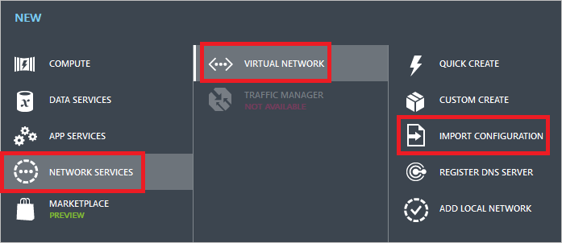
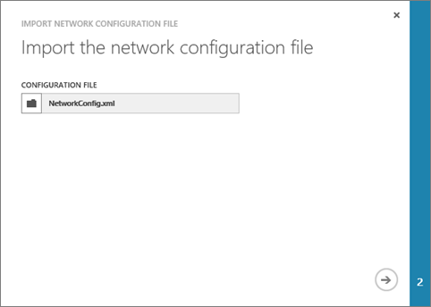
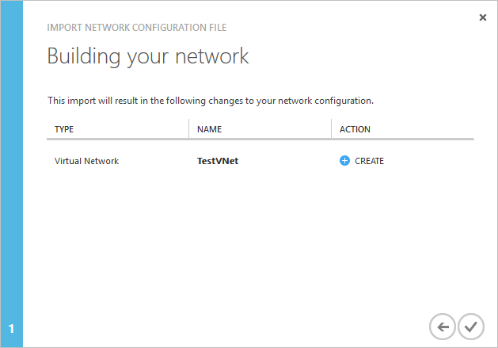

<properties
    pageTitle="创建 Azure 虚拟网络（经典）- 经典管理门户 | Azure"
    description="了解如何在 Azure 经典管理门户中使用 netcfg 文件创建虚拟网络（经典）。"
    services="virtual-network"
    documentationcenter=""
    author="jimdial"
    manager="timlt"
    editor=""
    tags="azure-service-management" />
<tags
    ms.assetid="69894a0b-8050-451e-8a25-c513e1bd271e"
    ms.service="virtual-network"
    ms.devlang="na"
    ms.topic="article"
    ms.tgt_pltfrm="na"
    ms.workload="infrastructure-services"
    ms.date="01/30/2017"
    wacn.date="03/24/2017"
    ms.author="jdial" />  

# 在 Azure 经典管理门户中使用 netcfg 文件创建虚拟网络（经典）
[AZURE.INCLUDE [virtual-networks-create-vnet-selectors-classic-include](../../includes/virtual-networks-create-vnet-selectors-classic-include.md)]

[AZURE.INCLUDE [virtual-networks-create-vnet-intro](../../includes/virtual-networks-create-vnet-intro-include.md)]

[AZURE.INCLUDE [azure-arm-classic-important-include](../../includes/azure-arm-classic-important-include.md)]

本文介绍如何在 Azure 经典管理门户中通过经典部署模型使用 netcfg 文件创建虚拟网络。也可以在 Azure 门户预览中，[在不使用 netcfg 文件的情况下通过经典部署模型创建虚拟网络](/documentation/articles/virtual-networks-create-vnet-classic-pportal/)，或者[通过 Azure Resource Manager 部署模型创建虚拟网络](/documentation/articles/virtual-networks-create-vnet-arm-pportal/)。

[AZURE.INCLUDE [virtual-networks-create-vnet-scenario-include](../../includes/virtual-networks-create-vnet-scenario-include.md)]

## 如何在 Microsoft Azure 经典管理门户中使用网络配置文件创建 VNet
Azure 使用 xml 文件定义适用于订阅的所有 VNet。可以下载并编辑此文件，通过经典部署模型创建 VNet，或者修改或删除现有的 VNet。本文介绍如何下载此文件（称为网络配置或 netcfg 文件）、在其中添加 VNet，以及上载该文件来创建 VNet。若要详细了解网络配置文件，请查看 [Azure 虚拟网络配置架构](https://msdn.microsoft.com/zh-cn/library/azure/jj157100.aspx)。

若要通过 Azure 经典管理门户使用 netcfg 文件创建 VNet，请完成以下步骤：

1. 从浏览器导航到 http://manage.windowsazure.cn，根据需要使用 Azure 帐户登录。
2. 向下滚动服务列表，单击“网络”，然后单击“导出”，如下图所示：

      

3. 在“导出网络配置”对话框中，选择要从中导出虚拟网络配置的订阅，然后单击对话框右下角的复选标记按钮。
4. 按照浏览器说明进行操作以保存 **NetworkConfig.xml** 文件。请确保记下保存该文件的位置。
5. 使用任何 XML 或文本编辑器应用程序打开步骤 4 中保存的文件，并查看 `<VirtualNetworkConfiguration>` 元素中的 `<VirtualNetworkSites>` 元素。任何现有的 VNet 将列在其自身的 `<VirtualNetworkSite>` 元素中。如果该文件未在 `<VirtualNetworkConfiguration>` 元素中包含 `<VirtualNetworkSites>` 元素，请创建一个。
6. 如果现有的 NetworkConfig 文件不包含任何 VNet，将本方案中所述的 VNet 添加到 NetworkConfig.xml 文件后，该文件将如以下示例所示：

        <NetworkConfiguration xmlns="http://schemas.microsoft.com/ServiceHosting/2011/07/NetworkConfiguration">
          <VirtualNetworkConfiguration>
            <VirtualNetworkSites>
              <VirtualNetworkSite name="TestVNet" Location="China North">
                <AddressSpace>
                  <AddressPrefix>192.168.0.0/16</AddressPrefix>
                </AddressSpace>
                <Subnets>
                  <Subnet name="FrontEnd">
                    <AddressPrefix>192.168.1.0/24</AddressPrefix>
                  </Subnet>
                  <Subnet name="BackEnd">
                    <AddressPrefix>192.168.2.0/24</AddressPrefix>
                  </Subnet>
                </Subnets>
              </VirtualNetworkSite>
            </VirtualNetworkSites>
          </VirtualNetworkConfiguration>
        </NetworkConfiguration>

7. 保存网络配置文件。
8. 在 Azure 经典管理门户中，依次单击“新建”、“网络服务”、“虚拟网络”、“导入配置”，如下图所示：

      

10. 在“导入网络配置文件”对话框中，单击“浏览文件...”，导航到步骤 7 中保存文件的文件夹，选择该文件，然后单击“打开”，如下图所示：

      

    在对话框的右下角，单击箭头按钮转到下一步骤。

9. 在“构建网络”对话框中，可以看到新 VNet 的条目，如下图所示：

      

10. 若要创建 VNet，请单击上图所示的对话框右下角的复选标记按钮。几秒钟后，该 VNet 将显示在可用 VNet 列表中，如下图所示：

      

<!---HONumber=Mooncake_0320_2017-->
<!--Update_Description: wording update-->