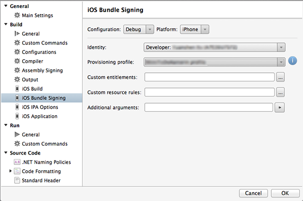

####配置 Xamarin Studio 中的 iOS 项目

1. 在 Xamarin.Studio 中，打开 **Info.plist**，然后使用前面随新应用 ID 创建的捆绑 ID 更新“捆绑标识符”。

    

2. 向下滚动到“Background Modes”（后台模式）并选中“Enable Background Modes”（启用后台模式）框和“Remote notifications”（远程通知）框。

    

3. 在解决方案面板中双击你的项目以打开“Project Options”（项目选项）。

4.  在“Build”（生成）下面选择“iOS Bundle Signing”（iOS 捆绑签名），并选择你刚刚为此项目设置的“Identity”（标识）和“Provisioning profile”（设置配置文件）。

    

    这确保项目使用新配置文件进行代码签名。有关正式的 Xamarin 设备设置文档，请参阅 [Xamarin 设备设置]。

####配置 Visual Studio 中的 iOS 项目

1. 在 Visual Studio 中，右键单击项目，然后单击“属性”。

2. 在属性页中，单击“iOS 应用程序”选项卡，然后使用先前创建的 ID 更新“标识符”。

    

3. 在“iOS 捆绑签名”选项卡中，选择刚为此项目设置的“标识符”和“设置配置文件”。

    

    这确保项目使用新配置文件进行代码签名。有关正式的 Xamarin 设备设置文档，请参阅 [Xamarin 设备设置]。

4. 双击 Info.plist 打开它，然后在后台模式下启用“远程通知”。

[Xamarin 设备设置]: http://developer.xamarin.com/guides/ios/getting_started/installation/device_provisioning/

<!---HONumber=Mooncake_0919_2016-->