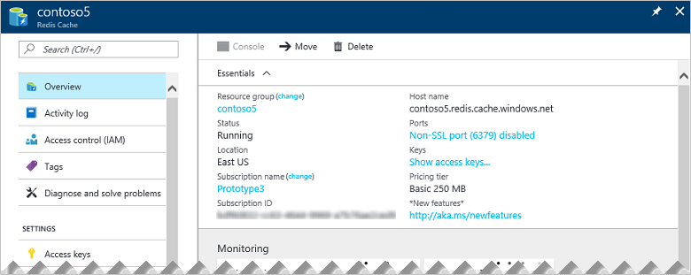

若要创建缓存，首先请登录到 [Azure 门户预览](https://portal.azure.cn)，然后单击“新建”、“数据 + 存储”、“Redis 缓存”。

>[AZURE.NOTE] 如果你没有 Azure 帐户，只需花费几分钟就能[建立一个 Azure 试用帐户](/pricing/1rmb-trial/?WT.mc_id=redis_cache_hero)。

  

>[AZURE.NOTE] 除了在 Azure 门户预览中创建缓存以外，也可以使用 ARM 模板、PowerShell 或 Azure CLI 来创建。
>
-	若要使用 ARM 模板创建缓存，请参阅 [Create a Redis cache using a template](/documentation/articles/cache-redis-cache-arm-provision/)（使用模板创建 Redis 缓存）。
>
-	若要使用 Azure PowerShell 创建缓存，请参阅 [Manage Azure Redis Cache with Azure PowerShell](/documentation/articles/cache-howto-manage-redis-cache-powershell/)（使用 Azure PowerShell 管理 Azure Redis 缓存）。
>
-	若要使用 Azure CLI 创建缓存，请参阅 [How to create and manage Azure Redis Cache using the Azure Command-Line Interface (Azure CLI)](/documentation/articles/cache-manage-cli/)（如何使用 Azure 命令行接口 (Azure CLI) 创建和管理 Azure Redis 缓存）。

在“新建 Redis 缓存”边栏选项卡中，指定所需的缓存配置。

-	在“DNS 名称”中，输入要用于缓存终结点的缓存名称。缓存名称必须是包含 1 到 63 个字符的字符串，只能包含数字、字母和 `-` 字符。缓存名称的开头或末尾不能是 `-` 字符，并且连续的 `-` 字符无效。
-	对于“订阅”，请选择要用于缓存的 Azure 订阅。如果你的帐户仅具有一个订阅，将自动选择该订阅并且将不显示“订阅”下拉菜单。
-	在“资源组”中，为缓存选择或创建资源组。有关详细信息，请参阅 [Using Resource groups to manage your Azure resources](/documentation/articles/resource-group-overview/)（使用资源组管理 Azure 资源）。
-	使用“位置”指定在其中托管你的缓存的地理位置。Microsoft 强烈推荐的最佳做法，是在与缓存客户端应用程序相同的区域中创建缓存。
-	使用“定价层”选择所需的缓存大小和功能。
-	**Redis 群集**允许你创建大于 53 GB 的缓存，以及将数据分散到多个 Redis 节点。有关详细信息，请参阅[如何为高级 Azure Redis 缓存配置群集功能](/documentation/articles/cache-how-to-premium-clustering/)。
-	**Redis 持久性**可让你将缓存保存到 Azure 存储帐户。有关配置暂留的说明，请参阅[《How to configure persistence for a Premium Azure Redis Cache》](/documentation/articles/cache-how-to-premium-persistence/)（如何为高级 Azure Redis 缓存配置暂留）。
-	**虚拟网络**通过将缓存访问权限限制于指定的 Azure 虚拟网络内的客户端，提供增强的安全性和隔离度。可以使用 VNet 的所有功能，例如子网、访问控制策略和其他功能，进一步限制对 Redis 的访问。有关详细信息，请参阅[如何为高级 Azure Redis 缓存配置虚拟网络支持](/documentation/articles/cache-how-to-premium-vnet/)。

在配置了新的缓存选项后，单击“创建”。创建缓存可能耗时几分钟。要检查的状态，可以监视开始板上的进度。创建缓存后，新缓存的状态为“正在运行”并可供用于默认设置。

<!---HONumber=Mooncake_0829_2016-->