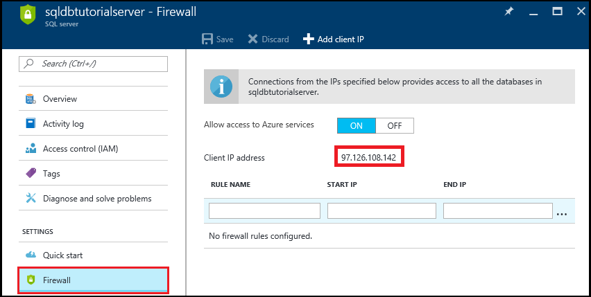

<!--
includes/sql-database-create-new-server-firewall-portal.md

Latest Freshness check:  2016-11-28 , rickbyh.

As of circa 2016-04-11, the following topics might include this include:
/documentation/articles/sql-database-get-started/
/documentation/articles/sql-database-configure-firewall-settings/
/documentation/articles/sql-data-warehouse-get-started-provision/

-->

## 在 Azure 门户预览中创建服务器级别的防火墙规则

1. 在“SQL Server”边栏选项卡中，单击“设置”下面的“防火墙”以打开 SQL Server 的“防火墙”边栏选项卡。

      

    
2. 使用所选的浏览器查看显示的客户端 IP 地址，并验证是否为你的 Internet 上的 IP 地址（询问“我的 IP 地址是多少”）。有时出于各种原因这两个地址并不相符。

      

3. 假设 IP 地址一致，则单击工具栏上的“添加客户端 IP”。

      

    > [AZURE.NOTE]可以打开一个 IP 地址或整个地址范围的服务器上的 SQL 数据库防火墙。打开防火墙使 SQL 管理员和用户能够登录到他们具有有效凭据的服务器上的任何数据库。

4. 单击工具栏上的“保存”以保存此服务器级防火墙规则，然后单击“确定”。

      

> [AZURE.Tip] 有关教程，请参阅 [SQL 数据库教程：创建服务器、服务器级防火墙规则、示例数据库、数据库级防火墙规则并连接到 SQL Server](/documentation/articles/sql-database-get-started/)。

<!---HONumber=Mooncake_0116_2017-->